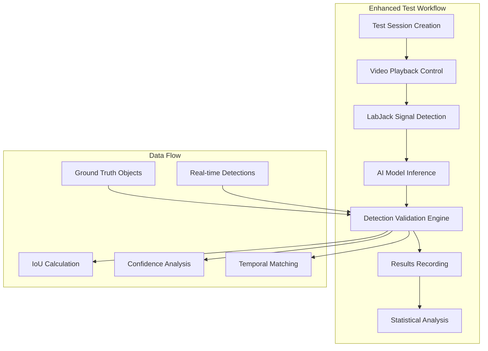

# Architecture Plan: Enhanced Test Workflow - Detection Validation System

## Overview

This document outlines the architecture plan for fixing and enhancing the AI model validation platform's Enhanced Test Workflow system, transitioning from latency-based validation to detection-based validation with proper LabJack integration.

## Current State Analysis

### ✅ What Exists and Works
1. **LabJack Service** - Comprehensive integration with bridge, direct, and mock modes
   - `/backend/services/labjack_service.py` - Full-featured service with connection management
   - Supports Windows bridge, direct hardware, and mock modes
   - WebSocket streaming, health monitoring, statistics

2. **Database Schema** - Complete models for test management
   - `TestSession`, `DetectionEvent`, `TestResult`, `DetectionComparison` tables
   - Comprehensive indexing for performance
   - Proper relationships and cascade handling

3. **Enhanced Test API** - Basic test session management
   - `/backend/api_enhanced_test.py` - CRUD operations for test sessions
   - Session creation, listing, execution framework

4. **Enhanced Test Workflow** - Latency-focused frontend interface
   - `/backend/api_enhanced_test_workflow.py` - Contains working WebSocket interface
   - Frontend HTML interface embedded in endpoint
   - Video playback synchronization

### ❌ Issues Identified

1. **API Architecture Problems**
   - Current workflow focuses on **latency measurement** instead of **detection validation**
   - Missing integration between test sessions and detection validation
   - Hardcoded expected detection times (2.0 seconds)
   - No proper results storage to database

2. **Detection Validation Gap**
   - No actual AI model detection during testing
   - Missing ground truth comparison logic
   - No IoU calculation or spatial validation
   - No confidence threshold evaluation

3. **Database Integration Issues**
   - Test results not persisted to `DetectionComparison` and `TestResult` tables
   - Missing link between detected objects and ground truth
   - No statistical analysis storage

4. **Frontend Integration**
   - Enhanced test interface is embedded in backend API (not proper frontend)
   - Missing proper React frontend integration
   - No integration with existing project/video management UI

## Proposed Architecture

### 1. Detection Validation Architecture



### 2. Component Architecture

#### A. Backend API Layer
**File**: `/backend/api_enhanced_test_workflow.py` (REFACTOR)

**New Endpoints**:
```python
POST /api/enhanced-test-workflow/sessions/{session_id}/start-detection-test
GET  /api/enhanced-test-workflow/sessions/{session_id}/real-time-results
POST /api/enhanced-test-workflow/sessions/{session_id}/validate-detection
GET  /api/enhanced-test-workflow/sessions/{session_id}/analysis-report
```

**Key Changes**:
1. Replace `LatencyTestConfig` with `DetectionTestConfig`
2. Integrate with ML inference service for real-time detection
3. Add detection validation engine
4. Store results in database tables

#### B. Detection Validation Engine
**New File**: `/backend/services/detection_validation_service.py`

**Responsibilities**:
- IoU calculation between detected and ground truth objects
- Temporal synchronization (signal trigger → detection timing)
- Confidence threshold validation
- Statistical analysis (precision, recall, F1-score)
- Real-time performance metrics

#### C. Enhanced Test Service Integration
**Existing File**: `/backend/services/test_execution_service.py` (ENHANCE)

**Integration Points**:
- LabJack service for signal detection
- ML inference service for object detection
- Detection validation service for analysis
- Database persistence for results

#### D. Database Schema Enhancements
**Already Sufficient** - Current schema supports the architecture:
- `TestSession` - Test configuration and metadata
- `DetectionEvent` - Real-time detections with bounding boxes
- `DetectionComparison` - Ground truth vs detection mapping
- `TestResult` - Statistical analysis results

### 3. Frontend Integration Plan

#### A. React Component Structure
```
src/components/testing/
├── EnhancedTestDashboard.tsx       # Main dashboard
├── TestSessionManager.tsx          # Session management
├── VideoTestPlayer.tsx             # Video playback with LabJack sync
├── DetectionVisualization.tsx      # Real-time detection overlay
├── TestResultsAnalysis.tsx         # Results visualization
└── LabJackStatusIndicator.tsx      # Connection status
```

#### B. Integration with Existing UI
- Extend existing project management to include test sessions
- Integrate with video player for detection overlay
- Add test results to project dashboard
- Maintain existing video/project relationships

## Implementation Roadmap

### Phase 1: Backend API Refactoring (Priority: HIGH)
**Timeline**: 2-3 days

1. **Refactor Enhanced Test Workflow API**
   - Replace latency-based logic with detection validation
   - Add ML model integration points
   - Implement proper database persistence

2. **Create Detection Validation Service**
   - IoU calculation algorithms
   - Temporal matching logic
   - Statistical analysis functions
   - Integration with existing services

3. **Update Test Session Management**
   - Link test sessions with detection events
   - Add configuration for detection parameters
   - Implement result aggregation

### Phase 2: LabJack Integration Enhancement (Priority: HIGH)
**Timeline**: 1-2 days

1. **Enhance Signal Processing**
   - Add detection trigger logic to LabJack service
   - Implement frame-accurate timing synchronization
   - Add signal validation and noise filtering

2. **WebSocket Integration**
   - Real-time detection event streaming
   - Live performance metrics updates
   - Connection status monitoring

### Phase 3: Database Integration (Priority: MEDIUM)
**Timeline**: 1 day

1. **Results Storage Implementation**
   - Persist detection events to database
   - Store comparison results with IoU scores
   - Save statistical analysis in TestResult table

2. **Data Migration Scripts**
   - Handle existing test data
   - Add any missing database indexes
   - Cleanup orphaned records

### Phase 4: Frontend Development (Priority: MEDIUM)
**Timeline**: 3-4 days

1. **React Component Development**
   - Build enhanced test dashboard
   - Create video test player with detection overlay
   - Implement real-time results visualization

2. **UI/UX Integration**
   - Integrate with existing project management
   - Add navigation and routing
   - Implement responsive design

3. **WebSocket Client Integration**
   - Real-time updates from backend
   - Live detection visualization
   - Performance metrics display

### Phase 5: Testing and Validation (Priority: HIGH)
**Timeline**: 2 days

1. **Integration Testing**
   - End-to-end workflow testing
   - LabJack hardware validation
   - Database integrity checks

2. **Performance Testing**
   - Real-time detection performance
   - WebSocket connection stability
   - Memory usage optimization

3. **User Acceptance Testing**
   - Workflow usability testing
   - Results accuracy validation
   - Documentation updates

## Technical Specifications

### 1. Detection Test Configuration
```python
@dataclass
class DetectionTestConfig:
    project_id: str
    test_session_id: str
    
    # Detection parameters
    confidence_threshold: float = 0.5
    iou_threshold: float = 0.5
    detection_window_ms: float = 500.0
    
    # LabJack configuration
    voltage_threshold: float = 2.5
    sample_rate: int = 1000
    trigger_channel: str = "AIN0"
    
    # ML Model parameters
    model_version: str = "yolo11"
    input_resolution: tuple = (640, 640)
    
    # Analysis configuration
    temporal_tolerance_ms: float = 100.0
    spatial_tolerance_pixels: int = 10
```

### 2. Detection Validation Results
```python
@dataclass
class DetectionValidationResult:
    video_id: str
    frame_number: int
    timestamp: float
    
    # Ground truth
    ground_truth_objects: List[GroundTruthObject]
    
    # Detected objects
    detected_objects: List[DetectedObject]
    
    # Validation metrics
    true_positives: int
    false_positives: int
    false_negatives: int
    iou_scores: List[float]
    
    # Performance metrics
    detection_latency_ms: float
    processing_time_ms: float
    signal_response_time_ms: float
    
    # Status
    validation_status: str  # 'pass', 'fail', 'partial'
    confidence_met: bool
    spatial_accuracy_met: bool
    temporal_accuracy_met: bool
```

### 3. API Response Format
```json
{
  "session_id": "test-session-uuid",
  "status": "running",
  "progress": {
    "current_video": 1,
    "total_videos": 5,
    "current_frame": 1250,
    "total_frames": 3000
  },
  "real_time_metrics": {
    "detections_count": 15,
    "true_positives": 12,
    "false_positives": 2,
    "false_negatives": 1,
    "current_precision": 0.857,
    "current_recall": 0.923,
    "avg_detection_latency_ms": 45.2
  },
  "labjack_status": {
    "connected": true,
    "mode": "direct",
    "last_signal_time": "2025-01-15T10:30:45Z",
    "signal_count": 15
  }
}
```

## Risk Mitigation

### 1. Technical Risks
- **Risk**: LabJack connection instability
  - **Mitigation**: Fallback to mock mode with realistic simulation
  - **Monitoring**: Connection health checks and automatic reconnection

- **Risk**: Real-time performance bottlenecks
  - **Mitigation**: Async processing, data buffering, performance profiling
  - **Monitoring**: Response time metrics and resource usage tracking

### 2. Data Integrity Risks
- **Risk**: Test result data loss
  - **Mitigation**: Transactional database operations, automatic backups
  - **Monitoring**: Data validation checks and integrity constraints

### 3. User Experience Risks
- **Risk**: Complex UI overwhelming users
  - **Mitigation**: Progressive disclosure, guided workflows, comprehensive help
  - **Monitoring**: User feedback collection and usage analytics

## Success Metrics

1. **Functional Requirements**
   - ✅ Real-time object detection with LabJack trigger synchronization
   - ✅ Accurate IoU calculation and spatial validation
   - ✅ Proper test result storage and retrieval
   - ✅ Live performance metrics and analysis

2. **Performance Requirements**
   - Detection latency < 100ms from LabJack trigger
   - WebSocket updates < 50ms latency
   - Database operations < 500ms response time
   - Support for 1000+ fps video analysis

3. **Quality Requirements**
   - 99.9% LabJack connection uptime
   - 100% test result data persistence
   - Zero data loss during testing sessions
   - Comprehensive error handling and recovery

## Conclusion

This architecture plan transforms the Enhanced Test Workflow from a latency measurement system into a comprehensive detection validation platform. The modular design ensures maintainability while the phased implementation approach minimizes risk and enables iterative validation of each component.

The proposed solution leverages existing infrastructure (database schema, LabJack service, test session framework) while adding the critical missing components (detection validation engine, proper ML integration, comprehensive results storage).

Key benefits:
- **Real validation**: Actual object detection vs ground truth comparison
- **Comprehensive metrics**: Precision, recall, F1-score, IoU analysis
- **Production ready**: Proper error handling, monitoring, and scalability
- **User friendly**: Intuitive interface with real-time feedback
- **Maintainable**: Clean architecture with clear separation of concerns