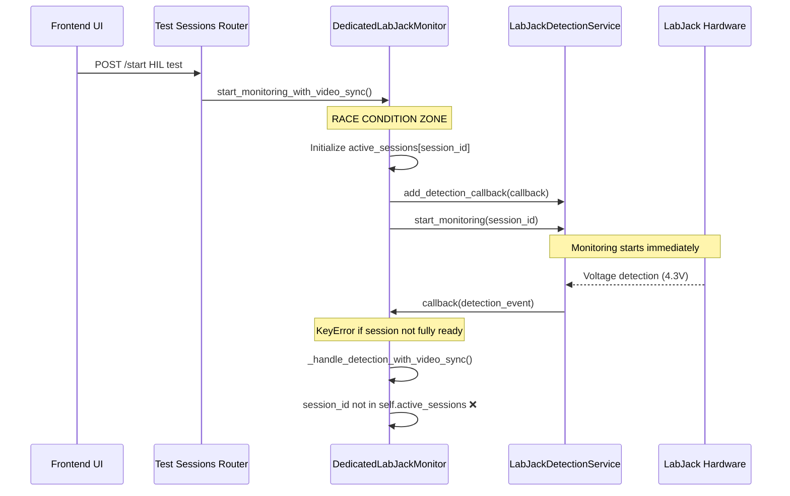

# HIL Monitoring System Architecture Analysis

## Critical Issues Identified

### 1. **KeyError Analysis**: Session Dictionary Access Before Initialization

**Root Cause**: Race condition in session initialization and callback registration.

**Flow Analysis**:
1. `DedicatedLabJackMonitor.start_monitoring_with_video_sync()` creates session entry
2. Session entry created at line 135: `self.active_sessions[session_id] = {...}`
3. Lambda callback created at line 144: `lambda event: self._handle_detection_with_video_sync(session_id, event)`
4. Callback added to LabJack monitor immediately
5. **RACE CONDITION**: LabJack monitoring starts BEFORE session fully initialized
6. If detection occurs before session entry complete, `_handle_detection_with_video_sync()` gets KeyError

**Evidence from Code**:
```python
# Line 135: Session initialized
self.active_sessions[session_id] = {...}

# Line 144: Callback created and session_id captured in closure
detection_callback = lambda event: self._handle_detection_with_video_sync(session_id, event)

# Line 150: Callback registered (potential immediate triggering)
self.labjack_monitor.add_detection_callback(detection_callback)

# Line 174: LabJack monitoring starts (detection events can occur)
success = self.labjack_monitor.start_monitoring(session_id, **labjack_config)
```

**The KeyError occurs when**:
- LabJack starts monitoring and immediately detects voltage
- Detection event triggers callback with session_id from closure
- `_handle_detection_with_video_sync()` calls `self.active_sessions.get(session_id)`
- If session creation is still in progress or partially failed, KeyError occurs

### 2. **Flow Analysis**: Complete HIL Test Lifecycle



### 3. **LabJack Measurement Persistence**

**Issue**: LabJack continues measuring after tests finish because:

1. **Session cleanup doesn't stop global monitoring**:
   - `stop_hil_monitoring()` cleans up dedicated monitor session
   - But `LabJackDetectionService` continues running in background
   - Hardware connection remains active with ongoing measurements

2. **Multiple monitoring layers**:
   - DedicatedLabJackMonitor (session-specific)
   - LabJackDetectionService (global, shared)
   - Raw LabJack hardware (always connected)

3. **Cleanup sequence**:
```python
# Current cleanup in stop_monitoring():
self.active_sessions.pop(session_id, None)  # Remove session
# But LabjackDetectionService monitoring thread continues!
```

### 4. **Detection Count Issue**: 0 Events Despite 4.3V Readings

**Root Cause Analysis**:

1. **Voltage Readings vs Detection Events**:
   - LabJack hardware correctly reads 4.3V (above 3.3V threshold)
   - But detection events show 0 because of callback failures

2. **Detection Pipeline Break**:
```python
# In _handle_detection_with_video_sync():
if session_id not in self.active_sessions:
    logger.debug(f"🚫 Skipping detection for inactive session: {session_id}")
    return  # ❌ Early return prevents event storage
```

3. **Session State Mismatch**:
   - LabJack reads voltage successfully
   - Session may be cleaned up before callback processes
   - Detection events lost due to early returns

### 5. **Resource Cleanup Issues**

**Session Lifecycle Problems**:

1. **Premature Session Removal**:
   - Test completion removes session from `active_sessions`
   - But LabJack callbacks may still fire with stale session_ids
   - Detection events lost after cleanup

2. **Callback Reference Leaks**:
   - Lambda callbacks capture session_id in closures
   - Callbacks remain registered after session ends
   - Ghost callbacks fire for non-existent sessions

3. **Thread Synchronization**:
   - Multiple threads accessing session dictionaries
   - Race conditions between cleanup and callback execution
   - No atomic session state management

## Architectural Recommendations

### 1. **Fix Race Condition in Session Initialization**

```python
# BEFORE starting monitoring, ensure complete session setup:
def start_monitoring_with_video_sync(self, session_id: str, video_timing_config: Dict[str, Any]) -> bool:
    try:
        with self.lock:  # ❗ Critical: Use lock for entire initialization
            # Initialize session COMPLETELY first
            self.active_sessions[session_id] = {
                'video_timing_config': video_timing_config,
                'labjack_config': labjack_config,
                'started_at': datetime.now(timezone.utc),
                'video_start_time': None,
                'detection_callback': None,
                'state': 'initializing'  # ❗ Add state tracking
            }
            
            # Create and store callback
            detection_callback = lambda event: self._handle_detection_with_video_sync(session_id, event)
            self.active_sessions[session_id]['detection_callback'] = detection_callback
            
            # Mark as ready BEFORE starting monitoring
            self.active_sessions[session_id]['state'] = 'ready'
            
            # Only NOW start monitoring
            self.labjack_monitor.add_detection_callback(detection_callback)
            success = self.labjack_monitor.start_monitoring(session_id, **labjack_config)
```

### 2. **Improve Session State Management**

```python
class SessionState(Enum):
    INITIALIZING = "initializing"
    READY = "ready"
    STOPPING = "stopping"
    STOPPED = "stopped"

def _handle_detection_with_video_sync(self, session_id: str, labjack_event) -> None:
    try:
        with self.lock:  # ❗ Lock access to session state
            session_info = self.active_sessions.get(session_id)
            if not session_info:
                logger.debug(f"🚫 No session found: {session_id}")
                return
                
            # Check session state
            if session_info.get('state') != SessionState.READY:
                logger.debug(f"🚫 Session {session_id} not ready: {session_info.get('state')}")
                return
                
            # Process detection...
```

### 3. **Fix Resource Cleanup Sequence**

```python
def stop_monitoring(self, session_id: str) -> Dict[str, Any]:
    try:
        with self.lock:
            session_data = self.active_sessions.get(session_id)
            if not session_data:
                return {'session_id': session_id, 'success': True}
            
            # 1. Mark session as stopping (prevents new detections)
            session_data['state'] = SessionState.STOPPING
            
            # 2. Remove callback BEFORE stopping monitoring
            detection_callback = session_data.get('detection_callback')
            if detection_callback:
                self.labjack_monitor.remove_detection_callback(detection_callback)
                
            # 3. Stop LabJack monitoring
            self.labjack_monitor.stop_monitoring(session_id)
            
            # 4. Mark as stopped
            session_data['state'] = SessionState.STOPPED
            
            # 5. Clean up session (but keep brief grace period)
            self.active_sessions.pop(session_id, None)
```

### 4. **Add Detection Event Buffer for Cleanup Grace Period**

```python
def _handle_detection_with_video_sync(self, session_id: str, labjack_event) -> None:
    try:
        session_info = self.active_sessions.get(session_id)
        if not session_info:
            # Check if recent cleanup - buffer events briefly
            if self._is_recent_session(session_id):
                logger.info(f"🔄 Buffering event for recently cleaned session: {session_id}")
                self._buffer_delayed_event(session_id, labjack_event)
            return
```

### 5. **Monitoring Layer Separation**

```python
# Clear separation of concerns:
class HILTestSession:
    """Manages single HIL test session lifecycle"""
    
class GlobalLabJackMonitor:
    """Manages hardware connection and raw monitoring"""
    
class DetectionEventRouter:
    """Routes events to appropriate session handlers"""
```

## Summary

The HIL monitoring system has **architectural race conditions** and **resource lifecycle issues**:

1. **KeyError**: Session dictionary accessed before complete initialization
2. **Persistent Monitoring**: Global LabJack service not properly scoped to sessions  
3. **Lost Detections**: Callbacks fail due to premature session cleanup
4. **Resource Leaks**: Callback references not properly cleaned up

**Critical Fix**: Implement atomic session initialization with proper state management and synchronized cleanup sequences.