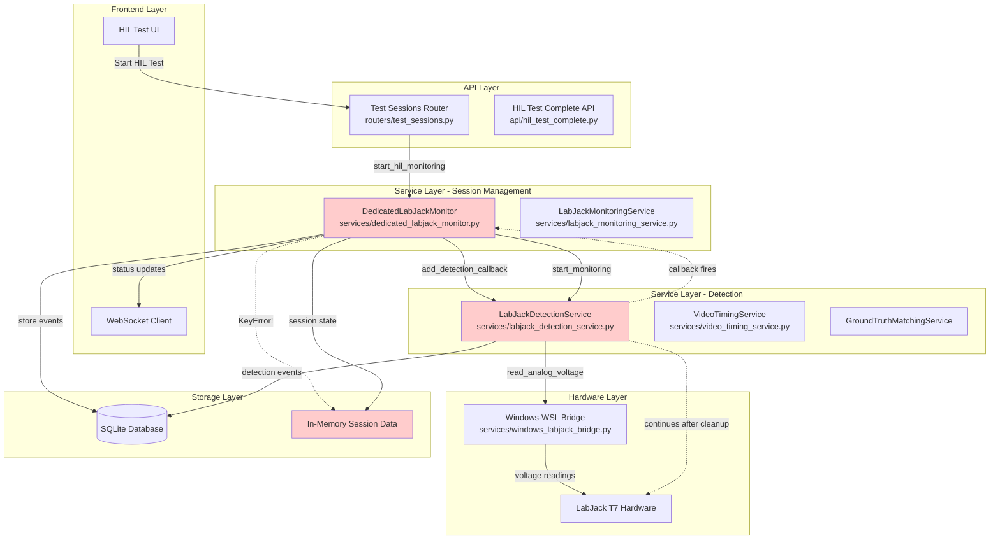
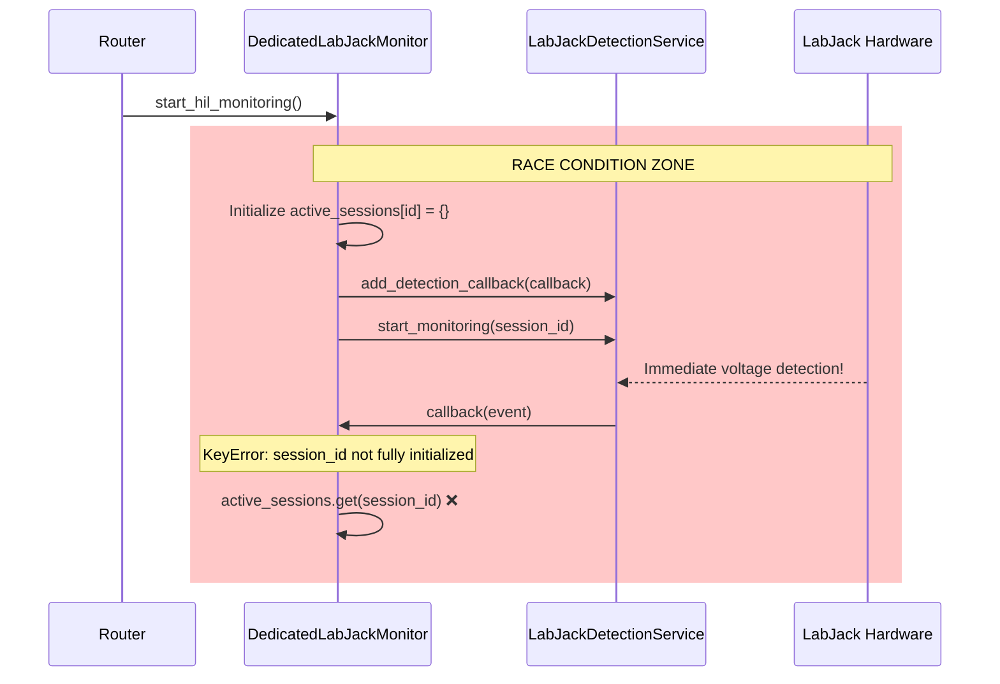
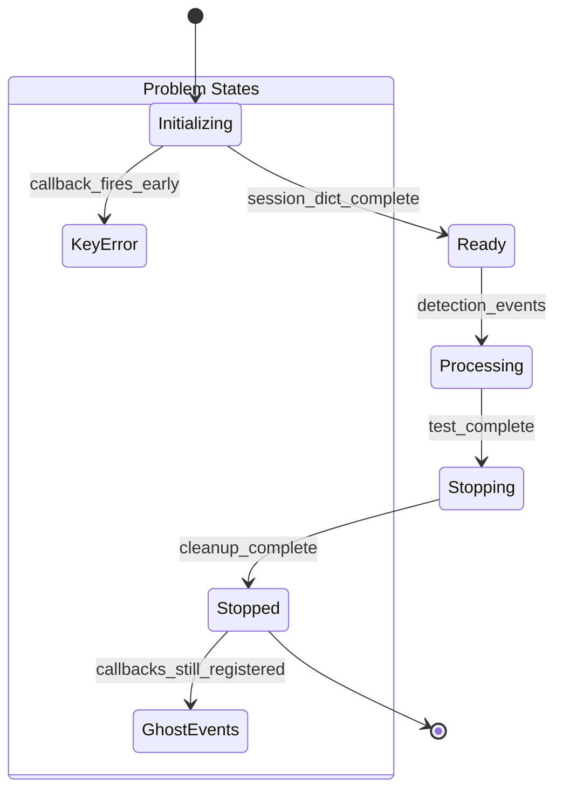
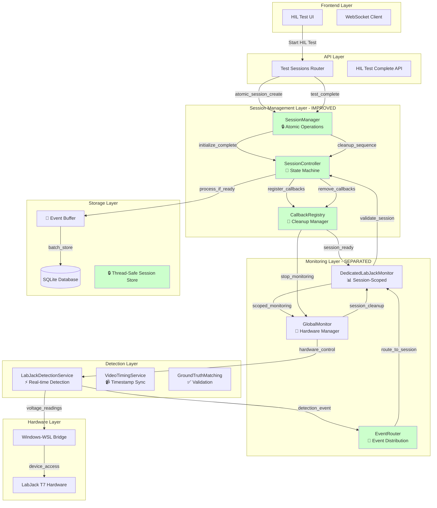

# HIL Monitoring System Architecture Diagram

## Current Architecture (Problematic)



## Problem Areas Identified

### 1. Race Condition Zone


### 2. Session Lifecycle Issues


## Improved Architecture (Recommended)



## Key Architectural Improvements

### 1. Atomic Session Management
```python
class SessionManager:
    """Ensures atomic session lifecycle operations"""
    
    @atomic_operation
    def create_hil_session(self, session_id: str, config: Dict) -> bool:
        """Atomically creates session with all dependencies"""
        with self.global_lock:
            # 1. Validate preconditions
            # 2. Initialize complete session state
            # 3. Register callbacks
            # 4. Start monitoring
            # 5. Mark as ready
            return True
```

### 2. State Machine Control
```python
class SessionState(Enum):
    INITIALIZING = "initializing"
    READY = "ready"  
    PROCESSING = "processing"
    STOPPING = "stopping"
    STOPPED = "stopped"
    ERROR = "error"

class SessionController:
    """Controls session state transitions safely"""
    
    def transition_to(self, session_id: str, new_state: SessionState) -> bool:
        """Thread-safe state transitions with validation"""
```

### 3. Callback Registry with Cleanup
```python
class CallbackRegistry:
    """Manages callback lifecycle with proper cleanup"""
    
    def register_callback(self, session_id: str, callback: Callable) -> str:
        """Register callback with automatic cleanup"""
        
    def cleanup_session_callbacks(self, session_id: str) -> None:
        """Remove all callbacks for session before cleanup"""
```

### 4. Event Router for Safe Distribution
```python
class EventRouter:
    """Routes events to appropriate handlers safely"""
    
    def route_detection_event(self, event: DetectionEvent) -> None:
        """Route event only to active, ready sessions"""
        session_id = event.session_id
        if self.session_controller.is_ready(session_id):
            self.dedicated_monitor.handle_event(session_id, event)
```

## Implementation Priority

1. **CRITICAL**: Fix race condition in session initialization
2. **HIGH**: Implement proper callback cleanup sequence
3. **HIGH**: Add session state validation to detection handlers
4. **MEDIUM**: Separate global vs session-scoped monitoring
5. **MEDIUM**: Add event buffering for cleanup grace periods
6. **LOW**: Implement full state machine architecture

## Files Requiring Changes

1. `services/dedicated_labjack_monitor.py` - Fix race condition
2. `services/labjack_detection_service.py` - Add callback cleanup
3. `routers/test_sessions.py` - Improve session lifecycle
4. `services/labjack_monitoring_service.py` - Scope monitoring properly

This architecture ensures **thread-safe session management**, **proper resource cleanup**, and **elimination of race conditions** in the HIL monitoring system.