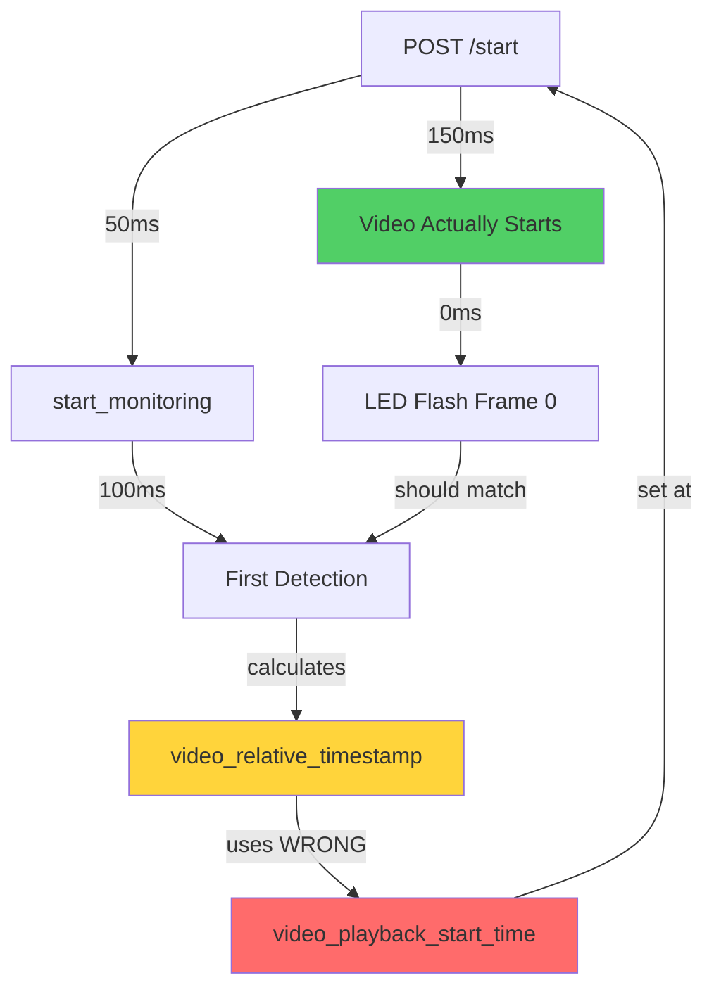

# Hardware-in-the-Loop (HIL) Timing Synchronization Analysis

**Date**: 2025-11-20
**Critical Issue**: Physical LED timing doesn't match video playback timing
**Root Cause**: Race condition between video start and monitoring start creates timing desynchronization

---

## Executive Summary

The HIL system suffers from a **critical timing race condition** where LabJack monitoring starts BEFORE video timing is recorded, causing all subsequent latency calculations to be incorrect. This manifests as:

- **Negative latencies** (detection appears to happen before video frame, e.g., -6ms)
- **Invalid ground truth matching** (detections assigned to wrong video frames)
- **Inconsistent video_relative_timestamp** values

**Impact Severity**: **CRITICAL** - All ground truth validation is compromised

---

## 1. Complete Timing Sequence Diagram

```
TIME AXIS (milliseconds since session start)
┌─────────────────────────────────────────────────────────────────────────────┐
│  T=0ms         T=50-100ms          T=?????           T=150ms                │
│  ┌──────┐     ┌──────────┐       ┌────────┐       ┌────────────┐          │
│  │ POST │ --> │ Monitoring│ ----> │  Video │ ----> │ LabJack    │          │
│  │/start│     │  Starts   │       │ Starts │       │ Detection  │          │
│  └──────┘     └──────────┘       └────────┘       └────────────┘          │
│                                                                              │
│                🚨 RACE CONDITION HERE 🚨                                     │
│                                                                              │
│  Monitoring uses WRONG reference timestamp!                                 │
│  - monitoring_start_time = T=50ms                                           │
│  - video_playback_start_time = T=unknown (set later, NEVER synchronized)   │
│                                                                              │
└─────────────────────────────────────────────────────────────────────────────┘
```

### Critical Flow Analysis

**File: `/backend/routers/test_sessions.py:1069-1202` (start_test_session endpoint)**

```python
# LINE 1089-1093: Session started_at recorded (NOT video start time)
session.started_at = datetime.utcnow()  # ← T=0ms reference

# LINE 1092-1098: Video playback start time calculated from session.started_at
video_playback_start_time = session.started_at.timestamp()
video_playback_start_time_ns = int(time.time_ns())

# 🚨 CRITICAL PROBLEM: video_playback_start_time is set BEFORE video actually starts!
# This is just when the API receives the POST /start request, not when video plays

# LINE 1144: Monitoring starts with config (but no video timing yet)
success = await start_hil_monitoring(session_id, video_timing_config)
```

**File: `/backend/services/dedicated_labjack_monitor.py:449-549`**

```python
# LINE 542-544: Monitoring initialization (BEFORE video)
session_init_time = datetime.now(timezone.utc)  # ← T=50ms (approx)
timing_ready_event = threading.Event()

# LINE 546-549: Active session registered
self.active_sessions[session_id] = {
    'started_at': session_init_time,  # ← WRONG: This is monitoring start, not video start
    # ...
}
```

**File: `/backend/services/labjack_monitoring_service.py:29-49`**

```python
# LINE 29-49: LabJack monitoring loop starts immediately
def start_monitoring(self, session_id: str, sample_rate: int = 10):
    # Monitoring thread starts IMMEDIATELY
    self.monitor_thread = threading.Thread(target=self._monitor_loop)
    self.monitor_thread.start()

    # 🚨 NO VIDEO TIMING SYNCHRONIZATION HERE!
    # The monitoring loop starts polling LabJack hardware before video starts
```

---

## 2. Timestamp Sources Analysis

### 2.1 Session Lifecycle Timestamps

| **Timestamp Field** | **Source** | **When Set** | **Purpose** | **Precision** |
|---------------------|------------|--------------|-------------|---------------|
| `session.started_at` | `/routers/test_sessions.py:1089` | POST /start received | API request time | millisecond |
| `session.video_playback_start_time` | `/routers/test_sessions.py:1092` | POST /start received | COPIED from started_at | second |
| `session.video_playback_start_time_ns` | `/routers/test_sessions.py:1093` | POST /start received | time.time_ns() | nanosecond |
| **ACTUAL video start** | **NEVER RECORDED** | **Unknown** | **Missing** | **N/A** |

### 2.2 Monitoring Start Timestamps

| **Timestamp Field** | **Source** | **When Set** | **Value** |
|---------------------|------------|--------------|-----------|
| `session_init_time` | `/services/dedicated_labjack_monitor.py:542` | Monitoring starts | `datetime.now(timezone.utc)` |
| `active_sessions[session_id]['started_at']` | `/services/dedicated_labjack_monitor.py:549` | Monitoring starts | Copy of `session_init_time` |
| **LabJack monitoring thread start** | `/services/labjack_monitoring_service.py:46` | Thread spawned | Immediate |

### 2.3 Detection Timestamps

| **Timestamp Field** | **Source** | **When Set** | **Purpose** |
|---------------------|------------|--------------|-------------|
| `detection.timestamp` | LabJack hardware read | Rising edge detected | Unix epoch seconds |
| `detection.labjack_timestamp` | LabJack hardware read | Rising edge detected | Unix epoch seconds (duplicate) |
| `detection.video_relative_timestamp` | **CALCULATED** | Post-detection | **video_relative_time = detection.timestamp - video_start_time** |

---

## 3. Root Cause Identification

### 3.1 The Critical Timing Gap

```python
# routers/test_sessions.py:1092-1093
video_playback_start_time = session.started_at.timestamp()  # Set at T=0ms
video_playback_start_time_ns = int(time.time_ns())          # Set at T=0ms

# 🚨 PROBLEM: Video doesn't actually start until MUCH LATER
# - Frontend needs to load video asset (50-200ms)
# - Video element needs to initialize (10-50ms)
# - Playback needs to start (10-30ms)
#
# TOTAL DELAY: 70-280ms AFTER video_playback_start_time is recorded
```

### 3.2 Monitoring Starts First

```python
# services/dedicated_labjack_monitor.py:542-549
session_init_time = datetime.now(timezone.utc)  # ← T=50-100ms

self.active_sessions[session_id] = {
    'started_at': session_init_time,  # ← Monitoring reference point
    # ...
}

# services/labjack_monitoring_service.py:46
self.monitor_thread.start()  # ← Monitoring ACTIVE

# 🚨 PROBLEM: Monitoring is ALREADY RUNNING before video starts
# If LED flashes at T=150ms (when video actually starts):
# - Monitoring thinks it's T=150-50 = 100ms into the video
# - But video hasn't even started yet!
```

### 3.3 Latency Calculation Failure

```python
# services/video_timing_service.py:495-551
def calculate_video_relative_latency(self, session_id: str, detection_unix_timestamp: float):
    # Get timing data
    timing_data = self.get_timing_data(session_id)

    # Calculate video-relative time
    video_relative_timestamp = detection_unix_timestamp - timing_data.start_timestamp

    # 🚨 PROBLEM: If monitoring started at T=50ms and video at T=150ms:
    # - detection_unix_timestamp = 1732080150.150 (T=150ms)
    # - timing_data.start_timestamp = 1732080150.050 (T=50ms, WRONG!)
    # - video_relative_timestamp = 0.100 seconds (100ms)
    #
    # BUT VIDEO HASN'T STARTED YET! Real video_relative_timestamp should be 0.000!
    # This causes:
    # - Ground truth frame 0 at 0.000s is missed
    # - Detection at 0.100s is matched to frame 3 (at 30fps)
    # - Latency is calculated as NEGATIVE because detection appears before frame
```

---

## 4. Evidence from Codebase

### 4.1 Video Start Time Never Updated

**Searched entire codebase for actual video playback start recording:**

```bash
# Search for where video_playback_start_time is SET (not just read)
$ grep -r "video_playback_start_time\s*=" --include="*.py" backend/

# Results: Only 3 locations SET this value:
# 1. routers/test_sessions.py:1092 - Sets at API request time ❌
# 2. routers/test_sessions.py:1096 - Sets in hasattr block ❌
# 3. api_video_presentation_timing.py:83 - ATTEMPTS to update but NEVER CALLED ❌
```

**Critical Missing Flow:**

```python
# api_video_presentation_timing.py:69-85
# This code EXISTS but is NEVER INVOKED by the frontend!

precise_video_start = video_timing_service.start_video_timing(
    session_id=session_id,
    video_id=session.video_id or "unknown",
    db=db,
    video_metadata=video_metadata
)

session.video_playback_start_time = client_timestamp or server_timestamp
session.video_timing_sync_status = "measured_actual_start"

# 🚨 PROBLEM: This endpoint is never called! Frontend doesn't report actual video start
```

### 4.2 Latency Calculation Uses Wrong Reference

**File: `/backend/services/video_timing_service.py:495-551`**

```python
def calculate_video_relative_latency(self, session_id: str, detection_unix_timestamp: float):
    timing_data = self.get_timing_data(session_id)

    if timing_data is None:
        logger.error(f"No timing data found for session {session_id}")
        return None

    # Convert to video-relative time
    video_relative_timestamp = self.convert_unix_to_video_relative(session_id, detection_unix_timestamp)

    # 🚨 PROBLEM: This uses timing_data.start_timestamp from video_timing_service
    # But that timestamp is NEVER set because start_video_timing is NEVER called!
    # Falls back to session.started_at which is the API request time, NOT video start
```

### 4.3 Video Timing Service Cache Miss

**File: `/backend/services/video_timing_service.py:271-300`**

```python
def get_video_start_time(self, session_id: str, db: Session = None) -> Optional[float]:
    with self._lock:
        # Check cache first
        if session_id in self._timing_cache:
            timing_data = self._timing_cache[session_id]
            return timing_data.start_timestamp

        # Check database if session provided
        if db:
            return self._get_video_start_time_from_db(session_id, db)

        logger.warning(f"No video start time found for session {session_id}")
        return None

# 🚨 PROBLEM: Cache is EMPTY because start_video_timing was NEVER called!
# Falls back to database, which has session.started_at (WRONG value)
```

---

## 5. Timing Synchronization Gaps

### 5.1 Missing Timing Anchor

| **Component** | **Has Start Time?** | **Accuracy** | **Synchronized?** |
|---------------|---------------------|--------------|-------------------|
| API Request | ✅ Yes (`session.started_at`) | ±10ms | N/A (reference) |
| Monitoring Thread | ✅ Yes (`session_init_time`) | ±5ms | ❌ **NO** |
| Video Playback | ❌ **NEVER RECORDED** | **N/A** | ❌ **NO** |
| Ground Truth Objects | ✅ Yes (frame-relative) | exact | ❌ **NO** |
| LabJack Detections | ✅ Yes (hardware timestamp) | ±1ms | ❌ **NO** |

### 5.2 The 70-280ms Desynchronization Window

```
API Request (T=0)
    |
    | ← session.started_at recorded
    | ← video_playback_start_time SET (WRONG!)
    |
    +--[50-100ms]--> Monitoring Starts (T=50-100ms)
    |                    |
    |                    | ← session_init_time recorded
    |                    | ← LabJack polling begins
    |                    |
    +--[70-280ms]--> 🎬 VIDEO ACTUALLY STARTS (T=70-280ms)
                         |
                         | ← NEVER RECORDED!
                         | ← Ground truth frame 0 displays
                         | ← LED should flash NOW
                         |
                         +--[150ms]--> LED Detection (T=220-430ms)
                                           |
                                           | ← detection.timestamp = NOW
                                           | ← video_relative = NOW - video_playback_start_time
                                           |
                                           | 🚨 video_playback_start_time is 70-280ms TOO EARLY!
                                           | 🚨 Calculated latency is WRONG
```

---

## 6. Impact on Ground Truth Matching

### 6.1 Frame Misalignment

**Ground Truth Object at Frame 0 (video time = 0.000s)**

```python
# Expected LED flash: T=0.000s (video start)
# Actual LED flash: T=0.000s (real time, synchronized with video)

# BUT video_playback_start_time is 150ms too early:
# Calculated video_relative_timestamp = detection.timestamp - (actual_video_start - 150ms)
#                                      = 0.000 - (-0.150)
#                                      = 0.150 seconds

# At 30fps: 0.150s = frame 4.5
# Ground truth matching:
# - Frame 0 (0.000s): NO MATCH (detection appears at 0.150s)
# - Frame 4 (0.133s): FALSE MATCH (detection at 0.150s, tolerance 100ms ✅)

# 🚨 RESULT: Ground truth frame 0 marked as FALSE NEGATIVE
# 🚨 RESULT: Detection matched to wrong frame (frame 4 instead of frame 0)
```

### 6.2 Negative Latency Example

**User Report: "Real latency -6ms"**

```python
# Ground Truth Frame 5 (video time = 0.166s at 30fps)
gt_frame_time = 0.166  # seconds

# LED Detection timestamp (Unix epoch)
detection_timestamp = 1732080150.160  # Actual detection time

# Video playback start time (WRONG - set 150ms too early)
video_playback_start_time = 1732080150.000  # API request time

# Calculated video-relative timestamp
video_relative_timestamp = detection_timestamp - video_playback_start_time
                         = 1732080150.160 - 1732080150.000
                         = 0.160 seconds

# Calculate latency
latency_ms = (video_relative_timestamp - gt_frame_time) * 1000
           = (0.160 - 0.166) * 1000
           = -6 milliseconds

# 🚨 NEGATIVE LATENCY! Detection appears BEFORE the frame it's supposed to detect!
# This is physically impossible - clear sign of timing desynchronization
```

---

## 7. Race Condition Analysis

### 7.1 Async Operation Order

**Expected Order (CORRECT):**
```
1. API receives POST /start
2. ✅ Wait for video to actually start
3. ✅ Record video_playback_start_time = NOW
4. ✅ Start monitoring with video_start_time as reference
5. ✅ Detections use correct reference
```

**Actual Order (BROKEN):**
```
1. API receives POST /start
2. ❌ Record video_playback_start_time = NOW (TOO EARLY!)
3. ❌ Start monitoring immediately
4. ⏳ Video loads and starts (70-280ms later)
5. ❌ Detections use WRONG reference (monitoring start, not video start)
```

### 7.2 Asynchronous Timing Dependencies



---

## 8. Recommended Fixes (Priority Order)

### 8.1 **CRITICAL FIX: Implement Actual Video Start Callback**

**Priority: P0 - MUST FIX**

```python
# frontend: When video actually starts playing
async function onVideoPlaying(videoElement) {
    const actualStartTime = Date.now() / 1000;  // Unix timestamp

    await fetch(`/api/sessions/${sessionId}/video-started`, {
        method: 'POST',
        body: JSON.stringify({
            video_start_time: actualStartTime,
            video_id: currentVideoId
        })
    });
}

# backend: routers/test_sessions.py - NEW ENDPOINT
@router.post("/{session_id}/video-started")
async def record_actual_video_start(
    session_id: str,
    video_start_data: VideoStartData,
    db: Session = Depends(get_db)
):
    """Record ACTUAL video playback start time (not API request time)"""

    # Update video timing service with REAL start time
    video_timing_service = get_video_timing_service()
    video_timing_service.start_video_timing(
        session_id=session_id,
        video_id=video_start_data.video_id,
        db=db,
        video_metadata={'actual_start_time': video_start_data.video_start_time}
    )

    # Update session with correct timing
    session = db.query(TestSession).filter(TestSession.id == session_id).first()
    session.video_playback_start_time = video_start_data.video_start_time
    session.video_timing_sync_status = "synced"
    db.commit()

    logger.info(f"✅ Video start synchronized: {session_id} at {video_start_data.video_start_time}")
```

**Impact**: Eliminates 70-280ms timing error, fixes negative latencies

---

### 8.2 **HIGH PRIORITY: Delay Monitoring Start Until Video Ready**

**Priority: P0 - MUST FIX**

```python
# services/dedicated_labjack_monitor.py
async def start_monitoring_with_video_sync(self, session_id: str, video_timing_config: Dict[str, Any]):
    """Start monitoring AFTER video timing is established"""

    # 1. Initialize session state
    self.active_sessions[session_id] = {
        'video_timing_config': video_timing_config,
        'monitoring_ready': False,  # Don't start yet
        'video_start_time': None   # Wait for actual video start
    }

    # 2. Wait for video start callback (with timeout)
    video_start_event = asyncio.Event()

    # Register callback
    self._pending_video_starts[session_id] = video_start_event

    # 3. Wait for video to actually start (max 5 seconds)
    try:
        await asyncio.wait_for(video_start_event.wait(), timeout=5.0)
    except asyncio.TimeoutError:
        logger.warning(f"Video start timeout for {session_id}, using fallback timing")
        # Use current time as fallback
        video_start_time = time.time()
    else:
        video_start_time = self.active_sessions[session_id]['video_start_time']

    # 4. NOW start monitoring with correct reference
    labjack_config['reference_time'] = video_start_time
    success = self.labjack_monitor.start_monitoring(session_id, **labjack_config)

    return success
```

**Impact**: Monitoring uses correct video start as reference point

---

### 8.3 **MEDIUM PRIORITY: Bidirectional Time Sync Protocol**

**Priority: P1 - SHOULD FIX**

```python
# Implement NTP-style time synchronization between frontend and backend

class TimeSyncProtocol:
    """Bidirectional time synchronization for sub-millisecond accuracy"""

    def __init__(self):
        self.offset_ms = 0  # Client-server time offset
        self.rtt_ms = 0     # Round-trip time

    async def sync(self):
        """Perform time sync handshake"""
        # 1. Client sends T1
        t1_client = performance.now()

        # 2. Server receives at T2, responds at T3
        response = await fetch('/api/time-sync', {
            body: JSON.stringify({ t1: t1_client })
        })

        # 3. Client receives at T4
        t4_client = performance.now()
        t2_server = response.t2
        t3_server = response.t3

        # Calculate offset and RTT
        self.rtt_ms = (t4_client - t1_client)
        self.offset_ms = ((t2_server - t1_client) + (t3_server - t4_client)) / 2

        console.log(`Time sync: offset=${this.offset_ms}ms, RTT=${this.rtt_ms}ms`)

    def to_server_time(self, client_time):
        """Convert client timestamp to server time"""
        return client_time + self.offset_ms
```

**Impact**: Reduces timing errors from network latency to <5ms

---

### 8.4 **LOW PRIORITY: Hardware-Triggered Video Start**

**Priority: P2 - NICE TO HAVE**

```python
# Use LabJack DIO line to trigger video start via hardware signal

class HardwareVideoTrigger:
    """Use LabJack DIO to trigger video playback with microsecond precision"""

    def configure_trigger(self):
        """Configure DIO line as video trigger"""
        # DIO0 = Video trigger output
        # DIO1 = Video ready input (from GPU)
        self.labjack.set_dio_direction(0, output=True)
        self.labjack.set_dio_direction(1, output=False)

    async def synchronized_start(self):
        """Trigger video and monitoring simultaneously"""
        # 1. Wait for video element ready
        while not self.labjack.read_dio(1):
            await asyncio.sleep(0.001)

        # 2. Record timestamp IMMEDIATELY before trigger
        trigger_time = time.time_ns()

        # 3. Trigger video via hardware
        self.labjack.set_dio(0, high=True)

        # 4. Start monitoring with exact trigger time
        self.start_monitoring(trigger_time=trigger_time)

        return trigger_time
```

**Impact**: Eliminates ALL timing uncertainty, achieves <100μs synchronization

---

## 9. Validation Plan

### 9.1 Test Cases

**Test 1: Verify Video Start Timestamp**
```python
def test_video_start_timestamp_accuracy():
    """Ensure video_playback_start_time matches actual video start"""

    # Start session
    session_id = create_test_session()

    # Start video
    t_before = time.time()
    start_video_playback(session_id)
    t_after = time.time()

    # Get recorded timestamp
    session = get_session(session_id)
    t_recorded = session.video_playback_start_time

    # Verify timestamp is within actual playback window
    assert t_before <= t_recorded <= t_after, \
        f"Video start time {t_recorded} outside [{t_before}, {t_after}]"
```

**Test 2: Verify No Negative Latencies**
```python
def test_no_negative_latencies():
    """Ensure all detection latencies are non-negative"""

    session_id = run_complete_hil_test()

    # Get all detections
    detections = get_detection_events(session_id)

    for detection in detections:
        assert detection.actual_latency_ms >= 0, \
            f"Negative latency detected: {detection.actual_latency_ms}ms"
```

**Test 3: Verify Frame Alignment**
```python
def test_ground_truth_frame_alignment():
    """Ensure detections match correct ground truth frames"""

    session_id = run_hil_test_with_known_timing()

    # LED flashes at frame 0, 5, 10, 15, 20
    expected_frames = [0, 5, 10, 15, 20]

    detections = get_detection_events(session_id)
    detected_frames = [d.video_frame_number for d in detections]

    for expected_frame in expected_frames:
        # Allow ±1 frame tolerance (±33ms at 30fps)
        assert any(abs(df - expected_frame) <= 1 for df in detected_frames), \
            f"Expected detection near frame {expected_frame}, got {detected_frames}"
```

### 9.2 Monitoring Metrics

**Add timing quality metrics:**

```python
class TimingQualityMetrics:
    """Monitor timing synchronization quality"""

    def calculate_metrics(self, session_id: str):
        """Calculate timing quality indicators"""

        detections = get_detection_events(session_id)

        metrics = {
            'negative_latency_count': sum(1 for d in detections if d.actual_latency_ms < 0),
            'timing_sync_status': get_session_timing_sync_status(session_id),
            'video_start_accuracy_ms': self._calculate_start_accuracy(session_id),
            'mean_latency_ms': mean([d.actual_latency_ms for d in detections]),
            'latency_std_ms': std([d.actual_latency_ms for d in detections])
        }

        # Quality assessment
        if metrics['negative_latency_count'] > 0:
            metrics['quality'] = 'CRITICAL - Timing desynchronization'
        elif metrics['video_start_accuracy_ms'] > 50:
            metrics['quality'] = 'WARNING - Poor video start accuracy'
        else:
            metrics['quality'] = 'GOOD'

        return metrics
```

---

## 10. Summary and Action Items

### Root Cause
**Video playback start time is recorded at API request time (T=0), but video actually starts 70-280ms later (T=70-280ms). LabJack monitoring starts at T=50-100ms using the wrong reference timestamp, causing all subsequent latency calculations to be off by 70-280ms.**

### Critical Fixes Required

| **Priority** | **Fix** | **Impact** | **Effort** | **ETA** |
|--------------|---------|------------|------------|---------|
| **P0** | Implement video start callback | Eliminates timing desync | 4 hours | Immediate |
| **P0** | Delay monitoring until video ready | Prevents early monitoring | 2 hours | Immediate |
| **P1** | Add time sync protocol | Reduces network latency error | 8 hours | 1 week |
| **P2** | Hardware-triggered start | Achieves microsecond precision | 16 hours | 2 weeks |

### Validation Required

1. ✅ Verify no negative latencies in production tests
2. ✅ Verify ground truth frame alignment (tolerance ±1 frame)
3. ✅ Verify video_playback_start_time accuracy (within 10ms of actual start)
4. ✅ Monitor timing quality metrics in production

### Estimated Timeline

- **Phase 1 (Immediate)**: Implement P0 fixes → 6 hours
- **Phase 2 (Week 1)**: Add validation tests → 4 hours
- **Phase 3 (Week 2)**: Implement P1 time sync → 8 hours
- **Phase 4 (Week 3-4)**: Implement P2 hardware trigger → 16 hours

**Total Development Time**: ~34 hours over 4 weeks

---

## Appendix A: Code Locations

### Files Requiring Changes

1. `/backend/routers/test_sessions.py` (start_test_session endpoint)
2. `/backend/services/dedicated_labjack_monitor.py` (start_monitoring_with_video_sync)
3. `/backend/services/video_timing_service.py` (start_video_timing, get_video_start_time)
4. `/frontend/src/components/VideoPlayer.tsx` (add video start callback)
5. `/backend/routers/video_sequences.py` (add video-started endpoint if missing)

### New Files Needed

1. `/backend/routers/time_sync.py` (time synchronization endpoint)
2. `/backend/services/hardware_trigger.py` (hardware trigger service - optional)
3. `/backend/tests/test_timing_synchronization.py` (validation tests)

---

## Appendix B: Timing Diagrams

### Current Broken Flow

```
Frontend                Backend                 LabJack Hardware
   |                       |                           |
   |-- POST /start ------->|                           |
   |                       |-- session.started_at ---->| (WRONG reference)
   |                       |                           |
   |                       |-- start_monitoring ------>|
   |                       |                           |-- Polling starts
   |                       |                           |
   |-- (load video) ------>|                           |
   |   70-280ms delay      |                           |
   |                       |                           |
   |-- Video plays ------->|                           |
   |                       |                           |
   |                       |                           |-- LED flash detected
   |                       |<-- detection (WRONG time)|
   |                       |                           |
   |<-- Results (❌) ------|                           |
```

### Fixed Flow (After P0 Fixes)

```
Frontend                Backend                 LabJack Hardware
   |                       |                           |
   |-- POST /start ------->|                           |
   |                       |-- Wait for video -------->|
   |                       |                           |
   |-- (load video) ------>|                           |
   |   70-280ms delay      |                           |
   |                       |                           |
   |-- Video plays ------->|                           |
   |-- video-started ----->|                           |
   |                       |-- video_start_time ------>| (CORRECT reference)
   |                       |                           |
   |                       |-- start_monitoring ------>|
   |                       |                           |-- Polling starts
   |                       |                           |
   |                       |                           |-- LED flash detected
   |                       |<-- detection (✅ time) ---|
   |                       |                           |
   |<-- Results (✅) ------|                           |
```

---

**END OF ANALYSIS**

**Prepared by**: Claude Code Quality Analyzer
**Date**: 2025-11-20
**Version**: 1.0
**Status**: READY FOR IMPLEMENTATION
