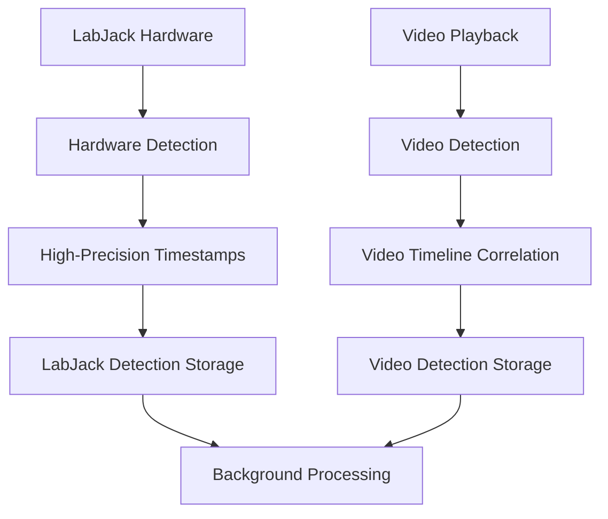
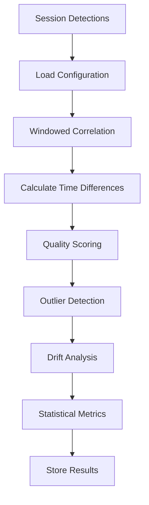

# LabJack Detection Storage and Comparison System Architecture

## Overview

This document describes the architecture for the independent LabJack detection storage and comparison system, designed to separate hardware detection from video playback for precise temporal synchronization analysis.

## System Components

### 1. Database Schema (`src/models/labjack_models.py`)

#### Core Models

**LabJackDetection**
- Independent hardware detection storage
- High-precision timestamps (hardware + system)
- Monotonic time for precise intervals
- Signal quality metrics and device configuration
- Status tracking and correlation windows

**VideoDetection** 
- Video playback detection events
- Video timeline correlation with real-time
- Playback speed and processing delay tracking
- Frame-level precision with confidence scoring

**DetectionSynchronization**
- Temporal relationship analysis between hardware and video
- Configurable tolerance windows and correlation algorithms
- Quality scores and drift analysis
- Manual review flags and validation status

**DetectionConfiguration**
- Per-session or global detection parameters
- Configurable windows (100ms default)
- Threshold and quality settings
- Analysis algorithm selection

**TemporalAnalysisResult**
- Comprehensive session analysis results
- Statistical metrics and performance data
- Drift analysis and stability scoring
- Quality assessment and recommendations

#### Key Features

- **Temporal Precision**: Microsecond-level timestamp storage
- **Flexible Windows**: Configurable detection windows (1ms - 10s)
- **Quality Assurance**: SNR, stability, and consistency metrics
- **Performance Optimization**: Indexed queries and batch processing
- **Validation Framework**: Automated and manual review capabilities

### 2. API Endpoints (`src/api/labjack_detection_api.py`)

#### Detection Storage Endpoints

```
POST /api/labjack-detections/labjack
POST /api/labjack-detections/video
GET  /api/labjack-detections/labjack/session/{session_id}
GET  /api/labjack-detections/video/session/{session_id}
```

#### Configuration Management

```
POST /api/labjack-detections/configurations
GET  /api/labjack-detections/configurations
```

#### Synchronization Analysis

```
POST /api/labjack-detections/synchronize
GET  /api/labjack-detections/synchronization/{analysis_id}
GET  /api/labjack-detections/session/{session_id}/synchronization-summary
```

#### Key Features

- **Async Processing**: Background synchronization analysis
- **Batch Operations**: Efficient bulk detection storage
- **Real-time Streaming**: Live detection feeds via WebSocket
- **Filtering & Pagination**: Flexible data retrieval
- **Performance Monitoring**: Built-in metrics and timing

### 3. Temporal Synchronization Service (`src/services/temporal_sync_service.py`)

#### Core Algorithms

**Windowed Correlation**
```python
# Configurable time windows for detection matching
window_start = labjack_time - (config.labjack_window_ms / 1000.0)
window_end = labjack_time + (config.labjack_window_ms / 1000.0)
```

**Quality Scoring**
```python
# Multi-factor correlation scoring
combined_score = (
    0.5 * time_proximity_score +
    0.3 * confidence_score + 
    0.2 * signal_quality_score
)
```

**Drift Analysis**
- Linear regression on time differences
- Stability scoring and jitter analysis
- Outlier detection using IQR method
- Performance degradation tracking

#### Analysis Pipeline

1. **Data Loading**: Session-based detection retrieval
2. **Windowed Correlation**: Temporal proximity matching
3. **Quality Assessment**: Multi-metric scoring
4. **Outlier Filtering**: Statistical anomaly removal
5. **Drift Analysis**: Long-term stability evaluation
6. **Results Storage**: Comprehensive result persistence

### 4. Detection Storage Service (`src/services/detection_storage_service.py`)

#### High-Performance Features

**Buffered Storage**
- Thread-safe detection buffers (10k+ capacity)
- Configurable batch sizes for optimal throughput
- Automatic overflow handling and metrics tracking

**Real-time Streaming**
```python
async def get_detection_stream(session_id, source=None):
    # Live detection streaming with configurable buffering
    # Supports filtering by source and time range
```

**Background Processing**
- Async batch processing loops
- Automatic buffer flushing
- Performance optimization and monitoring

**Data Integrity**
- Validation before storage
- Transaction safety and rollback
- Comprehensive error handling

### 5. Detection Validation Service (`src/services/detection_validation_service.py`)

#### Signal Quality Analysis

**Signal-to-Noise Ratio**
```python
snr_db = 10 * log10(signal_power / noise_power)
```

**Temporal Consistency**
```python
consistency = 1 - min(coefficient_of_variation, 1.0)
```

**Amplitude Stability**
```python  
stability = 1 - min(cv_amplitude / 2.0, 1.0)
```

#### Validation Framework

- **Real-time Validation**: Per-detection quality checks
- **Context Analysis**: Signal quality over time windows
- **Session Validation**: Batch quality assessment
- **Automated Recommendations**: Quality improvement suggestions

## Temporal Synchronization Workflow

### 1. Independent Detection Storage



### 2. Temporal Correlation Analysis



### 3. Real-time vs Recorded Time Comparison

#### Time Reference Points

- **Hardware Time**: LabJack device timestamp
- **System Time**: Host system receive timestamp  
- **Monotonic Time**: High-precision interval measurement
- **Video Time**: Playback timeline position
- **Playback Time**: Real-time playback timestamp

#### Synchronization Analysis

1. **Temporal Windows**: Configurable detection correlation windows
2. **Drift Compensation**: Linear regression-based drift correction
3. **Quality Metrics**: SNR, consistency, stability scoring
4. **Performance Tracking**: Throughput and latency monitoring

## Configuration System

### Detection Windows

```json
{
  "labjack_window_ms": 100,
  "video_window_ms": 100, 
  "synchronization_tolerance_ms": 50,
  "signal_threshold": 3.0,
  "confidence_threshold": 0.7,
  "correlation_method": "pearson"
}
```

### Quality Thresholds

- **Minimum SNR**: 6.0 dB
- **Minimum Confidence**: 0.5
- **Maximum False Positive Rate**: 0.1
- **Maximum False Negative Rate**: 0.2
- **Minimum Consistency**: 0.7
- **Minimum Stability**: 0.6

## Performance Characteristics

### Storage Performance

- **Throughput**: 10,000+ detections/second with buffering
- **Latency**: <1ms for individual detection storage
- **Batch Size**: Configurable (default 100)
- **Buffer Capacity**: 10,000 detections per buffer

### Analysis Performance  

- **Correlation Speed**: ~1000 detection pairs/second
- **Memory Usage**: <100MB for 100k detections
- **Parallel Processing**: Multi-threaded correlation analysis
- **Background Processing**: Non-blocking analysis execution

### Database Optimization

- **Indexes**: Composite indexes on session_id, timestamp
- **Partitioning**: Time-based partitioning for large datasets
- **Cleanup**: Automated retention policy management
- **Compression**: JSON field compression for metadata

## Integration Examples

### Real-time Detection Storage

```python
# Store LabJack detection
detection_id = await storage_service.store_labjack_detection(
    session_id="session_123",
    device_id="labjack_001", 
    hardware_timestamp=datetime.now(timezone.utc),
    signal_value=5.2,
    threshold_value=3.0,
    channel=0
)

# Store video detection
video_id = await storage_service.store_video_detection(
    session_id="session_123",
    video_id="video_456",
    video_timestamp=123.45,
    detection_type="object_detected"
)
```

### Synchronization Analysis

```python  
# Trigger analysis
analysis = await sync_service.analyze_session_synchronization(
    analysis_id="analysis_789",
    session_id="session_123", 
    config_id="config_default"
)

# Get results
results = await api_client.get_synchronization_result("analysis_789")
print(f"Synchronization accuracy: {results['synchronization_accuracy']:.1f}%")
print(f"Mean time difference: {results['mean_time_difference_ms']:.2f}ms")
```

### Quality Validation

```python
# Validate detection quality
validation_result = await validation_service.validate_labjack_detection(
    detection, context_window_seconds=60
)

if validation_result.is_valid:
    print(f"Quality score: {validation_result.quality_score:.2f}")
else:
    print("Validation errors:", validation_result.errors)
```

## Deployment Considerations

### Database Requirements

- **PostgreSQL 12+**: Advanced indexing and JSON support
- **Storage**: ~1MB per 10k detections (with metadata)
- **Backup**: Regular incremental backups recommended
- **Monitoring**: Query performance and storage growth tracking

### System Resources

- **CPU**: Multi-core recommended for parallel analysis
- **Memory**: 4GB+ for large session analysis  
- **Network**: Low-latency connection for real-time detection
- **Storage**: SSD recommended for high-throughput scenarios

### Security Considerations

- **Authentication**: API key-based access control
- **Authorization**: Session-based permission model
- **Data Privacy**: Detection data anonymization options
- **Audit Logging**: Comprehensive access and modification logs

## Future Enhancements

### Advanced Analysis

- **Machine Learning**: Automated pattern recognition in temporal data
- **Predictive Modeling**: Detection quality prediction
- **Anomaly Detection**: Advanced outlier identification
- **Adaptive Thresholds**: Dynamic threshold adjustment

### Scalability Improvements

- **Distributed Processing**: Multi-node analysis capabilities
- **Stream Processing**: Real-time detection processing pipelines
- **Caching**: Redis-based result caching for improved performance
- **Microservices**: Service decomposition for better scalability

### Integration Features

- **External APIs**: Integration with third-party analysis tools
- **Export Formats**: Multiple data export formats (CSV, HDF5, etc.)
- **Visualization**: Real-time detection and synchronization dashboards
- **Alerting**: Quality degradation and anomaly notifications