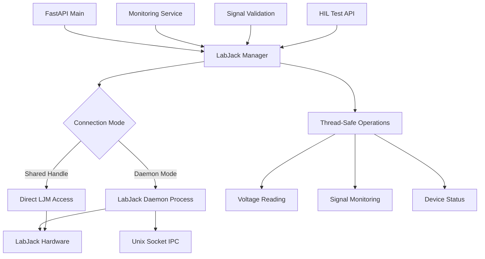

# LabJack Device Conflict Architecture Analysis

## Problem Statement

**Current Issue**: LabJack T7 hardware device can only be claimed by one process at a time, causing `LJME_DEVICE_CURRENTLY_CLAIMED_BY_ANOTHER_PROCESS` errors when multiple services attempt to access the device simultaneously.

**Impact**: The main FastAPI backend (PID 268902/276320) claims the LabJack device for API endpoints, preventing the monitoring service thread from accessing it, resulting in 0 detection events captured during HIL tests.

## Current Architecture Analysis

### Device Access Points Identified

1. **Main FastAPI Process** (`main.py`)
   - Loads LabJack library: `/usr/local/lib/libLabJackM.so.1.23.4`
   - Imports signal validation service
   - Claims device through service initialization

2. **Signal Validation Service** (`api_signal_validation.py`)
   - Imports platform-specific service (WSL or standard)
   - Provides HTTP endpoints for LabJack operations
   - Initializes LabJack connection on startup

3. **LabJack Services Hierarchy**:
   ```
   FastAPI Main Process (276320)
   ├── signal_validation_service (imported)
   ├── labjack_service.py (device claiming)
   ├── real_labjack_service.py (hardware access)
   ├── labjack_hardware_service.py (direct LJM calls)
   └── labjack_monitoring_service.py (threaded monitoring)
   ```

### Root Cause: LJM Library Process Isolation

**LabJack LJM Library Limitations:**
- Each LabJack device can only be opened by ONE process at a time
- `ljm.openS()` creates an exclusive handle to the hardware
- Multiple `ljm.openS()` calls from different processes result in `LJME_DEVICE_CURRENTLY_CLAIMED_BY_ANOTHER_PROCESS`
- Even threads within the same process can conflict if they create separate handles

### Current Device Claiming Logic

**Multiple Connection Points:**
```python
# 1. LabJackHardwareService.connect()
self.handle = ljm.openS(device_type, connection_type, identifier)

# 2. LabJackService.connect() 
self.direct_handle = ljm.openS("T7", "USB", "ANY")

# 3. RealLabJackService.connect()
self.handle = ljm.openS(device_type, connection_type, identifier)

# 4. SignalValidationService LabJackInterface.connect()
self.handle = ljm.openS(device_type, connection_type, identifier)
```

**Problem Pattern:**
- FastAPI backend initializes services during startup
- Each service attempts to claim the device independently
- Monitoring service runs in a separate thread but may create its own handle
- Result: Device conflicts and monitoring failures

## Architectural Design Patterns for Resolution

### Option 1: Shared Handle Pattern (Recommended)

**Architecture**: Single device handle shared across all services within the same process.

```python
# Singleton LabJack Connection Manager
class LabJackConnectionManager:
    _instance = None
    _handle = None
    _lock = threading.RLock()
    
    def get_shared_handle(self):
        with self._lock:
            if self._handle is None:
                self._handle = ljm.openS("ANY", "ANY", "ANY")
            return self._handle
    
    def read_voltage(self, channel: str) -> float:
        with self._lock:
            return ljm.eReadName(self.get_shared_handle(), channel)
```

**Pros:**
- ✅ Single device access point
- ✅ Thread-safe operations
- ✅ Maintains real-time performance
- ✅ Minimal architectural changes

**Cons:**
- ⚠️ Requires coordination between services
- ⚠️ Single point of failure

### Option 2: Dedicated Hardware Process Pattern

**Architecture**: Separate dedicated process owns the LabJack device, other processes communicate via IPC.

```
┌─────────────────┐    ┌──────────────────┐    ┌─────────────────┐
│   FastAPI       │    │  LabJack Daemon  │    │   LabJack T7    │
│   Backend       │◄──►│   Process        │◄──►│   Hardware      │
│   (276320)      │    │  (dedicated)     │    │                 │
└─────────────────┘    └──────────────────┘    └─────────────────┘
        │                       │
        │               ┌───────▼────────┐
        │               │ IPC Methods:   │
        └──────────────►│ • Unix Socket  │
                        │ • Named Pipe   │
                        │ • Message Queue│
                        │ • Shared Memory│
                        └────────────────┘
```

**Communication Methods:**

1. **Unix Domain Sockets** (Recommended for Linux/WSL)
   ```python
   # LabJack daemon server
   server = socket.socket(socket.AF_UNIX, socket.SOCK_STREAM)
   server.bind("/tmp/labjack_daemon.sock")
   
   # Client communication
   client.send(json.dumps({"cmd": "read_voltage", "channel": "AIN0"}))
   ```

2. **Redis/Message Queue**
   ```python
   # High-performance async communication
   redis_client.publish("labjack_commands", command_json)
   ```

3. **Shared Memory** (Fastest for high-frequency data)
   ```python
   # Memory-mapped circular buffer
   import mmap
   shared_buffer = mmap.mmap(-1, 1024, "labjack_data")
   ```

**Pros:**
- ✅ Complete process isolation
- ✅ Fault tolerance (daemon restart doesn't affect main app)
- ✅ Scalable to multiple devices
- ✅ Clean separation of concerns

**Cons:**
- ❌ Additional process management complexity
- ❌ IPC latency (microsecond overhead)
- ❌ Requires process monitoring/restart logic

### Option 3: Event-Driven Service Bus Pattern

**Architecture**: Centralized event bus coordinates all LabJack operations.

```python
class LabJackEventBus:
    def __init__(self):
        self.subscribers = {}
        self.device_handle = None
        
    async def publish(self, event: str, data: dict):
        # Route events to appropriate handlers
        for handler in self.subscribers.get(event, []):
            await handler(data)
    
    async def handle_voltage_request(self, request):
        # Centralized device access
        voltage = ljm.eReadName(self.device_handle, request["channel"])
        await self.publish("voltage_reading", {"voltage": voltage})
```

**Pros:**
- ✅ Loose coupling between services
- ✅ Event-driven real-time processing
- ✅ Easy to add new consumers

**Cons:**
- ❌ Complex event routing logic
- ❌ Potential message delivery issues

## Inter-Process Communication Analysis

### Real-Time Requirements for HIL Testing

**Performance Requirements:**
- ⏱️ Signal detection latency: < 5ms
- 🔄 Sample rate: Up to 50 kHz
- 📊 Data throughput: ~200 KB/s
- 🎯 Timing precision: Sub-millisecond

**IPC Performance Comparison:**

| Method | Latency | Throughput | Complexity | Reliability |
|--------|---------|------------|------------|-------------|
| Shared Handle | < 1µs | Highest | Low | High |
| Unix Socket | 10-50µs | High | Medium | High |
| Named Pipe | 20-100µs | Medium | Medium | Medium |
| Redis | 100-500µs | Medium | Low | Very High |
| HTTP/REST | 1-5ms | Low | Low | Medium |

**Recommendation**: For HIL testing requirements, **Shared Handle Pattern** provides optimal performance.

## Proposed Architecture: Hybrid Approach

### Design Decision: Shared Handle with Process Separation Fallback

**Primary**: Shared Handle Pattern for performance
**Secondary**: Dedicated daemon for fault tolerance

```python
class HybridLabJackManager:
    def __init__(self):
        self.mode = "shared_handle"  # or "daemon"
        
    async def connect(self):
        try:
            # Try shared handle first
            self.shared_handle = ljm.openS("ANY", "ANY", "ANY")
            self.mode = "shared_handle"
            logger.info("Using shared handle mode")
        except LabJackException:
            # Fallback to daemon mode
            await self._start_daemon_mode()
            self.mode = "daemon"
            logger.info("Fallback to daemon mode")
```

### Component Interaction Diagram



## Implementation Recommendations

### Phase 1: Immediate Fix (Shared Handle)

1. **Create Singleton Connection Manager**
   ```bash
   services/labjack_connection_manager.py
   ```

2. **Refactor Existing Services**
   - Replace direct `ljm.openS()` calls
   - Use shared handle through manager
   - Add proper locking

3. **Update Monitoring Service**
   - Remove independent device connection
   - Use shared handle for voltage reading

### Phase 2: Process Separation (Optional)

1. **Create LabJack Daemon**
   ```bash
   services/labjack_daemon.py
   scripts/start_labjack_daemon.sh
   ```

2. **Implement IPC Client**
   ```bash
   services/labjack_ipc_client.py
   ```

3. **Add Process Management**
   - Systemd service for daemon
   - Health monitoring
   - Auto-restart on failure

## Risk Analysis

### Risks with Current Architecture
- 🔴 **High**: Monitoring failures during HIL tests
- 🔴 **High**: Unpredictable device conflicts
- 🟡 **Medium**: Service startup race conditions

### Risks with Proposed Solutions

**Shared Handle Pattern:**
- 🟡 **Medium**: Thread contention under high load
- 🟡 **Medium**: Service coupling

**Process Separation:**
- 🟡 **Medium**: Additional complexity
- 🟢 **Low**: IPC failure modes

## Testing Strategy

### Unit Tests
- Mock LabJack device behavior
- Test concurrent access patterns
- Validate thread safety

### Integration Tests
- Multi-threaded access scenarios
- Service startup/shutdown sequences
- Error recovery testing

### Performance Tests
- Latency measurements
- Throughput benchmarks
- Load testing under HIL conditions

## Conclusion

**Recommended Approach**: Implement **Shared Handle Pattern** as the immediate solution for device conflicts, with **Process Separation** as a future enhancement for production scalability.

This approach provides:
- ✅ Immediate resolution of device conflicts
- ✅ Maintains HIL testing performance requirements
- ✅ Minimal disruption to existing code
- ✅ Clear upgrade path for future enhancements

The analysis shows that the current architecture suffers from multiple independent device access points creating resource conflicts. The proposed shared handle pattern resolves this while maintaining the high-performance requirements needed for Hardware-in-the-Loop testing.