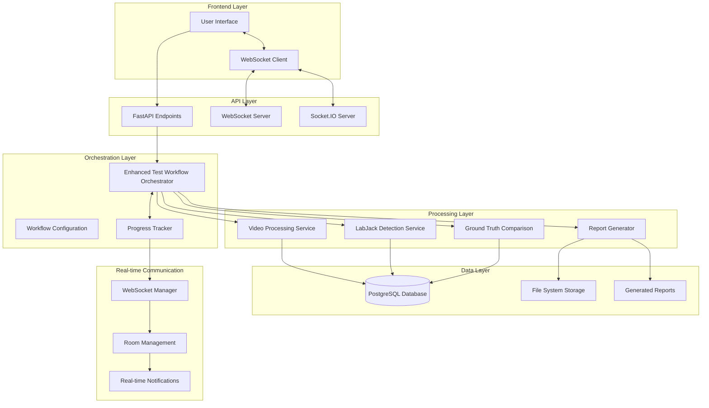
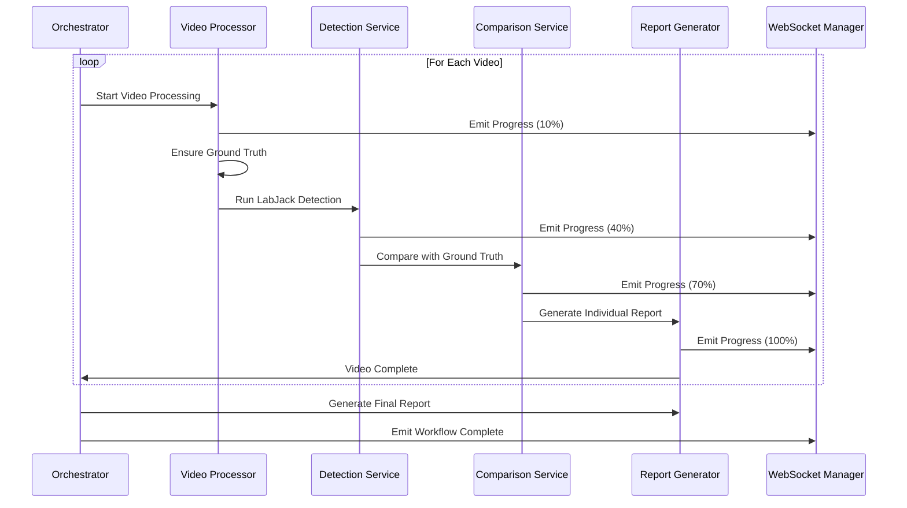
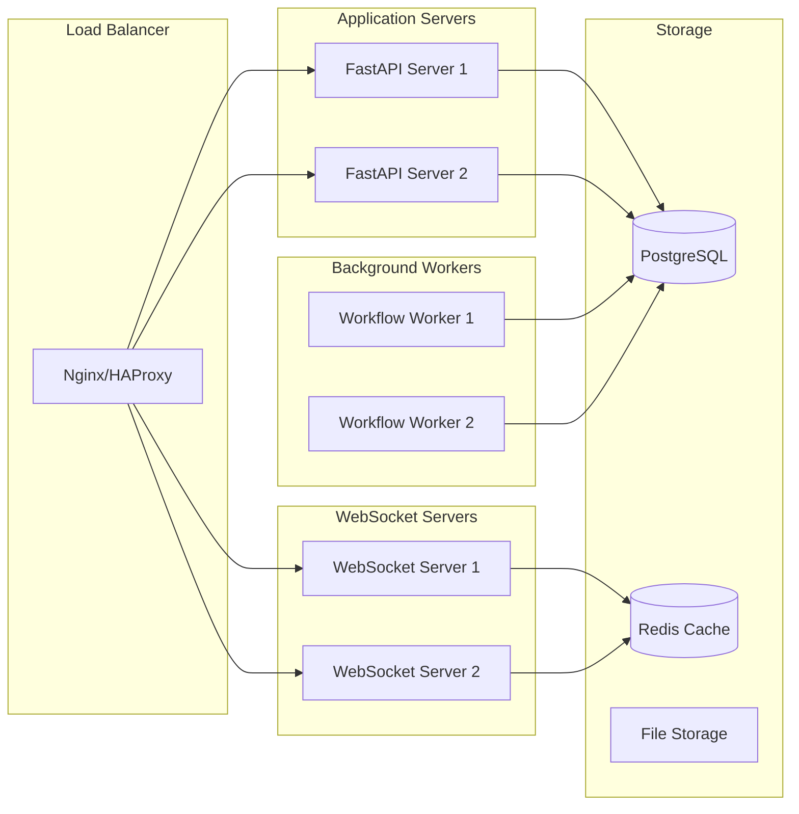

# Enhanced Test Workflow System - Complete Architecture Design

## System Overview

The Enhanced Test Workflow system provides a completely automated "walk away" testing experience where users can click "Start Test" and return to find comprehensive results for all project videos.

## Architecture Diagram



## Component Architecture

### 1. Enhanced Test Workflow Orchestrator

**Purpose**: Central coordinator managing the complete automated test workflow

**Key Responsibilities**:
- Sequential video processing management
- Progress tracking and reporting
- Error handling and recovery
- Real-time status broadcasting
- Report generation coordination

**Key Classes**:
```python
class EnhancedTestWorkflowOrchestrator:
    - start_enhanced_test_workflow()
    - _execute_workflow()
    - _process_single_video()
    - _generate_final_report()
    - cancel_workflow()
```

**Status Management**:
```python
class WorkflowStatus(Enum):
    INITIALIZING = "initializing"
    LOADING_VIDEOS = "loading_videos"
    PROCESSING_VIDEO = "processing_video"
    RUNNING_DETECTION = "running_detection"
    COMPARING_RESULTS = "comparing_results"
    GENERATING_REPORT = "generating_report"
    COMPLETED = "completed"
    FAILED = "failed"
    CANCELLED = "cancelled"
```

### 2. Database Schema Extensions

**Enhanced Test Workflow Table**:
```sql
CREATE TABLE enhanced_test_workflows (
    id VARCHAR(36) PRIMARY KEY,
    project_id VARCHAR(36) REFERENCES projects(id),
    name VARCHAR NOT NULL,
    config JSON NOT NULL,
    status VARCHAR NOT NULL,
    start_time TIMESTAMP WITH TIME ZONE,
    end_time TIMESTAMP WITH TIME ZONE,
    total_videos INTEGER,
    completed_videos INTEGER,
    failed_videos INTEGER,
    overall_progress REAL,
    final_results JSON,
    error_log JSON
);
```

**Video Workflow Execution Table**:
```sql
CREATE TABLE video_workflow_executions (
    id VARCHAR(36) PRIMARY KEY,
    workflow_id VARCHAR(36) REFERENCES enhanced_test_workflows(id),
    video_id VARCHAR(36) REFERENCES videos(id),
    execution_order INTEGER,
    status VARCHAR NOT NULL,
    processing_duration REAL,
    total_detections INTEGER,
    true_positives INTEGER,
    false_positives INTEGER,
    false_negatives INTEGER,
    precision REAL,
    recall REAL,
    f1_score REAL,
    individual_report_path VARCHAR
);
```

### 3. Real-time Communication Architecture

**WebSocket Event Structure**:
```typescript
interface WorkflowProgressEvent {
    type: 'workflow_progress';
    workflow_id: string;
    progress: {
        total_videos: number;
        completed_videos: number;
        failed_videos: number;
        current_video?: string;
        current_video_progress: number;
        overall_progress: number;
    };
    timestamp: string;
}

interface VideoProgressEvent {
    type: 'video_progress';
    workflow_id: string;
    video_id: string;
    progress_percentage: number;
    message: string;
    timestamp: string;
}

interface WorkflowStatusEvent {
    type: 'workflow_status';
    workflow_id: string;
    status: string;
    message?: string;
    timestamp: string;
}
```

**Room Management**:
- `workflow_{workflow_id}`: Workflow-specific updates
- `project_{project_id}`: Project-wide notifications
- `video_{video_id}`: Video-specific progress
- `general`: System-wide alerts

### 4. Video Processing Pipeline

**Sequential Processing Flow**:


### 5. Error Handling and Recovery

**Error Handling Strategy**:
```python
class ErrorHandlingConfig:
    continue_on_error: bool = True
    fail_fast: bool = False
    max_retries: int = 2
    retry_failed_videos: bool = True
    timeout_per_video: int = 300  # seconds
```

**Error Recovery Flow**:
1. **Video-Level Errors**: Log error, mark video as failed, continue to next
2. **Critical Errors**: Stop workflow, preserve partial results
3. **Timeout Handling**: Cancel stuck video, mark as failed
4. **Retry Logic**: Retry failed videos up to max_retries

### 6. Results and Reporting System

**Individual Video Reports**:
```json
{
    "video_info": {
        "id": "video_id",
        "filename": "child-1-1-1.mp4",
        "duration": 30.5,
        "fps": 30
    },
    "test_results": {
        "total_detections": 15,
        "true_positives": 12,
        "false_positives": 3,
        "false_negatives": 2,
        "precision": 0.80,
        "recall": 0.86,
        "f1_score": 0.83
    }
}
```

**Final Comprehensive Report**:
```json
{
    "workflow_summary": {
        "workflow_id": "workflow_id",
        "project_id": "project_id",
        "total_duration_seconds": 1200,
        "status": "completed"
    },
    "video_summary": {
        "total_videos": 10,
        "completed_videos": 9,
        "failed_videos": 1,
        "success_rate": 0.90
    },
    "performance_metrics": {
        "overall_precision": 0.85,
        "overall_recall": 0.82,
        "overall_f1_score": 0.84
    },
    "individual_video_results": {...}
}
```

## API Endpoints

### REST API Endpoints
```
POST   /api/enhanced-test/start-workflow
GET    /api/enhanced-test/workflow/{workflow_id}/status
GET    /api/enhanced-test/workflow/{workflow_id}/results
POST   /api/enhanced-test/workflow/{workflow_id}/cancel
GET    /api/enhanced-test/workflows
GET    /api/enhanced-test/workflow/{workflow_id}/report/download
GET    /api/enhanced-test/project/{project_id}/test-history
```

### WebSocket Endpoints
```
WS     /api/enhanced-test/workflow/{workflow_id}/ws
WS     /api/enhanced-test/ws/general
```

## Frontend Integration

**User Interface Flow**:
1. **Project Selection**: User selects project with videos
2. **Configuration**: Set tolerance, retry options, report preferences
3. **Start Test**: Single click starts complete workflow
4. **Real-time Progress**: WebSocket updates show current progress
5. **Walk Away**: User can leave and return later
6. **Results Display**: Comprehensive results page with all data

**Progress Tracking Components**:
```typescript
interface WorkflowProgress {
    overall_progress: number;
    current_video: string;
    completed_videos: number;
    total_videos: number;
    current_step: string;
    estimated_completion?: Date;
}
```

## Deployment Architecture

**Production Deployment**:


## Security Considerations

**Authentication & Authorization**:
- JWT token validation for API access
- WebSocket connection authentication
- Project-level access control
- Rate limiting for workflow creation

**Data Protection**:
- Encrypted storage of sensitive results
- Audit logging of all workflow activities
- Secure file storage for reports
- PII handling in detection results

## Performance Optimization

**Scalability Features**:
- Horizontal scaling of workflow workers
- Redis-based session management
- Database connection pooling
- Efficient WebSocket broadcasting

**Memory Management**:
- Streaming video processing
- Chunked report generation
- Garbage collection of completed workflows
- Resource cleanup on errors

## Monitoring and Observability

**Metrics Tracking**:
- Workflow completion rates
- Average processing time per video
- Error rates by type
- WebSocket connection health
- Resource utilization

**Logging Strategy**:
- Structured JSON logging
- Correlation IDs across services
- Performance timing logs
- Error context preservation

## Future Enhancements

**Planned Features**:
1. **Parallel Video Processing**: Process multiple videos simultaneously
2. **Advanced Error Recovery**: Smart retry with exponential backoff
3. **Custom Report Templates**: User-defined report formats
4. **Integration APIs**: Webhook notifications for external systems
5. **Advanced Analytics**: ML-powered performance insights

This architecture provides a robust, scalable foundation for automated test execution with comprehensive real-time monitoring and reporting capabilities.