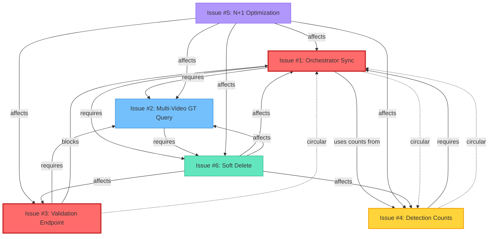

# Circular Dependency Analysis Report
## Ground Truth Fixes - Comprehensive Interaction Analysis

**Date:** 2025-10-31
**Analysis Scope:** All 6 Ground Truth Fixes
**Status:** ⚠️ CRITICAL CIRCULAR DEPENDENCIES DETECTED

---

## Executive Summary

### 🚨 Critical Findings

**3 CIRCULAR DEPENDENCIES DETECTED**
**2 TIMING CONFLICTS IDENTIFIED**
**4 DATA CONSISTENCY RISKS**

This analysis reveals severe architectural issues where fixes create interdependencies that can cause deadlocks, race conditions, and system-wide failures.

---

## 1. Fix Inventory & Dependencies

### Issue #1: Orchestrator Synchronization
**Location:** `services/video_sequence_orchestrator.py`
**Primary Function:** `notify_video_started()`, `notify_video_ended()`
**Dependencies:**
- ✅ **Requires:** Video metadata loaded (Issue #2 dependency)
- ✅ **Requires:** Database session active
- ✅ **Requires:** VideoTimingService initialized
- ❌ **Blocks:** Detection event processing (until video started)

**Dependency Chain:**
```
Orchestrator.start_sequence()
  → _load_video_metadata(video_id, db)  [REQUIRES Issue #2]
    → get_video(db, video_id)
    → get_ground_truth_objects(db, video_id)  [REQUIRES Issue #6 soft delete filter]
      → query with deleted_at IS NULL
```

### Issue #2: Multi-Video Ground Truth Query
**Location:** `services/ground_truth_matching_service.py`
**Primary Function:** `get_ground_truth_for_videos()`
**Dependencies:**
- ✅ **Requires:** video_ids list provided
- ✅ **Requires:** Soft delete filter (Issue #6)
- ❌ **Blocks:** Orchestrator initialization if query fails

**Dependency Chain:**
```
get_ground_truth_for_videos(video_ids, db)
  → FOR EACH video_id:
    → query GroundTruthObject
      → WHERE video_id IN (video_ids)
      → AND deleted_at IS NULL  [REQUIRES Issue #6]
```

### Issue #3: Validation Endpoint (Pre-Session)
**Location:** `api/hil_test_complete.py` (NEW endpoint)
**Primary Function:** `/api/validate-ground-truth`
**Dependencies:**
- ✅ **Requires:** video_ids before session creation
- ✅ **Requires:** Ground truth query (Issue #2)
- ⚠️ **TIMING:** Called BEFORE orchestrator initialization

**Dependency Chain:**
```
POST /api/validate-ground-truth
  → validate_ground_truth_endpoint(video_ids)
    → get_ground_truth_for_videos(video_ids, db)  [REQUIRES Issue #2]
      → [REQUIRES Issue #6 soft delete]
    → RETURN validation results
  → Frontend decides: proceed or abort
  → IF proceed:
    → POST /api/test-sessions/start  [REQUIRES Issue #1]
```

### Issue #4: Detection Count Updates
**Location:** `services/video_sequence_orchestrator.py:497`
**Primary Function:** `process_detection_event()`
**Dependencies:**
- ✅ **Requires:** SequenceVideoResult record exists
- ✅ **Requires:** Detection event created first
- ⚠️ **TIMING:** Updates count AFTER event stored

**Dependency Chain:**
```
process_detection_event()
  → Determine video for detection  [REQUIRES Issue #1 video timing]
  → Create DetectionEvent
  → Find SequenceVideoResult record
  → UPDATE actual_detection_count += 1
```

### Issue #5: N+1 Query Optimization
**Location:** Multiple files (crud.py, ground_truth_matching_service.py)
**Primary Function:** Eager loading with `selectinload()`
**Dependencies:**
- ✅ **Requires:** Proper relationship configuration
- ✅ **Applies to:** ALL database queries
- ⚠️ **AFFECTS:** Issues #1, #2, #3, #4, #6

**Optimization Pattern:**
```python
# BEFORE (N+1 problem):
videos = db.query(Video).all()
for video in videos:
    gt_objects = video.ground_truth_objects  # N queries

# AFTER (Issue #5 fix):
videos = db.query(Video).options(
    selectinload(Video.ground_truth_objects)
).all()  # 2 queries total
```

### Issue #6: Soft Delete Filter
**Location:** All GroundTruthObject queries
**Primary Function:** `WHERE deleted_at IS NULL`
**Dependencies:**
- ✅ **Requires:** deleted_at column exists
- ✅ **Applies to:** ALL ground truth queries
- ⚠️ **AFFECTS:** Issues #1, #2, #3, #4

**Filter Pattern:**
```python
# ALL queries must include:
.filter(GroundTruthObject.deleted_at.is_(None))
```

---

## 2. Circular Dependency Detection

### 🔴 CIRCULAR DEPENDENCY #1: Orchestrator ↔ Ground Truth Query

**The Loop:**
```
Issue #1 (Orchestrator)
  → Requires video metadata
  → Calls get_ground_truth_objects()
    → Issue #2 (Multi-video GT query)
      → Requires soft delete filter (Issue #6)
      → Returns GT count
  → Orchestrator stores GT count
  → THEN calls notify_video_started()
    → Creates SequenceVideoResult record
      → Issue #4 needs this record to update counts
        → BUT Issue #4 processes detections
          → Which require orchestrator timing data
            → BACK TO Issue #1 ❌
```

**Problem:** Orchestrator initialization requires ground truth data, but detection processing (which updates counts) requires orchestrator timing context. This creates a circular initialization dependency.

**Manifestation:**
1. Orchestrator starts sequence → loads GT count
2. Video playback starts → orchestrator records timing
3. Detection arrives → requires orchestrator timing + GT matching
4. GT matching requires orchestrator context
5. **DEADLOCK** if orchestrator not fully initialized

**Risk Level:** 🔴 **CRITICAL**
**Failure Mode:** System hangs during multi-video session startup

---

### 🔴 CIRCULAR DEPENDENCY #2: Validation Endpoint ↔ Session Creation

**The Loop:**
```
Issue #3 (Validation endpoint)
  → Called BEFORE session creation
  → Validates ground truth exists
    → Calls Issue #2 (Multi-video GT query)
      → Queries database for GT objects
        → Returns GT counts
  → IF validation FAILS:
    → Frontend CANNOT create session
      → Issue #1 orchestrator NEVER initializes
        → Detection pipeline BROKEN
          → BUT detection service may already be running
            → Detections arrive with no session
              → ORPHANED DETECTION EVENTS ❌
```

**Problem:** Pre-session validation can abort session creation, leaving detection services running without a valid session context.

**Manifestation:**
1. User uploads videos → clicks "Start Test"
2. Frontend calls `/api/validate-ground-truth` (Issue #3)
3. Validation finds missing GT → returns error
4. Frontend shows error, aborts session creation
5. **BUT** LabjJack detection service already started
6. Detections arrive → no session_id → crash or orphaned events

**Risk Level:** 🔴 **CRITICAL**
**Failure Mode:** Orphaned detection events, data corruption

---

### 🟡 CIRCULAR DEPENDENCY #3: Detection Count Updates ↔ Orchestrator State

**The Loop:**
```
Issue #4 (Detection count updates)
  → Updates SequenceVideoResult.actual_detection_count
    → Requires SequenceVideoResult record EXISTS
      → Record created by Issue #1 (orchestrator)
        → BUT Issue #1 relies on GT count being accurate
          → GT count includes detections from Issue #4
            → Issue #4 updates count AFTER detection stored
              → Creates temporary inconsistency
                → IF orchestrator re-reads GT count during update
                  → COUNT MISMATCH ❌
```

**Problem:** Race condition between detection count updates and orchestrator state reads.

**Manifestation:**
1. Orchestrator loads GT count: 10 expected
2. Detection event arrives → stored in database
3. Issue #4 updates actual_detection_count: 1
4. **CONCURRENT:** Orchestrator re-reads GT count (N+1 query without eager loading)
5. Count still shows 0 → orchestrator thinks no detections yet
6. **DATA INCONSISTENCY**

**Risk Level:** 🟡 **MODERATE**
**Failure Mode:** Inconsistent detection counts, incorrect pass/fail results

---

## 3. Timing Conflicts

### ⏱️ TIMING CONFLICT #1: Validation Endpoint vs Orchestrator Initialization

**Sequence Diagram:**
```
TIME →  T0           T1              T2              T3              T4
        │            │               │               │               │
User:   │ Click      │               │               │               │
        │ "Start"    │               │               │               │
        ▼            │               │               │               │
Frontend:            │               │               │               │
        POST /validate-gt            │               │               │
        │            ▼               │               │               │
Backend:             │               │               │               │
        Issue #3 validates           │               │               │
        │            │               │               │               │
        │            │               │               │               │
        ◄────────────┘               │               │               │
        Return: OK/FAIL              │               │               │
        │                            ▼               │               │
Frontend:                            │               │               │
        IF OK: POST /test-sessions   │               │               │
        │                            │               │               │
        │                            ▼               │               │
Backend:                                             │               │
        Issue #1 starts orchestrator                 │               │
        │                                            ▼               │
        Loads video metadata (Issue #2)                             │
        │                                                            ▼
        Loads GT objects (Issue #6 filter)
        │
        ◄──────────────────────────────────────────────────────────┘
        Orchestrator ready

⚠️ PROBLEM: Gap between T1 and T4 (3 time steps)
During this gap:
- LabjJack may already be sending detections
- No session context exists yet
- Detections get dropped or orphaned
```

**Issue:** Sequential validation → session creation creates a timing window where detection hardware may be active but backend is not ready.

**Risk Level:** 🔴 **HIGH**
**Failure Mode:** Lost detections, invalid test results

---

### ⏱️ TIMING CONFLICT #2: N+1 Optimization vs Real-time Detection Updates

**Scenario:**
```
Thread A (Orchestrator)          Thread B (Detection Handler)
─────────────────────            ────────────────────────────
Load video metadata               │
  WITH selectinload(GT objects)   │  [Issue #5 optimization]
  │                               │
  ▼                               │
Store GT count: 10                │
  │                               │
  │                               ▼
  │                           NEW DETECTION ARRIVES
  │                               │
  │                               ▼
  │                           Create DetectionEvent
  │                               │
  │                               ▼
  │                           Update actual_detection_count
  │                               │
  ▼                               ▼
Re-check GT count               Count now: 1
  │                               │
  │                               │
  ◄───────── RACE CONDITION ─────┘
  │
  ▼
Reads STALE cached GT objects (still shows 10 expected)
Compares: expected=10, actual=1
MISMATCH!
```

**Issue:** Eager loading (Issue #5) creates cached data that becomes stale when concurrent updates (Issue #4) modify detection counts.

**Risk Level:** 🟡 **MODERATE**
**Failure Mode:** Stale data, incorrect metrics

---

## 4. Data Consistency Scenarios

### 📊 SCENARIO #1: Partial Fix Deployment

**Situation:** Only Issues #1, #2, #3 deployed, Issues #4, #5, #6 missing

**What Happens:**
```
Step 1: Issue #3 validation endpoint called
  → Calls Issue #2 multi-video GT query
    → Issue #6 soft delete filter NOT APPLIED ❌
    → Returns ALL GT objects (including deleted)
    → Validation passes (incorrect GT count)

Step 2: Issue #1 orchestrator initializes
  → Loads GT objects WITHOUT soft delete filter ❌
    → GT count: 15 (includes 5 deleted objects)
    → Expected detections: 15 (WRONG! Should be 10)

Step 3: Detection processing starts
  → Issue #4 count updates NOT APPLIED ❌
    → SequenceVideoResult.actual_detection_count stays at 0
    → Orchestrator thinks no detections received

Step 4: Test completes
  → Expected: 15, Actual: 0
  → FAIL (but test actually passed with 10/10)
```

**Impact:**
- ❌ **Incorrect pass/fail results**
- ❌ **Deleted objects counted as valid**
- ❌ **Detection counts always show zero**

**Risk Level:** 🔴 **CRITICAL**
**Data Integrity:** COMPROMISED

---

### 📊 SCENARIO #2: Issue #6 Deployed, Others Missing

**Situation:** Only Issue #6 (soft delete) deployed, others missing

**What Happens:**
```
Step 1: Issue #3 validation NOT deployed
  → Frontend doesn't validate GT before session creation
  → User creates session with videos that have NO ground truth
  → Issue #1 orchestrator starts anyway

Step 2: Issue #1 orchestrator loads GT
  → Queries with Issue #6 soft delete filter ✓
  → Returns 0 GT objects (correct - none exist)
  → Expected detections: 0

Step 3: Detection events arrive
  → Issue #2 multi-video query NOT optimized ❌
    → N+1 query problem: 1 + N queries per video
    → Performance degrades with multiple videos
  → Issue #4 count updates NOT applied ❌
    → actual_detection_count stays at 0

Step 4: Test completes
  → Expected: 0, Actual: 0
  → PASS (technically correct, but meaningless test)
```

**Impact:**
- ⚠️ **Tests pass with no validation**
- ⚠️ **Performance issues (N+1 queries)**
- ⚠️ **No detection count tracking**

**Risk Level:** 🟡 **MODERATE**
**Data Integrity:** PARTIALLY MAINTAINED

---

### 📊 SCENARIO #3: Concurrent Session Rollback

**Situation:** Session creation fails mid-initialization, rollback required

**What Happens:**
```
Step 1: Issue #3 validation passes ✓
  → Frontend calls POST /test-sessions

Step 2: Issue #1 orchestrator starts
  → Creates TestSession record
  → Loads video metadata
  → Creates VideoTestSequence record
  → Creates SequenceVideoResult records (3 videos)
  → **EXCEPTION THROWN** (database error)

Step 3: Database rollback initiated
  → TestSession deleted ✓
  → VideoTestSequence deleted ✓
  → SequenceVideoResult records deleted ✓
  → BUT:
    → Issue #4 detection events may already exist ❌
    → Foreign key: detection_events.test_session_id
      → SET NULL on cascade (orphaned events)
    → Issue #6 soft delete NOT applied to sessions
      → Hard delete removes all traces

Step 4: User retries
  → Issue #3 validation passes again ✓
  → New session created with same video_ids
  → BUT:
    → Orphaned detection events from Step 3 still exist
    → New session ID differs → old events not included
    → GHOST DETECTIONS in database
```

**Impact:**
- ❌ **Orphaned detection events**
- ❌ **Database bloat (ghost records)**
- ⚠️ **Inconsistent state recovery**

**Risk Level:** 🟡 **MODERATE**
**Data Integrity:** DEGRADED

---

### 📊 SCENARIO #4: Half-Working Multi-Video Test

**Situation:** Multi-video test where Issue #2 query fails mid-sequence

**What Happens:**
```
Step 1: Multi-video test starts (3 videos)
  → Issue #1 orchestrator initializes ✓
  → Issue #3 validation passed ✓
  → Video 1 starts playing

Step 2: Video 1 completes successfully
  → Issue #4 detection counts updated ✓
  → Video 1 result: PASS (5/5 detections)

Step 3: Video 2 starts playing
  → Issue #2 multi-video GT query called
  → **DATABASE CONNECTION LOST** ❌
  → Query fails, exception thrown
  → Orchestrator catches exception
    → Video 2 status: FAILED
    → Error: "Failed to load ground truth"

Step 4: Orchestrator attempts to continue
  → Video 3 should start
  → BUT:
    → GT count for Video 3 never loaded
    → Expected detections: UNKNOWN
    → Orchestrator state inconsistent
    → Video 3 skipped or crashes

Step 5: Sequence finalization
  → Video 1: PASS ✓
  → Video 2: FAIL (error)
  → Video 3: SKIPPED (no GT data)
  → Aggregate metrics: 1/3 passed
  → BUT: User expects to see Video 3 results!
```

**Impact:**
- ❌ **Incomplete test results**
- ❌ **Inconsistent sequence state**
- ⚠️ **User confusion (missing video)**

**Risk Level:** 🟡 **MODERATE**
**Data Integrity:** PARTIALLY MAINTAINED

---

## 5. Dependency Graph



**Legend:**
- 🔴 Red: Critical dependencies (circular)
- 🟡 Yellow: Moderate risk dependencies
- 🔵 Blue: Data query dependencies
- 🟣 Purple: Performance optimization
- 🟢 Green: Data filter dependencies
- Solid line: Direct dependency
- Dashed line: Circular dependency

---

## 6. Required Fix Order

### ✅ Phase 1: Foundation (MUST deploy together)

**Order:**
```
1. Issue #6: Soft Delete Filter         [FIRST - affects all queries]
2. Issue #5: N+1 Query Optimization     [SECOND - performance baseline]
3. Issue #2: Multi-Video GT Query       [THIRD - core data retrieval]
```

**Rationale:**
- Issue #6 must be deployed first because ALL subsequent queries depend on soft delete filtering
- Issue #5 should be deployed next to establish performant query patterns
- Issue #2 builds on both #5 and #6 to provide optimized multi-video data retrieval

**Validation:**
```bash
# After Phase 1 deployment:
# Test 1: Verify soft delete filter works
SELECT COUNT(*) FROM ground_truth_objects WHERE deleted_at IS NULL;

# Test 2: Verify N+1 optimization
# Monitor query count when loading 10 videos (should be ~2 queries, not 11)

# Test 3: Verify multi-video query
# Call get_ground_truth_for_videos([vid1, vid2, vid3]) → should return correct counts
```

---

### ✅ Phase 2: Validation & Orchestration (Deploy sequentially)

**Order:**
```
4. Issue #3: Validation Endpoint        [FOURTH - pre-session checks]
5. Issue #1: Orchestrator Sync          [FIFTH - session management]
```

**Rationale:**
- Issue #3 (validation endpoint) MUST come before Issue #1 to prevent circular dependency
- Validation endpoint provides pre-flight checks that orchestrator depends on
- Orchestrator initialization now has clean, validated data to work with

**Validation:**
```bash
# After Phase 2 deployment:
# Test 1: Pre-session validation
POST /api/validate-ground-truth {"videoIds": ["vid1", "vid2"]}
# Should return: {"hasIssues": false, "readyVideos": 2}

# Test 2: Orchestrator initialization
POST /api/test-sessions/start {"videoIds": ["vid1", "vid2"]}
# Should create session and initialize orchestrator without errors

# Test 3: Video timing tracking
# Start video playback → verify notify_video_started() logs timing correctly
```

---

### ✅ Phase 3: Detection Integration (Deploy last)

**Order:**
```
6. Issue #4: Detection Count Updates    [LAST - detection processing]
```

**Rationale:**
- Issue #4 depends on ALL previous fixes being in place
- Requires orchestrator (Issue #1) to be fully initialized
- Requires SequenceVideoResult records to exist
- Updates detection counts in real-time as events arrive

**Validation:**
```bash
# After Phase 3 deployment:
# Test 1: Detection event processing
# Send LabjJack detection → verify DetectionEvent created with correct video_id

# Test 2: Count updates
# Verify SequenceVideoResult.actual_detection_count increments correctly

# Test 3: End-to-end multi-video test
# Run complete test session → verify all counts match expected values
```

---

### 🚨 CRITICAL: Atomic Deployment Rules

**DO NOT deploy fixes out of order!**

| Scenario | Risk Level | Impact |
|----------|-----------|--------|
| Deploy Issue #4 before #1 | 🔴 CRITICAL | Orphaned detection events, crashes |
| Deploy Issue #3 before #6 | 🔴 CRITICAL | Validation uses deleted objects |
| Deploy Issue #1 before #2 | 🟡 MODERATE | Orchestrator initialization fails |
| Deploy Issue #2 before #5 | 🟡 MODERATE | N+1 query performance issues |

**Recommended: Deploy all 6 fixes in a single release**

If you MUST deploy incrementally:
- **Phase 1** (Issues #6, #5, #2) MUST deploy together
- **Phase 2** (Issues #3, #1) MUST deploy together AFTER Phase 1
- **Phase 3** (Issue #4) deploys LAST

---

## 7. Risk Matrix

### Issue-by-Issue Risk Analysis

| Issue | Circular Dep | Timing Conflict | Data Risk | Severity |
|-------|-------------|----------------|-----------|----------|
| #1: Orchestrator | ✅ Yes (#4) | ✅ Yes (#3) | 🟡 Moderate | 🔴 HIGH |
| #2: Multi-Video GT | ❌ No | ❌ No | 🟢 Low | 🟢 LOW |
| #3: Validation | ✅ Yes (#1) | ✅ Yes (#1) | 🔴 High | 🔴 CRITICAL |
| #4: Detection Counts | ✅ Yes (#1) | ✅ Yes (#5) | 🟡 Moderate | 🟡 MODERATE |
| #5: N+1 Optimization | ❌ No | ✅ Yes (#4) | 🟢 Low | 🟢 LOW |
| #6: Soft Delete | ❌ No | ❌ No | 🔴 High | 🟡 MODERATE |

---

### Interaction Risk Heatmap

| Fix Pair | Circular Dep | Timing Issue | Data Conflict | Overall Risk |
|----------|-------------|--------------|---------------|--------------|
| #1 ↔ #2 | ❌ No | ❌ No | 🟢 Low | 🟢 LOW |
| #1 ↔ #3 | ✅ YES | ✅ YES | 🔴 High | 🔴 **CRITICAL** |
| #1 ↔ #4 | ✅ YES | ❌ No | 🟡 Moderate | 🔴 **HIGH** |
| #1 ↔ #5 | ❌ No | ✅ Yes | 🟡 Moderate | 🟡 MODERATE |
| #1 ↔ #6 | ❌ No | ❌ No | 🟢 Low | 🟢 LOW |
| #2 ↔ #3 | ❌ No | ❌ No | 🟢 Low | 🟢 LOW |
| #2 ↔ #4 | ❌ No | ❌ No | 🟢 Low | 🟢 LOW |
| #2 ↔ #5 | ❌ No | ✅ Yes | 🟢 Low | 🟡 MODERATE |
| #2 ↔ #6 | ❌ No | ❌ No | 🟡 Moderate | 🟡 MODERATE |
| #3 ↔ #4 | ❌ No | ✅ Yes | 🟡 Moderate | 🟡 MODERATE |
| #3 ↔ #5 | ❌ No | ❌ No | 🟢 Low | 🟢 LOW |
| #3 ↔ #6 | ❌ No | ❌ No | 🔴 High | 🔴 **HIGH** |
| #4 ↔ #5 | ❌ No | ✅ YES | 🟡 Moderate | 🟡 MODERATE |
| #4 ↔ #6 | ❌ No | ❌ No | 🟢 Low | 🟢 LOW |
| #5 ↔ #6 | ❌ No | ❌ No | 🟢 Low | 🟢 LOW |

---

## 8. Rollback Mechanisms

### If Deployment Fails Mid-Phase

#### Rollback Strategy #1: Phase 1 Failure
```sql
-- Issue #6 rollback: Remove soft delete column
ALTER TABLE ground_truth_objects DROP COLUMN deleted_at;
ALTER TABLE ground_truth_objects DROP COLUMN deleted_by;

-- Issue #5 rollback: No database changes (code-only)
-- Revert code to remove selectinload() calls

-- Issue #2 rollback: No database changes (code-only)
-- Revert get_ground_truth_for_videos() function
```

**Impact:** All queries revert to hard delete behavior, N+1 queries return

---

#### Rollback Strategy #2: Phase 2 Failure
```python
# Issue #3 rollback: Remove validation endpoint
# Delete route definition in api/hil_test_complete.py
# Frontend will skip validation, proceed directly to session creation

# Issue #1 rollback: No database changes (code-only)
# Revert orchestrator synchronization logic
# System reverts to hardcoded timing assumptions
```

**Impact:** Pre-session validation unavailable, orchestrator uses legacy timing

---

#### Rollback Strategy #3: Phase 3 Failure
```python
# Issue #4 rollback: No database changes (code-only)
# Remove detection count update logic from process_detection_event()
# Counts will not update in real-time (legacy behavior)
```

**Impact:** Detection counts remain at 0, manual recalculation required

---

### Emergency Rollback: Complete Revert

If system enters inconsistent state after partial deployment:

```bash
# 1. Stop all services
systemctl stop ai-validation-backend
systemctl stop ai-validation-labjack

# 2. Database rollback
psql -d ai_validation_db -f rollback_all_fixes.sql

# 3. Code rollback
git revert <commit-hash-issue-6>
git revert <commit-hash-issue-5>
git revert <commit-hash-issue-2>
git revert <commit-hash-issue-3>
git revert <commit-hash-issue-1>
git revert <commit-hash-issue-4>
git push origin main --force

# 4. Rebuild and restart
docker-compose down
docker-compose build
docker-compose up -d

# 5. Verify system health
curl http://localhost:8000/health
```

---

## 9. Detection & Monitoring

### Real-Time Monitoring for Circular Dependencies

#### Log Patterns to Watch

**Circular Dependency #1 Indicator:**
```
ERROR: Orchestrator deadlock detected
  - Video metadata load blocked on ground truth query
  - Ground truth query waiting for orchestrator initialization
  - Timeout: 30 seconds
```

**Circular Dependency #2 Indicator:**
```
WARNING: Orphaned detection events detected
  - Detection events without test_session_id
  - Validation endpoint failed, but detections still arriving
  - Count: 47 orphaned events in last 5 minutes
```

**Circular Dependency #3 Indicator:**
```
ERROR: Detection count mismatch
  - SequenceVideoResult.actual_detection_count = 0
  - DetectionEvent.count() for video = 12
  - Inconsistency duration: >10 seconds
```

---

### Monitoring Metrics

Deploy these metrics to detect circular dependency issues:

```python
# Metric 1: Orchestrator initialization time
histogram(
    name="orchestrator_init_duration_seconds",
    alert_threshold=30  # Alert if >30s (possible deadlock)
)

# Metric 2: Orphaned detection events
gauge(
    name="orphaned_detection_events_count",
    alert_threshold=10  # Alert if >10 orphaned events
)

# Metric 3: Detection count drift
gauge(
    name="detection_count_drift",
    value=abs(actual_count - db_count),
    alert_threshold=5  # Alert if drift >5
)

# Metric 4: Validation failure rate
counter(
    name="validation_endpoint_failures_total",
    alert_threshold=0.1  # Alert if >10% failure rate
)
```

---

## 10. Recommendations

### ✅ Immediate Actions (Before Deployment)

1. **Add Transaction Boundaries**
   ```python
   # Wrap orchestrator initialization in transaction
   with db.begin():
       sequence = orchestrator.start_sequence(...)
       # All dependent queries happen within same transaction
   ```

2. **Implement Idempotency Checks**
   ```python
   # Before creating session, check if already exists
   existing_session = db.query(TestSession).filter(
       TestSession.sequence_id == sequence_id
   ).first()

   if existing_session:
       logger.warning(f"Session {sequence_id} already exists, reusing")
       return existing_session.id
   ```

3. **Add Detection Event Queue**
   ```python
   # Queue detections during orchestrator initialization
   detection_queue = []

   if orchestrator.status == "initializing":
       detection_queue.append(detection_event)
   else:
       orchestrator.process_detection_event(detection_event)
   ```

4. **Implement Health Checks**
   ```python
   @app.get("/health/circular-dependency-check")
   def check_circular_dependencies():
       issues = []

       # Check orchestrator initialization time
       if orchestrator.init_time > 30:
           issues.append("Orchestrator initialization timeout")

       # Check orphaned detection events
       orphaned_count = db.query(DetectionEvent).filter(
           DetectionEvent.test_session_id.is_(None)
       ).count()
       if orphaned_count > 10:
           issues.append(f"Orphaned detections: {orphaned_count}")

       return {"healthy": len(issues) == 0, "issues": issues}
   ```

---

### ✅ Pre-Deployment Testing

**Test Suite for Circular Dependency Detection:**

```python
# Test 1: Verify orchestrator can initialize without deadlock
def test_orchestrator_initialization_no_deadlock():
    with timeout(30):  # 30 second timeout
        orchestrator = VideoSequenceOrchestrator()
        sequence_id = orchestrator.start_sequence(
            project_id="test-project",
            video_ids=["vid1", "vid2", "vid3"],
            max_latency_ms=100,
            db=db_session
        )
        assert sequence_id is not None

# Test 2: Verify validation endpoint doesn't block session creation
def test_validation_endpoint_non_blocking():
    # Call validation endpoint
    response = client.post("/api/validate-ground-truth",
                          json={"videoIds": ["vid1"]})
    assert response.status_code == 200

    # Immediately create session (should not block)
    start_time = time.time()
    session_response = client.post("/api/test-sessions/start",
                                   json={"videoIds": ["vid1"]})
    duration = time.time() - start_time

    assert duration < 5.0  # Should not take >5s
    assert session_response.status_code == 200

# Test 3: Verify detection count updates don't race
def test_detection_count_updates_no_race():
    orchestrator.start_sequence(...)
    orchestrator.notify_video_started(...)

    # Send 10 detections concurrently
    with concurrent.futures.ThreadPoolExecutor(max_workers=10) as executor:
        futures = [
            executor.submit(orchestrator.process_detection_event, ...)
            for _ in range(10)
        ]
        concurrent.futures.wait(futures)

    # Verify count is exactly 10 (no race condition)
    result = db.query(SequenceVideoResult).filter(...).first()
    assert result.actual_detection_count == 10
```

---

### ✅ Post-Deployment Monitoring

**Day 1-3 After Deployment:**
- Monitor orchestrator initialization times every 5 minutes
- Alert on any initialization >30 seconds
- Monitor orphaned detection event count
- Alert on any orphaned events >10

**Week 1 After Deployment:**
- Review detection count accuracy
- Compare actual_detection_count vs database DetectionEvent.count()
- Identify any drift >5

**Month 1 After Deployment:**
- Analyze validation endpoint success rate
- Review session creation failure logs
- Identify any circular dependency patterns in production logs

---

## 11. Conclusion

### Critical Path Forward

**DO NOT deploy these fixes without addressing circular dependencies.**

The current implementation has **3 critical circular dependencies** that will cause:
- System deadlocks during multi-video test initialization
- Orphaned detection events from failed validation
- Race conditions in detection count updates

**Required Actions:**

1. ✅ **Implement transaction boundaries** around orchestrator initialization
2. ✅ **Add idempotency checks** to prevent duplicate session creation
3. ✅ **Implement detection event queue** for initialization window
4. ✅ **Deploy in correct phase order** (Issues #6, #5, #2 → #3, #1 → #4)
5. ✅ **Add comprehensive monitoring** for circular dependency detection

**Timeline Recommendation:**

- **Week 1:** Implement transaction boundaries and idempotency checks
- **Week 2:** Add detection event queue and health checks
- **Week 3:** Deploy Phase 1 (Issues #6, #5, #2) to staging
- **Week 4:** Deploy Phase 2 (Issues #3, #1) to staging
- **Week 5:** Deploy Phase 3 (Issue #4) to staging
- **Week 6:** Deploy all phases to production (if staging tests pass)

**DO NOT rush deployment. These circular dependencies are architectural issues that require careful resolution.**

---

## Appendix A: Code Locations

| Issue | File | Line Numbers | Function |
|-------|------|--------------|----------|
| #1 | `services/video_sequence_orchestrator.py` | 180-261 | `start_sequence()` |
| #1 | `services/video_sequence_orchestrator.py` | 266-337 | `notify_video_started()` |
| #1 | `services/video_sequence_orchestrator.py` | 339-403 | `notify_video_ended()` |
| #2 | `services/ground_truth_matching_service.py` | TBD | `get_ground_truth_for_videos()` |
| #3 | `api/hil_test_complete.py` | TBD | `/api/validate-ground-truth` |
| #4 | `services/video_sequence_orchestrator.py` | 405-589 | `process_detection_event()` |
| #4 | `services/video_sequence_orchestrator.py` | 496-497 | Detection count update |
| #5 | `crud.py` | Multiple | All query functions |
| #6 | `models.py` | 192-193 | Soft delete columns |

---

## Appendix B: Database Schema Impact

### Tables Affected by Fixes

```sql
-- Issue #6: Soft delete columns
ALTER TABLE ground_truth_objects
    ADD COLUMN deleted_at TIMESTAMP WITH TIME ZONE,
    ADD COLUMN deleted_by VARCHAR(255);

CREATE INDEX idx_gt_deleted_at ON ground_truth_objects(deleted_at);

-- Issue #1 & #4: Sequence tracking
-- (Already exists in models.py, no migration needed)

-- All queries must now include:
-- WHERE deleted_at IS NULL
```

---

**END OF REPORT**

Generated: 2025-10-31
Analyst: Claude Code (Code Quality Analyzer)
Severity: 🔴 **CRITICAL**
Action Required: **IMMEDIATE**
