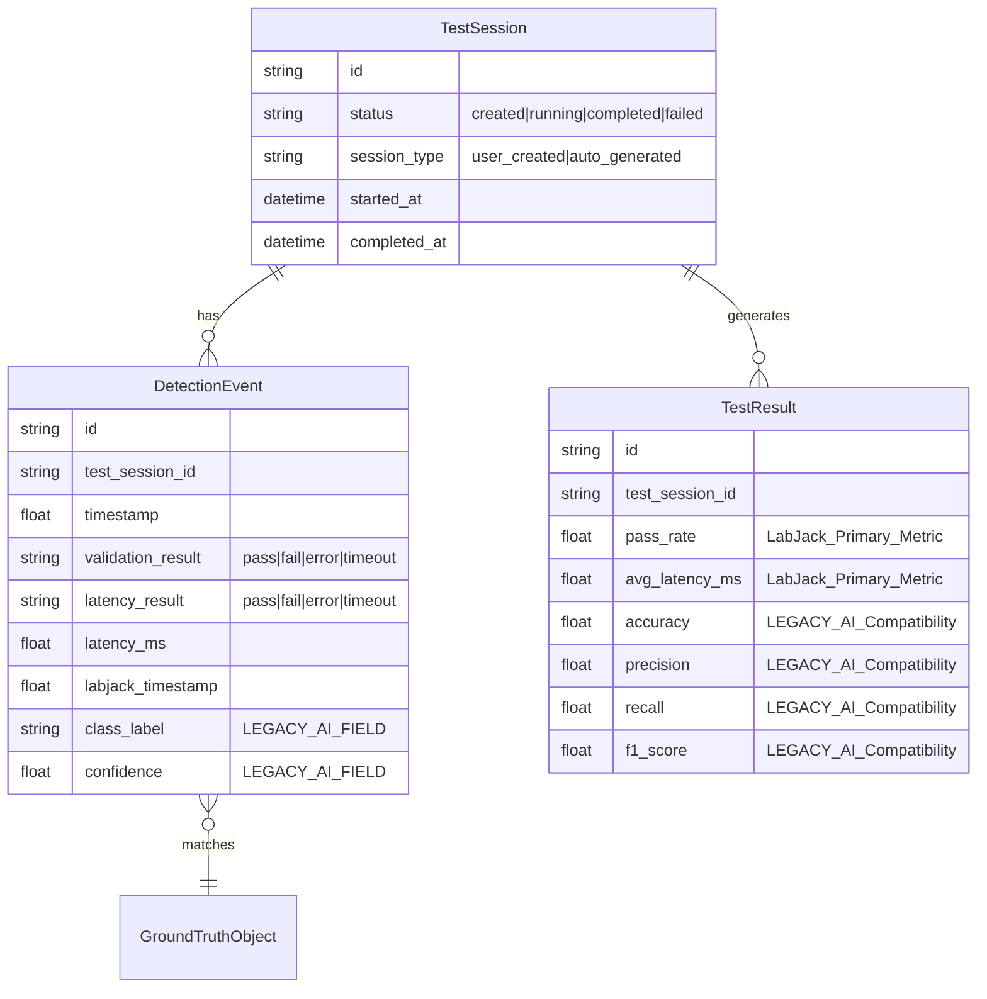
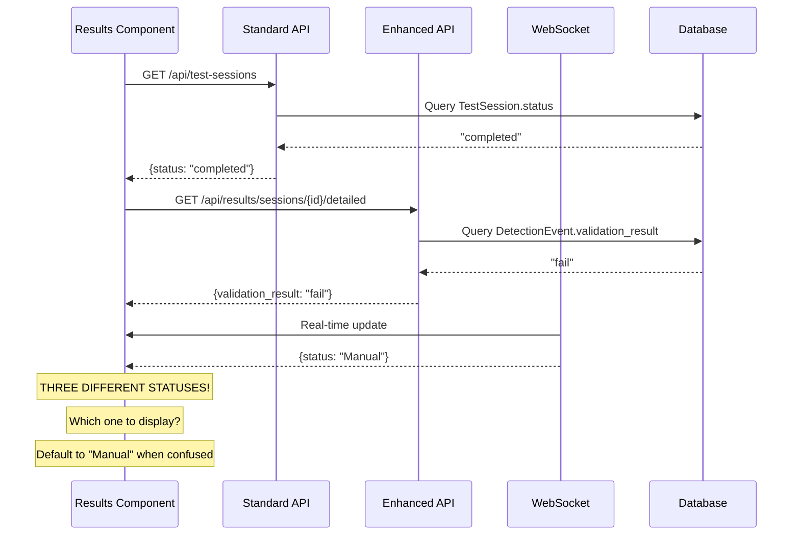
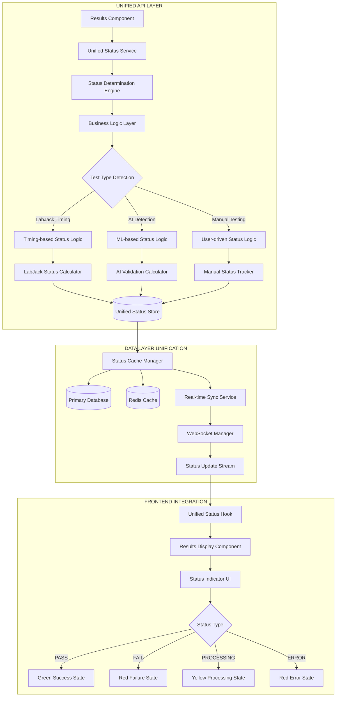
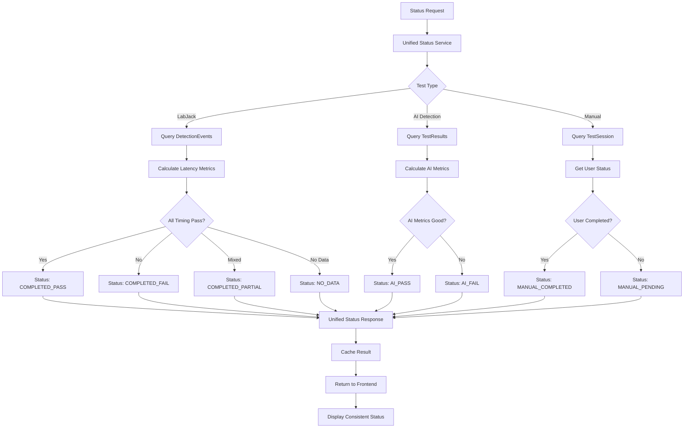

# AI Model Validation Platform - System Architecture Diagrams

## Current Architecture Problems - Data Flow Analysis

### 1. FRAGMENTED STATUS DETERMINATION ARCHITECTURE

```mermaid
graph TD
    A[Results Component] --> B{API Selection Logic}
    B -->|Enhanced API Available| C[getEnhancedTestSessions]
    B -->|Fallback| D[apiService.getTestSessions]
    
    C --> E[Enhanced API Response]
    D --> F[Standard API Response]
    
    E --> G{Results Summary Available?}
    G -->|Yes| H[Use Enhanced Results]
    G -->|No| I[Call apiService.getTestResults]
    
    F --> I
    
    I --> J{API Call Success?}
    J -->|Success| K[Transform Results]
    J -->|Error| L[Mock Data Fallback]
    
    K --> M[Status Mapping Logic]
    L --> N[Hardcoded 'completed' Status]
    
    M --> O{Status Determination}
    O -->|TestSession.status| P["created", "running", "completed", "failed"]
    O -->|DetectionEvent.validation_result| Q["pass", "fail", "error", "timeout"]
    O -->|DetectionEvent.latency_result| R["pass", "fail", "error", "timeout"]
    O -->|WebSocket Updates| S["Manual", "Automated", "Processing"]
    O -->|Fallback Logic| T["Manual" - DEFAULT VALUE]
    
    P --> U[UI Display Logic]
    Q --> U
    R --> U
    S --> U
    T --> U
    
    U --> V{Final Status Displayed}
    V --> W["Manual" - Persistent Display Issue]
```

### 2. DATABASE SCHEMA CONFLICTS



**PROBLEM**: Three different status systems in one database:
- `TestSession.status` (User workflow)
- `DetectionEvent.validation_result` (AI validation) 
- `DetectionEvent.latency_result` (LabJack timing)

### 3. API ENDPOINT CONFLICTS



### 4. COMPONENT COUPLING ISSUES

```mermaid
graph LR
    subgraph "Results Component Dependencies"
        A[Results.tsx] --> B[apiService]
        A --> C[getEnhancedTestSessions]  
        A --> D[WebSocket Connection]
        A --> E[Mock Data Generator]
        A --> F[Error Handler]
        
        B --> G[/api/test-sessions]
        C --> H[/api/results/sessions/{id}/detailed]
        D --> I[/api/status-updates]
        
        G --> J[(Database)]
        H --> J
        I --> K[Real-time Service]
        
        F --> L[Fallback Logic]
        L --> M["Manual" Status Assignment]
    end
    
    subgraph "Status Resolution Chain"
        N[API Call] --> O{Success?}
        O -->|Yes| P[Transform Data]
        O -->|No| Q[Try Next API]
        Q --> R{More APIs?}
        R -->|Yes| N
        R -->|No| S[Use Mock Data]
        S --> T["completed" Status]
        P --> U{Valid Status?}
        U -->|Yes| V[Display Status]
        U -->|No| W["Manual" Fallback]
    end
```

### 5. PROPOSED UNIFIED ARCHITECTURE



### 6. UNIFIED DATA MODEL

```typescript
// SOLUTION: Single Status Interface
interface UnifiedTestStatus {
  // Core Identification
  sessionId: string;
  projectId: string;
  testType: 'labjack_timing' | 'ai_detection' | 'manual_testing';
  
  // Unified Status
  overallStatus: 'pending' | 'running' | 'completed' | 'failed' | 'error';
  
  // Test-Specific Results
  timingResults?: {
    status: 'pass' | 'fail' | 'timeout';
    averageLatency: number;
    passRate: number;
    threshold: number;
  };
  
  aiResults?: {
    status: 'pass' | 'fail' | 'partial';
    accuracy: number;
    precision: number;
    recall: number;
    f1Score: number;
  };
  
  // Metadata
  dataSource: 'api' | 'websocket' | 'cache' | 'computed';
  lastUpdated: string;
  confidence: number; // 0-1 confidence in status accuracy
  
  // Error Handling
  errors?: string[];
  warnings?: string[];
}
```

### 7. STATUS DETERMINATION FLOW



## IMPLEMENTATION STRATEGY

### Phase 1: Immediate Fix (1-2 days)
1. **Create Unified Status Endpoint**: `/api/unified-status/{session_id}`
2. **Update Results Component**: Single API call instead of multiple
3. **Remove Fallback Logic**: Eliminate "Manual" default assignments
4. **Add Proper Error Handling**: Show actual errors instead of hiding them

### Phase 2: Real-time Integration (3-5 days)  
1. **WebSocket Unification**: Single WebSocket for status updates
2. **Cache Strategy**: Unified cache invalidation
3. **State Management**: Centralized status state

### Phase 3: Complete Architecture (1-2 weeks)
1. **API Gateway**: Consolidate all APIs through unified gateway
2. **Business Logic Layer**: Centralized status determination
3. **Database Optimization**: Optimize queries for unified model
4. **Performance Testing**: Ensure sub-100ms response times

## CONCLUSION

The "Manual" status issue stems from **fundamental architectural fragmentation** where multiple systems compete to determine status, leading to inconsistent data flows and default fallback behaviors. The solution requires unified data models, centralized business logic, and elimination of graceful degradation patterns that hide real issues.