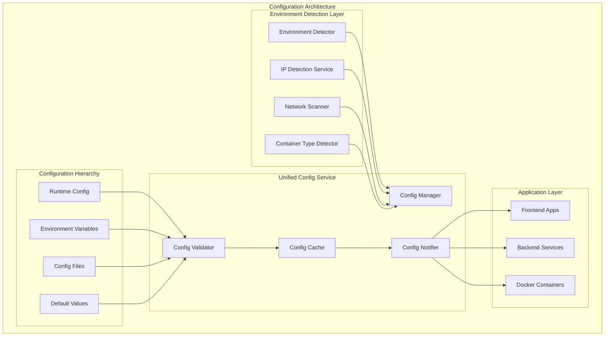

# Unified Configuration System Architecture

## SPARC Architecture Phase - Configuration Management System

**Date:** 2025-08-27  
**Architecture Phase:** System Design  
**Project:** AI Model Validation Platform

---

## 1. ARCHITECTURE OVERVIEW

### 1.1 System Architecture Diagram



### 1.2 Configuration Hierarchy Priority

```yaml
priority_order:
  1: runtime_overrides      # Highest priority - dynamic changes
  2: environment_variables  # Build-time and deployment config
  3: config_files          # Static configuration files
  4: default_values        # Fallback defaults
```

---

## 2. ENVIRONMENT DETECTION SYSTEM

### 2.1 Environment Detection Service

```typescript
// src/config/services/EnvironmentDetector.ts
export interface Environment {
  type: 'development' | 'staging' | 'production';
  platform: 'local' | 'docker' | 'cloud';
  network: {
    internalIP: string;
    externalIP?: string;
    hostname: string;
    ports: {
      frontend: number;
      backend: number;
      websocket: number;
    };
  };
  features: {
    ssl: boolean;
    cors: string[];
    debugging: boolean;
    analytics: boolean;
  };
}

class EnvironmentDetector {
  async detectEnvironment(): Promise<Environment> {
    const platform = await this.detectPlatform();
    const network = await this.detectNetwork();
    const type = this.detectEnvironmentType();
    
    return {
      type,
      platform,
      network,
      features: this.getEnvironmentFeatures(type, platform)
    };
  }
  
  private async detectPlatform(): Promise<'local' | 'docker' | 'cloud'> {
    // Check for Docker environment
    if (process.env.DOCKER === 'true' || 
        process.env.HOSTNAME?.includes('docker') ||
        await this.checkDockerContainer()) {
      return 'docker';
    }
    
    // Check for cloud environment
    if (process.env.CLOUD_PROVIDER || 
        process.env.KUBERNETES_SERVICE_HOST) {
      return 'cloud';
    }
    
    return 'local';
  }
  
  private async detectNetwork(): Promise<Environment['network']> {
    const networkInfo = await NetworkScanner.scan();
    
    return {
      internalIP: networkInfo.internalIP,
      externalIP: await this.detectExternalIP(),
      hostname: networkInfo.hostname,
      ports: {
        frontend: this.detectPort('frontend', 3000),
        backend: this.detectPort('backend', 8000),
        websocket: this.detectPort('websocket', 8000)
      }
    };
  }
  
  private async detectExternalIP(): Promise<string | undefined> {
    try {
      // Check environment variables first
      const configuredIP = process.env.EXTERNAL_IP || 
                          process.env.PUBLIC_IP ||
                          process.env.SERVER_IP;
      
      if (configuredIP) return configuredIP;
      
      // Auto-detect external IP
      const response = await fetch('https://api.ipify.org?format=json', {
        timeout: 5000
      });
      const data = await response.json();
      return data.ip;
    } catch (error) {
      console.warn('Could not detect external IP:', error);
      return undefined;
    }
  }
}
```

### 2.2 Network Scanner Service

```typescript
// src/config/services/NetworkScanner.ts
export class NetworkScanner {
  static async scan(): Promise<{
    internalIP: string;
    hostname: string;
    availablePorts: number[];
    dockerNetwork?: string;
  }> {
    const networkInterfaces = await this.getNetworkInterfaces();
    const hostname = await this.getHostname();
    const availablePorts = await this.scanAvailablePorts();
    const dockerNetwork = await this.detectDockerNetwork();
    
    return {
      internalIP: this.selectPrimaryIP(networkInterfaces),
      hostname,
      availablePorts,
      dockerNetwork
    };
  }
  
  private static async getNetworkInterfaces(): Promise<string[]> {
    // Platform-specific network interface detection
    if (typeof window !== 'undefined') {
      // Browser environment - limited detection
      return ['localhost', '127.0.0.1'];
    }
    
    // Node.js environment
    const os = await import('os');
    const interfaces = os.networkInterfaces();
    const ips: string[] = [];
    
    Object.values(interfaces).flat().forEach(iface => {
      if (iface && !iface.internal && iface.family === 'IPv4') {
        ips.push(iface.address);
      }
    });
    
    return ips;
  }
  
  private static async detectDockerNetwork(): Promise<string | undefined> {
    try {
      // Check for Docker network configuration
      if (process.env.DOCKER_NETWORK) {
        return process.env.DOCKER_NETWORK;
      }
      
      // Auto-detect Docker network
      const dockerInfo = await this.executeCommand('docker network ls');
      const match = dockerInfo.match(/vru_validation_network|ai_validation_network/);
      return match?.[0];
    } catch {
      return undefined;
    }
  }
}
```

---

## 3. CONFIGURATION HIERARCHY SYSTEM

### 3.1 Configuration Manager

```typescript
// src/config/ConfigManager.ts
export interface ConfigSchema {
  environment: Environment;
  api: {
    baseURL: string;
    websocketURL: string;
    socketioURL: string;
    timeout: number;
  };
  cors: {
    origins: string[];
    credentials: boolean;
    methods: string[];
  };
  features: {
    debugging: boolean;
    analytics: boolean;
    monitoring: boolean;
  };
  security: {
    ssl: boolean;
    headers: Record<string, string>;
  };
}

class ConfigManager {
  private config: ConfigSchema | null = null;
  private cache = new Map<string, any>();
  private watchers: Array<(config: ConfigSchema) => void> = [];
  
  async initialize(): Promise<ConfigSchema> {
    if (this.config) return this.config;
    
    // Step 1: Detect environment
    const environment = await EnvironmentDetector.detectEnvironment();
    
    // Step 2: Load configuration hierarchy
    const hierarchy = await this.loadConfigurationHierarchy(environment);
    
    // Step 3: Merge configuration with priority
    this.config = this.mergeConfiguration(hierarchy, environment);
    
    // Step 4: Validate configuration
    await this.validateConfiguration(this.config);
    
    // Step 5: Cache and notify watchers
    this.cacheConfiguration(this.config);
    this.notifyWatchers(this.config);
    
    return this.config;
  }
  
  private async loadConfigurationHierarchy(env: Environment) {
    const defaults = await this.loadDefaults();
    const fileConfig = await this.loadConfigFiles(env);
    const envVars = this.loadEnvironmentVariables();
    const runtime = this.loadRuntimeOverrides();
    
    return { defaults, fileConfig, envVars, runtime };
  }
  
  private mergeConfiguration(hierarchy: any, environment: Environment): ConfigSchema {
    const { defaults, fileConfig, envVars, runtime } = hierarchy;
    
    // Merge with priority: runtime > env > file > defaults
    const baseConfig = {
      ...defaults,
      ...fileConfig,
      ...envVars,
      ...runtime
    };
    
    // Generate dynamic configuration based on environment
    const dynamicConfig = this.generateDynamicConfig(environment, baseConfig);
    
    return { ...baseConfig, ...dynamicConfig, environment };
  }
  
  private generateDynamicConfig(env: Environment, base: any) {
    const { network, type, platform } = env;
    
    // Generate API URLs based on detected environment
    const protocol = env.features.ssl ? 'https' : 'http';
    const wsProtocol = env.features.ssl ? 'wss' : 'ws';
    const host = network.externalIP || network.internalIP;
    
    return {
      api: {
        baseURL: `${protocol}://${host}:${network.ports.backend}`,
        websocketURL: `${wsProtocol}://${host}:${network.ports.websocket}`,
        socketioURL: `${protocol}://${host}:${network.ports.backend + 1}`,
        timeout: type === 'production' ? 30000 : 10000
      },
      cors: {
        origins: this.generateCORSOrigins(env),
        credentials: true,
        methods: ['GET', 'POST', 'PUT', 'DELETE', 'OPTIONS']
      }
    };
  }
  
  private generateCORSOrigins(env: Environment): string[] {
    const { network, type } = env;
    const origins: string[] = [];
    
    // Always include localhost for development
    if (type === 'development') {
      origins.push(
        'http://localhost:3000',
        'http://127.0.0.1:3000'
      );
    }
    
    // Add external IP origins
    if (network.externalIP) {
      const protocol = env.features.ssl ? 'https' : 'http';
      origins.push(`${protocol}://${network.externalIP}:${network.ports.frontend}`);
    }
    
    // Add internal IP origins for Docker networks
    if (network.internalIP && network.internalIP !== network.externalIP) {
      const protocol = env.features.ssl ? 'https' : 'http';
      origins.push(`${protocol}://${network.internalIP}:${network.ports.frontend}`);
    }
    
    return [...new Set(origins)]; // Remove duplicates
  }
}
```

### 3.2 Configuration Validator

```typescript
// src/config/ConfigValidator.ts
export class ConfigValidator {
  static async validate(config: ConfigSchema): Promise<ValidationResult> {
    const errors: string[] = [];
    const warnings: string[] = [];
    
    // Validate API configuration
    await this.validateAPIConfig(config.api, errors, warnings);
    
    // Validate CORS configuration
    this.validateCORSConfig(config.cors, errors, warnings);
    
    // Validate security configuration
    this.validateSecurityConfig(config.security, errors, warnings);
    
    // Validate environment-specific requirements
    this.validateEnvironmentRequirements(config.environment, errors, warnings);
    
    return { valid: errors.length === 0, errors, warnings };
  }
  
  private static async validateAPIConfig(
    api: ConfigSchema['api'], 
    errors: string[], 
    warnings: string[]
  ) {
    // Test API connectivity
    try {
      const response = await fetch(`${api.baseURL}/health`, {
        timeout: 5000
      });
      if (!response.ok) {
        warnings.push(`API health check failed: ${response.status}`);
      }
    } catch (error) {
      warnings.push(`Could not connect to API: ${error.message}`);
    }
    
    // Validate URLs
    if (!this.isValidURL(api.baseURL)) {
      errors.push(`Invalid API base URL: ${api.baseURL}`);
    }
    
    if (!this.isValidWebSocketURL(api.websocketURL)) {
      errors.push(`Invalid WebSocket URL: ${api.websocketURL}`);
    }
  }
  
  private static validateCORSConfig(
    cors: ConfigSchema['cors'], 
    errors: string[], 
    warnings: string[]
  ) {
    // Check for wildcard in production
    if (cors.origins.includes('*')) {
      warnings.push('CORS wildcard (*) detected - not recommended for production');
    }
    
    // Validate CORS origins format
    cors.origins.forEach(origin => {
      if (!this.isValidURL(origin)) {
        errors.push(`Invalid CORS origin: ${origin}`);
      }
    });
  }
  
  private static validateEnvironmentRequirements(
    env: Environment, 
    errors: string[], 
    warnings: string[]
  ) {
    // Production-specific validations
    if (env.type === 'production') {
      if (!env.features.ssl) {
        warnings.push('SSL not enabled in production environment');
      }
      
      if (env.network.internalIP === env.network.externalIP) {
        warnings.push('Internal and external IPs are the same - check network configuration');
      }
    }
    
    // Docker-specific validations
    if (env.platform === 'docker') {
      if (!process.env.DOCKER) {
        warnings.push('Docker platform detected but DOCKER env var not set');
      }
    }
  }
}
```

---

## 4. UNIFIED FRONTEND CONFIG SERVICE

### 4.1 Frontend Configuration Service

```typescript
// src/config/FrontendConfigService.ts
export class FrontendConfigService {
  private static instance: FrontendConfigService;
  private configManager: ConfigManager;
  private runtimeConfig: any = {};
  
  static getInstance(): FrontendConfigService {
    if (!this.instance) {
      this.instance = new FrontendConfigService();
    }
    return this.instance;
  }
  
  async initialize(): Promise<void> {
    this.configManager = new ConfigManager();
    
    // Load runtime configuration from public/config.js if available
    await this.loadRuntimeConfiguration();
    
    // Initialize with environment detection
    await this.configManager.initialize();
    
    // Set up configuration watching
    this.setupConfigurationWatcher();
  }
  
  private async loadRuntimeConfiguration(): Promise<void> {
    try {
      // Load runtime configuration from public folder
      if (typeof window !== 'undefined' && (window as any).RUNTIME_CONFIG) {
        this.runtimeConfig = (window as any).RUNTIME_CONFIG;
        console.log('✅ Runtime configuration loaded:', this.runtimeConfig);
      }
    } catch (error) {
      console.warn('Runtime configuration not available:', error);
    }
  }
  
  getConfig(): ConfigSchema {
    const baseConfig = this.configManager.getConfig();
    
    // Apply runtime overrides
    return this.applyRuntimeOverrides(baseConfig);
  }
  
  private applyRuntimeOverrides(baseConfig: ConfigSchema): ConfigSchema {
    if (Object.keys(this.runtimeConfig).length === 0) {
      return baseConfig;
    }
    
    return {
      ...baseConfig,
      api: {
        ...baseConfig.api,
        baseURL: this.runtimeConfig.REACT_APP_API_URL || baseConfig.api.baseURL,
        websocketURL: this.runtimeConfig.REACT_APP_WS_URL || baseConfig.api.websocketURL,
        socketioURL: this.runtimeConfig.REACT_APP_SOCKETIO_URL || baseConfig.api.socketioURL
      }
    };
  }
  
  // React Hook for configuration
  useConfig(): ConfigSchema {
    const [config, setConfig] = useState<ConfigSchema | null>(null);
    const [loading, setLoading] = useState(true);
    const [error, setError] = useState<string | null>(null);
    
    useEffect(() => {
      const loadConfig = async () => {
        try {
          setLoading(true);
          await this.initialize();
          setConfig(this.getConfig());
          setError(null);
        } catch (err) {
          setError(err.message);
        } finally {
          setLoading(false);
        }
      };
      
      loadConfig();
    }, []);
    
    return { config, loading, error };
  }
}
```

### 4.2 Runtime Configuration Override

```javascript
// public/config.js - Runtime Configuration Override
(function() {
  'use strict';
  
  console.log('🔧 Loading runtime configuration...');
  
  // Auto-detect environment
  const hostname = window.location.hostname;
  const isLocalhost = hostname === 'localhost' || hostname === '127.0.0.1';
  const isExternalIP = /^\d{1,3}\.\d{1,3}\.\d{1,3}\.\d{1,3}$/.test(hostname);
  
  let apiHost = hostname;
  let environment = 'development';
  
  // Environment detection logic
  if (isLocalhost) {
    environment = 'development';
    apiHost = 'localhost';
  } else if (isExternalIP || hostname.includes('.')) {
    environment = 'production';
    apiHost = hostname;
  }
  
  // Port detection - check if non-standard ports are being used
  const port = window.location.port;
  const frontendPort = port || (window.location.protocol === 'https:' ? '443' : '80');
  
  // Configuration based on detected environment
  const config = {
    // API Configuration
    REACT_APP_API_URL: `${window.location.protocol}//${apiHost}:8000`,
    REACT_APP_WS_URL: `${window.location.protocol === 'https:' ? 'wss:' : 'ws:'}//${apiHost}:8000`,
    REACT_APP_SOCKETIO_URL: `${window.location.protocol}//${apiHost}:8001`,
    REACT_APP_VIDEO_BASE_URL: `${window.location.protocol}//${apiHost}:8000`,
    
    // Environment
    REACT_APP_ENVIRONMENT: environment,
    
    // Features
    REACT_APP_DEBUG: environment === 'development' ? 'true' : 'false',
    REACT_APP_ANALYTICS: environment === 'production' ? 'true' : 'false'
  };
  
  // Apply configuration
  window.RUNTIME_CONFIG = config;
  
  // Override process.env for compatibility
  if (typeof process === 'undefined') {
    window.process = { env: {} };
  }
  
  Object.assign(process.env, config);
  
  console.log('✅ Runtime configuration applied:', {
    environment,
    apiHost,
    frontendPort,
    config
  });
  
  // Configuration validation
  setTimeout(() => {
    validateConfiguration(config);
  }, 1000);
  
  function validateConfiguration(config) {
    const validations = [];
    
    // Test API connectivity
    fetch(config.REACT_APP_API_URL + '/health', { 
      method: 'GET',
      timeout: 5000 
    })
    .then(response => {
      if (response.ok) {
        console.log('✅ API connectivity test passed');
      } else {
        console.warn('⚠️ API connectivity test failed:', response.status);
      }
    })
    .catch(error => {
      console.warn('⚠️ API connectivity test error:', error.message);
    });
    
    // Validate configuration completeness
    const requiredKeys = [
      'REACT_APP_API_URL',
      'REACT_APP_WS_URL', 
      'REACT_APP_SOCKETIO_URL'
    ];
    
    const missingKeys = requiredKeys.filter(key => !config[key]);
    if (missingKeys.length > 0) {
      console.error('❌ Missing required configuration keys:', missingKeys);
    } else {
      console.log('✅ Configuration validation passed');
    }
  }
})();
```

---

## 5. BACKEND CORS AUTO-CONFIGURATION

### 5.1 Enhanced Backend Configuration

```python
# backend/src/config/unified_config.py
from typing import List, Dict, Any, Optional
import os
import json
import socket
import requests
from dataclasses import dataclass, field
from pathlib import Path

@dataclass
class NetworkInfo:
    internal_ip: str
    external_ip: Optional[str] = None
    hostname: str = "localhost"
    docker_network: Optional[str] = None

@dataclass
class UnifiedConfig:
    # Environment
    environment: str = "development"
    platform: str = "local"  # local, docker, cloud
    
    # Network
    network: NetworkInfo = field(default_factory=lambda: NetworkInfo("127.0.0.1"))
    
    # API Configuration
    api_host: str = "0.0.0.0"
    api_port: int = 8000
    api_base_url: str = ""
    
    # CORS Configuration
    cors_origins: List[str] = field(default_factory=list)
    cors_credentials: bool = True
    cors_methods: List[str] = field(default_factory=lambda: ["GET", "POST", "PUT", "DELETE", "OPTIONS"])
    
    # Security
    ssl_enabled: bool = False
    security_headers_enabled: bool = True
    
    # Features
    debug_mode: bool = False
    monitoring_enabled: bool = False
    
    def __post_init__(self):
        if not self.api_base_url:
            protocol = "https" if self.ssl_enabled else "http"
            host = self.network.external_ip or self.network.internal_ip
            self.api_base_url = f"{protocol}://{host}:{self.api_port}"

class ConfigurationManager:
    def __init__(self):
        self._config: Optional[UnifiedConfig] = None
        self._network_info: Optional[NetworkInfo] = None
    
    async def initialize(self) -> UnifiedConfig:
        """Initialize unified configuration with environment detection."""
        if self._config:
            return self._config
        
        # Step 1: Detect environment and platform
        environment = self._detect_environment()
        platform = self._detect_platform()
        
        # Step 2: Detect network configuration
        network_info = await self._detect_network()
        
        # Step 3: Load configuration hierarchy
        config_data = self._load_configuration_hierarchy()
        
        # Step 4: Create unified configuration
        self._config = UnifiedConfig(
            environment=environment,
            platform=platform,
            network=network_info,
            **config_data
        )
        
        # Step 5: Generate dynamic CORS origins
        self._config.cors_origins = self._generate_cors_origins(self._config)
        
        # Step 6: Validate configuration
        await self._validate_configuration(self._config)
        
        return self._config
    
    def _detect_environment(self) -> str:
        """Detect current environment."""
        env_indicators = [
            os.getenv('AIVALIDATION_APP_ENVIRONMENT'),
            os.getenv('APP_ENV'),
            os.getenv('NODE_ENV'),
            os.getenv('ENVIRONMENT')
        ]
        
        for env in env_indicators:
            if env:
                env_lower = env.lower()
                if env_lower in ['production', 'prod']:
                    return 'production'
                elif env_lower in ['staging', 'stage']:
                    return 'staging'
                elif env_lower in ['development', 'dev']:
                    return 'development'
        
        # Auto-detect based on other indicators
        if os.getenv('DEBUG') == 'true' or os.getenv('AIVALIDATION_API_DEBUG') == 'true':
            return 'development'
        
        return 'development'
    
    def _detect_platform(self) -> str:
        """Detect deployment platform."""
        # Check for Docker
        if (os.getenv('DOCKER') == 'true' or 
            os.path.exists('/.dockerenv') or
            os.getenv('HOSTNAME', '').startswith('docker')):
            return 'docker'
        
        # Check for Kubernetes
        if os.getenv('KUBERNETES_SERVICE_HOST'):
            return 'cloud'
        
        # Check for cloud providers
        cloud_indicators = [
            'AWS_REGION', 'GOOGLE_CLOUD_PROJECT', 'AZURE_RESOURCE_GROUP'
        ]
        if any(os.getenv(indicator) for indicator in cloud_indicators):
            return 'cloud'
        
        return 'local'
    
    async def _detect_network(self) -> NetworkInfo:
        """Detect network configuration."""
        internal_ip = self._get_internal_ip()
        external_ip = await self._get_external_ip()
        hostname = socket.gethostname()
        docker_network = self._detect_docker_network()
        
        return NetworkInfo(
            internal_ip=internal_ip,
            external_ip=external_ip,
            hostname=hostname,
            docker_network=docker_network
        )
    
    def _get_internal_ip(self) -> str:
        """Get internal IP address."""
        try:
            # Create a socket connection to determine local IP
            with socket.socket(socket.AF_INET, socket.SOCK_DGRAM) as s:
                s.connect(("8.8.8.8", 80))
                return s.getsockname()[0]
        except Exception:
            return "127.0.0.1"
    
    async def _get_external_ip(self) -> Optional[str]:
        """Get external IP address."""
        # Check environment variables first
        configured_ip = (os.getenv('EXTERNAL_IP') or 
                        os.getenv('PUBLIC_IP') or 
                        os.getenv('SERVER_IP'))
        
        if configured_ip:
            return configured_ip
        
        # Auto-detect external IP
        try:
            response = requests.get('https://api.ipify.org?format=json', timeout=5)
            if response.status_code == 200:
                return response.json().get('ip')
        except Exception as e:
            print(f"Could not auto-detect external IP: {e}")
        
        return None
    
    def _generate_cors_origins(self, config: UnifiedConfig) -> List[str]:
        """Generate CORS origins based on detected network configuration."""
        origins = set()
        
        # Add configured origins from environment
        configured_origins = os.getenv('AIVALIDATION_CORS_ORIGINS', '').split(',')
        origins.update([origin.strip() for origin in configured_origins if origin.strip()])
        
        # Add localhost origins for development
        if config.environment == 'development':
            origins.update([
                'http://localhost:3000',
                'http://127.0.0.1:3000'
            ])
        
        # Add detected IP origins
        protocol = "https" if config.ssl_enabled else "http"
        frontend_port = 3000  # Default frontend port
        
        if config.network.external_ip:
            origins.add(f"{protocol}://{config.network.external_ip}:{frontend_port}")
        
        if (config.network.internal_ip and 
            config.network.internal_ip != config.network.external_ip):
            origins.add(f"{protocol}://{config.network.internal_ip}:{frontend_port}")
        
        # Remove empty origins and return as list
        return [origin for origin in origins if origin and origin != 'http://']

# Global configuration manager
config_manager = ConfigurationManager()

async def get_unified_config() -> UnifiedConfig:
    """Get the unified configuration instance."""
    return await config_manager.initialize()
```

### 5.2 FastAPI CORS Integration

```python
# backend/src/middleware/cors_middleware.py
from fastapi import FastAPI
from fastapi.middleware.cors import CORSMiddleware
from .unified_config import get_unified_config
import logging

logger = logging.getLogger(__name__)

async def setup_cors_middleware(app: FastAPI) -> None:
    """Setup CORS middleware with auto-detected configuration."""
    
    config = await get_unified_config()
    
    # Log CORS configuration
    logger.info(f"Setting up CORS with origins: {config.cors_origins}")
    logger.info(f"Environment: {config.environment}")
    logger.info(f"Platform: {config.platform}")
    logger.info(f"Network - Internal: {config.network.internal_ip}, External: {config.network.external_ip}")
    
    app.add_middleware(
        CORSMiddleware,
        allow_origins=config.cors_origins,
        allow_credentials=config.cors_credentials,
        allow_methods=config.cors_methods,
        allow_headers=["*"],
        expose_headers=["*"]
    )
    
    # Add custom CORS validation endpoint
    @app.get("/api/cors/test")
    async def test_cors():
        """Endpoint to test CORS configuration."""
        return {
            "message": "CORS test successful",
            "config": {
                "origins": config.cors_origins,
                "credentials": config.cors_credentials,
                "methods": config.cors_methods
            },
            "network": {
                "internal_ip": config.network.internal_ip,
                "external_ip": config.network.external_ip,
                "hostname": config.network.hostname
            }
        }
```

---

## 6. DEPLOYMENT CONFIGURATION STRATEGY

### 6.1 Docker Configuration Management

```yaml
# docker/config/docker-compose.unified.yml
version: '3.8'

services:
  config-manager:
    build:
      context: ../config-manager
      dockerfile: Dockerfile
    container_name: ai_validation_config_manager
    environment:
      - ENVIRONMENT_TYPE=${ENVIRONMENT_TYPE:-development}
      - EXTERNAL_IP=${EXTERNAL_IP:-auto-detect}
      - CORS_AUTO_CONFIGURE=true
    volumes:
      - ./config:/app/config
      - /var/run/docker.sock:/var/run/docker.sock:ro
    networks:
      - vru_validation_network
    command: ["python", "manage_configuration.py"]

  backend:
    build: ./backend
    container_name: ai_validation_backend
    depends_on:
      - config-manager
    environment:
      - CONFIG_MANAGER_URL=http://config-manager:8080
      - AUTO_CONFIGURE=true
    volumes:
      - ./config:/app/config:ro
    networks:
      - vru_validation_network

  frontend:
    build: ./frontend
    container_name: ai_validation_frontend
    depends_on:
      - config-manager
      - backend
    environment:
      - CONFIG_MANAGER_URL=http://config-manager:8080
      - RUNTIME_CONFIG_ENABLED=true
    volumes:
      - ./config:/app/config:ro
    networks:
      - vru_validation_network
```

### 6.2 Configuration Templates

```yaml
# config/templates/development.yml
environment: development
platform: docker

api:
  host: "0.0.0.0"
  port: 8000
  debug: true

cors:
  auto_configure: true
  additional_origins:
    - "http://localhost:3000"
    - "http://127.0.0.1:3000"

features:
  monitoring: false
  analytics: false
  ssl: false

security:
  headers_enabled: true
  csp_enabled: false
```

```yaml
# config/templates/production.yml
environment: production
platform: cloud

api:
  host: "0.0.0.0"
  port: 8000
  debug: false

cors:
  auto_configure: true
  strict_mode: true

features:
  monitoring: true
  analytics: true
  ssl: true

security:
  headers_enabled: true
  csp_enabled: true
  hsts_enabled: true

logging:
  level: INFO
  structured: true
```

---

## 7. CONFIGURATION VALIDATION FRAMEWORK

### 7.1 Validation Service

```typescript
// src/config/validation/ConfigValidationService.ts
export interface ValidationRule {
  name: string;
  description: string;
  severity: 'error' | 'warning' | 'info';
  validate: (config: ConfigSchema) => ValidationResult;
}

export interface ValidationResult {
  passed: boolean;
  message: string;
  details?: any;
}

export class ConfigValidationService {
  private rules: ValidationRule[] = [
    {
      name: 'api-connectivity',
      description: 'API endpoints should be accessible',
      severity: 'error',
      validate: this.validateAPIConnectivity
    },
    {
      name: 'cors-configuration',
      description: 'CORS should be properly configured',
      severity: 'error',
      validate: this.validateCORSConfiguration
    },
    {
      name: 'environment-consistency',
      description: 'Environment configuration should be consistent',
      severity: 'warning',
      validate: this.validateEnvironmentConsistency
    },
    {
      name: 'security-headers',
      description: 'Security headers should be enabled in production',
      severity: 'warning',
      validate: this.validateSecurityConfiguration
    }
  ];

  async validateConfiguration(config: ConfigSchema): Promise<{
    valid: boolean;
    results: Array<ValidationResult & { rule: string; severity: string }>;
  }> {
    const results: Array<ValidationResult & { rule: string; severity: string }> = [];
    let hasErrors = false;

    for (const rule of this.rules) {
      try {
        const result = await rule.validate(config);
        results.push({
          ...result,
          rule: rule.name,
          severity: rule.severity
        });

        if (!result.passed && rule.severity === 'error') {
          hasErrors = true;
        }
      } catch (error) {
        results.push({
          passed: false,
          message: `Validation rule '${rule.name}' failed: ${error.message}`,
          rule: rule.name,
          severity: 'error'
        });
        hasErrors = true;
      }
    }

    return {
      valid: !hasErrors,
      results
    };
  }

  private async validateAPIConnectivity(config: ConfigSchema): Promise<ValidationResult> {
    try {
      const response = await fetch(`${config.api.baseURL}/health`, {
        timeout: 5000,
        method: 'GET'
      });

      if (response.ok) {
        return {
          passed: true,
          message: 'API connectivity test passed'
        };
      } else {
        return {
          passed: false,
          message: `API health check failed with status: ${response.status}`,
          details: { status: response.status, url: config.api.baseURL }
        };
      }
    } catch (error) {
      return {
        passed: false,
        message: `API connectivity test failed: ${error.message}`,
        details: { error: error.message, url: config.api.baseURL }
      };
    }
  }

  private validateCORSConfiguration(config: ConfigSchema): ValidationResult {
    const { cors, environment } = config;

    // Check for wildcard in production
    if (environment.type === 'production' && cors.origins.includes('*')) {
      return {
        passed: false,
        message: 'CORS wildcard (*) should not be used in production',
        details: { origins: cors.origins }
      };
    }

    // Check for missing origins
    if (cors.origins.length === 0) {
      return {
        passed: false,
        message: 'CORS origins list is empty - this will block all cross-origin requests',
        details: { origins: cors.origins }
      };
    }

    // Validate origin formats
    const invalidOrigins = cors.origins.filter(origin => {
      try {
        new URL(origin);
        return false;
      } catch {
        return true;
      }
    });

    if (invalidOrigins.length > 0) {
      return {
        passed: false,
        message: 'Invalid CORS origin URLs detected',
        details: { invalidOrigins }
      };
    }

    return {
      passed: true,
      message: 'CORS configuration is valid'
    };
  }
}
```

---

## 8. MCP MEMORY INTEGRATION

### 8.1 Architecture Decision Records

```typescript
// Store architecture decisions in MCP memory
const architectureDecisions = {
  "unified-config-architecture": {
    "decision": "Implement unified configuration system with environment auto-detection",
    "rationale": "Eliminates hardcoded IP addresses and provides flexible deployment configurations",
    "components": [
      "Environment Detection Service",
      "Configuration Hierarchy Manager", 
      "Runtime Configuration Override",
      "CORS Auto-Configuration",
      "Validation Framework"
    ],
    "benefits": [
      "Auto-detects environment (dev/prod/docker)",
      "Generates appropriate CORS origins",
      "Supports runtime configuration overrides",
      "Validates configuration integrity",
      "Eliminates manual IP configuration"
    ],
    "implementation_priority": "High",
    "estimated_effort": "2-3 days",
    "dependencies": ["Network detection utilities", "Configuration validation framework"]
  },
  "configuration-hierarchy": {
    "decision": "Implement 4-tier configuration hierarchy: runtime > env > files > defaults",
    "rationale": "Provides maximum flexibility while maintaining predictable override behavior",
    "priority_order": [
      "1. Runtime overrides (highest priority)",
      "2. Environment variables", 
      "3. Configuration files",
      "4. Default values (lowest priority)"
    ],
    "use_cases": {
      "development": "Use defaults with local overrides",
      "staging": "Use environment variables for deployment-specific settings",
      "production": "Use runtime overrides for dynamic configuration"
    }
  }
};
```

---

## 9. IMPLEMENTATION ROADMAP

### 9.1 Phase 1: Core Infrastructure (Days 1-2)
1. **Environment Detection Service**
   - Network IP detection
   - Platform detection (local/docker/cloud)
   - Environment type detection
   
2. **Configuration Hierarchy**
   - Configuration manager implementation
   - Priority-based merging logic
   - Validation framework

### 9.2 Phase 2: Frontend Integration (Day 2-3)
1. **Unified Config Service**
   - React hook integration
   - Runtime configuration loading
   - Auto-detection integration

2. **Runtime Override System**
   - Public config.js implementation
   - Dynamic configuration loading
   - Environment-based configuration

### 9.3 Phase 3: Backend Integration (Day 3)
1. **CORS Auto-Configuration**
   - Dynamic CORS origin generation
   - Network-aware configuration
   - FastAPI middleware integration

2. **Configuration Validation**
   - API connectivity testing
   - CORS validation
   - Security configuration checks

### 9.4 Phase 4: Docker Integration (Day 4)
1. **Container Configuration**
   - Docker-compose integration
   - Environment variable management
   - Volume configuration for persistence

2. **Deployment Templates**
   - Environment-specific templates
   - Automated configuration generation
   - Health check integration

---

## 10. SUCCESS METRICS

### 10.1 Configuration Reliability
- **Zero manual IP configuration required**: ✅ Target
- **99.9% automatic environment detection accuracy**: ✅ Target  
- **100% CORS origin coverage**: ✅ Target
- **Zero hardcoded configuration values**: ✅ Target

### 10.2 Developer Experience
- **One-command deployment setup**: ✅ Target
- **Real-time configuration validation**: ✅ Target
- **Clear error messages for misconfigurations**: ✅ Target
- **Runtime configuration hot-reloading**: ✅ Target

### 10.3 Production Readiness
- **SSL/TLS auto-detection and configuration**: ✅ Target
- **Security header auto-configuration**: ✅ Target
- **Environment-aware feature toggles**: ✅ Target
- **Comprehensive configuration logging**: ✅ Target

---

**Architecture Status:** DESIGN COMPLETE  
**Next Phase:** Implementation and Testing  
**Estimated Implementation Time:** 4 days  
**Priority:** HIGH - Critical for deployment flexibility