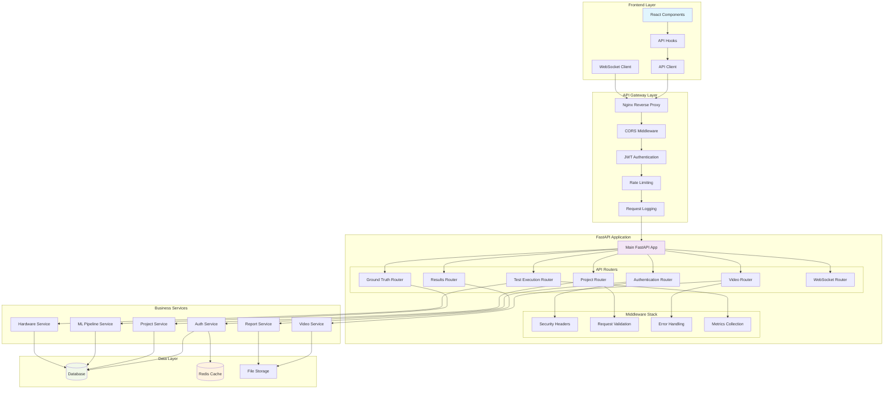

# AI Model Validation Platform - API Interaction Patterns

## Complete API Architecture Overview



## 1. API Endpoint Catalog

### Authentication Endpoints

```python
# Authentication API Patterns
@router.post("/auth/login")
async def login(
    credentials: UserLoginSchema,
    db: Session = Depends(get_db),
    redis: Redis = Depends(get_redis)
) -> TokenResponse:
    """
    Login endpoint with rate limiting and session management
    
    Request:
    POST /auth/login
    Content-Type: application/json
    {
        "email": "user@example.com",
        "password": "secure_password"
    }
    
    Response:
    {
        "access_token": "eyJhbGciOiJIUzI1NiIs...",
        "refresh_token": "eyJhbGciOiJIUzI1NiIs...",
        "token_type": "bearer",
        "expires_in": 3600,
        "user": {
            "id": "user-uuid",
            "email": "user@example.com",
            "full_name": "John Doe",
            "is_verified": true
        }
    }
    
    Error Responses:
    401: Invalid credentials
    429: Too many requests
    422: Validation error
    """

@router.post("/auth/refresh")
async def refresh_token(
    refresh_data: RefreshTokenSchema,
    redis: Redis = Depends(get_redis)
) -> TokenResponse:
    """Refresh access token using refresh token"""

@router.post("/auth/logout")
async def logout(
    current_user: User = Depends(get_current_user),
    redis: Redis = Depends(get_redis)
) -> dict:
    """Logout and invalidate tokens"""

@router.get("/auth/me")
async def get_current_user_info(
    current_user: User = Depends(get_current_user)
) -> UserResponse:
    """Get current user profile information"""
```

### Project Management Endpoints

```python
# Project CRUD API Patterns
@router.get("/api/projects")
async def list_projects(
    skip: int = Query(0, ge=0),
    limit: int = Query(50, le=100),
    status: Optional[ProjectStatus] = None,
    search: Optional[str] = None,
    current_user: User = Depends(get_current_user),
    db: Session = Depends(get_db)
) -> PaginatedResponse[ProjectResponse]:
    """
    List projects with filtering and pagination
    
    Query Parameters:
    - skip: Number of records to skip (pagination)
    - limit: Maximum number of records to return
    - status: Filter by project status
    - search: Search in project name and description
    
    Response:
    {
        "items": [
            {
                "id": "project-uuid",
                "name": "VRU Detection Test",
                "description": "Front-facing camera validation",
                "status": "active",
                "video_count": 15,
                "created_at": "2024-01-15T10:30:00Z"
            }
        ],
        "total": 25,
        "page": 1,
        "pages": 3,
        "has_next": true,
        "has_prev": false
    }
    """

@router.post("/api/projects")
async def create_project(
    project_data: ProjectCreateSchema,
    current_user: User = Depends(get_current_user),
    db: Session = Depends(get_db)
) -> ProjectResponse:
    """
    Create new project
    
    Request:
    {
        "name": "New VRU Test Project",
        "description": "Testing front-facing VRU detection",
        "camera_model": "Sony IMX219",
        "camera_view": "Front-facing VRU",
        "signal_type": "GPIO",
        "resolution": "1920x1080",
        "frame_rate": 30
    }
    """

@router.get("/api/projects/{project_id}")
async def get_project(
    project_id: str,
    current_user: User = Depends(get_current_user),
    db: Session = Depends(get_db)
) -> ProjectDetailResponse:
    """Get project details with video statistics"""

@router.put("/api/projects/{project_id}")
async def update_project(
    project_id: str,
    project_data: ProjectUpdateSchema,
    current_user: User = Depends(get_current_user),
    db: Session = Depends(get_db)
) -> ProjectResponse:
    """Update existing project"""

@router.delete("/api/projects/{project_id}")
async def delete_project(
    project_id: str,
    current_user: User = Depends(get_current_user),
    db: Session = Depends(get_db)
) -> dict:
    """Delete project and associated data"""
```

### Video Management Endpoints

```python
# Video Upload and Processing API
@router.post("/api/projects/{project_id}/videos/upload")
async def upload_video(
    project_id: str,
    video_file: UploadFile = File(...),
    background_tasks: BackgroundTasks,
    current_user: User = Depends(get_current_user),
    db: Session = Depends(get_db)
) -> VideoUploadResponse:
    """
    Upload video with validation and background processing
    
    Form Data:
    - video_file: Video file (mp4, avi, mov)
    
    Response:
    {
        "video_id": "video-uuid",
        "filename": "test_video.mp4",
        "status": "uploaded",
        "file_size": 15728640,
        "processing_job_id": "job-uuid",
        "estimated_processing_time": 120
    }
    
    Background Processing:
    1. File validation (format, size, duration)
    2. Metadata extraction (resolution, fps, duration)
    3. Thumbnail generation
    4. Frame extraction for ML processing
    5. Status updates via WebSocket
    """

@router.get("/api/projects/{project_id}/videos")
async def list_project_videos(
    project_id: str,
    status: Optional[VideoStatus] = None,
    validation_status: Optional[str] = None,
    has_ground_truth: Optional[bool] = None,
    skip: int = Query(0, ge=0),
    limit: int = Query(50, le=100),
    current_user: User = Depends(get_current_user),
    db: Session = Depends(get_db)
) -> PaginatedResponse[VideoResponse]:
    """List videos in project with filtering"""

@router.get("/api/videos/{video_id}")
async def get_video_details(
    video_id: str,
    current_user: User = Depends(get_current_user),
    db: Session = Depends(get_db)
) -> VideoDetailResponse:
    """
    Get detailed video information
    
    Response:
    {
        "id": "video-uuid",
        "filename": "child-1-1-1.mp4",
        "status": "validated",
        "validation_status": "completed",
        "duration": 30.5,
        "fps": 29.97,
        "resolution": "1920x1080",
        "file_size": 15728640,
        "ground_truth_count": 45,
        "ground_truth_quality_score": 0.95,
        "hil_testing_ready": true,
        "processing_metadata": {
            "frame_count": 915,
            "codec": "h264",
            "bitrate": "4.2 Mbps"
        }
    }
    """

@router.post("/api/videos/{video_id}/validate")
async def validate_video(
    video_id: str,
    validation_data: VideoValidationSchema,
    current_user: User = Depends(get_current_user),
    db: Session = Depends(get_db)
) -> ValidationResponse:
    """Mark video as validated for HIL testing"""

@router.get("/api/videos/{video_id}/stream")
async def stream_video(
    video_id: str,
    range_header: Optional[str] = Header(None, alias="range"),
    current_user: User = Depends(get_current_user),
    db: Session = Depends(get_db)
):
    """Stream video with range requests support for progressive loading"""
```

### Ground Truth Management Endpoints

```python
# Ground Truth and Annotation API
@router.post("/api/videos/{video_id}/ground-truth/upload")
async def upload_ground_truth(
    video_id: str,
    ground_truth_file: UploadFile = File(...),
    format_type: GroundTruthFormat = Form(...),
    background_tasks: BackgroundTasks,
    current_user: User = Depends(get_current_user),
    db: Session = Depends(get_db)
) -> GroundTruthUploadResponse:
    """
    Upload ground truth annotations
    
    Supported Formats:
    - COCO JSON
    - YOLO TXT
    - CVAT XML
    - Custom JSON
    
    Processing Pipeline:
    1. Format validation and parsing
    2. Coordinate normalization
    3. Bounding box validation
    4. Temporal synchronization
    5. Quality assessment
    6. Database storage
    """

@router.get("/api/videos/{video_id}/ground-truth")
async def get_ground_truth_objects(
    video_id: str,
    frame_start: Optional[int] = None,
    frame_end: Optional[int] = None,
    timestamp_start: Optional[float] = None,
    timestamp_end: Optional[float] = None,
    class_filter: Optional[List[str]] = Query(None),
    current_user: User = Depends(get_current_user),
    db: Session = Depends(get_db)
) -> List[GroundTruthObjectResponse]:
    """
    Get ground truth objects with temporal/spatial filtering
    
    Response:
    [
        {
            "id": "gt-uuid",
            "tracking_id": "person_01",
            "frame_number": 125,
            "timestamp": 4.17,
            "class_label": "pedestrian",
            "bounding_box": {
                "x": 0.345,
                "y": 0.234,
                "width": 0.123,
                "height": 0.187
            },
            "confidence": 0.95,
            "validated": true
        }
    ]
    """

@router.post("/api/videos/{video_id}/annotations/session")
async def create_annotation_session(
    video_id: str,
    session_data: AnnotationSessionCreateSchema,
    current_user: User = Depends(get_current_user),
    db: Session = Depends(get_db)
) -> AnnotationSessionResponse:
    """Create new annotation session for video"""

@router.post("/api/videos/{video_id}/annotations")
async def create_annotation(
    video_id: str,
    annotation_data: AnnotationCreateSchema,
    current_user: User = Depends(get_current_user),
    db: Session = Depends(get_db)
) -> AnnotationResponse:
    """Create single annotation object"""

@router.get("/api/videos/{video_id}/annotations/export")
async def export_annotations(
    video_id: str,
    export_format: ExportFormat,
    current_user: User = Depends(get_current_user),
    db: Session = Depends(get_db)
) -> FileResponse:
    """Export annotations in various formats"""
```

### Test Execution Endpoints

```python
# Enhanced Test Execution API
@router.post("/api/enhanced-test/start-workflow")
async def start_enhanced_test_workflow(
    workflow_config: EnhancedTestWorkflowSchema,
    background_tasks: BackgroundTasks,
    current_user: User = Depends(get_current_user),
    db: Session = Depends(get_db)
) -> WorkflowStartResponse:
    """
    Start comprehensive automated test workflow
    
    Request:
    {
        "project_id": "project-uuid",
        "name": "Full Project Test Run",
        "config": {
            "tolerance_ms": 100,
            "confidence_threshold": 0.5,
            "iou_threshold": 0.4,
            "retry_failed": true,
            "max_retries": 2,
            "continue_on_error": true,
            "generate_reports": true,
            "notify_on_completion": true
        },
        "video_filters": {
            "status": "validated",
            "hil_testing_ready": true
        }
    }
    
    Response:
    {
        "workflow_id": "workflow-uuid",
        "status": "initializing",
        "total_videos": 15,
        "estimated_duration_minutes": 45,
        "websocket_room": "workflow_abc123",
        "started_at": "2024-01-15T10:30:00Z"
    }
    
    Workflow Stages:
    1. Video validation and loading
    2. Sequential video processing
    3. LabJack hardware integration
    4. Detection event generation
    5. Ground truth comparison
    6. Performance metrics calculation
    7. Report generation and storage
    8. Notification delivery
    """

@router.get("/api/enhanced-test/workflow/{workflow_id}/status")
async def get_workflow_status(
    workflow_id: str,
    current_user: User = Depends(get_current_user),
    db: Session = Depends(get_db)
) -> WorkflowStatusResponse:
    """
    Get real-time workflow status
    
    Response:
    {
        "workflow_id": "workflow-uuid",
        "status": "processing_video",
        "progress": {
            "total_videos": 15,
            "completed_videos": 8,
            "failed_videos": 1,
            "current_video": {
                "video_id": "video-uuid",
                "filename": "child-2-3-1.mp4",
                "progress_percentage": 65,
                "current_stage": "running_detection"
            },
            "overall_progress": 53.3
        },
        "timing": {
            "started_at": "2024-01-15T10:30:00Z",
            "elapsed_minutes": 23,
            "estimated_completion": "2024-01-15T11:15:00Z"
        },
        "performance": {
            "avg_processing_time_per_video": 180,
            "success_rate": 87.5
        }
    }
    """

@router.post("/api/enhanced-test/workflow/{workflow_id}/cancel")
async def cancel_workflow(
    workflow_id: str,
    current_user: User = Depends(get_current_user),
    db: Session = Depends(get_db)
) -> dict:
    """Cancel running workflow with cleanup"""

@router.get("/api/enhanced-test/workflow/{workflow_id}/results")
async def get_workflow_results(
    workflow_id: str,
    include_individual_reports: bool = Query(False),
    current_user: User = Depends(get_current_user),
    db: Session = Depends(get_db)
) -> WorkflowResultsResponse:
    """Get comprehensive workflow results"""

@router.get("/api/enhanced-test/workflow/{workflow_id}/report/download")
async def download_workflow_report(
    workflow_id: str,
    format: ReportFormat = Query("pdf"),
    current_user: User = Depends(get_current_user),
    db: Session = Depends(get_db)
) -> FileResponse:
    """Download generated workflow report"""
```

### Results and Analytics Endpoints

```python
# Results Analysis and Reporting API
@router.get("/api/projects/{project_id}/results/summary")
async def get_project_results_summary(
    project_id: str,
    time_range: Optional[str] = Query("30d"),
    current_user: User = Depends(get_current_user),
    db: Session = Depends(get_db)
) -> ProjectResultsSummaryResponse:
    """
    Get aggregated project performance metrics
    
    Response:
    {
        "project_id": "project-uuid",
        "summary": {
            "total_tests": 45,
            "total_videos": 15,
            "total_detections": 1234,
            "avg_precision": 0.87,
            "avg_recall": 0.84,
            "avg_f1_score": 0.85,
            "pass_rate": 92.3
        },
        "performance_trends": {
            "daily_metrics": [...],
            "video_performance": [...]
        },
        "class_breakdown": {
            "pedestrian": {"count": 856, "precision": 0.91},
            "cyclist": {"count": 234, "precision": 0.78},
            "vehicle": {"count": 144, "precision": 0.94}
        }
    }
    """

@router.get("/api/test-sessions/{session_id}/results/detailed")
async def get_detailed_test_results(
    session_id: str,
    include_comparisons: bool = Query(False),
    current_user: User = Depends(get_current_user),
    db: Session = Depends(get_db)
) -> DetailedTestResultsResponse:
    """Get detailed test session analysis"""

@router.get("/api/detection-events")
async def query_detection_events(
    project_id: Optional[str] = None,
    video_id: Optional[str] = None,
    session_id: Optional[str] = None,
    start_time: Optional[datetime] = None,
    end_time: Optional[datetime] = None,
    latency_min: Optional[float] = None,
    latency_max: Optional[float] = None,
    result_filter: Optional[str] = None,
    skip: int = Query(0, ge=0),
    limit: int = Query(100, le=1000),
    current_user: User = Depends(get_current_user),
    db: Session = Depends(get_db)
) -> PaginatedResponse[DetectionEventResponse]:
    """Query detection events with advanced filtering"""

@router.post("/api/results/compare")
async def compare_test_results(
    comparison_request: ResultsComparisonSchema,
    current_user: User = Depends(get_current_user),
    db: Session = Depends(get_db)
) -> ComparisonResponse:
    """Compare performance between different test sessions"""
```

## 2. API Request/Response Patterns

### Standard Response Format

```typescript
// Standard API Response Format
interface APIResponse<T> {
    success: boolean;
    data: T;
    message?: string;
    timestamp: string;
    request_id: string;
}

// Paginated Response Format  
interface PaginatedResponse<T> {
    items: T[];
    total: number;
    page: number;
    pages: number;
    has_next: boolean;
    has_prev: boolean;
    links: {
        first: string;
        last: string;
        next?: string;
        prev?: string;
    };
}

// Error Response Format
interface ErrorResponse {
    success: false;
    error: {
        type: string;
        code: string;
        message: string;
        details?: any;
    };
    timestamp: string;
    request_id: string;
}
```

### Authentication Patterns

```typescript
// JWT Token Structure
interface TokenPayload {
    sub: string;        // User ID
    email: string;      // User email
    full_name: string;  // Display name
    iat: number;        // Issued at
    exp: number;        // Expiration
    jti: string;        // JWT ID
    scopes: string[];   // Permissions
}

// API Client Authentication
class APIClient {
    private accessToken: string | null = null;
    private refreshToken: string | null = null;
    
    setTokens(access: string, refresh: string) {
        this.accessToken = access;
        this.refreshToken = refresh;
        localStorage.setItem('access_token', access);
        localStorage.setItem('refresh_token', refresh);
    }
    
    async request(url: string, options: RequestInit = {}) {
        // Add authorization header
        const headers = new Headers(options.headers);
        if (this.accessToken) {
            headers.set('Authorization', `Bearer ${this.accessToken}`);
        }
        
        let response = await fetch(url, { ...options, headers });
        
        // Handle token refresh
        if (response.status === 401 && this.refreshToken) {
            const newTokens = await this.refreshTokens();
            if (newTokens) {
                headers.set('Authorization', `Bearer ${newTokens.access_token}`);
                response = await fetch(url, { ...options, headers });
            }
        }
        
        return response;
    }
}
```

### File Upload Patterns

```python
# Chunked File Upload Pattern
@router.post("/api/videos/upload-chunked")
async def upload_video_chunk(
    chunk_number: int = Form(...),
    total_chunks: int = Form(...),
    chunk_data: UploadFile = File(...),
    upload_id: str = Form(...),
    current_user: User = Depends(get_current_user)
) -> ChunkUploadResponse:
    """
    Chunked upload for large video files
    
    Benefits:
    - Resume interrupted uploads
    - Better progress tracking
    - Reduced memory usage
    - Parallel chunk uploads
    """

# Frontend Chunked Upload Implementation
class ChunkedUploader {
    private chunkSize = 5 * 1024 * 1024; // 5MB chunks
    
    async uploadFile(file: File, onProgress: (progress: number) => void) {
        const uploadId = this.generateUploadId();
        const totalChunks = Math.ceil(file.size / this.chunkSize);
        
        const uploadPromises = [];
        for (let i = 0; i < totalChunks; i++) {
            const start = i * this.chunkSize;
            const end = Math.min(start + this.chunkSize, file.size);
            const chunk = file.slice(start, end);
            
            uploadPromises.push(
                this.uploadChunk(chunk, i + 1, totalChunks, uploadId)
            );
        }
        
        // Upload chunks in parallel with concurrency limit
        return this.uploadWithConcurrency(uploadPromises, 3, onProgress);
    }
}
```

### Error Handling Patterns

```python
# Centralized Error Handler
@app.exception_handler(ValidationError)
async def validation_error_handler(request: Request, exc: ValidationError):
    return JSONResponse(
        status_code=422,
        content={
            "success": False,
            "error": {
                "type": "validation_error",
                "code": "VALIDATION_FAILED",
                "message": "Request validation failed",
                "details": exc.errors()
            },
            "timestamp": datetime.utcnow().isoformat(),
            "request_id": str(uuid.uuid4())
        }
    )

@app.exception_handler(HTTPException)
async def http_error_handler(request: Request, exc: HTTPException):
    return JSONResponse(
        status_code=exc.status_code,
        content={
            "success": False,
            "error": {
                "type": "http_error",
                "code": exc.detail.get("code", "HTTP_ERROR"),
                "message": exc.detail.get("message", str(exc.detail)),
                "details": exc.detail.get("details")
            },
            "timestamp": datetime.utcnow().isoformat(),
            "request_id": str(uuid.uuid4())
        }
    )
```

## 3. API Client Integration Patterns

### React Query Integration

```typescript
// API Hooks with React Query
export const useProjects = (filters?: ProjectFilters) => {
    return useQuery({
        queryKey: ['projects', filters],
        queryFn: () => apiClient.getProjects(filters),
        staleTime: 5 * 60 * 1000, // 5 minutes
        cacheTime: 10 * 60 * 1000, // 10 minutes
        refetchOnWindowFocus: false
    });
};

export const useCreateProject = () => {
    const queryClient = useQueryClient();
    
    return useMutation({
        mutationFn: apiClient.createProject,
        onSuccess: (newProject) => {
            // Invalidate and refetch projects list
            queryClient.invalidateQueries({ queryKey: ['projects'] });
            
            // Add new project to cache
            queryClient.setQueryData(['projects', newProject.id], newProject);
        },
        onError: (error) => {
            console.error('Failed to create project:', error);
        }
    });
};

export const useVideoUpload = () => {
    return useMutation({
        mutationFn: ({ projectId, file, onProgress }: UploadParams) => 
            apiClient.uploadVideo(projectId, file, onProgress),
        onSuccess: (result) => {
            // Show success notification
            toast.success(`Video ${result.filename} uploaded successfully`);
        },
        onError: (error) => {
            // Show error notification
            toast.error(`Upload failed: ${error.message}`);
        }
    });
};
```

### Optimistic Updates Pattern

```typescript
// Optimistic UI Updates
export const useUpdateVideo = () => {
    const queryClient = useQueryClient();
    
    return useMutation({
        mutationFn: ({ videoId, updates }: UpdateVideoParams) =>
            apiClient.updateVideo(videoId, updates),
        onMutate: async ({ videoId, updates }) => {
            // Cancel outgoing refetches
            await queryClient.cancelQueries(['video', videoId]);
            
            // Snapshot previous value
            const previousVideo = queryClient.getQueryData(['video', videoId]);
            
            // Optimistically update cache
            queryClient.setQueryData(['video', videoId], (old: Video) => ({
                ...old,
                ...updates,
                updated_at: new Date().toISOString()
            }));
            
            return { previousVideo };
        },
        onError: (error, variables, context) => {
            // Rollback on error
            if (context?.previousVideo) {
                queryClient.setQueryData(['video', variables.videoId], context.previousVideo);
            }
        },
        onSettled: (data, error, { videoId }) => {
            // Always refetch to ensure consistency
            queryClient.invalidateQueries(['video', videoId]);
        }
    });
};
```

## 4. API Performance Optimization

### Caching Strategy

```python
# Redis Caching Decorator
def cached_response(ttl_seconds: int = 300):
    def decorator(func):
        @wraps(func)
        async def wrapper(*args, **kwargs):
            # Generate cache key
            cache_key = f"api:{func.__name__}:{hash(str(args) + str(kwargs))}"
            
            # Try to get from cache
            cached_result = await redis.get(cache_key)
            if cached_result:
                return json.loads(cached_result)
            
            # Execute function
            result = await func(*args, **kwargs)
            
            # Cache result
            await redis.setex(cache_key, ttl_seconds, json.dumps(result))
            
            return result
        return wrapper
    return decorator

# Usage
@router.get("/api/projects/{project_id}/statistics")
@cached_response(ttl_seconds=600)  # Cache for 10 minutes
async def get_project_statistics(project_id: str, db: Session = Depends(get_db)):
    return await calculate_project_statistics(project_id, db)
```

### Database Query Optimization

```python
# Optimized Query Patterns
async def get_project_with_videos_optimized(
    project_id: str, 
    db: Session
) -> ProjectWithVideosResponse:
    """Optimized single query with joins"""
    
    query = (
        db.query(Project)
        .options(
            joinedload(Project.videos).joinedload(Video.ground_truth_objects),
            joinedload(Project.test_sessions).joinedload(TestSession.results)
        )
        .filter(Project.id == project_id)
    )
    
    project = query.first()
    if not project:
        raise HTTPException(status_code=404, detail="Project not found")
    
    return ProjectWithVideosResponse.from_orm(project)

# Bulk Operations Pattern
async def bulk_update_video_status(
    video_ids: List[str],
    new_status: str,
    db: Session
) -> BulkUpdateResponse:
    """Efficient bulk status update"""
    
    updated_count = (
        db.query(Video)
        .filter(Video.id.in_(video_ids))
        .update(
            {"status": new_status, "updated_at": func.now()},
            synchronize_session=False
        )
    )
    
    db.commit()
    
    return BulkUpdateResponse(
        updated_count=updated_count,
        video_ids=video_ids
    )
```

This comprehensive API interaction documentation provides a complete picture of how the frontend and backend communicate, including request/response patterns, error handling, optimization strategies, and real-world usage examples that ensure efficient and reliable data exchange throughout the AI Model Validation Platform.