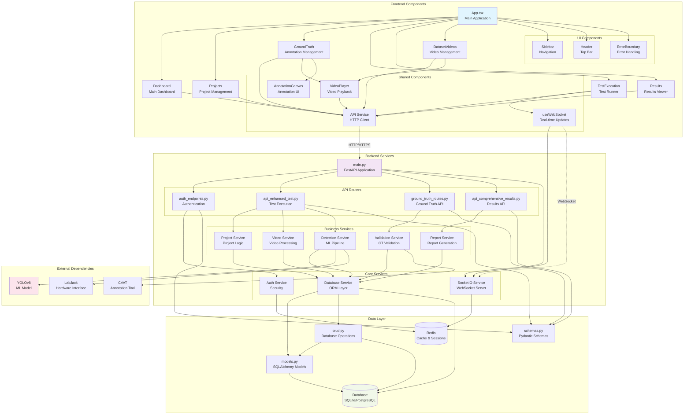
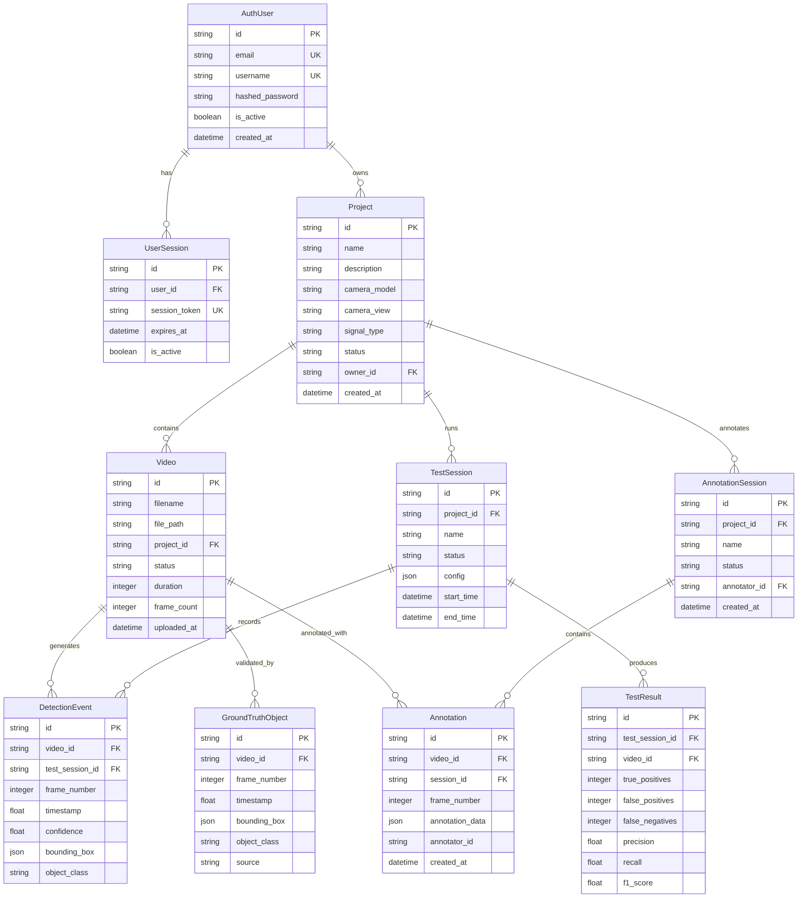
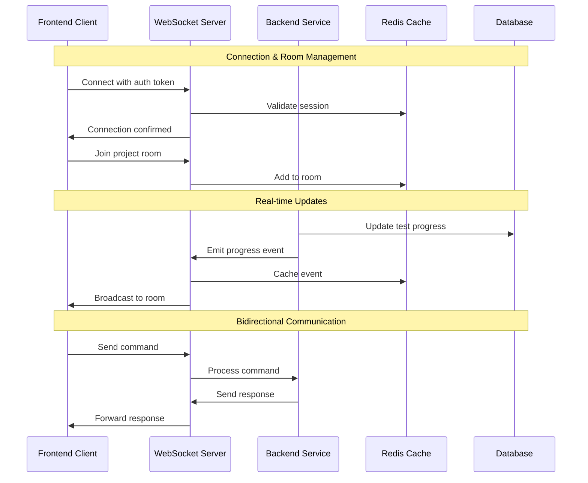

# AI Model Validation Platform - Component Relationships & Dependencies

## Component Dependency Graph



## Detailed Component Dependencies

### 1. Frontend Component Hierarchy

#### Core Application Components

```typescript
// App.tsx - Root component dependencies
App
├── ThemeProvider (Material-UI)
├── BrowserRouter (React Router)
├── ErrorBoundary (Error handling)
├── GlobalErrorHandler (Error management)
├── ApiConnectionStatus (Connection monitoring)
└── Routes
    ├── Dashboard
    ├── Projects  
    ├── GroundTruth
    ├── TestExecution
    ├── Results
    └── DatasetVideos
```

#### Shared Component Dependencies

```typescript
// VideoPlayer component dependencies
VideoPlayer
├── useVideoState (Custom hook)
├── useWebSocket (Real-time updates)
├── Material-UI components
├── HTML5 Video API
└── Custom controls

// AnnotationCanvas component dependencies  
AnnotationCanvas
├── Canvas API
├── Mouse/Touch event handlers
├── Zoom and pan utilities
├── Bounding box utilities
└── WebSocket integration

// useWebSocket hook dependencies
useWebSocket
├── Socket.IO client
├── React useEffect/useState
├── Error handling
├── Reconnection logic
└── Event management
```

### 2. Backend Service Dependencies

#### FastAPI Application Structure

```python
# main.py - Central FastAPI application
main.py
├── FastAPI app instance
├── CORS middleware
├── Authentication middleware  
├── Static file serving
├── Router registration
│   ├── auth_endpoints
│   ├── api_enhanced_test
│   ├── ground_truth_routes
│   └── api_comprehensive_results
├── SocketIO integration
├── Database initialization
└── Startup/shutdown events
```

#### Service Layer Dependencies

```python
# Business service dependencies
ProjectService
├── models.Project (SQLAlchemy model)
├── crud.py (Database operations)
├── schemas.py (Validation)
└── database.py (Session management)

VideoService  
├── models.Video
├── File system operations
├── Video processing utilities
├── ML pipeline integration
└── WebSocket notifications

DetectionService
├── YOLOv8 model integration
├── LabJack hardware interface
├── OpenCV image processing
├── NumPy array operations
└── Result storage

ValidationService
├── Ground truth loading
├── Bounding box matching
├── IoU calculations
├── Performance metrics
└── Report generation
```

### 3. Database Model Relationships



### 4. API Endpoint Dependencies

#### Authentication Flow Dependencies

```python
# Authentication endpoint dependencies
@app.post("/auth/login")
├── UserLoginSchema (Request validation)
├── AuthService.authenticate_user()
│   ├── models.AuthUser
│   ├── Password verification
│   └── Database query
├── JWT token generation
├── Redis session storage
└── UserResponseSchema (Response serialization)

@app.get("/auth/me") 
├── JWT token validation (Dependency)
├── Database user lookup
└── Current user serialization
```

#### Test Execution Dependencies

```python
# Test execution endpoint dependencies  
@app.post("/api/enhanced-test/start-workflow")
├── WorkflowConfigSchema (Validation)
├── Authentication dependency
├── ProjectService.get_project()
├── VideoService.get_project_videos()
├── TestWorkflowOrchestrator.start()
│   ├── DetectionService
│   ├── ValidationService  
│   ├── WebSocket notifications
│   └── Background task creation
└── WorkflowResponseSchema (Response)
```

### 5. Real-Time Communication Dependencies

#### WebSocket Architecture

```python
# Socket.IO server dependencies
socketio_server.py
├── Socket.IO AsyncServer
├── FastAPI integration
├── CORS configuration
├── Authentication middleware
├── Room management
├── Event handlers
│   ├── connect/disconnect
│   ├── start_test_session
│   ├── progress_update
│   └── error_notification
└── Redis adapter (for scaling)
```

#### WebSocket Event Flow



### 6. External Integration Dependencies

#### YOLOv8 ML Model Integration

```python
# Detection service YOLOv8 dependencies
DetectionService
├── ultralytics.YOLO (Model loading)
├── OpenCV (Image preprocessing)
├── PIL (Image handling)
├── NumPy (Array operations)
├── PyTorch (Model inference)
├── CUDA (GPU acceleration - optional)
└── Custom result processing
```

#### LabJack Hardware Integration

```python
# Hardware service dependencies
LabJackService
├── labjack.ljm (LabJack driver)
├── Serial communication
├── GPIO pin management
├── Timing synchronization
├── Error handling
└── Mock implementation (development)
```

### 7. Configuration and Environment Dependencies

#### Configuration Hierarchy

```python
# Configuration dependencies
config.py
├── pydantic.BaseSettings
├── Environment variable loading
├── .env file parsing
├── Default value definitions
├── Validation rules
└── Type conversion

# Environment-specific configs
├── .env.development
├── .env.production  
├── .env.docker
└── .env.example
```

### 8. Testing Dependencies

#### Test Infrastructure

```python
# Test dependencies
conftest.py
├── pytest fixtures
├── Test database setup
├── Mock services
├── Test client creation
└── Cleanup utilities

# Frontend testing
├── Jest test runner
├── React Testing Library
├── MSW (API mocking)
├── WebSocket mocking
└── Component test utilities
```

## Dependency Management Strategies

### 1. Dependency Injection
- Services are injected through FastAPI's dependency system
- Database sessions are provided via dependency injection
- Authentication is enforced through dependencies

### 2. Interface Abstractions
- Abstract base classes define service interfaces
- Mock implementations for testing
- Environment-specific implementations

### 3. Configuration Management
- Centralized configuration through Pydantic settings
- Environment-based configuration overrides
- Runtime configuration validation

### 4. Error Boundary Isolation
- Component-level error boundaries in React
- Service-level exception handling in Python
- Circuit breaker patterns for external dependencies

### 5. State Management
- React Context for global state
- Redux for complex state management
- Server state managed by React Query

This comprehensive component relationship analysis shows how every part of the AI Model Validation Platform connects together, from the smallest UI components to the largest backend services, providing a complete picture of the system's interdependencies.