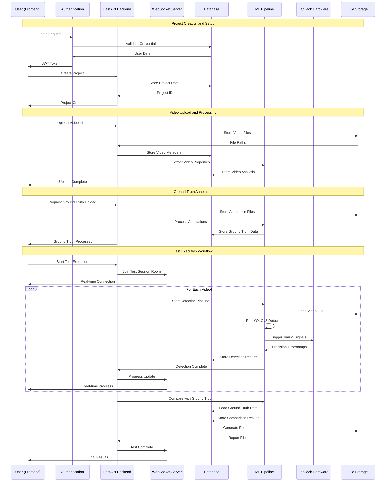
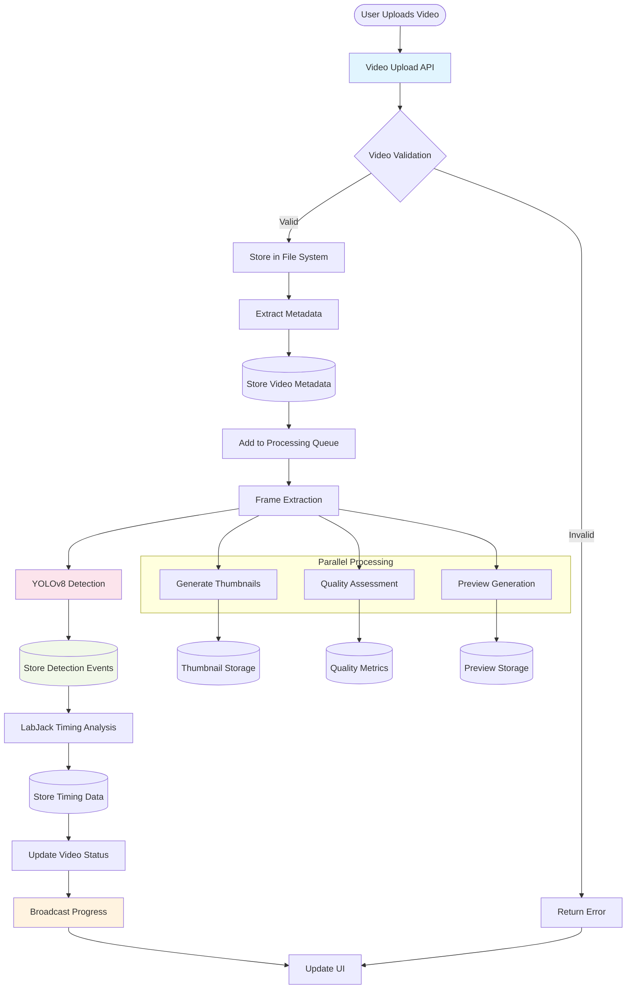
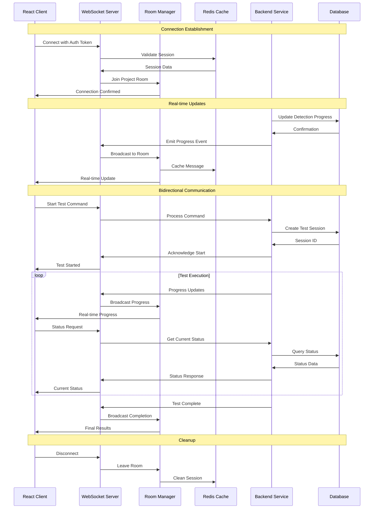
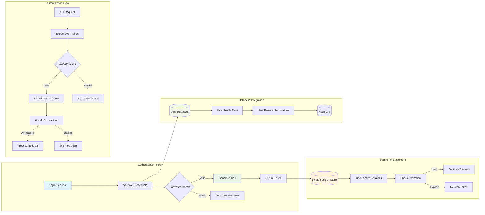
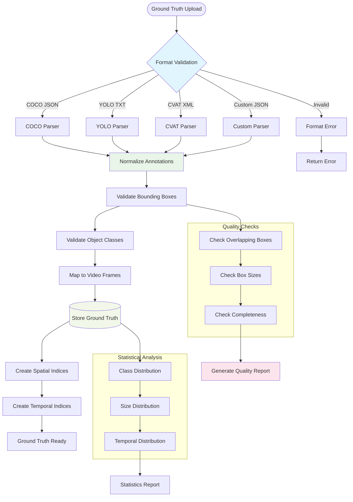
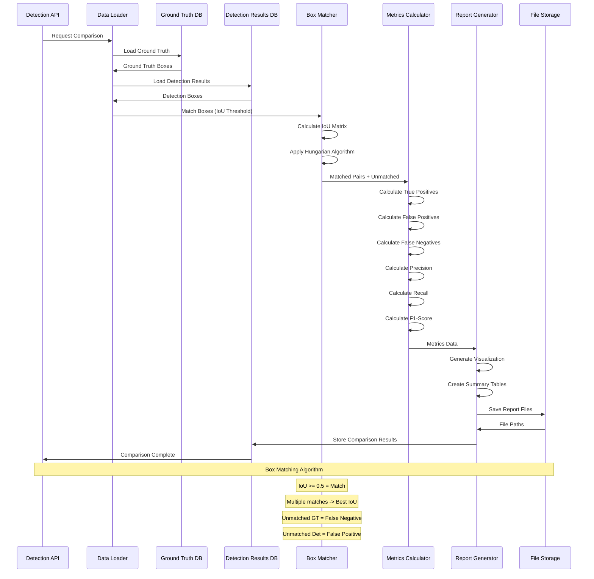
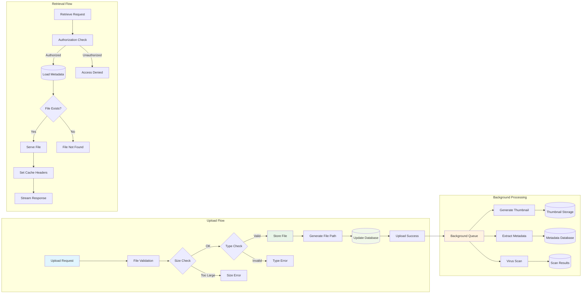
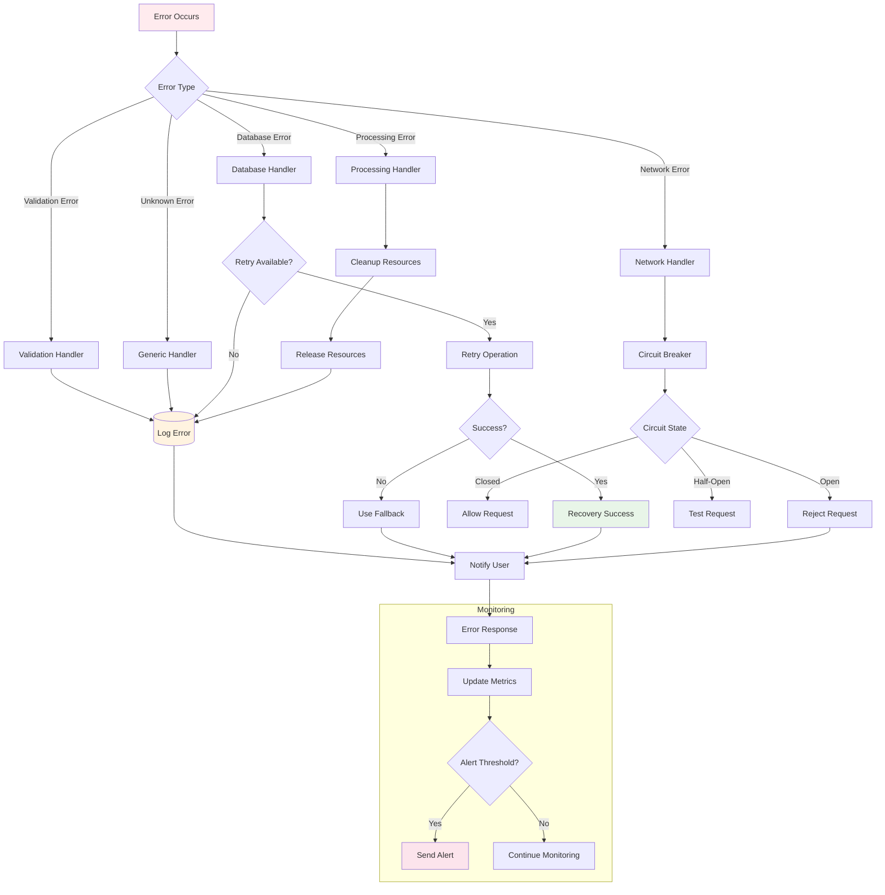

# AI Model Validation Platform - Data Flow Diagrams

## 1. Complete User Workflow Data Flow

## 2. Video Processing Pipeline Data Flow

## 3. Real-Time Communication Data Flow

## 4. Authentication and Authorization Data Flow

## 5. Ground Truth Processing Data Flow

## 6. Detection Result Comparison Data Flow

## 7. File Storage and Retrieval Data Flow

## 8. Error Handling and Recovery Data Flow

## Data Flow Summary

### Key Data Transformation Points

1. **Input Validation**: All external data is validated at API boundaries
2. **Format Normalization**: Different input formats are normalized to common schemas
3. **Processing Pipelines**: Data flows through sequential processing stages
4. **Real-time Broadcasting**: Status updates are broadcast to connected clients
5. **Result Aggregation**: Individual results are aggregated into comprehensive reports
6. **Error Recovery**: Failed operations are retried with exponential backoff
7. **Audit Logging**: All significant operations are logged for compliance

### Performance Considerations

- **Asynchronous Processing**: Long-running tasks are processed asynchronously
- **Caching**: Frequently accessed data is cached in Redis
- **Streaming**: Large files are streamed rather than loaded entirely into memory
- **Connection Pooling**: Database connections are pooled for efficiency
- **Background Tasks**: Non-critical operations are performed in background threads

### Security Considerations

- **Authentication**: All API requests require valid JWT tokens
- **Authorization**: User permissions are checked before data access
- **Input Sanitization**: All user inputs are sanitized before processing
- **Data Encryption**: Sensitive data is encrypted at rest and in transit
- **Audit Trails**: All data modifications are logged with user attribution

This comprehensive data flow documentation shows how information moves through every layer of the AI Model Validation Platform, from user interaction to final result delivery.