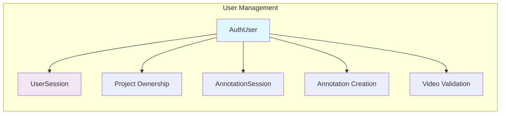
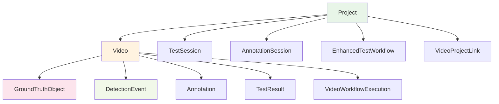
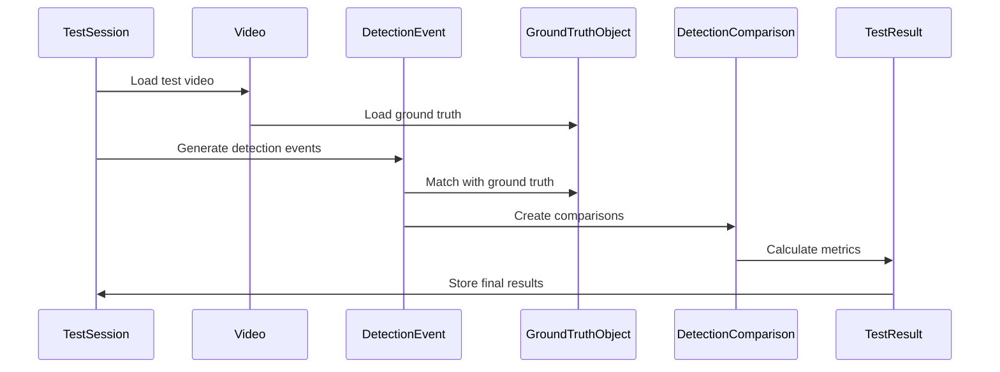

# AI Model Validation Platform - Database Architecture & Relationships

## Complete Database Schema Overview

```mermaid
erDiagram
    %% Authentication & User Management
    AuthUser {
        string id PK "UUID Primary Key"
        string email UK "Unique Email"
        string username UK "Unique Username"
        string full_name "User Full Name"
        string hashed_password "Bcrypt Hashed Password"
        boolean is_active "Active Status"
        boolean is_superuser "Admin Privileges"
        boolean is_verified "Email Verified"
        datetime last_login "Last Login Time"
        datetime created_at "Account Creation"
        datetime updated_at "Last Update"
    }
    
    UserSession {
        string id PK "UUID Primary Key"
        string user_id FK "Reference to AuthUser"
        string session_token UK "Unique Session Token"
        string ip_address "Client IP Address"
        text user_agent "Browser User Agent"
        boolean is_active "Session Status"
        datetime expires_at "Expiration Time"
        datetime created_at "Session Start"
        datetime last_activity "Last Activity"
    }
    
    %% Core Project Management
    Project {
        string id PK "UUID Primary Key"
        string name "Project Name"
        text description "Project Description"
        string camera_model "Camera Hardware Model"
        string camera_view "Camera Perspective Type"
        string lens_type "Lens Specification"
        string resolution "Video Resolution"
        integer frame_rate "Frames Per Second"
        string signal_type "Hardware Signal Type"
        string status "Project Status"
        string owner_id FK "Project Owner"
        datetime created_at "Creation Time"
        datetime updated_at "Last Update"
    }
    
    %% Video Management & Processing
    Video {
        string id PK "UUID Primary Key"
        string filename "Original Filename"
        string file_path "Storage File Path"
        integer file_size "File Size in Bytes"
        float duration "Video Duration (seconds)"
        float fps "Actual Frame Rate"
        string resolution "Actual Resolution"
        string status "Primary Status Field"
        string validation_status "Validation Workflow Status"
        string validation_type "Validation Method"
        datetime validated_at "Validation Complete Time"
        string validated_by FK "Validator User ID"
        boolean ground_truth_generated "GT Generation Status"
        integer ground_truth_count "Number of GT Objects"
        float ground_truth_quality_score "GT Quality Score"
        datetime ground_truth_completed_at "GT Generation Time"
        boolean hil_testing_ready "HIL Test Ready Status"
        string hil_testing_approved_by FK "HIL Approver"
        datetime hil_testing_approved_at "HIL Approval Time"
        string processing_status "Legacy Processing Status"
        string project_id FK "Parent Project"
        datetime created_at "Upload Time"
        datetime updated_at "Last Update"
    }
    
    %% Ground Truth & Annotations
    GroundTruthObject {
        string id PK "UUID Primary Key"
        string video_id FK "Parent Video"
        string tracking_id "VRU Tracking ID"
        integer frame_number "Video Frame Number"
        float timestamp "Frame Timestamp"
        string class_label "Object Class"
        float x "Bounding Box X"
        float y "Bounding Box Y"  
        float width "Bounding Box Width"
        float height "Bounding Box Height"
        json bounding_box "Legacy Bounding Box"
        float confidence "Detection Confidence"
        boolean validated "Validation Status"
        boolean difficult "Difficult Detection Flag"
        datetime created_at "Creation Time"
    }
    
    AnnotationSession {
        string id PK "UUID Primary Key"
        string project_id FK "Parent Project"
        string video_id FK "Target Video"
        string name "Session Name"
        string status "Session Status"
        string annotator_id FK "Annotator User"
        json config "Session Configuration"
        datetime created_at "Session Start"
        datetime updated_at "Last Update"
        datetime completed_at "Completion Time"
    }
    
    Annotation {
        string id PK "UUID Primary Key"
        string session_id FK "Annotation Session"
        string video_id FK "Target Video"
        integer frame_number "Frame Number"
        float timestamp "Frame Timestamp"
        json annotation_data "Annotation Content"
        string annotation_type "Annotation Type"
        string annotator_id FK "Annotator User"
        string status "Annotation Status"
        datetime created_at "Creation Time"
        datetime updated_at "Last Update"
    }
    
    %% Test Execution & Sessions  
    TestSession {
        string id PK "UUID Primary Key"
        string name "Session Name"
        string project_id FK "Parent Project"
        string video_id FK "Test Video"
        integer tolerance_ms "Timing Tolerance"
        string status "Session Status"
        string session_type "Session Type"
        datetime started_at "Session Start Time"
        datetime completed_at "Session End Time"
        datetime created_at "Creation Time"
        datetime updated_at "Last Update"
        integer latency_threshold_ms "LabJack Latency Threshold"
        float video_start_timestamp "Video Start Reference"
    }
    
    %% Detection Events & Results
    DetectionEvent {
        string id PK "UUID Primary Key"
        string test_session_id FK "Parent Test Session"
        string video_id FK "Source Video"
        float timestamp "Detection Timestamp"
        string validation_result "Pass/Fail Result"
        string ground_truth_match_id FK "Matched GT Object"
        datetime created_at "Creation Time"
        float latency_ms "Measured Latency"
        float labjack_timestamp "LabJack Hardware Timestamp"
        float video_start_time "Video Reference Time"
        float labjack_voltage "Hardware Voltage Reading"
        float latency_threshold_ms "Applied Threshold"
        string latency_result "Latency Test Result"
        float voltage_level "Trigger Voltage Level"
        string detection_channel "Hardware Channel"
        float confidence "AI Confidence (Legacy)"
        string class_label "Object Class (Legacy)"
        string detection_id "Unique Detection ID"
        integer frame_number "Video Frame"
        string vru_type "VRU Classification"
        float bounding_box_x "Bounding Box X"
        float bounding_box_y "Bounding Box Y"
        float bounding_box_width "Bounding Box Width"
        float bounding_box_height "Bounding Box Height"
        string screenshot_path "Full Frame Screenshot"
        string screenshot_zoom_path "Zoomed Screenshot"
        float processing_time_ms "Processing Duration"
        string model_version "ML Model Version"
        string source "Detection Source"
        string detection_type "Detection Method"
    }
    
    TestResult {
        string id PK "UUID Primary Key"
        string test_session_id FK "Parent Test Session"
        string video_id FK "Test Video"
        integer true_positives "True Positive Count"
        integer false_positives "False Positive Count"
        integer false_negatives "False Negative Count"
        float precision "Precision Metric"
        float recall "Recall Metric"
        float f1_score "F1 Score Metric"
        json detailed_results "Detailed Analysis"
        datetime created_at "Result Generation Time"
        datetime updated_at "Last Update"
    }
    
    DetectionComparison {
        string id PK "UUID Primary Key"
        string test_session_id FK "Parent Test Session"
        string detection_event_id FK "Detection Event"
        string ground_truth_id FK "Ground Truth Object"
        float iou_score "Intersection over Union"
        boolean is_match "Match Status"
        string comparison_type "Comparison Method"
        json metadata "Additional Data"
        datetime created_at "Comparison Time"
    }
    
    %% Video-Project Linking
    VideoProjectLink {
        string id PK "UUID Primary Key"
        string video_id FK "Linked Video"
        string project_id FK "Linked Project"
        string link_type "Link Relationship Type"
        datetime created_at "Link Creation"
        datetime updated_at "Last Update"
    }
    
    %% Enhanced Test Workflows
    EnhancedTestWorkflow {
        string id PK "UUID Primary Key"
        string project_id FK "Parent Project"
        string name "Workflow Name"
        json config "Workflow Configuration"
        string status "Workflow Status"
        datetime start_time "Workflow Start"
        datetime end_time "Workflow End"
        integer total_videos "Total Video Count"
        integer completed_videos "Completed Count"
        integer failed_videos "Failed Count"
        float overall_progress "Progress Percentage"
        json final_results "Final Report"
        json error_log "Error History"
        datetime created_at "Creation Time"
        datetime updated_at "Last Update"
    }
    
    VideoWorkflowExecution {
        string id PK "UUID Primary Key"
        string workflow_id FK "Parent Workflow"
        string video_id FK "Executed Video"
        integer execution_order "Processing Order"
        string status "Execution Status"
        float processing_duration "Duration in Seconds"
        integer total_detections "Detection Count"
        integer true_positives "True Positives"
        integer false_positives "False Positives"
        integer false_negatives "False Negatives"
        float precision "Video Precision"
        float recall "Video Recall"
        float f1_score "Video F1 Score"
        string individual_report_path "Report File Path"
        datetime created_at "Execution Time"
        datetime updated_at "Last Update"
    }
    
    %% Relationships
    AuthUser ||--o{ UserSession : "has sessions"
    AuthUser ||--o{ Project : "owns projects"
    AuthUser ||--o{ Video : "validates videos"
    AuthUser ||--o{ AnnotationSession : "annotates"
    AuthUser ||--o{ Annotation : "creates"
    
    Project ||--o{ Video : "contains videos"
    Project ||--o{ TestSession : "runs tests"
    Project ||--o{ AnnotationSession : "has annotations"
    Project ||--o{ VideoProjectLink : "linked to videos"
    Project ||--o{ EnhancedTestWorkflow : "executes workflows"
    
    Video ||--o{ GroundTruthObject : "has ground truth"
    Video ||--o{ TestSession : "tested in sessions"
    Video ||--o{ DetectionEvent : "generates events"
    Video ||--o{ Annotation : "annotated with"
    Video ||--o{ AnnotationSession : "annotation target"
    Video ||--o{ VideoProjectLink : "linked to projects"
    Video ||--o{ TestResult : "produces results"
    Video ||--o{ VideoWorkflowExecution : "executed in workflow"
    
    TestSession ||--o{ DetectionEvent : "records events"
    TestSession ||--o{ TestResult : "generates results"
    TestSession ||--o{ DetectionComparison : "compares detections"
    
    DetectionEvent ||--o{ DetectionComparison : "compared with GT"
    GroundTruthObject ||--o{ DetectionComparison : "compared with detection"
    GroundTruthObject ||--o{ DetectionEvent : "matched to detection"
    
    AnnotationSession ||--o{ Annotation : "contains annotations"
    
    EnhancedTestWorkflow ||--o{ VideoWorkflowExecution : "executes videos"
```



## Database Index Strategy

### Performance-Critical Indexes

```sql
-- Authentication Performance Indexes
CREATE INDEX idx_auth_user_email_active ON auth_users (email, is_active);
CREATE INDEX idx_auth_user_username_active ON auth_users (username, is_active);
CREATE INDEX idx_session_token_active ON user_sessions (session_token, is_active);
CREATE INDEX idx_session_expires_active ON user_sessions (expires_at, is_active);

-- Video Processing Workflow Indexes
CREATE INDEX idx_video_status_validation ON videos (status, validation_status);
CREATE INDEX idx_video_hil_ready ON videos (hil_testing_ready, status);
CREATE INDEX idx_video_project_status ON videos (project_id, status);
CREATE INDEX idx_video_ground_truth_quality ON videos (ground_truth_quality_score, ground_truth_count);

-- Ground Truth Spatial & Temporal Indexes
CREATE INDEX idx_gt_video_timestamp ON ground_truth_objects (video_id, timestamp);
CREATE INDEX idx_gt_video_class ON ground_truth_objects (video_id, class_label);
CREATE INDEX idx_gt_spatial_bounds ON ground_truth_objects (x, y, width, height);
CREATE INDEX idx_gt_tracking_temporal ON ground_truth_objects (tracking_id, timestamp);

-- Detection Event Performance Indexes  
CREATE INDEX idx_detection_session_timestamp ON detection_events (test_session_id, timestamp);
CREATE INDEX idx_detection_video_timestamp ON detection_events (video_id, timestamp);
CREATE INDEX idx_detection_latency_result ON detection_events (latency_ms, latency_result);
CREATE INDEX idx_detection_source_type ON detection_events (source, detection_type);

-- Test Session Analytics Indexes
CREATE INDEX idx_testsession_project_status ON test_sessions (project_id, status);
CREATE INDEX idx_testsession_type_status ON test_sessions (session_type, status);
```

## Data Flow & Relationships Analysis

### 1. Authentication & Authorization Flow



### 2. Project & Video Hierarchy



### 3. Test Execution Data Flow



## Data Types & Constraints

### String Field Specifications

```sql
-- ID Fields (UUID format)
id VARCHAR(36) PRIMARY KEY DEFAULT uuid_generate_v4()

-- File Paths (support long paths)
file_path VARCHAR(500) NOT NULL

-- Names and Labels
name VARCHAR(255) NOT NULL
class_label VARCHAR(100) NOT NULL

-- Status Fields (enumerated values)
status VARCHAR(50) DEFAULT 'active' 
validation_status VARCHAR(50) DEFAULT 'pending'
latency_result VARCHAR(20) -- 'pass', 'fail', 'error', 'timeout'

-- Email and Username
email VARCHAR(320) UNIQUE NOT NULL  -- RFC 5321 compliant
username VARCHAR(150) UNIQUE NOT NULL
```

### Numeric Field Specifications

```sql
-- Timing Fields (milliseconds precision)
latency_ms DECIMAL(10,3)
tolerance_ms INTEGER DEFAULT 100
latency_threshold_ms INTEGER DEFAULT 100

-- Video Metadata
duration DECIMAL(10,3)  -- seconds with millisecond precision
fps DECIMAL(8,3)        -- frames per second
file_size BIGINT        -- bytes

-- Spatial Coordinates (normalized 0-1 or pixel coordinates)
x DECIMAL(10,6)         -- bounding box coordinates
y DECIMAL(10,6)
width DECIMAL(10,6)
height DECIMAL(10,6)

-- Performance Metrics (0-1 range)
confidence DECIMAL(5,4)     -- 0.0000 to 1.0000
precision DECIMAL(5,4)
recall DECIMAL(5,4)
f1_score DECIMAL(5,4)
iou_score DECIMAL(5,4)
```

### JSON Field Structures

```sql
-- Configuration JSON Examples
config JSON -- {
--   "tolerance_ms": 100,
--   "detection_threshold": 0.5,
--   "retry_count": 3,
--   "notify_on_completion": true
-- }

-- Bounding Box JSON (legacy compatibility)
bounding_box JSON -- {
--   "x": 0.123,
--   "y": 0.456,
--   "width": 0.200,
--   "height": 0.150
-- }

-- Annotation Data JSON
annotation_data JSON -- {
--   "type": "bounding_box",
--   "coordinates": {...},
--   "properties": {...},
--   "metadata": {...}
-- }

-- Detailed Results JSON
detailed_results JSON -- {
--   "per_class_metrics": {...},
--   "confusion_matrix": [...],
--   "temporal_analysis": {...}
-- }
```

## Database Migration Strategy

### Version Control & Migrations

```python
# Alembic Migration Example
"""Add video validation status fields

Revision ID: 12345678
Revises: 87654321
Create Date: 2024-01-15 10:30:00.000000

"""
from alembic import op
import sqlalchemy as sa

def upgrade():
    # Add new validation status fields
    op.add_column('videos', sa.Column('validation_status', sa.String(50), default='pending'))
    op.add_column('videos', sa.Column('validation_type', sa.String(50), nullable=True))
    op.add_column('videos', sa.Column('validated_at', sa.DateTime(timezone=True), nullable=True))
    
    # Create new indexes for performance
    op.create_index('idx_video_status_validation', 'videos', ['status', 'validation_status'])
    op.create_index('idx_video_validation_completed', 'videos', ['validated_at', 'validation_type'])

def downgrade():
    # Remove indexes first
    op.drop_index('idx_video_validation_completed', 'videos')
    op.drop_index('idx_video_status_validation', 'videos')
    
    # Remove columns
    op.drop_column('videos', 'validated_at')
    op.drop_column('videos', 'validation_type') 
    op.drop_column('videos', 'validation_status')
```

## Database Performance Considerations

### Query Optimization Patterns

```sql
-- Efficient Video Status Queries
SELECT v.id, v.filename, v.status, v.validation_status
FROM videos v 
WHERE v.project_id = ? 
  AND v.status IN ('uploaded', 'processing', 'completed')
  AND v.hil_testing_ready = true
ORDER BY v.created_at DESC;

-- Ground Truth Temporal Queries
SELECT gto.* 
FROM ground_truth_objects gto
WHERE gto.video_id = ?
  AND gto.timestamp BETWEEN ? AND ?
  AND gto.class_label = ?
ORDER BY gto.timestamp ASC;

-- Detection Event Analysis
SELECT 
  COUNT(*) as total_detections,
  AVG(de.latency_ms) as avg_latency,
  COUNT(CASE WHEN de.latency_result = 'pass' THEN 1 END) as passed_count
FROM detection_events de
WHERE de.test_session_id = ?
  AND de.latency_ms IS NOT NULL;
```

### Connection Pooling Configuration

```python
# SQLAlchemy Connection Pool Settings
engine = create_engine(
    DATABASE_URL,
    poolclass=QueuePool,
    pool_size=20,              # Base connection pool size
    max_overflow=30,           # Additional connections during peak
    pool_pre_ping=True,        # Validate connections before use
    pool_recycle=3600,         # Recycle connections every hour
    echo=False,                # SQL logging (development only)
    connect_args={
        "options": "-c timezone=utc"  # PostgreSQL timezone
    }
)
```

This comprehensive database architecture provides a robust foundation for the AI Model Validation Platform with optimized relationships, strategic indexing, and scalable design patterns that support both current functionality and future enhancements.