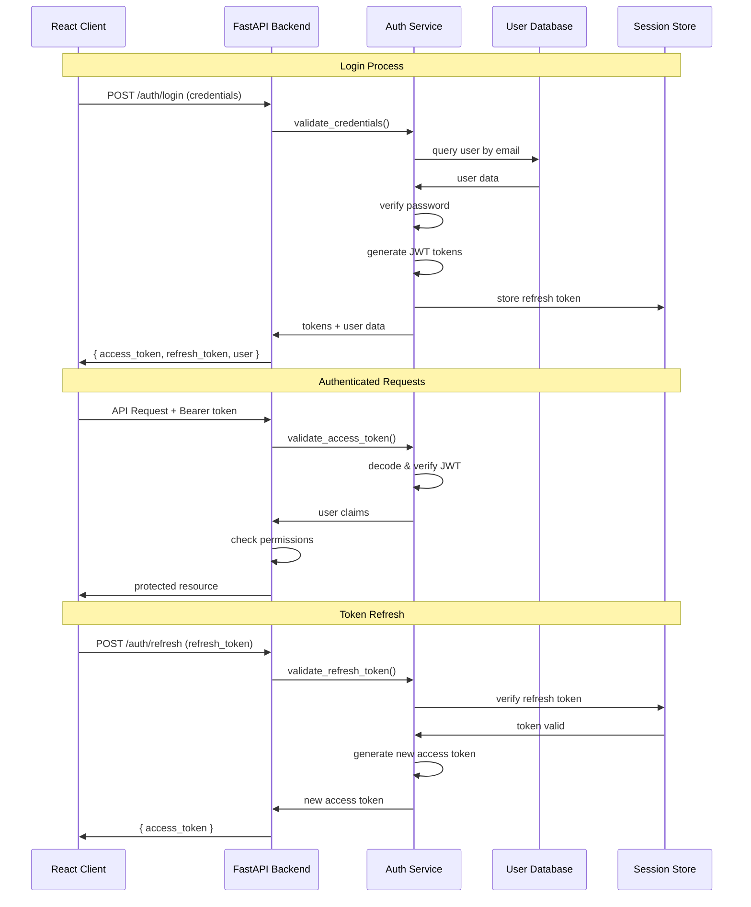

# AI Model Validation Platform - Integration Architecture

## Integration Architecture Overview

```mermaid
graph TB
    subgraph "Frontend Integration Layer"
        UI[React Frontend]
        WS_CLIENT[WebSocket Client]
        HTTP_CLIENT[HTTP Client (Axios)]
        ERROR_BOUNDARY[Error Boundary System]
    end
    
    subgraph "API Gateway & Middleware"
        NGINX[Nginx Reverse Proxy]
        CORS[CORS Middleware]
        AUTH_MW[JWT Authentication]
        RATE_LIMIT[Rate Limiting]
        LOGGING[Request Logging]
    end
    
    subgraph "Backend Integration Hub"
        FASTAPI[FastAPI Application]
        SOCKETIO[Socket.IO Server]
        TASK_QUEUE[Background Task Queue]
        EVENT_BUS[Event Bus System]
    end
    
    subgraph "Service Integration Layer"
        PROJECT_INT[Project Integration]
        VIDEO_INT[Video Integration]  
        ML_INT[ML Pipeline Integration]
        HW_INT[Hardware Integration]
        AUTH_INT[Authentication Integration]
    end
    
    subgraph "Data Integration Layer"
        DB_POOL[Database Connection Pool]
        REDIS_POOL[Redis Connection Pool]
        FILE_HANDLER[File System Handler]
        CACHE_MGR[Cache Manager]
    end
    
    subgraph "External System Integration"
        YOLO_INT[YOLOv8 Model Integration]
        LABJACK_INT[LabJack Hardware Integration]
        CVAT_INT[CVAT Annotation Integration]
        CLOUD_INT[Cloud Storage Integration]
        EMAIL_INT[Email Service Integration]
    end
    
    subgraph "Data Persistence"
        MAIN_DB[(Primary Database)]
        REDIS_CACHE[(Redis Cache)]
        FILE_STORAGE[File Storage]
        LOG_STORAGE[Log Storage]
    end
    
    %% Frontend to Gateway
    UI --> NGINX
    WS_CLIENT --> NGINX
    HTTP_CLIENT --> NGINX
    
    %% Gateway to Backend
    NGINX --> CORS
    CORS --> AUTH_MW
    AUTH_MW --> RATE_LIMIT
    RATE_LIMIT --> LOGGING
    LOGGING --> FASTAPI
    
    %% Backend Hub Connections
    FASTAPI --> SOCKETIO
    FASTAPI --> TASK_QUEUE
    FASTAPI --> EVENT_BUS
    
    %% Service Integration
    FASTAPI --> PROJECT_INT
    FASTAPI --> VIDEO_INT
    FASTAPI --> ML_INT
    FASTAPI --> HW_INT
    FASTAPI --> AUTH_INT
    
    %% Data Layer Integration
    PROJECT_INT --> DB_POOL
    VIDEO_INT --> DB_POOL
    ML_INT --> DB_POOL
    AUTH_INT --> REDIS_POOL
    VIDEO_INT --> FILE_HANDLER
    SOCKETIO --> CACHE_MGR
    
    %% External Integrations
    ML_INT --> YOLO_INT
    HW_INT --> LABJACK_INT
    VIDEO_INT --> CVAT_INT
    FILE_HANDLER --> CLOUD_INT
    FASTAPI --> EMAIL_INT
    
    %% Data Persistence
    DB_POOL --> MAIN_DB
    REDIS_POOL --> REDIS_CACHE
    FILE_HANDLER --> FILE_STORAGE
    LOGGING --> LOG_STORAGE
    
    style UI fill:#e1f5fe
    style FASTAPI fill:#f3e5f5
    style YOLO_INT fill:#fce4ec
    style MAIN_DB fill:#f1f8e9
```

## 1. Frontend-Backend Integration Patterns

### HTTP API Integration

```typescript
// API Client Configuration
class APIClient {
    private baseURL: string;
    private authToken: string | null;
    private retryConfig: RetryConfig;
    
    constructor() {
        this.baseURL = process.env.REACT_APP_API_BASE_URL || 'http://localhost:8000';
        this.setupInterceptors();
        this.setupRetryLogic();
    }
    
    private setupInterceptors() {
        // Request interceptor - Add auth token
        axios.interceptors.request.use((config) => {
            if (this.authToken) {
                config.headers.Authorization = `Bearer ${this.authToken}`;
            }
            return config;
        });
        
        // Response interceptor - Handle errors
        axios.interceptors.response.use(
            (response) => response,
            (error) => this.handleApiError(error)
        );
    }
    
    private async handleApiError(error: AxiosError): Promise<never> {
        if (error.response?.status === 401) {
            // Token expired - refresh or redirect to login
            await this.refreshToken();
        } else if (error.response?.status >= 500) {
            // Server error - show user-friendly message
            this.showErrorNotification('Server temporarily unavailable');
        }
        throw error;
    }
}
```

### WebSocket Integration

```typescript
// WebSocket Connection Management
class WebSocketManager {
    private socket: Socket | null = null;
    private reconnectAttempts: number = 0;
    private maxReconnectAttempts: number = 5;
    private reconnectDelay: number = 1000;
    
    connect(projectId: string): Promise<void> {
        return new Promise((resolve, reject) => {
            this.socket = io(this.getWebSocketURL(), {
                auth: { token: this.getAuthToken() },
                transports: ['websocket', 'polling'],
                timeout: 10000,
                forceNew: true
            });
            
            this.setupEventHandlers(resolve, reject);
            this.joinProjectRoom(projectId);
        });
    }
    
    private setupEventHandlers(resolve: Function, reject: Function) {
        if (!this.socket) return;
        
        this.socket.on('connect', () => {
            console.log('WebSocket connected');
            this.reconnectAttempts = 0;
            resolve();
        });
        
        this.socket.on('disconnect', () => {
            console.log('WebSocket disconnected');
            this.attemptReconnect();
        });
        
        this.socket.on('error', (error) => {
            console.error('WebSocket error:', error);
            reject(error);
        });
        
        // Business event handlers
        this.socket.on('test_progress', (data) => {
            this.handleTestProgress(data);
        });
        
        this.socket.on('video_processed', (data) => {
            this.handleVideoProcessed(data);
        });
    }
    
    private attemptReconnect() {
        if (this.reconnectAttempts < this.maxReconnectAttempts) {
            setTimeout(() => {
                this.reconnectAttempts++;
                this.socket?.connect();
            }, this.reconnectDelay * Math.pow(2, this.reconnectAttempts));
        }
    }
}
```

## 2. Authentication & Authorization Integration

### JWT Token Flow Integration



### Permission-Based Access Control

```python
# FastAPI Dependency for Authorization
from functools import wraps
from fastapi import Depends, HTTPException, status
from typing import List, Optional

class PermissionChecker:
    def __init__(self, required_permissions: List[str]):
        self.required_permissions = required_permissions
    
    def __call__(self, current_user: User = Depends(get_current_user)):
        if not self.has_permissions(current_user, self.required_permissions):
            raise HTTPException(
                status_code=status.HTTP_403_FORBIDDEN,
                detail="Insufficient permissions"
            )
        return current_user
    
    def has_permissions(self, user: User, permissions: List[str]) -> bool:
        user_permissions = self.get_user_permissions(user)
        return all(perm in user_permissions for perm in permissions)

# Usage in API endpoints
@app.get("/api/projects/{project_id}")
async def get_project(
    project_id: str,
    user: User = Depends(PermissionChecker(["project:read"]))
):
    return await project_service.get_project(project_id, user)
```

## 3. Database Integration Patterns

### Connection Pool Management

```python
# Database Connection Pool Configuration
from sqlalchemy import create_engine
from sqlalchemy.pool import QueuePool
from sqlalchemy.orm import sessionmaker

class DatabaseManager:
    def __init__(self, database_url: str):
        self.engine = create_engine(
            database_url,
            poolclass=QueuePool,
            pool_size=20,                    # Base connections
            max_overflow=30,                 # Additional connections
            pool_pre_ping=True,              # Health checks
            pool_recycle=3600,               # Recycle after 1 hour
            echo=False                       # SQL logging (dev only)
        )
        self.SessionLocal = sessionmaker(
            autocommit=False, 
            autoflush=False, 
            bind=self.engine
        )
    
    def get_session(self):
        """Dependency for FastAPI endpoints"""
        db = self.SessionLocal()
        try:
            yield db
        finally:
            db.close()
    
    async def health_check(self) -> bool:
        """Check database connectivity"""
        try:
            with self.engine.connect() as conn:
                conn.execute(text("SELECT 1"))
            return True
        except Exception:
            return False
```

### Redis Integration for Caching & Sessions

```python
# Redis Integration Service
import redis.asyncio as aioredis
from typing import Optional, Any
import json

class RedisService:
    def __init__(self, redis_url: str):
        self.redis_url = redis_url
        self.pool = None
        
    async def initialize(self):
        """Initialize Redis connection pool"""
        self.pool = aioredis.ConnectionPool.from_url(
            self.redis_url,
            max_connections=20,
            retry_on_timeout=True,
            health_check_interval=30
        )
        
    async def get_client(self) -> aioredis.Redis:
        """Get Redis client from pool"""
        return aioredis.Redis(connection_pool=self.pool)
    
    async def cache_set(self, key: str, value: Any, ttl: int = 3600):
        """Set cached value with TTL"""
        client = await self.get_client()
        serialized = json.dumps(value) if not isinstance(value, str) else value
        await client.setex(key, ttl, serialized)
    
    async def cache_get(self, key: str) -> Optional[Any]:
        """Get cached value"""
        client = await self.get_client()
        value = await client.get(key)
        if value:
            try:
                return json.loads(value)
            except json.JSONDecodeError:
                return value.decode('utf-8')
        return None
    
    async def session_store(self, session_id: str, data: dict, ttl: int = 86400):
        """Store session data"""
        await self.cache_set(f"session:{session_id}", data, ttl)
    
    async def session_get(self, session_id: str) -> Optional[dict]:
        """Get session data"""
        return await self.cache_get(f"session:{session_id}")
```

## 4. Machine Learning Pipeline Integration

### YOLOv8 Model Integration

```python
# ML Model Integration Service
from ultralytics import YOLO
import cv2
import numpy as np
from typing import List, Dict, Any
import torch

class YOLODetectionService:
    def __init__(self, model_path: str = "yolov8n.pt"):
        self.model_path = model_path
        self.model = None
        self.device = None
        self.class_names = None
        
    def initialize(self):
        """Initialize YOLO model"""
        # Determine device (CUDA, MPS, or CPU)
        if torch.cuda.is_available():
            self.device = 'cuda'
        elif torch.backends.mps.is_available():
            self.device = 'mps'
        else:
            self.device = 'cpu'
            
        # Load model
        self.model = YOLO(self.model_path)
        self.model.to(self.device)
        self.class_names = self.model.names
        
        print(f"YOLO model loaded on {self.device}")
    
    async def detect_objects(
        self, 
        image_path: str,
        confidence_threshold: float = 0.5,
        iou_threshold: float = 0.4
    ) -> List[Dict[str, Any]]:
        """Run object detection on image"""
        
        # Load and preprocess image
        image = cv2.imread(image_path)
        if image is None:
            raise ValueError(f"Could not load image: {image_path}")
        
        # Run inference
        results = self.model.predict(
            image,
            conf=confidence_threshold,
            iou=iou_threshold,
            device=self.device,
            verbose=False
        )
        
        # Process results
        detections = []
        for result in results:
            boxes = result.boxes
            if boxes is not None:
                for box in boxes:
                    detection = {
                        'bbox': box.xyxy[0].cpu().numpy().tolist(),  # [x1, y1, x2, y2]
                        'confidence': float(box.conf[0].cpu().numpy()),
                        'class_id': int(box.cls[0].cpu().numpy()),
                        'class_name': self.class_names[int(box.cls[0].cpu().numpy())],
                        'area': self._calculate_area(box.xyxy[0].cpu().numpy())
                    }
                    detections.append(detection)
        
        return detections
    
    def _calculate_area(self, bbox: np.ndarray) -> float:
        """Calculate bounding box area"""
        x1, y1, x2, y2 = bbox
        return float((x2 - x1) * (y2 - y1))
    
    async def process_video_frames(
        self, 
        video_path: str,
        frame_skip: int = 1
    ) -> Dict[int, List[Dict[str, Any]]]:
        """Process video frame by frame"""
        
        cap = cv2.VideoCapture(video_path)
        frame_detections = {}
        frame_number = 0
        
        try:
            while cap.isOpened():
                ret, frame = cap.read()
                if not ret:
                    break
                
                if frame_number % frame_skip == 0:
                    # Save frame temporarily
                    temp_path = f"/tmp/frame_{frame_number}.jpg"
                    cv2.imwrite(temp_path, frame)
                    
                    # Run detection
                    detections = await self.detect_objects(temp_path)
                    frame_detections[frame_number] = detections
                    
                    # Cleanup
                    os.remove(temp_path)
                
                frame_number += 1
                
        finally:
            cap.release()
        
        return frame_detections
```

### Hardware Integration (LabJack)

```python
# LabJack Hardware Integration
from typing import Optional, Dict, Any
import time
import asyncio
from abc import ABC, abstractmethod

class HardwareInterface(ABC):
    """Abstract hardware interface"""
    
    @abstractmethod
    async def initialize(self) -> bool:
        pass
    
    @abstractmethod
    async def trigger_signal(self, pin: int, duration_ms: float) -> bool:
        pass
    
    @abstractmethod
    async def read_signal(self, pin: int) -> float:
        pass
    
    @abstractmethod
    async def get_timestamp(self) -> float:
        pass

class LabJackService(HardwareInterface):
    """LabJack hardware integration service"""
    
    def __init__(self, device_type: str = "U3"):
        self.device_type = device_type
        self.device = None
        self.is_connected = False
        
    async def initialize(self) -> bool:
        """Initialize LabJack device connection"""
        try:
            # Try to import and connect to LabJack
            import labjack
            from labjack import ljm
            
            # Open device connection
            self.device = ljm.openS(self.device_type, "USB", "ANY")
            
            # Configure device settings
            await self._configure_device()
            
            self.is_connected = True
            print(f"LabJack {self.device_type} connected successfully")
            return True
            
        except ImportError:
            print("LabJack drivers not installed, using mock implementation")
            self.device = MockLabJack()
            self.is_connected = True
            return True
        except Exception as e:
            print(f"Failed to connect to LabJack: {e}")
            self.is_connected = False
            return False
    
    async def _configure_device(self):
        """Configure LabJack device pins and settings"""
        if not self.device:
            return
            
        # Configure digital outputs for trigger signals
        ljm.eWriteName(self.device, "FIO0", 0)  # Initialize as output low
        ljm.eWriteName(self.device, "FIO1", 0)  # Initialize as output low
        
        # Configure analog inputs for signal reading
        ljm.eWriteName(self.device, "AIN0_NEGATIVE_CH", 199)  # Single-ended
        ljm.eWriteName(self.device, "AIN0_RANGE", 10)         # ±10V range
    
    async def trigger_signal(self, pin: int, duration_ms: float) -> bool:
        """Trigger a digital signal on specified pin"""
        if not self.is_connected:
            return False
            
        try:
            # Set pin high
            ljm.eWriteName(self.device, f"FIO{pin}", 1)
            
            # Wait for duration
            await asyncio.sleep(duration_ms / 1000.0)
            
            # Set pin low
            ljm.eWriteName(self.device, f"FIO{pin}", 0)
            
            return True
        except Exception as e:
            print(f"Error triggering signal on pin {pin}: {e}")
            return False
    
    async def read_signal(self, pin: int) -> float:
        """Read analog signal from specified pin"""
        if not self.is_connected:
            return 0.0
            
        try:
            value = ljm.eReadName(self.device, f"AIN{pin}")
            return float(value)
        except Exception as e:
            print(f"Error reading signal from pin {pin}: {e}")
            return 0.0
    
    async def get_timestamp(self) -> float:
        """Get high-precision timestamp"""
        return time.perf_counter()
    
    async def cleanup(self):
        """Clean up device connection"""
        if self.device and self.is_connected:
            try:
                ljm.close(self.device)
                print("LabJack connection closed")
            except:
                pass
            finally:
                self.is_connected = False

class MockLabJack(HardwareInterface):
    """Mock LabJack for development/testing"""
    
    async def initialize(self) -> bool:
        return True
    
    async def trigger_signal(self, pin: int, duration_ms: float) -> bool:
        print(f"MOCK: Triggering pin {pin} for {duration_ms}ms")
        await asyncio.sleep(duration_ms / 1000.0)
        return True
    
    async def read_signal(self, pin: int) -> float:
        # Return mock sensor data
        import random
        return random.uniform(0.0, 5.0)
    
    async def get_timestamp(self) -> float:
        return time.perf_counter()
```

## 5. Real-Time Communication Integration

### Socket.IO Room Management

```python
# Real-time communication integration
import socketio
from typing import Dict, Set, Any
import asyncio
import logging

class RealTimeManager:
    def __init__(self, sio: socketio.AsyncServer):
        self.sio = sio
        self.active_rooms: Dict[str, Set[str]] = {}
        self.user_rooms: Dict[str, Set[str]] = {}
        self.logger = logging.getLogger(__name__)
    
    async def join_project_room(self, sid: str, project_id: str, user_id: str):
        """Join user to project-specific room"""
        room_name = f"project_{project_id}"
        
        await self.sio.enter_room(sid, room_name)
        
        # Track room membership
        if room_name not in self.active_rooms:
            self.active_rooms[room_name] = set()
        self.active_rooms[room_name].add(sid)
        
        if sid not in self.user_rooms:
            self.user_rooms[sid] = set()
        self.user_rooms[sid].add(room_name)
        
        self.logger.info(f"User {user_id} (session {sid}) joined room {room_name}")
        
        # Notify other users in room
        await self.sio.emit('user_joined', {
            'user_id': user_id,
            'room': room_name,
            'timestamp': time.time()
        }, room=room_name, skip_sid=sid)
    
    async def broadcast_test_progress(
        self, 
        project_id: str, 
        progress_data: Dict[str, Any]
    ):
        """Broadcast test progress to all users in project room"""
        room_name = f"project_{project_id}"
        
        await self.sio.emit('test_progress', {
            'project_id': project_id,
            'data': progress_data,
            'timestamp': time.time()
        }, room=room_name)
        
        self.logger.debug(f"Broadcast test progress to room {room_name}")
    
    async def broadcast_video_processed(
        self, 
        project_id: str, 
        video_data: Dict[str, Any]
    ):
        """Broadcast video processing completion"""
        room_name = f"project_{project_id}"
        
        await self.sio.emit('video_processed', {
            'project_id': project_id,
            'video_data': video_data,
            'timestamp': time.time()
        }, room=room_name)
    
    async def leave_all_rooms(self, sid: str):
        """Remove user from all rooms on disconnect"""
        if sid in self.user_rooms:
            for room_name in self.user_rooms[sid]:
                await self.sio.leave_room(sid, room_name)
                
                if room_name in self.active_rooms:
                    self.active_rooms[room_name].discard(sid)
                    
                    # Clean up empty rooms
                    if not self.active_rooms[room_name]:
                        del self.active_rooms[room_name]
            
            del self.user_rooms[sid]
            
        self.logger.info(f"User session {sid} left all rooms")
    
    async def get_room_stats(self) -> Dict[str, Any]:
        """Get statistics about active rooms and connections"""
        return {
            'total_rooms': len(self.active_rooms),
            'total_connections': sum(len(members) for members in self.active_rooms.values()),
            'rooms': {
                room: len(members) 
                for room, members in self.active_rooms.items()
            }
        }
```

## 6. Error Handling & Recovery Integration

### Centralized Error Handling

```python
# Centralized error handling system
from fastapi import HTTPException, Request
from fastapi.responses import JSONResponse
import traceback
import logging
from enum import Enum

class ErrorType(str, Enum):
    VALIDATION_ERROR = "validation_error"
    AUTHENTICATION_ERROR = "authentication_error"
    AUTHORIZATION_ERROR = "authorization_error"
    NOT_FOUND_ERROR = "not_found_error"
    DATABASE_ERROR = "database_error"
    EXTERNAL_SERVICE_ERROR = "external_service_error"
    INTERNAL_ERROR = "internal_error"

class ErrorHandler:
    def __init__(self, logger: logging.Logger):
        self.logger = logger
    
    async def handle_exception(self, request: Request, exc: Exception) -> JSONResponse:
        """Central exception handler"""
        
        error_id = self._generate_error_id()
        
        # Log error with context
        self.logger.error(
            f"Error {error_id}: {str(exc)}",
            extra={
                'error_id': error_id,
                'path': str(request.url.path),
                'method': request.method,
                'user_agent': request.headers.get('user-agent'),
                'traceback': traceback.format_exc()
            }
        )
        
        # Determine error type and response
        if isinstance(exc, ValidationError):
            return self._validation_error_response(error_id, exc)
        elif isinstance(exc, AuthenticationException):
            return self._auth_error_response(error_id, exc)
        elif isinstance(exc, DatabaseException):
            return self._database_error_response(error_id, exc)
        elif isinstance(exc, ExternalServiceException):
            return self._external_service_error_response(error_id, exc)
        else:
            return self._internal_error_response(error_id, exc)
    
    def _validation_error_response(self, error_id: str, exc: Exception) -> JSONResponse:
        return JSONResponse(
            status_code=400,
            content={
                'error_type': ErrorType.VALIDATION_ERROR,
                'error_id': error_id,
                'message': 'Validation failed',
                'details': str(exc)
            }
        )
    
    def _internal_error_response(self, error_id: str, exc: Exception) -> JSONResponse:
        return JSONResponse(
            status_code=500,
            content={
                'error_type': ErrorType.INTERNAL_ERROR,
                'error_id': error_id,
                'message': 'An internal error occurred',
                'details': 'Please contact support with error ID'
            }
        )
    
    def _generate_error_id(self) -> str:
        import uuid
        return str(uuid.uuid4())[:8]
```

## Integration Architecture Summary

### Key Integration Patterns

1. **API-First Design**: All services expose well-defined REST APIs
2. **Event-Driven Communication**: Real-time updates through WebSocket events
3. **Layered Integration**: Clear separation between UI, business logic, and data layers
4. **Circuit Breaker Pattern**: Fault tolerance for external service dependencies
5. **Retry Logic**: Automatic retry for transient failures
6. **Connection Pooling**: Efficient resource management for databases and caches
7. **Centralized Error Handling**: Consistent error responses across all components
8. **Authentication Integration**: JWT-based authentication across all services
9. **Real-time Synchronization**: Socket.IO for bidirectional communication
10. **Hardware Abstraction**: Clean interface for hardware integration with mocking support

### Integration Benefits

- **Loose Coupling**: Services can be developed and deployed independently
- **Scalability**: Each integration point can be scaled based on demand
- **Reliability**: Fault tolerance and recovery mechanisms at each integration point
- **Maintainability**: Clear interfaces and error handling make debugging easier
- **Testability**: Mock implementations allow for comprehensive testing
- **Security**: Authentication and authorization enforced at integration boundaries

This integration architecture ensures that all components of the AI Model Validation Platform work together seamlessly while maintaining flexibility for future enhancements and scaling requirements.