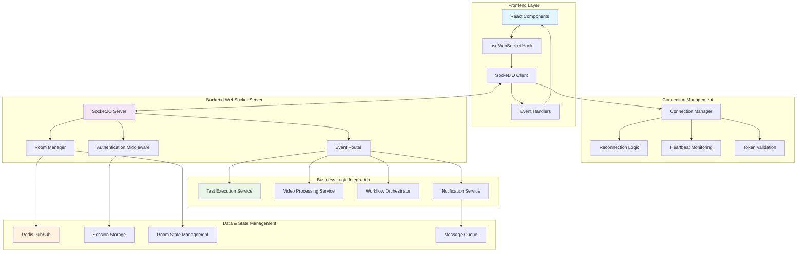
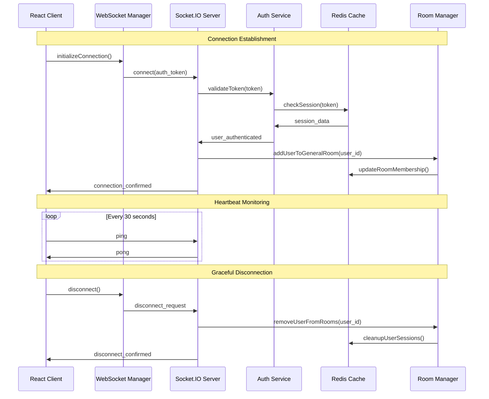
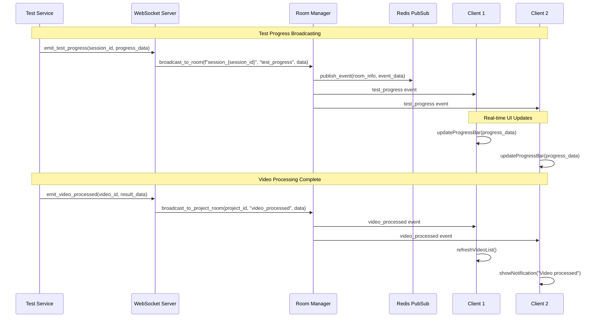

# AI Model Validation Platform - WebSocket Communication Flows

## WebSocket Architecture Overview



## 1. WebSocket Connection Lifecycle

### Connection Establishment Flow



### Frontend WebSocket Hook Implementation

```typescript
// useWebSocket Hook - Complete Implementation
interface WebSocketOptions {
    autoConnect?: boolean;
    reconnectAttempts?: number;
    reconnectInterval?: number;
    heartbeatInterval?: number;
    debug?: boolean;
}

interface WebSocketState {
    connected: boolean;
    connecting: boolean;
    error: string | null;
    reconnectAttempts: number;
    lastMessage: any;
    rooms: string[];
}

export const useWebSocket = (options: WebSocketOptions = {}) => {
    const [socket, setSocket] = useState<Socket | null>(null);
    const [state, setState] = useState<WebSocketState>({
        connected: false,
        connecting: false,
        error: null,
        reconnectAttempts: 0,
        lastMessage: null,
        rooms: []
    });
    
    const {
        autoConnect = true,
        reconnectAttempts = 5,
        reconnectInterval = 2000,
        heartbeatInterval = 30000,
        debug = false
    } = options;
    
    const authToken = useAuth().token;
    const eventHandlers = useRef<Map<string, Function[]>>(new Map());
    const heartbeatInterval = useRef<NodeJS.Timeout>();
    const reconnectTimeout = useRef<NodeJS.Timeout>();
    
    // Connection Management
    const connect = useCallback(async () => {
        if (!authToken) {
            setState(prev => ({ ...prev, error: 'No authentication token' }));
            return;
        }
        
        if (socket?.connected) {
            debug && console.log('WebSocket: Already connected');
            return;
        }
        
        setState(prev => ({ ...prev, connecting: true, error: null }));
        
        try {
            const newSocket = io(getWebSocketURL(), {
                auth: { token: authToken },
                transports: ['websocket', 'polling'],
                timeout: 10000,
                forceNew: true,
                reconnection: false // Handle manually
            });
            
            await setupSocketHandlers(newSocket);
            setSocket(newSocket);
            
        } catch (error) {
            setState(prev => ({ 
                ...prev, 
                connecting: false, 
                error: error.message 
            }));
            
            scheduleReconnect();
        }
    }, [authToken, debug]);
    
    const setupSocketHandlers = (socket: Socket) => {
        return new Promise<void>((resolve, reject) => {
            // Connection Events
            socket.on('connect', () => {
                debug && console.log('WebSocket: Connected');
                setState(prev => ({
                    ...prev,
                    connected: true,
                    connecting: false,
                    error: null,
                    reconnectAttempts: 0
                }));
                
                startHeartbeat(socket);
                resolve();
            });
            
            socket.on('disconnect', (reason) => {
                debug && console.log('WebSocket: Disconnected', reason);
                setState(prev => ({
                    ...prev,
                    connected: false,
                    connecting: false,
                    rooms: []
                }));
                
                stopHeartbeat();
                
                if (reason === 'io server disconnect') {
                    // Server initiated disconnect - don't reconnect
                    return;
                }
                
                scheduleReconnect();
            });
            
            socket.on('connect_error', (error) => {
                debug && console.error('WebSocket: Connection error', error);
                setState(prev => ({ 
                    ...prev, 
                    connecting: false,
                    error: error.message 
                }));
                
                reject(error);
                scheduleReconnect();
            });
            
            // Business Event Handlers
            socket.on('test_progress', handleTestProgress);
            socket.on('video_processed', handleVideoProcessed);
            socket.on('workflow_status', handleWorkflowStatus);
            socket.on('notification', handleNotification);
            socket.on('room_joined', handleRoomJoined);
            socket.on('room_left', handleRoomLeft);
            
            // Generic event handler for custom events
            socket.onAny((eventName, ...args) => {
                const handlers = eventHandlers.current.get(eventName);
                if (handlers) {
                    handlers.forEach(handler => handler(...args));
                }
                
                setState(prev => ({ 
                    ...prev, 
                    lastMessage: { event: eventName, data: args } 
                }));
            });
        });
    };
    
    // Heartbeat Management
    const startHeartbeat = (socket: Socket) => {
        heartbeatInterval.current = setInterval(() => {
            if (socket.connected) {
                socket.emit('ping', Date.now());
            }
        }, heartbeatInterval);
    };
    
    const stopHeartbeat = () => {
        if (heartbeatInterval.current) {
            clearInterval(heartbeatInterval.current);
        }
    };
    
    // Reconnection Logic
    const scheduleReconnect = () => {
        setState(prev => {
            if (prev.reconnectAttempts >= reconnectAttempts) {
                return { 
                    ...prev, 
                    error: 'Max reconnection attempts reached' 
                };
            }
            
            const backoffDelay = reconnectInterval * Math.pow(2, prev.reconnectAttempts);
            
            reconnectTimeout.current = setTimeout(() => {
                debug && console.log(`WebSocket: Reconnecting (attempt ${prev.reconnectAttempts + 1})`);
                connect();
            }, backoffDelay);
            
            return { 
                ...prev, 
                reconnectAttempts: prev.reconnectAttempts + 1 
            };
        });
    };
    
    // Room Management
    const joinRoom = useCallback((roomName: string) => {
        if (socket?.connected) {
            socket.emit('join_room', { room: roomName });
            debug && console.log(`WebSocket: Joining room ${roomName}`);
        }
    }, [socket, debug]);
    
    const leaveRoom = useCallback((roomName: string) => {
        if (socket?.connected) {
            socket.emit('leave_room', { room: roomName });
            debug && console.log(`WebSocket: Leaving room ${roomName}`);
        }
    }, [socket, debug]);
    
    // Event Subscription
    const on = useCallback((eventName: string, handler: Function) => {
        const handlers = eventHandlers.current.get(eventName) || [];
        handlers.push(handler);
        eventHandlers.current.set(eventName, handlers);
        
        return () => {
            const currentHandlers = eventHandlers.current.get(eventName) || [];
            const index = currentHandlers.indexOf(handler);
            if (index > -1) {
                currentHandlers.splice(index, 1);
                eventHandlers.current.set(eventName, currentHandlers);
            }
        };
    }, []);
    
    // Send Message
    const emit = useCallback((eventName: string, data: any) => {
        if (socket?.connected) {
            socket.emit(eventName, data);
            debug && console.log(`WebSocket: Emitting ${eventName}`, data);
        } else {
            debug && console.warn(`WebSocket: Cannot emit ${eventName}, not connected`);
        }
    }, [socket, debug]);
    
    // Event Handlers
    const handleTestProgress = useCallback((data: any) => {
        debug && console.log('WebSocket: Test progress update', data);
        // Update global test progress state
    }, [debug]);
    
    const handleVideoProcessed = useCallback((data: any) => {
        debug && console.log('WebSocket: Video processed', data);
        // Invalidate video queries, update UI
    }, [debug]);
    
    const handleWorkflowStatus = useCallback((data: any) => {
        debug && console.log('WebSocket: Workflow status', data);
        // Update workflow status in UI
    }, [debug]);
    
    const handleNotification = useCallback((data: any) => {
        debug && console.log('WebSocket: Notification', data);
        // Show toast notification
    }, [debug]);
    
    const handleRoomJoined = useCallback((data: { room: string }) => {
        setState(prev => ({
            ...prev,
            rooms: [...prev.rooms, data.room]
        }));
    }, []);
    
    const handleRoomLeft = useCallback((data: { room: string }) => {
        setState(prev => ({
            ...prev,
            rooms: prev.rooms.filter(room => room !== data.room)
        }));
    }, []);
    
    // Cleanup
    const disconnect = useCallback(() => {
        if (reconnectTimeout.current) {
            clearTimeout(reconnectTimeout.current);
        }
        
        stopHeartbeat();
        
        if (socket) {
            socket.disconnect();
            setSocket(null);
        }
        
        setState({
            connected: false,
            connecting: false,
            error: null,
            reconnectAttempts: 0,
            lastMessage: null,
            rooms: []
        });
    }, [socket]);
    
    // Auto-connect on mount
    useEffect(() => {
        if (autoConnect && authToken) {
            connect();
        }
        
        return () => {
            disconnect();
        };
    }, [autoConnect, authToken, connect, disconnect]);
    
    return {
        ...state,
        connect,
        disconnect,
        joinRoom,
        leaveRoom,
        emit,
        on,
        socket
    };
};
```

## 2. Room Management System

### Room Types and Hierarchy

```python
# Backend Room Management System
from typing import Dict, Set, Optional, List
import asyncio
from enum import Enum

class RoomType(str, Enum):
    GENERAL = "general"                    # Global notifications
    PROJECT = "project_{project_id}"       # Project-specific updates
    VIDEO = "video_{video_id}"             # Video-specific events
    TEST_SESSION = "session_{session_id}"  # Test session progress
    WORKFLOW = "workflow_{workflow_id}"    # Workflow execution
    USER = "user_{user_id}"               # Personal notifications

class RoomManager:
    def __init__(self, sio: socketio.AsyncServer, redis_client):
        self.sio = sio
        self.redis = redis_client
        self.active_rooms: Dict[str, Set[str]] = {}  # room -> session_ids
        self.user_rooms: Dict[str, Set[str]] = {}    # session_id -> rooms
        self.room_metadata: Dict[str, Dict] = {}     # room -> metadata
    
    async def join_room(self, sid: str, room_name: str, user_id: str):
        """Add user to room with proper tracking"""
        await self.sio.enter_room(sid, room_name)
        
        # Track room membership
        if room_name not in self.active_rooms:
            self.active_rooms[room_name] = set()
        self.active_rooms[room_name].add(sid)
        
        if sid not in self.user_rooms:
            self.user_rooms[sid] = set()
        self.user_rooms[sid].add(room_name)
        
        # Store in Redis for persistence across server restarts
        await self.redis.sadd(f"room:{room_name}:members", sid)
        await self.redis.sadd(f"session:{sid}:rooms", room_name)
        await self.redis.hset(f"session:{sid}:info", "user_id", user_id)
        
        # Notify other room members
        await self.sio.emit('user_joined_room', {
            'user_id': user_id,
            'room': room_name,
            'timestamp': time.time(),
            'member_count': len(self.active_rooms[room_name])
        }, room=room_name, skip_sid=sid)
        
        # Confirm to joining user
        await self.sio.emit('room_joined', {
            'room': room_name,
            'member_count': len(self.active_rooms[room_name]),
            'timestamp': time.time()
        }, room=sid)
    
    async def leave_room(self, sid: str, room_name: str):
        """Remove user from room with cleanup"""
        await self.sio.leave_room(sid, room_name)
        
        # Update tracking
        if room_name in self.active_rooms:
            self.active_rooms[room_name].discard(sid)
            
            # Clean up empty rooms
            if not self.active_rooms[room_name]:
                del self.active_rooms[room_name]
                await self.redis.delete(f"room:{room_name}:members")
        
        if sid in self.user_rooms:
            self.user_rooms[sid].discard(room_name)
        
        # Remove from Redis
        await self.redis.srem(f"room:{room_name}:members", sid)
        await self.redis.srem(f"session:{sid}:rooms", room_name)
        
        # Get user info for notification
        user_id = await self.redis.hget(f"session:{sid}:info", "user_id")
        
        # Notify remaining room members
        if room_name in self.active_rooms:
            await self.sio.emit('user_left_room', {
                'user_id': user_id,
                'room': room_name,
                'timestamp': time.time(),
                'member_count': len(self.active_rooms[room_name])
            }, room=room_name)
        
        # Confirm to leaving user
        await self.sio.emit('room_left', {
            'room': room_name,
            'timestamp': time.time()
        }, room=sid)
    
    async def cleanup_user_session(self, sid: str):
        """Clean up all rooms for disconnected user"""
        if sid in self.user_rooms:
            rooms_to_leave = list(self.user_rooms[sid])
            for room_name in rooms_to_leave:
                await self.leave_room(sid, room_name)
            
            del self.user_rooms[sid]
        
        # Clean up Redis data
        await self.redis.delete(f"session:{sid}:rooms")
        await self.redis.delete(f"session:{sid}:info")
    
    async def broadcast_to_room(self, room_name: str, event: str, data: dict):
        """Broadcast message to all room members"""
        if room_name in self.active_rooms:
            await self.sio.emit(event, {
                **data,
                'room': room_name,
                'timestamp': time.time(),
                'member_count': len(self.active_rooms[room_name])
            }, room=room_name)
    
    async def get_room_stats(self) -> Dict[str, any]:
        """Get comprehensive room statistics"""
        stats = {
            'total_rooms': len(self.active_rooms),
            'total_connections': sum(len(members) for members in self.active_rooms.values()),
            'room_breakdown': {},
            'active_rooms': {}
        }
        
        for room_name, members in self.active_rooms.items():
            room_type = self._classify_room_type(room_name)
            if room_type not in stats['room_breakdown']:
                stats['room_breakdown'][room_type] = 0
            stats['room_breakdown'][room_type] += 1
            
            stats['active_rooms'][room_name] = {
                'member_count': len(members),
                'room_type': room_type
            }
        
        return stats
    
    def _classify_room_type(self, room_name: str) -> str:
        """Classify room by name pattern"""
        if room_name == 'general':
            return 'general'
        elif room_name.startswith('project_'):
            return 'project'
        elif room_name.startswith('video_'):
            return 'video'
        elif room_name.startswith('session_'):
            return 'test_session'
        elif room_name.startswith('workflow_'):
            return 'workflow'
        elif room_name.startswith('user_'):
            return 'user'
        else:
            return 'custom'
```

## 3. Event-Driven Communication Patterns

### Test Progress Updates



### WebSocket Event Handlers

```python
# Complete Socket.IO Server Implementation
import socketio
from typing import Dict, Any
import logging
import json
from datetime import datetime

logger = logging.getLogger(__name__)

class WebSocketServer:
    def __init__(self, app: FastAPI, redis_client, db_session):
        self.sio = socketio.AsyncServer(
            async_mode='asgi',
            cors_allowed_origins=[
                'http://localhost:3000',
                'http://127.0.0.1:3000',
                'https://yourdomain.com'
            ],
            logger=True,
            engineio_logger=True
        )
        
        self.room_manager = RoomManager(self.sio, redis_client)
        self.db_session = db_session
        self.redis = redis_client
        
        self.setup_event_handlers()
    
    def setup_event_handlers(self):
        """Register all WebSocket event handlers"""
        
        @self.sio.event
        async def connect(sid, environ, auth):
            """Handle client connection with authentication"""
            try:
                logger.info(f"Client {sid} attempting to connect")
                
                # Validate authentication token
                if not auth or 'token' not in auth:
                    logger.warning(f"Client {sid} connection rejected: No auth token")
                    return False
                
                user = await self.validate_auth_token(auth['token'])
                if not user:
                    logger.warning(f"Client {sid} connection rejected: Invalid token")
                    return False
                
                # Store user info in session
                await self.redis.hset(f"session:{sid}", {
                    "user_id": user.id,
                    "email": user.email,
                    "connected_at": datetime.utcnow().isoformat()
                })
                
                # Join general room
                await self.room_manager.join_room(sid, "general", user.id)
                
                # Send connection confirmation
                await self.sio.emit('connection_confirmed', {
                    'status': 'connected',
                    'user': {
                        'id': user.id,
                        'email': user.email,
                        'full_name': user.full_name
                    },
                    'server_time': datetime.utcnow().isoformat(),
                    'session_id': sid
                }, room=sid)
                
                logger.info(f"Client {sid} connected as user {user.email}")
                return True
                
            except Exception as e:
                logger.error(f"Connection error for {sid}: {str(e)}")
                return False
        
        @self.sio.event
        async def disconnect(sid):
            """Handle client disconnection with cleanup"""
            logger.info(f"Client {sid} disconnecting")
            
            # Get user info before cleanup
            user_info = await self.redis.hgetall(f"session:{sid}")
            
            # Clean up room memberships
            await self.room_manager.cleanup_user_session(sid)
            
            # Clean up session data
            await self.redis.delete(f"session:{sid}")
            
            # Log disconnection
            if user_info:
                logger.info(f"User {user_info.get('email', 'unknown')} disconnected (session {sid})")
        
        @self.sio.event
        async def join_project_room(sid, data):
            """Join project-specific room for updates"""
            try:
                project_id = data.get('project_id')
                if not project_id:
                    await self.emit_error(sid, "Missing project_id")
                    return
                
                # Verify user has access to project
                user_id = await self.redis.hget(f"session:{sid}", "user_id")
                if not await self.verify_project_access(user_id, project_id):
                    await self.emit_error(sid, "Access denied to project")
                    return
                
                room_name = f"project_{project_id}"
                await self.room_manager.join_room(sid, room_name, user_id)
                
                logger.info(f"User {user_id} joined project room {room_name}")
                
            except Exception as e:
                logger.error(f"Error joining project room: {str(e)}")
                await self.emit_error(sid, "Failed to join project room")
        
        @self.sio.event
        async def leave_project_room(sid, data):
            """Leave project-specific room"""
            try:
                project_id = data.get('project_id')
                if not project_id:
                    return
                
                room_name = f"project_{project_id}"
                await self.room_manager.leave_room(sid, room_name)
                
            except Exception as e:
                logger.error(f"Error leaving project room: {str(e)}")
        
        @self.sio.event
        async def start_test_session(sid, data):
            """Handle test session start request"""
            try:
                user_id = await self.redis.hget(f"session:{sid}", "user_id")
                
                # Validate request data
                project_id = data.get('project_id')
                video_id = data.get('video_id')
                config = data.get('config', {})
                
                if not all([project_id, video_id]):
                    await self.emit_error(sid, "Missing required fields")
                    return
                
                # Start test session (this would integrate with your test service)
                session_id = await self.start_test_execution(
                    user_id, project_id, video_id, config
                )
                
                # Join test session room
                session_room = f"session_{session_id}"
                await self.room_manager.join_room(sid, session_room, user_id)
                
                # Confirm test session started
                await self.sio.emit('test_session_started', {
                    'session_id': session_id,
                    'project_id': project_id,
                    'video_id': video_id,
                    'room': session_room,
                    'status': 'initializing'
                }, room=sid)
                
                logger.info(f"Test session {session_id} started by user {user_id}")
                
            except Exception as e:
                logger.error(f"Error starting test session: {str(e)}")
                await self.emit_error(sid, "Failed to start test session")
        
        @self.sio.event
        async def ping(sid, timestamp):
            """Handle heartbeat ping"""
            await self.sio.emit('pong', timestamp, room=sid)
        
        @self.sio.event
        async def request_status_update(sid, data):
            """Handle request for current status"""
            try:
                request_type = data.get('type')
                entity_id = data.get('id')
                
                if request_type == 'test_session':
                    status = await self.get_test_session_status(entity_id)
                    await self.sio.emit('status_update', {
                        'type': 'test_session',
                        'id': entity_id,
                        'status': status
                    }, room=sid)
                
                elif request_type == 'workflow':
                    status = await self.get_workflow_status(entity_id)
                    await self.sio.emit('status_update', {
                        'type': 'workflow', 
                        'id': entity_id,
                        'status': status
                    }, room=sid)
                
            except Exception as e:
                logger.error(f"Error handling status request: {str(e)}")
    
    # Business Logic Integration Methods
    async def broadcast_test_progress(self, session_id: str, progress_data: Dict[str, Any]):
        """Broadcast test progress to session room"""
        room_name = f"session_{session_id}"
        await self.room_manager.broadcast_to_room(room_name, 'test_progress', {
            'session_id': session_id,
            'progress': progress_data,
            'timestamp': datetime.utcnow().isoformat()
        })
    
    async def broadcast_video_processed(self, project_id: str, video_data: Dict[str, Any]):
        """Broadcast video processing completion to project room"""
        room_name = f"project_{project_id}"
        await self.room_manager.broadcast_to_room(room_name, 'video_processed', {
            'project_id': project_id,
            'video_data': video_data,
            'timestamp': datetime.utcnow().isoformat()
        })
    
    async def broadcast_workflow_status(self, workflow_id: str, status_data: Dict[str, Any]):
        """Broadcast workflow status to workflow room"""
        room_name = f"workflow_{workflow_id}"
        await self.room_manager.broadcast_to_room(room_name, 'workflow_status', {
            'workflow_id': workflow_id,
            'status': status_data,
            'timestamp': datetime.utcnow().isoformat()
        })
    
    async def send_user_notification(self, user_id: str, notification: Dict[str, Any]):
        """Send notification to specific user"""
        user_room = f"user_{user_id}"
        await self.room_manager.broadcast_to_room(user_room, 'notification', {
            'user_id': user_id,
            'notification': notification,
            'timestamp': datetime.utcnow().isoformat()
        })
    
    # Utility Methods
    async def emit_error(self, sid: str, message: str):
        """Send error message to specific client"""
        await self.sio.emit('error', {
            'message': message,
            'timestamp': datetime.utcnow().isoformat()
        }, room=sid)
    
    async def validate_auth_token(self, token: str):
        """Validate JWT token and return user"""
        # This would integrate with your auth service
        # Return user object or None if invalid
        pass
    
    async def verify_project_access(self, user_id: str, project_id: str) -> bool:
        """Verify user has access to project"""
        # This would check user permissions
        return True
    
    async def start_test_execution(self, user_id: str, project_id: str, video_id: str, config: Dict) -> str:
        """Start test execution and return session ID"""
        # This would integrate with your test execution service
        pass
    
    async def get_test_session_status(self, session_id: str) -> Dict[str, Any]:
        """Get current test session status"""
        # This would query your database/cache
        pass
    
    async def get_workflow_status(self, workflow_id: str) -> Dict[str, Any]:
        """Get current workflow status"""
        # This would query your workflow service
        pass

# FastAPI Integration
def create_socketio_app(app: FastAPI, redis_client, db_session) -> socketio.ASGIApp:
    """Create and configure Socket.IO application"""
    ws_server = WebSocketServer(app, redis_client, db_session)
    
    # Create ASGI app that combines FastAPI and Socket.IO
    socketio_app = socketio.ASGIApp(ws_server.sio, app)
    
    return socketio_app, ws_server
```

## 4. Event Broadcasting Patterns

### Multi-Room Broadcasting

```python
# Advanced Broadcasting Patterns
class EventBroadcaster:
    def __init__(self, websocket_server: WebSocketServer):
        self.ws_server = websocket_server
        self.sio = websocket_server.sio
        self.room_manager = websocket_server.room_manager
    
    async def broadcast_project_update(self, project_id: str, update_data: Dict[str, Any]):
        """Broadcast update to all project-related rooms"""
        rooms = [
            f"project_{project_id}",
            "general"  # Also broadcast to general room for global awareness
        ]
        
        for room in rooms:
            await self.room_manager.broadcast_to_room(room, 'project_update', {
                'project_id': project_id,
                'update_data': update_data,
                'broadcast_scope': room
            })
    
    async def broadcast_system_maintenance(self, maintenance_data: Dict[str, Any]):
        """Broadcast maintenance notification to all connected users"""
        # Get all active rooms
        room_stats = await self.room_manager.get_room_stats()
        
        # Broadcast to all rooms
        for room_name in room_stats['active_rooms'].keys():
            await self.room_manager.broadcast_to_room(room_name, 'system_maintenance', {
                'maintenance_data': maintenance_data,
                'severity': maintenance_data.get('severity', 'info'),
                'estimated_duration': maintenance_data.get('duration_minutes', 0)
            })
    
    async def broadcast_cascade_update(self, event_type: str, entity_id: str, update_data: Dict[str, Any]):
        """Broadcast update that cascades to related entities"""
        
        if event_type == 'video_update':
            # Broadcast to video room, project room, and any active test sessions
            video_id = entity_id
            project_id = update_data.get('project_id')
            
            rooms = [f"video_{video_id}"]
            if project_id:
                rooms.append(f"project_{project_id}")
            
            # Find active test sessions using this video
            active_sessions = await self.get_active_test_sessions_for_video(video_id)
            rooms.extend([f"session_{session_id}" for session_id in active_sessions])
            
            for room in rooms:
                await self.room_manager.broadcast_to_room(room, 'video_update', {
                    'video_id': video_id,
                    'project_id': project_id,
                    'update_data': update_data,
                    'cascade_source': event_type
                })
    
    async def get_active_test_sessions_for_video(self, video_id: str) -> List[str]:
        """Get list of active test sessions using this video"""
        # This would query your database
        return []
```

### Error Handling and Resilience

```python
# WebSocket Error Handling and Recovery
class WebSocketErrorHandler:
    def __init__(self, websocket_server: WebSocketServer):
        self.ws_server = websocket_server
        self.sio = websocket_server.sio
        self.redis = websocket_server.redis
        self.logger = logging.getLogger(__name__)
    
    async def handle_connection_error(self, sid: str, error: Exception):
        """Handle connection-related errors"""
        self.logger.error(f"Connection error for session {sid}: {str(error)}")
        
        # Try to notify client if still connected
        try:
            await self.sio.emit('connection_error', {
                'error': str(error),
                'recovery_suggestion': 'Please refresh the page and try again',
                'error_code': 'CONNECTION_ERROR'
            }, room=sid)
        except:
            pass  # Client already disconnected
        
        # Clean up session data
        await self.cleanup_session_on_error(sid)
    
    async def handle_room_error(self, sid: str, room_name: str, error: Exception):
        """Handle room-related errors"""
        self.logger.error(f"Room error for session {sid} in room {room_name}: {str(error)}")
        
        await self.sio.emit('room_error', {
            'room': room_name,
            'error': str(error),
            'recovery_action': 'rejoin_room',
            'error_code': 'ROOM_ERROR'
        }, room=sid)
    
    async def handle_broadcast_error(self, room_name: str, event: str, error: Exception):
        """Handle errors during broadcast operations"""
        self.logger.error(f"Broadcast error in room {room_name} for event {event}: {str(error)}")
        
        # Store failed broadcast for retry
        await self.store_failed_broadcast(room_name, event, error)
    
    async def cleanup_session_on_error(self, sid: str):
        """Clean up session data when errors occur"""
        try:
            # Remove from all rooms
            await self.ws_server.room_manager.cleanup_user_session(sid)
            
            # Clean up Redis data
            await self.redis.delete(f"session:{sid}")
            
        except Exception as cleanup_error:
            self.logger.error(f"Error during session cleanup: {str(cleanup_error)}")
    
    async def store_failed_broadcast(self, room_name: str, event: str, error: Exception):
        """Store failed broadcast for potential retry"""
        failed_broadcast = {
            'room': room_name,
            'event': event,
            'error': str(error),
            'timestamp': datetime.utcnow().isoformat(),
            'retry_count': 0
        }
        
        # Store in Redis with expiration
        await self.redis.lpush('failed_broadcasts', json.dumps(failed_broadcast))
        await self.redis.expire('failed_broadcasts', 3600)  # 1 hour TTL
```

This comprehensive WebSocket communication documentation provides complete patterns for real-time communication in the AI Model Validation Platform, including connection management, room-based broadcasting, error handling, and integration with business logic for seamless real-time user experiences.