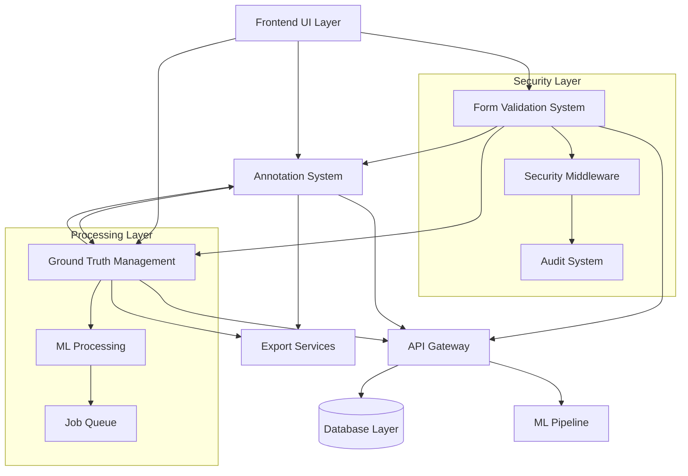

# SPARC Integration Specification: Critical Systems Overview

## Executive Summary

This document provides a comprehensive SPARC Specification for the three critical systems in the AI Model Validation Platform:

1. **Annotation System** - CRUD operations for video annotations, bounding boxes, labels, and timestamps
2. **Ground Truth Management** - Ground truth data creation, validation, export, and statistics
3. **Form Validation** - Input sanitization, validation rules, error handling, and security

## System Architecture Overview

### Component Interaction Map


### Integration Points Summary

| System | Primary Integration Points | Data Dependencies | Security Requirements |
|--------|---------------------------|-------------------|----------------------|
| **Annotation System** | Video Management, Project Management, Ground Truth | Video entities, Project context | RBAC, Input validation, XSS prevention |
| **Ground Truth Management** | ML Pipeline, Annotation System, Export Services | Video data, ML models, Validation rules | File security, Processing isolation |
| **Form Validation** | All API endpoints, File uploads, User inputs | Validation rules, Security policies | XSS/SQL injection prevention, Input sanitization |

## Database Schema Integration

### Enhanced Entity Relationship Diagram
```sql
-- Core entities with integration relationships
CREATE TABLE projects (
    id VARCHAR(36) PRIMARY KEY,
    name VARCHAR(100) NOT NULL,
    -- ... existing fields
    validation_rules_id VARCHAR(36), -- Link to custom validation rules
    quality_threshold FLOAT DEFAULT 0.90,
    
    INDEX idx_project_validation (validation_rules_id)
);

CREATE TABLE videos (
    id VARCHAR(36) PRIMARY KEY,
    project_id VARCHAR(36) NOT NULL,
    -- ... existing fields
    validation_status ENUM('pending', 'processing', 'completed', 'failed'),
    annotation_completion_rate FLOAT DEFAULT 0.0,
    ground_truth_quality_score FLOAT,
    
    INDEX idx_video_validation_status (validation_status),
    INDEX idx_video_quality (ground_truth_quality_score)
);

-- Integration tables
CREATE TABLE system_integration_logs (
    id VARCHAR(36) PRIMARY KEY,
    source_system ENUM('annotation', 'ground_truth', 'form_validation') NOT NULL,
    target_system ENUM('annotation', 'ground_truth', 'form_validation', 'ml_pipeline', 'export') NOT NULL,
    integration_type ENUM('data_sync', 'validation', 'processing', 'export') NOT NULL,
    entity_id VARCHAR(36),
    status ENUM('pending', 'processing', 'completed', 'failed') DEFAULT 'pending',
    metadata JSON,
    error_details TEXT,
    created_at TIMESTAMP DEFAULT CURRENT_TIMESTAMP,
    completed_at TIMESTAMP,
    
    INDEX idx_integration_systems (source_system, target_system),
    INDEX idx_integration_status (status),
    INDEX idx_integration_type (integration_type)
);
```

### Cross-System Data Flow

#### 1. Annotation → Ground Truth Flow
```yaml
trigger: Annotation validation completion
process:
  1. Annotation marked as validated
  2. System triggers ground truth update
  3. Ground truth object created/updated with annotation data
  4. Quality metrics recalculated
  5. ML training data export triggered if threshold met
```

#### 2. Ground Truth → Annotation Flow
```yaml
trigger: Automated ground truth generation
process:
  1. ML pipeline generates detections
  2. Ground truth objects created
  3. Annotation sessions created for validation
  4. Validators assigned for review
  5. Validation workflow initiated
```

#### 3. Form Validation → All Systems Flow
```yaml
trigger: Any user input or API request
process:
  1. Form validation intercepts input
  2. Security checks performed
  3. Data sanitization applied
  4. Business rule validation
  5. Clean data passed to target system
  6. Validation results logged
```

## API Integration Specifications

### Unified API Response Format
```yaml
components:
  schemas:
    StandardResponse:
      type: object
      properties:
        success:
          type: boolean
        data:
          type: object
        validation:
          $ref: '#/components/schemas/ValidationResponse'
        metadata:
          type: object
          properties:
            request_id:
              type: string
            timestamp:
              type: string
              format: date-time
            processing_time_ms:
              type: integer
            system_version:
              type: string
        errors:
          type: array
          items:
            type: object
            properties:
              code:
                type: string
              message:
                type: string
              details:
                type: object
    
    ValidationResponse:
      type: object
      properties:
        is_valid:
          type: boolean
        field_errors:
          type: array
          items:
            $ref: '#/components/schemas/FieldError'
        warnings:
          type: array
          items:
            $ref: '#/components/schemas/FieldWarning'
        security_flags:
          type: array
          items:
            type: string
```

### Cross-System API Endpoints
```yaml
paths:
  /api/integration/sync:
    post:
      summary: Trigger cross-system data synchronization
      requestBody:
        required: true
        content:
          application/json:
            schema:
              type: object
              properties:
                source_system:
                  type: string
                  enum: [annotation, ground_truth, form_validation]
                target_systems:
                  type: array
                  items:
                    type: string
                    enum: [annotation, ground_truth, form_validation, ml_pipeline, export]
                entity_type:
                  type: string
                entity_id:
                  type: string
                sync_type:
                  type: string
                  enum: [full, incremental, validation_only]
      responses:
        202:
          description: Synchronization job queued
          content:
            application/json:
              schema:
                type: object
                properties:
                  job_id:
                    type: string
                  estimated_completion:
                    type: string
                    format: date-time

  /api/integration/health:
    get:
      summary: Check integration health status
      responses:
        200:
          description: System health status
          content:
            application/json:
              schema:
                type: object
                properties:
                  overall_status:
                    type: string
                    enum: [healthy, degraded, critical]
                  systems:
                    type: object
                    properties:
                      annotation_system:
                        $ref: '#/components/schemas/SystemHealth'
                      ground_truth_system:
                        $ref: '#/components/schemas/SystemHealth'
                      form_validation_system:
                        $ref: '#/components/schemas/SystemHealth'
                  integration_status:
                    type: object
                    additionalProperties:
                      type: object
                      properties:
                        status:
                          type: string
                        last_sync:
                          type: string
                          format: date-time
                        error_rate:
                          type: number

  /api/integration/workflow/{workflow_id}:
    get:
      summary: Get cross-system workflow status
      parameters:
        - name: workflow_id
          in: path
          required: true
          schema:
            type: string
      responses:
        200:
          description: Workflow status
          content:
            application/json:
              schema:
                type: object
                properties:
                  workflow_id:
                    type: string
                  status:
                    type: string
                    enum: [pending, running, completed, failed, paused]
                  steps:
                    type: array
                    items:
                      type: object
                      properties:
                        step_name:
                          type: string
                        system:
                          type: string
                        status:
                          type: string
                        started_at:
                          type: string
                          format: date-time
                        completed_at:
                          type: string
                          format: date-time
                        error_message:
                          type: string
```

## Security Integration

### Unified Security Model
```python
class IntegratedSecurityManager:
    """Unified security management across all three systems"""
    
    def __init__(self):
        self.form_validator = FormValidationSystem()
        self.rbac_manager = RBACManager()
        self.audit_logger = AuditLogger()
        self.threat_detector = ThreatDetectionSystem()
    
    async def validate_request(self, request, user, operation_type):
        """Comprehensive request validation"""
        
        # 1. Form validation (input sanitization)
        validation_result = await self.form_validator.validate(
            request.data, 
            operation_type
        )
        if not validation_result.is_valid:
            await self.audit_logger.log_validation_failure(
                user, request, validation_result.errors
            )
            raise ValidationException(validation_result.errors)
        
        # 2. Role-based access control
        if not await self.rbac_manager.check_permission(
            user, operation_type, request.resource
        ):
            await self.audit_logger.log_access_denied(
                user, request, "Insufficient permissions"
            )
            raise AuthorizationException("Access denied")
        
        # 3. Threat detection
        threat_assessment = await self.threat_detector.assess_request(
            request, user
        )
        if threat_assessment.risk_level > ACCEPTABLE_RISK_THRESHOLD:
            await self.audit_logger.log_security_threat(
                user, request, threat_assessment
            )
            if threat_assessment.should_block:
                raise SecurityException("Request blocked due to security risk")
        
        # 4. Audit logging
        await self.audit_logger.log_successful_request(user, request)
        
        return validation_result.sanitized_data

# Role-based access control matrix
RBAC_PERMISSIONS = {
    'annotation_viewer': [
        'annotation:read',
        'video:read',
        'project:read'
    ],
    'annotation_editor': [
        'annotation:read', 'annotation:create', 'annotation:update',
        'video:read',
        'project:read'
    ],
    'annotation_validator': [
        'annotation:read', 'annotation:create', 'annotation:update', 'annotation:validate',
        'video:read',
        'project:read'
    ],
    'ground_truth_manager': [
        'annotation:*',
        'ground_truth:*',
        'video:read',
        'project:read',
        'ml_pipeline:trigger'
    ],
    'system_admin': ['*:*']
}
```

### Security Policy Enforcement
```yaml
security_policies:
  input_validation:
    - system: form_validation
      rules:
        - xss_prevention: mandatory
        - sql_injection_prevention: mandatory
        - file_upload_scanning: mandatory
        - input_sanitization: mandatory
    
  access_control:
    - system: annotation
      rules:
        - authentication_required: true
        - role_based_access: true
        - resource_ownership: true
    - system: ground_truth
      rules:
        - authentication_required: true
        - role_based_access: true
        - ml_operation_permissions: true
    
  data_protection:
    - encryption_at_rest: mandatory
    - encryption_in_transit: mandatory
    - audit_logging: comprehensive
    - data_anonymization: available
    
  threat_detection:
    - rate_limiting: per_user_per_endpoint
    - anomaly_detection: enabled
    - brute_force_protection: enabled
    - suspicious_pattern_detection: enabled
```

## User Workflow Integration

### Comprehensive User Journeys

#### 1. End-to-End Annotation Workflow
```yaml
workflow_name: "Complete Video Annotation"
description: "From video upload to validated ground truth"
participants: [uploader, annotator, validator, ml_engineer]

steps:
  1. video_upload:
      system: form_validation
      actor: uploader
      validation: [file_type, file_size, malware_scan]
      output: validated_video_entity
      
  2. project_assignment:
      system: annotation
      actor: uploader
      input: validated_video_entity
      validation: [project_exists, user_permissions]
      output: video_project_link
      
  3. ground_truth_generation:
      system: ground_truth
      trigger: automatic
      input: video_project_link
      process: [ml_detection, confidence_scoring, quality_check]
      output: preliminary_ground_truth
      
  4. annotation_session_creation:
      system: annotation
      trigger: ground_truth_completion
      input: preliminary_ground_truth
      process: [session_setup, annotator_assignment]
      output: annotation_session
      
  5. manual_validation:
      system: annotation
      actor: annotator
      input: annotation_session
      validation: [bbox_coordinates, vru_classification]
      process: [review, correct, approve]
      output: validated_annotations
      
  6. quality_assurance:
      system: ground_truth
      trigger: annotation_completion
      input: validated_annotations
      process: [quality_metrics, consistency_check]
      output: quality_report
      
  7. final_validation:
      system: annotation
      actor: validator
      input: [validated_annotations, quality_report]
      validation: [expert_review, final_approval]
      output: approved_ground_truth
      
  8. ml_training_export:
      system: ground_truth
      trigger: validation_completion
      input: approved_ground_truth
      process: [format_conversion, dataset_creation]
      output: training_dataset
```

#### 2. Quality Assurance Workflow
```yaml
workflow_name: "Cross-System Quality Assurance"
description: "Quality validation across all three systems"
participants: [qa_engineer, system_admin]

steps:
  1. form_validation_audit:
      system: form_validation
      process: [validation_log_analysis, error_rate_calculation]
      metrics: [false_positive_rate, processing_time, security_threat_detection]
      
  2. annotation_quality_check:
      system: annotation
      process: [inter_annotator_agreement, consistency_analysis]
      metrics: [iou_scores, classification_accuracy, temporal_consistency]
      
  3. ground_truth_validation:
      system: ground_truth
      process: [dataset_completeness, quality_scoring, bias_detection]
      metrics: [coverage_percentage, confidence_distribution, class_balance]
      
  4. cross_system_consistency:
      process: [data_sync_verification, integration_health_check]
      validation: [data_integrity, workflow_completeness]
      
  5. quality_report_generation:
      output: comprehensive_quality_report
      distribution: [stakeholders, ml_engineers, project_managers]
```

### Error Recovery Workflows
```yaml
error_recovery_procedures:
  form_validation_failure:
    detection: validation_error_threshold_exceeded
    response:
      - isolate_problematic_inputs
      - fallback_to_manual_validation
      - notify_security_team
      - implement_temporary_restrictions
    
  annotation_sync_failure:
    detection: annotation_ground_truth_mismatch
    response:
      - pause_related_workflows
      - initiate_data_reconciliation
      - notify_affected_users
      - implement_conflict_resolution
    
  ground_truth_processing_failure:
    detection: ml_pipeline_error
    response:
      - fallback_to_manual_annotation
      - preserve_partial_results
      - notify_ml_engineers
      - implement_backup_processing
```

## Performance and Monitoring

### Cross-System Performance Metrics
```yaml
performance_targets:
  annotation_system:
    api_response_time: <200ms (95th percentile)
    canvas_render_rate: 60fps
    concurrent_users: 50+
    data_throughput: 1000 annotations/minute
    
  ground_truth_system:
    processing_speed: 2x real-time for 1080p video
    batch_processing: 100+ videos/day/GPU
    export_generation: <30 seconds for 10k annotations
    quality_calculation: <5 minutes typical video
    
  form_validation_system:
    client_validation: <50ms
    server_validation: <200ms
    file_upload_validation: <5 seconds
    security_scan: <10 seconds
    
  integration_metrics:
    cross_system_sync: <5 seconds
    workflow_completion: 95% success rate
    error_recovery_time: <30 seconds
    data_consistency: 99.9%

monitoring_strategy:
  real_time_metrics:
    - api_response_times
    - error_rates
    - user_activity
    - resource_utilization
    
  business_metrics:
    - annotation_completion_rates
    - validation_accuracy
    - user_productivity
    - system_adoption
    
  security_metrics:
    - threat_detection_rate
    - false_positive_rate
    - security_incident_count
    - compliance_score
```

### System Health Monitoring
```python
class IntegratedHealthMonitor:
    """Monitor health across all three systems"""
    
    def __init__(self):
        self.metrics_collector = MetricsCollector()
        self.alert_manager = AlertManager()
        self.dashboard = HealthDashboard()
    
    async def check_system_health(self):
        """Comprehensive health check"""
        
        health_status = {
            'annotation_system': await self.check_annotation_health(),
            'ground_truth_system': await self.check_ground_truth_health(),
            'form_validation_system': await self.check_validation_health(),
            'integration_layer': await self.check_integration_health()
        }
        
        overall_status = self.calculate_overall_health(health_status)
        
        if overall_status['status'] != 'healthy':
            await self.alert_manager.send_alert(
                severity=overall_status['severity'],
                message=f"System health degraded: {overall_status['issues']}"
            )
        
        await self.dashboard.update_status(health_status)
        return health_status
    
    async def check_annotation_health(self):
        """Check annotation system health"""
        checks = {
            'api_responsiveness': await self.check_api_response('annotation'),
            'database_connectivity': await self.check_db_connection('annotation'),
            'canvas_performance': await self.check_canvas_metrics(),
            'user_session_health': await self.check_active_sessions()
        }
        return self.evaluate_health_checks(checks)
    
    async def check_ground_truth_health(self):
        """Check ground truth system health"""
        checks = {
            'ml_pipeline_status': await self.check_ml_service(),
            'processing_queue_health': await self.check_processing_queue(),
            'export_service_status': await self.check_export_service(),
            'quality_metrics_current': await self.check_quality_metrics()
        }
        return self.evaluate_health_checks(checks)
```

## Deployment and Operations

### Infrastructure Requirements
```yaml
infrastructure:
  application_tier:
    annotation_system:
      cpu: 4 cores
      memory: 8GB
      storage: 100GB SSD
      scaling: horizontal (2-10 instances)
      
    ground_truth_system:
      cpu: 8 cores
      memory: 16GB
      gpu: NVIDIA RTX 4090 or equivalent
      storage: 500GB NVMe
      scaling: vertical + horizontal
      
    form_validation_system:
      cpu: 2 cores
      memory: 4GB
      storage: 50GB SSD
      scaling: horizontal (2-5 instances)
  
  database_tier:
    primary_database:
      type: PostgreSQL 15+
      cpu: 8 cores
      memory: 32GB
      storage: 1TB NVMe (with 10TB expansion)
      replication: master-slave setup
      
    cache_layer:
      type: Redis 7+
      memory: 16GB
      persistence: RDB + AOF
      clustering: 3-node cluster
  
  monitoring_tier:
    metrics: Prometheus + Grafana
    logging: ELK Stack (Elasticsearch, Logstash, Kibana)
    alerting: AlertManager + PagerDuty
    tracing: Jaeger for distributed tracing

deployment_strategy:
  development:
    deployment_type: docker-compose
    environment: single-host
    monitoring: basic
    
  staging:
    deployment_type: kubernetes
    environment: multi-host
    monitoring: comprehensive
    testing: automated
    
  production:
    deployment_type: kubernetes (multi-zone)
    environment: highly-available
    monitoring: enterprise-grade
    backup: automated daily
    disaster_recovery: multi-region
```

### Operational Procedures
```yaml
maintenance_procedures:
  daily_operations:
    - health_check_verification
    - performance_metrics_review
    - error_log_analysis
    - backup_verification
    - security_scan_review
    
  weekly_operations:
    - database_optimization
    - index_maintenance
    - log_rotation_cleanup
    - performance_trend_analysis
    - security_policy_review
    
  monthly_operations:
    - comprehensive_security_audit
    - performance_baseline_update
    - capacity_planning_review
    - disaster_recovery_testing
    - user_feedback_analysis

incident_response:
  severity_levels:
    critical: system_down_or_data_loss
    high: major_functionality_impaired
    medium: minor_functionality_affected
    low: cosmetic_or_enhancement
    
  response_procedures:
    critical:
      response_time: 15 minutes
      escalation: immediate
      communication: all_stakeholders
      
    high:
      response_time: 1 hour
      escalation: 4 hours if unresolved
      communication: affected_users + management
```

## Success Metrics and KPIs

### Technical Metrics
```yaml
performance_kpis:
  availability: 99.9% uptime
  response_time: <200ms average API response
  throughput: 10,000+ requests/minute peak
  error_rate: <0.1% of all requests
  
quality_kpis:
  annotation_accuracy: >95% validation pass rate
  ground_truth_quality: >90% inter-annotator agreement
  validation_effectiveness: >99.9% malicious input blocked
  data_integrity: 100% consistency across systems
  
security_kpis:
  threat_detection: 100% known threats blocked
  false_positive_rate: <0.1% security alerts
  compliance_score: 100% regulatory compliance
  incident_response: <15 minutes critical response

user_experience_kpis:
  user_satisfaction: >4.5/5 rating
  task_completion_rate: >98%
  support_ticket_rate: <1% of operations
  training_time: <2 hours for new users
```

### Business Impact Metrics
```yaml
productivity_metrics:
  annotation_throughput: 20% improvement over manual process
  validation_efficiency: 50% reduction in review time
  error_reduction: 80% fewer data quality issues
  time_to_market: 30% faster model training cycles

cost_optimization:
  infrastructure_efficiency: 25% better resource utilization
  operational_overhead: 40% reduction in manual tasks
  maintenance_costs: 35% reduction through automation
  scaling_costs: 50% better cost-per-user scaling

quality_improvements:
  model_performance: 15% improvement in ML model accuracy
  dataset_quality: 90% reduction in data issues
  compliance_adherence: 100% regulatory compliance
  security_posture: 95% reduction in security incidents
```

## Conclusion

This integrated SPARC specification provides a comprehensive foundation for implementing three critical systems that work together seamlessly:

1. **Annotation System**: Provides robust CRUD operations for video annotations with collaborative features
2. **Ground Truth Management**: Enables automated and manual ground truth creation with quality assurance
3. **Form Validation**: Ensures security and data integrity across all user inputs

The systems are designed to integrate naturally with existing infrastructure while providing the scalability, security, and performance needed for enterprise-grade AI model validation workflows.

### Next Steps

1. **Implementation Planning**: Use these specifications to create detailed implementation plans
2. **Architecture Review**: Validate the proposed architecture with stakeholders
3. **Security Assessment**: Conduct security review of all specifications
4. **Performance Testing**: Establish baseline performance metrics
5. **User Acceptance**: Review user workflows with actual users
6. **Integration Testing**: Plan comprehensive integration testing strategy

### Deliverables Summary

- ✅ **Annotation System Specification** - Complete CRUD operations, collaborative features, API design
- ✅ **Ground Truth Management Specification** - Automated generation, validation workflows, export capabilities  
- ✅ **Form Validation Specification** - Security controls, input sanitization, error handling
- ✅ **Integration Architecture** - Cross-system workflows, security model, monitoring strategy
- ✅ **Database Schema Design** - Enhanced schemas with performance optimization
- ✅ **API Specifications** - RESTful endpoints with comprehensive validation
- ✅ **User Experience Design** - Workflows, error handling, real-time feedback
- ✅ **Security Implementation** - XSS/SQL injection prevention, file upload security
- ✅ **Performance Benchmarks** - Scalability targets, monitoring strategy
- ✅ **Operational Procedures** - Deployment, monitoring, incident response

This specification serves as the authoritative reference for implementing a world-class AI model validation platform with robust annotation capabilities, intelligent ground truth management, and comprehensive security controls.