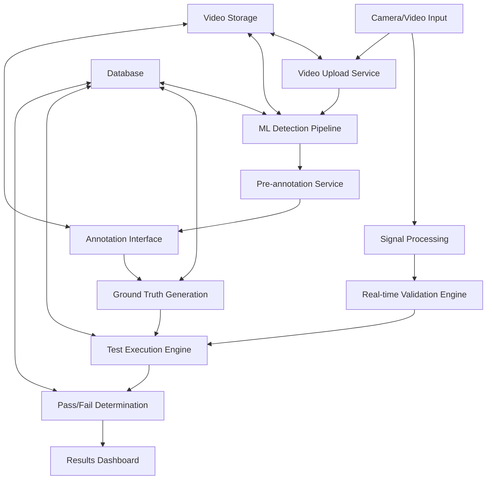

# Overall System Architecture - Video Annotation and Camera Validation Platform

## Executive Summary

This document presents the comprehensive end-to-end system architecture for the video annotation and camera validation platform. The platform enables real-time camera testing, video annotation, AI/ML model validation, and pass/fail determination for automotive and surveillance applications.

## 1. System Overview

### 1.1 Core Components

The platform consists of five major architectural layers:

1. **Data Ingestion Layer** - Camera feeds, video uploads, signal processing
2. **Processing Layer** - AI/ML pipelines, annotation services, validation engines
3. **Storage Layer** - Video storage, metadata, annotations, test results
4. **API Layer** - RESTful APIs, WebSocket services, real-time communication
5. **Presentation Layer** - Web frontend, annotation interfaces, dashboards

### 1.2 Technology Stack

**Backend:**
- FastAPI (Python) - API framework
- SQLAlchemy - ORM and database management
- PostgreSQL - Primary database
- Redis - Caching and session management
- OpenCV - Video processing
- YOLO/Ultralytics - Object detection
- Socket.IO - Real-time communication

**Frontend:**
- React 18 with TypeScript
- Material-UI/Ant Design - Component library
- React Query - Data fetching and caching
- WebSocket integration - Real-time updates
- Video.js - Video playback and annotation

**Infrastructure:**
- Docker - Containerization
- nginx - Load balancing and static file serving
- MinIO/S3 - Object storage for videos
- Prometheus/Grafana - Monitoring

## 2. System Topology

### 2.1 High-Level Architecture

```
┌─────────────────────────────────────────────────────────────────┐
│                        FRONTEND LAYER                          │
├─────────────────────┬───────────────────┬─────────────────────┤
│   Video Annotation  │    Project Mgmt   │   Real-time Testing │
│      Interface      │     Dashboard     │      Dashboard      │
└─────────────────────┴───────────────────┴─────────────────────┘
                              │
                    ┌─────────┴─────────┐
                    │   API GATEWAY     │
                    │  (Load Balancer)  │
                    └─────────┬─────────┘
                              │
┌─────────────────────────────┴─────────────────────────────────┐
│                     API SERVICE LAYER                        │
├──────────────┬──────────────┬──────────────┬─────────────────┤
│   Video API  │ Project API  │ Testing API  │ Annotation API  │
└──────────────┴──────────────┴──────────────┴─────────────────┘
                              │
┌─────────────────────────────┴─────────────────────────────────┐
│                  BUSINESS LOGIC LAYER                        │
├────────────┬────────────┬────────────┬─────────────┬─────────┤
│ Video Proc │ ML/AI Svc  │ Signal Svc │ Validation  │ Workflow│
│  Service   │           │            │   Engine    │ Manager │
└────────────┴────────────┴────────────┴─────────────┴─────────┘
                              │
┌─────────────────────────────┴─────────────────────────────────┐
│                     DATA STORAGE LAYER                       │
├───────────────┬─────────────┬───────────────┬───────────────┤
│ PostgreSQL DB │ Video Store │  Redis Cache  │ File Storage  │
│  (Metadata)   │ (MinIO/S3)  │  (Sessions)   │   (Logs)      │
└───────────────┴─────────────┴───────────────┴───────────────┘
                              │
┌─────────────────────────────┴─────────────────────────────────┐
│                  EXTERNAL INTEGRATIONS                       │
├─────────────┬─────────────┬─────────────┬─────────────────────┤
│   Camera    │ Signal      │ Label Studio│    Monitoring      │
│  Hardware   │ Processors  │ Integration │   & Alerting       │
└─────────────┴─────────────┴─────────────┴─────────────────────┘
```

### 2.2 Data Flow Architecture



## 3. Component Architecture

### 3.1 Core Services

#### 3.1.1 Video Management Service
**Responsibility:** Video upload, storage, metadata extraction, streaming
**Key Features:**
- Chunked upload with progress tracking
- Video transcoding and optimization
- Thumbnail and keyframe extraction
- CDN integration for streaming
- Video quality assessment

#### 3.1.2 Detection Pipeline Service
**Responsibility:** AI/ML object detection, pre-annotation generation
**Key Features:**
- Multiple model support (YOLO, Detectron2, etc.)
- Batch and real-time processing
- Confidence scoring and filtering
- Model version management
- Performance optimization

#### 3.1.3 Annotation Service
**Responsibility:** Manual annotation, review workflows, ground truth management
**Key Features:**
- Frame-by-frame annotation
- Temporal annotation support
- Multi-annotator collaboration
- Quality control and validation
- Label Studio integration

#### 3.1.4 Signal Processing Service
**Responsibility:** Camera signal ingestion, real-time processing
**Key Features:**
- Multi-protocol support (CAN, GPIO, Network, Serial)
- High-precision timestamping
- Signal filtering and noise reduction
- Event correlation
- Real-time streaming

#### 3.1.5 Validation Engine
**Responsibility:** Pass/fail determination, test execution
**Key Features:**
- Configurable validation rules
- Real-time test execution
- Statistical analysis
- Performance metrics calculation
- Evidence collection

### 3.2 Data Models

#### 3.2.1 Core Entities
- **Project** - Test project with configuration and metadata
- **Video** - Video files with processing status and metadata
- **TestSession** - Individual test execution instances
- **Annotation** - Ground truth annotations with temporal data
- **DetectionEvent** - AI detection results with confidence scores
- **ValidationResult** - Pass/fail results with evidence

#### 3.2.2 Signal Processing Entities
- **CameraSignal** - Raw signal data from hardware
- **ValidationRule** - Configurable pass/fail criteria
- **TestScenario** - Predefined test scenarios
- **TestExecution** - Scenario execution results

## 4. Integration Patterns

### 4.1 API Design Patterns

#### 4.1.1 RESTful API Structure
```
/api/v1/
├── projects/                 # Project management
│   ├── {id}/videos/         # Project videos
│   ├── {id}/test-sessions/  # Test execution
│   └── {id}/validation-rules/ # Pass/fail criteria
├── videos/                  # Video management
│   ├── upload/              # Video upload
│   ├── {id}/annotations/    # Video annotations
│   └── {id}/detections/     # Detection results
├── test-sessions/           # Test execution
│   ├── {id}/status/         # Real-time status
│   ├── {id}/results/        # Test results
│   └── {id}/signals/        # Signal data
└── dashboard/               # Analytics and reporting
    ├── stats/               # Dashboard statistics
    └── metrics/             # Performance metrics
```

#### 4.1.2 WebSocket Integration
- Real-time test progress updates
- Live video annotation collaboration
- Signal monitoring and alerts
- Performance metrics streaming

### 4.2 Database Integration

#### 4.2.1 Performance Optimizations
- Composite indexes for temporal queries
- Partitioning for large video datasets
- Read replicas for analytics
- Connection pooling and query optimization

#### 4.2.2 Data Consistency
- ACID transactions for critical operations
- Event sourcing for audit trails
- Eventual consistency for analytics
- Backup and disaster recovery

## 5. Scalability and Performance

### 5.1 Horizontal Scaling

#### 5.1.1 Service Decomposition
- Microservices architecture with clear boundaries
- Independent scaling based on load patterns
- Load balancing with health checks
- Circuit breaker patterns for resilience

#### 5.1.2 Data Scaling
- Database sharding strategies
- CDN for video content delivery
- Caching layers for frequently accessed data
- Message queues for async processing

### 5.2 Performance Optimization

#### 5.2.1 Video Processing
- Parallel processing pipelines
- GPU acceleration for ML models
- Optimized video codecs and streaming
- Progressive loading and buffering

#### 5.2.2 Real-time Processing
- WebSocket connection pooling
- Event-driven architecture
- Low-latency signal processing
- Optimized database queries

## 6. Security Architecture

### 6.1 Authentication and Authorization
- JWT-based authentication
- Role-based access control (RBAC)
- Project-level permissions
- API rate limiting and throttling

### 6.2 Data Protection
- Encrypted video storage
- Secure video streaming with tokens
- GDPR-compliant data handling
- Audit logging for compliance

## 7. Monitoring and Observability

### 7.1 Application Monitoring
- Performance metrics collection
- Error tracking and alerting
- User activity monitoring
- System health dashboards

### 7.2 Business Metrics
- Test execution statistics
- Annotation quality metrics
- Model performance tracking
- User engagement analytics

## 8. Deployment Architecture

### 8.1 Container Strategy
- Docker containerization for all services
- Kubernetes orchestration
- Multi-environment deployment (dev/staging/prod)
- Infrastructure as Code (IaC)

### 8.2 CI/CD Pipeline
- Automated testing and quality gates
- Progressive deployment strategies
- Rollback capabilities
- Performance regression testing

## 9. Future Extensibility

### 9.1 Plugin Architecture
- Extensible ML model integration
- Custom annotation tools
- Third-party integrations
- Workflow customization

### 9.2 API Evolution
- Versioned APIs with backwards compatibility
- GraphQL integration for flexible queries
- Event-driven architecture for loose coupling
- Standardized data formats

## Conclusion

This architecture provides a robust, scalable foundation for video annotation and camera validation. The modular design enables independent development and deployment while maintaining system coherence through well-defined interfaces and data contracts. The architecture supports both current requirements and future extensibility needs.