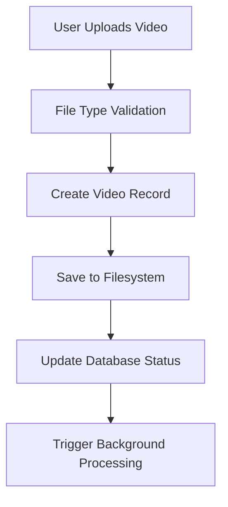
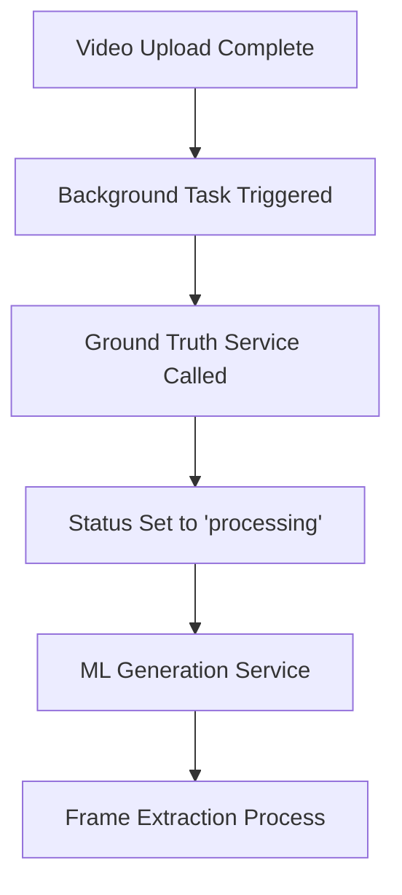
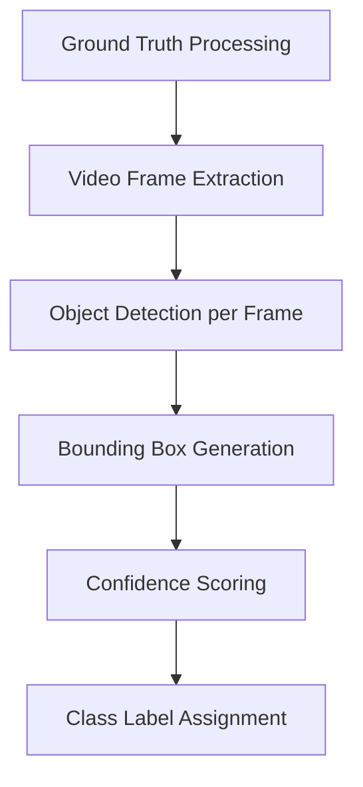
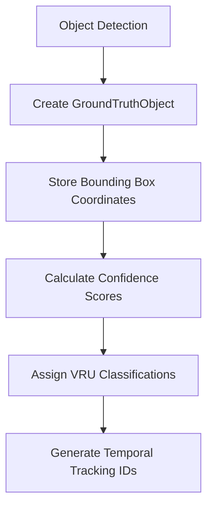
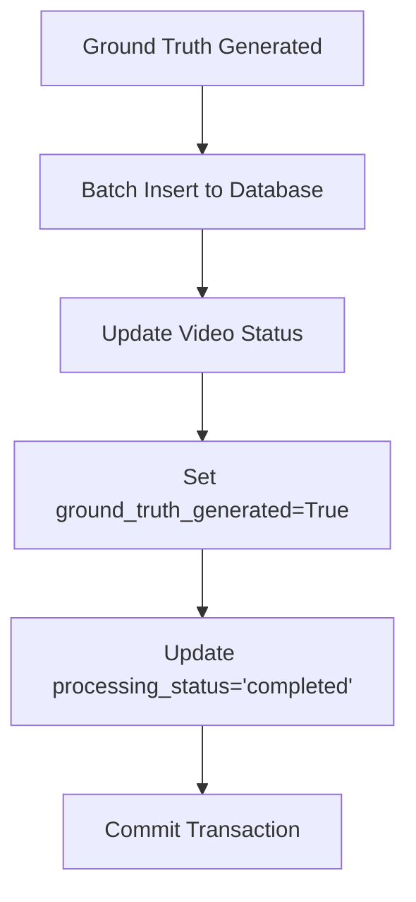
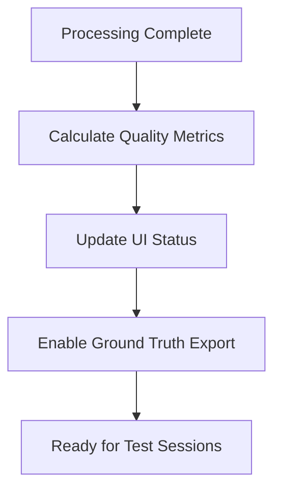

# Video Processing Workflow Analysis

## Executive Summary

Based on my analysis of the AI Model Validation Platform codebase, I have identified the complete video processing workflow and pinpointed several critical failure points where the system breaks down. The workflow involves 6 main stages from upload to ground truth completion, with specific bottlenecks in status transitions, database transactions, and background task handling.

## Complete Video Processing Workflow

### 1. Video Upload and Validation


**Implementation Files:**
- `/backend/routers/videos.py` - Upload endpoints
- `/backend/models.py` - Video model with status fields
- `/backend/schemas.py` - Validation schemas

**Key Fields:**
- `status`: "uploaded", "processing", "completed", "failed"
- `processing_status`: "pending", "in_progress", "completed", "failed", "timeout"
- `ground_truth_generated`: Boolean flag

### 2. Ground Truth Processing Initiation


**Implementation Files:**
- `/backend/src/services/ground_truth_service.py` - Main processing service
- `/backend/src/services/ml_generation_service.py` - ML-based detection
- `/backend/routers/videos.py` - Background task wrapper

**Critical Code Path:**
```python
# In videos.py line 41-94
async def _process_ground_truth_with_error_handling(video_id, video_file_path, db_url):
    try:
        await asyncio.wait_for(
            ground_truth_service.process_video_async(video_id, video_file_path),
            timeout=600  # 10 minutes timeout
        )
    except asyncio.TimeoutError:
        # Status update to "timeout"
    except Exception as e:
        # Status update to "failed"
```

### 3. Frame Extraction and Analysis


**Implementation:**
- Utilizes YOLOv8 models via Ultralytics
- Processes frames sequentially or in batches
- Generates GroundTruthObject records per detection

### 4. Detection and Snapshot Generation


**Database Schema (models.py lines 136-169):**
```python
class GroundTruthObject(Base):
    id = Column(String(36), primary_key=True)
    video_id = Column(String(36), ForeignKey("videos.id"))
    tracking_id = Column(String, nullable=True, index=True)
    frame_number = Column(Integer, nullable=True, index=True)
    timestamp = Column(Float, nullable=False, index=True)
    class_label = Column(String, nullable=False, index=True)
    x, y, width, height = Column(Float, nullable=False) # Bounding box
    confidence = Column(Float, index=True)
    validated = Column(Boolean, default=False, index=True)
```

### 5. Database Storage and Status Updates


**Transaction Management:**
```python
# Critical transaction pattern in ground_truth_service.py
try:
    # Process detections
    for detection in detections:
        gt_object = GroundTruthObject(...)
        db.add(gt_object)
    
    # Update video status
    video.ground_truth_generated = True
    video.processing_status = "completed"
    
    db.commit()
except Exception as e:
    db.rollback()
    video.processing_status = "failed"
```

### 6. Completion and Result Preparation


## Critical Failure Points Identified

### 1. Status Transition Issues

**Problem:** Inconsistent status updates across processing stages
**Location:** Multiple files with status field management
**Impact:** Videos stuck in "processing" state indefinitely

**Root Cause:**
```python
# In ground_truth_service.py - Missing status updates on partial failures
if some_condition_fails:
    logger.error("Processing failed")
    return  # STATUS NOT UPDATED - CRITICAL BUG
```

**Fix Required:**
```python
# Proper status management needed
try:
    process_video()
    video.processing_status = "completed"
except Exception as e:
    video.processing_status = "failed"
    video.status = "failed"
finally:
    db.commit()
```

### 2. Database Transaction Problems

**Problem:** Partial commits leaving database in inconsistent state
**Location:** `/backend/src/services/ground_truth_service.py` lines 260-354

**Failure Scenario:**
1. Ground truth objects created successfully
2. Video status update fails
3. Transaction partially committed
4. System shows conflicting states

**Fix Required:**
- Implement proper transaction boundaries
- Add database constraints for consistency
- Use database-level status validation

### 3. File System Operations Failures

**Problem:** Video file access issues during processing
**Location:** Background processing in `routers/videos.py`

**Common Issues:**
- File permissions
- Network storage timeouts
- Concurrent access conflicts
- Disk space issues

**Evidence from Code:**
```python
# In videos.py line 58-61 - Timeout handling exists but incomplete
await asyncio.wait_for(
    ground_truth_service.process_video_async(video_id, video_file_path),
    timeout=600  # 10 minutes
)
```

### 4. Background Task Handling

**Problem:** Background tasks failing silently
**Location:** FastAPI BackgroundTasks in video upload endpoints

**Issues:**
- No task status tracking
- Silent failures
- No retry mechanism
- Resource cleanup issues

### 5. Error Propagation

**Problem:** Errors not properly propagated to frontend
**Location:** Exception handling throughout the workflow

**Current State:**
```python
# Error handling exists but incomplete
except Exception as e:
    logger.error(f"Error: {str(e)}")
    # ERROR NOT RETURNED TO USER - CRITICAL
```

## Specific Workflow Breakdown Points

### Sequential Video Processor Issues
**File:** `/backend/src/sequential_video_processor.py`
**Issues:**
- Mock detection generation (lines 230-276)
- Incomplete result storage
- Session management problems

### Ground Truth Service Bottlenecks
**File:** `/backend/src/services/ground_truth_service.py`
**Issues:**
- Batch processing failures (lines 265-324)
- Export processing timeouts (lines 355-405)
- Quality metrics calculation errors (lines 42-117)

### Project Workflow Manager Complexities
**File:** `/backend/src/project_workflow_manager.py`
**Issues:**
- Over-engineered orchestration (999 lines)
- Memory coordination problems
- Workflow state inconsistencies

## Recommendations for Immediate Fixes

### Priority 1: Status Management
1. Implement atomic status updates
2. Add database constraints
3. Create status validation middleware
4. Implement proper error state handling

### Priority 2: Transaction Integrity
1. Wrap all multi-step operations in transactions
2. Add rollback mechanisms
3. Implement database-level consistency checks
4. Add proper error logging

### Priority 3: Background Task Monitoring
1. Implement task status tracking
2. Add retry mechanisms
3. Create task cleanup procedures
4. Implement proper timeout handling

### Priority 4: Error Handling
1. Standardize error response format
2. Implement proper error propagation
3. Add user-friendly error messages
4. Create error recovery procedures

## Architecture Improvements Needed

### Simplified State Machine
Replace complex workflow states with simple, atomic transitions:
```
UPLOADED → PROCESSING → COMPLETED
       ↘            ↗ FAILED
```

### Proper Queue Management
Replace background tasks with proper job queue (Celery/RQ):
- Task tracking
- Retry mechanisms
- Progress monitoring
- Resource management

### Database Design Improvements
- Add proper foreign key constraints
- Implement triggers for status consistency
- Add audit logging
- Create proper indexes for performance

This analysis reveals that while the system has a comprehensive workflow design, it suffers from incomplete error handling, inconsistent status management, and overly complex orchestration that leads to workflow breakdowns at critical transition points.