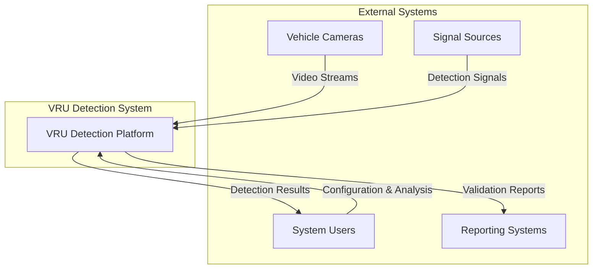

# VRU Detection System - System Overview (C4 Level 1)

## Executive Summary

The VRU (Vulnerable Road User) Detection System is a comprehensive platform for validating computer vision models used in automotive safety systems. The system processes video streams from vehicle cameras, detects VRUs (pedestrians, cyclists, motorcyclists), and validates detection accuracy against ground truth data with precise timing requirements.

## System Context

## Key Stakeholders

| Role | Responsibilities | Interaction Points |
|------|-----------------|-------------------|
| **System Engineers** | Configure camera setups, define test scenarios | Web UI, Project Management |
| **Test Engineers** | Upload videos, run validation tests | Video Library, Test Execution |
| **Data Scientists** | Analyze detection performance, tune models | Results Dashboard, Analytics |
| **Quality Assurance** | Verify system accuracy, generate reports | Validation Reports, Audit Logs |

## System Capabilities

### Core Functions
1. **Video Library Management** - Centralized storage with metadata
2. **Real-time VRU Detection** - ML inference pipeline
3. **Signal Processing** - GPIO/Network/Serial signal handling
4. **Timing Validation** - Precision latency measurement
5. **Performance Analytics** - Comprehensive reporting

### Quality Attributes
- **Accuracy**: <100ms timing precision for safety-critical applications
- **Scalability**: Support 1000+ concurrent video streams
- **Reliability**: 99.9% uptime for continuous monitoring
- **Security**: Role-based access, audit trails
- **Maintainability**: Modular architecture, automated testing

## Business Context

### Regulatory Requirements
- **ISO 26262** (Automotive Safety Integrity)
- **NCAP** (New Car Assessment Programme) compliance
- **GDPR** compliance for data handling

### Success Metrics
- Detection accuracy > 95% for all VRU classes
- System latency < 50ms for real-time processing
- False positive rate < 2%
- Test execution time reduction by 60%

## Technology Stack Overview

| Layer | Technologies |
|-------|-------------|
| **Frontend** | React 18, TypeScript, Material-UI |
| **Backend** | FastAPI, Python 3.9+, SQLAlchemy |
| **Database** | PostgreSQL (production), SQLite (development) |
| **ML/CV** | YOLOv8, OpenCV, PyTorch |
| **Infrastructure** | Docker, Kubernetes, AWS/Azure |
| **Monitoring** | Prometheus, Grafana, ELK Stack |

## System Constraints

### Technical Constraints
- Real-time processing requires GPU acceleration
- Video storage limited to 30 days retention
- Signal timing accuracy ±10ms tolerance

### Business Constraints
- Budget allocation for cloud infrastructure
- Compliance with automotive industry standards
- Data sovereignty requirements per region

## Risk Assessment

| Risk | Impact | Mitigation |
|------|--------|------------|
| **Model Drift** | High | Continuous monitoring, automated retraining |
| **Data Privacy** | High | Encryption, access controls, audit logging |
| **System Downtime** | Medium | High availability setup, backup systems |
| **Performance Degradation** | Medium | Auto-scaling, resource monitoring |

## Next Steps

1. **Container Architecture** - Define service boundaries and interactions
2. **Component Design** - Detail internal system components
3. **Database Schema** - Optimize for performance and scalability
4. **Deployment Strategy** - Infrastructure and CI/CD pipeline