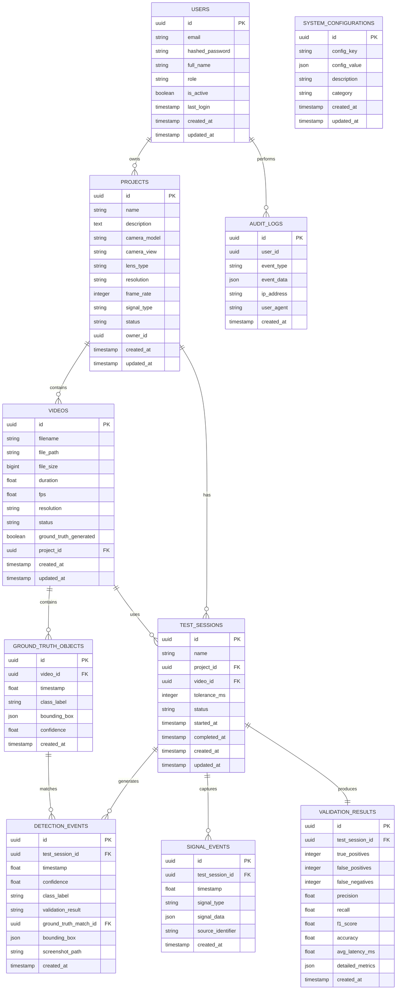

# VRU Detection System - Database Schema Design

## Schema Overview

The database design follows a normalized approach optimized for performance-critical queries while maintaining data integrity and audit capabilities.



## Core Tables

### Projects Table
```sql
CREATE TABLE projects (
    id UUID PRIMARY KEY DEFAULT gen_random_uuid(),
    name VARCHAR(255) NOT NULL,
    description TEXT,
    camera_model VARCHAR(100) NOT NULL,
    camera_view VARCHAR(50) NOT NULL CHECK (camera_view IN ('Front-facing VRU', 'Rear-facing VRU', 'In-Cab Driver Behavior')),
    lens_type VARCHAR(50),
    resolution VARCHAR(20),
    frame_rate INTEGER,
    signal_type VARCHAR(20) NOT NULL CHECK (signal_type IN ('GPIO', 'Network Packet', 'Serial', 'CAN Bus')),
    status VARCHAR(20) DEFAULT 'Active' CHECK (status IN ('Active', 'Completed', 'Draft', 'Archived')),
    owner_id UUID REFERENCES users(id),
    created_at TIMESTAMP WITH TIME ZONE DEFAULT NOW(),
    updated_at TIMESTAMP WITH TIME ZONE DEFAULT NOW()
);

-- Indexes for performance
CREATE INDEX idx_projects_name ON projects(name);
CREATE INDEX idx_projects_status ON projects(status);
CREATE INDEX idx_projects_owner ON projects(owner_id);
CREATE INDEX idx_projects_created ON projects(created_at);
CREATE INDEX idx_projects_camera_view ON projects(camera_view);
```

### Videos Table
```sql
CREATE TABLE videos (
    id UUID PRIMARY KEY DEFAULT gen_random_uuid(),
    filename VARCHAR(255) NOT NULL,
    file_path VARCHAR(512) NOT NULL,
    file_size BIGINT,
    duration REAL, -- seconds
    fps REAL,
    resolution VARCHAR(20),
    status VARCHAR(20) DEFAULT 'uploaded' CHECK (status IN ('uploaded', 'processing', 'processed', 'failed', 'archived')),
    ground_truth_generated BOOLEAN DEFAULT FALSE,
    project_id UUID NOT NULL REFERENCES projects(id) ON DELETE CASCADE,
    created_at TIMESTAMP WITH TIME ZONE DEFAULT NOW(),
    updated_at TIMESTAMP WITH TIME ZONE DEFAULT NOW()
);

-- Indexes for performance
CREATE INDEX idx_videos_filename ON videos(filename);
CREATE INDEX idx_videos_status ON videos(status);
CREATE INDEX idx_videos_ground_truth ON videos(ground_truth_generated);
CREATE INDEX idx_videos_project ON videos(project_id);
CREATE INDEX idx_videos_created ON videos(created_at);

-- Composite indexes for common queries
CREATE INDEX idx_videos_project_status ON videos(project_id, status);
CREATE INDEX idx_videos_project_created ON videos(project_id, created_at);
```

### Ground Truth Objects Table
```sql
CREATE TABLE ground_truth_objects (
    id UUID PRIMARY KEY DEFAULT gen_random_uuid(),
    video_id UUID NOT NULL REFERENCES videos(id) ON DELETE CASCADE,
    timestamp REAL NOT NULL, -- seconds from video start
    class_label VARCHAR(50) NOT NULL CHECK (class_label IN ('pedestrian', 'cyclist', 'motorcyclist', 'wheelchair_user', 'scooter_rider', 'child_with_stroller')),
    bounding_box JSONB NOT NULL, -- {"x": 0, "y": 0, "width": 100, "height": 100}
    confidence REAL CHECK (confidence >= 0.0 AND confidence <= 1.0),
    created_at TIMESTAMP WITH TIME ZONE DEFAULT NOW()
);

-- Indexes for temporal and spatial queries
CREATE INDEX idx_gt_video ON ground_truth_objects(video_id);
CREATE INDEX idx_gt_timestamp ON ground_truth_objects(timestamp);
CREATE INDEX idx_gt_class ON ground_truth_objects(class_label);
CREATE INDEX idx_gt_confidence ON ground_truth_objects(confidence);

-- Composite indexes for performance-critical queries
CREATE INDEX idx_gt_video_timestamp ON ground_truth_objects(video_id, timestamp);
CREATE INDEX idx_gt_video_class ON ground_truth_objects(video_id, class_label);

-- GIN index for bounding box JSON queries
CREATE INDEX idx_gt_bounding_box ON ground_truth_objects USING gin (bounding_box);
```

### Test Sessions Table
```sql
CREATE TABLE test_sessions (
    id UUID PRIMARY KEY DEFAULT gen_random_uuid(),
    name VARCHAR(255) NOT NULL,
    project_id UUID NOT NULL REFERENCES projects(id) ON DELETE CASCADE,
    video_id UUID NOT NULL REFERENCES videos(id) ON DELETE CASCADE,
    tolerance_ms INTEGER DEFAULT 100 CHECK (tolerance_ms > 0),
    status VARCHAR(20) DEFAULT 'created' CHECK (status IN ('created', 'running', 'completed', 'failed', 'cancelled')),
    started_at TIMESTAMP WITH TIME ZONE,
    completed_at TIMESTAMP WITH TIME ZONE,
    created_at TIMESTAMP WITH TIME ZONE DEFAULT NOW(),
    updated_at TIMESTAMP WITH TIME ZONE DEFAULT NOW()
);

-- Indexes for session management
CREATE INDEX idx_sessions_name ON test_sessions(name);
CREATE INDEX idx_sessions_project ON test_sessions(project_id);
CREATE INDEX idx_sessions_video ON test_sessions(video_id);
CREATE INDEX idx_sessions_status ON test_sessions(status);
CREATE INDEX idx_sessions_started ON test_sessions(started_at);

-- Composite indexes
CREATE INDEX idx_sessions_project_status ON test_sessions(project_id, status);
CREATE INDEX idx_sessions_project_created ON test_sessions(project_id, created_at);
```

### Detection Events Table
```sql
CREATE TABLE detection_events (
    id UUID PRIMARY KEY DEFAULT gen_random_uuid(),
    test_session_id UUID NOT NULL REFERENCES test_sessions(id) ON DELETE CASCADE,
    timestamp REAL NOT NULL, -- seconds from video start
    confidence REAL CHECK (confidence >= 0.0 AND confidence <= 1.0),
    class_label VARCHAR(50) NOT NULL,
    validation_result VARCHAR(10) CHECK (validation_result IN ('TP', 'FP', 'FN', 'TN')),
    ground_truth_match_id UUID REFERENCES ground_truth_objects(id) ON DELETE SET NULL,
    bounding_box JSONB,
    screenshot_path VARCHAR(512),
    created_at TIMESTAMP WITH TIME ZONE DEFAULT NOW()
);

-- Indexes for detection analysis
CREATE INDEX idx_detection_session ON detection_events(test_session_id);
CREATE INDEX idx_detection_timestamp ON detection_events(timestamp);
CREATE INDEX idx_detection_confidence ON detection_events(confidence);
CREATE INDEX idx_detection_class ON detection_events(class_label);
CREATE INDEX idx_detection_validation ON detection_events(validation_result);
CREATE INDEX idx_detection_gt_match ON detection_events(ground_truth_match_id);

-- Composite indexes for performance-critical queries
CREATE INDEX idx_detection_session_timestamp ON detection_events(test_session_id, timestamp);
CREATE INDEX idx_detection_session_validation ON detection_events(test_session_id, validation_result);
CREATE INDEX idx_detection_timestamp_confidence ON detection_events(timestamp, confidence);

-- GIN index for bounding box queries
CREATE INDEX idx_detection_bounding_box ON detection_events USING gin (bounding_box);
```

## Advanced Tables

### Signal Events Table
```sql
CREATE TABLE signal_events (
    id UUID PRIMARY KEY DEFAULT gen_random_uuid(),
    test_session_id UUID NOT NULL REFERENCES test_sessions(id) ON DELETE CASCADE,
    timestamp REAL NOT NULL, -- high-precision timestamp
    signal_type VARCHAR(20) NOT NULL CHECK (signal_type IN ('GPIO', 'Network Packet', 'Serial', 'CAN Bus')),
    signal_data JSONB NOT NULL, -- signal-specific data structure
    source_identifier VARCHAR(100), -- GPIO pin, IP address, serial port, etc.
    created_at TIMESTAMP WITH TIME ZONE DEFAULT NOW()
);

-- Indexes for signal correlation
CREATE INDEX idx_signal_session ON signal_events(test_session_id);
CREATE INDEX idx_signal_timestamp ON signal_events(timestamp);
CREATE INDEX idx_signal_type ON signal_events(signal_type);
CREATE INDEX idx_signal_source ON signal_events(source_identifier);

-- Composite index for temporal correlation
CREATE INDEX idx_signal_session_timestamp ON signal_events(test_session_id, timestamp);

-- GIN index for signal data queries
CREATE INDEX idx_signal_data ON signal_events USING gin (signal_data);
```

### Validation Results Table
```sql
CREATE TABLE validation_results (
    id UUID PRIMARY KEY DEFAULT gen_random_uuid(),
    test_session_id UUID NOT NULL REFERENCES test_sessions(id) ON DELETE CASCADE,
    true_positives INTEGER DEFAULT 0,
    false_positives INTEGER DEFAULT 0,
    false_negatives INTEGER DEFAULT 0,
    precision REAL CHECK (precision >= 0.0 AND precision <= 1.0),
    recall REAL CHECK (recall >= 0.0 AND recall <= 1.0),
    f1_score REAL CHECK (f1_score >= 0.0 AND f1_score <= 1.0),
    accuracy REAL CHECK (accuracy >= 0.0 AND accuracy <= 1.0),
    avg_latency_ms REAL,
    detailed_metrics JSONB, -- Additional metrics and analysis
    created_at TIMESTAMP WITH TIME ZONE DEFAULT NOW()
);

-- Indexes for results analysis
CREATE INDEX idx_results_session ON validation_results(test_session_id);
CREATE INDEX idx_results_precision ON validation_results(precision);
CREATE INDEX idx_results_recall ON validation_results(recall);
CREATE INDEX idx_results_f1 ON validation_results(f1_score);
CREATE INDEX idx_results_latency ON validation_results(avg_latency_ms);

-- GIN index for detailed metrics
CREATE INDEX idx_results_detailed ON validation_results USING gin (detailed_metrics);
```

### Users and Security Tables
```sql
CREATE TABLE users (
    id UUID PRIMARY KEY DEFAULT gen_random_uuid(),
    email VARCHAR(255) UNIQUE NOT NULL,
    hashed_password VARCHAR(255) NOT NULL,
    full_name VARCHAR(255) NOT NULL,
    role VARCHAR(50) DEFAULT 'user' CHECK (role IN ('admin', 'engineer', 'analyst', 'user')),
    is_active BOOLEAN DEFAULT TRUE,
    last_login TIMESTAMP WITH TIME ZONE,
    created_at TIMESTAMP WITH TIME ZONE DEFAULT NOW(),
    updated_at TIMESTAMP WITH TIME ZONE DEFAULT NOW()
);

CREATE INDEX idx_users_email ON users(email);
CREATE INDEX idx_users_role ON users(role);
CREATE INDEX idx_users_active ON users(is_active);

CREATE TABLE audit_logs (
    id UUID PRIMARY KEY DEFAULT gen_random_uuid(),
    user_id UUID REFERENCES users(id),
    event_type VARCHAR(50) NOT NULL,
    event_data JSONB,
    ip_address INET,
    user_agent TEXT,
    created_at TIMESTAMP WITH TIME ZONE DEFAULT NOW()
);

-- Indexes for audit analysis
CREATE INDEX idx_audit_user ON audit_logs(user_id);
CREATE INDEX idx_audit_event ON audit_logs(event_type);
CREATE INDEX idx_audit_created ON audit_logs(created_at);
CREATE INDEX idx_audit_ip ON audit_logs(ip_address);

-- Composite indexes for security queries
CREATE INDEX idx_audit_user_event ON audit_logs(user_id, event_type);
CREATE INDEX idx_audit_created_event ON audit_logs(created_at, event_type);

-- GIN index for event data
CREATE INDEX idx_audit_event_data ON audit_logs USING gin (event_data);
```

## Performance Optimization

### Partitioning Strategy
```sql
-- Partition detection_events by test_session_id for large datasets
CREATE TABLE detection_events_partitioned (
    LIKE detection_events INCLUDING ALL
) PARTITION BY HASH (test_session_id);

-- Create partitions
CREATE TABLE detection_events_p0 PARTITION OF detection_events_partitioned FOR VALUES WITH (modulus 4, remainder 0);
CREATE TABLE detection_events_p1 PARTITION OF detection_events_partitioned FOR VALUES WITH (modulus 4, remainder 1);
CREATE TABLE detection_events_p2 PARTITION OF detection_events_partitioned FOR VALUES WITH (modulus 4, remainder 2);
CREATE TABLE detection_events_p3 PARTITION OF detection_events_partitioned FOR VALUES WITH (modulus 4, remainder 3);
```

### Materialized Views for Analytics
```sql
-- Pre-computed project statistics
CREATE MATERIALIZED VIEW project_statistics AS
SELECT 
    p.id as project_id,
    p.name,
    COUNT(v.id) as total_videos,
    COUNT(ts.id) as total_test_sessions,
    AVG(vr.precision) as avg_precision,
    AVG(vr.recall) as avg_recall,
    AVG(vr.f1_score) as avg_f1_score,
    AVG(vr.avg_latency_ms) as avg_latency
FROM projects p
LEFT JOIN videos v ON p.id = v.project_id
LEFT JOIN test_sessions ts ON p.id = ts.project_id
LEFT JOIN validation_results vr ON ts.id = vr.test_session_id
GROUP BY p.id, p.name;

-- Refresh index for real-time updates
CREATE UNIQUE INDEX idx_project_stats_id ON project_statistics(project_id);

-- Daily performance summary
CREATE MATERIALIZED VIEW daily_performance_summary AS
SELECT 
    DATE(ts.created_at) as date,
    COUNT(ts.id) as sessions_run,
    AVG(vr.precision) as avg_precision,
    AVG(vr.recall) as avg_recall,
    AVG(vr.f1_score) as avg_f1_score,
    SUM(de.confidence) / COUNT(de.id) as avg_confidence
FROM test_sessions ts
JOIN validation_results vr ON ts.id = vr.test_session_id
JOIN detection_events de ON ts.id = de.test_session_id
WHERE ts.status = 'completed'
GROUP BY DATE(ts.created_at)
ORDER BY date DESC;
```

### Connection Pooling Configuration
```python
# Database configuration for high-performance applications
DATABASE_CONFIG = {
    "pool_size": 20,           # Number of persistent connections
    "max_overflow": 30,        # Additional connections under load
    "pool_recycle": 3600,      # Recycle connections every hour
    "pool_pre_ping": True,     # Verify connections before use
    "pool_timeout": 30,        # Timeout for getting connection
    "echo": False,             # Disable SQL logging in production
    "connect_args": {
        "connect_timeout": 10,
        "command_timeout": 30,
        "server_settings": {
            "application_name": "VRU_Detection_System",
            "jit": "off"       # Disable JIT for consistent performance
        }
    }
}
```

## Data Archival Strategy

### Archive Tables
```sql
-- Archive old detection events after 90 days
CREATE TABLE detection_events_archive (
    LIKE detection_events INCLUDING ALL,
    archived_at TIMESTAMP WITH TIME ZONE DEFAULT NOW()
);

-- Automatic archival function
CREATE OR REPLACE FUNCTION archive_old_detection_events()
RETURNS void AS $$
BEGIN
    -- Move detection events older than 90 days to archive
    INSERT INTO detection_events_archive 
    SELECT *, NOW() FROM detection_events 
    WHERE created_at < NOW() - INTERVAL '90 days';
    
    -- Delete archived events from main table
    DELETE FROM detection_events 
    WHERE created_at < NOW() - INTERVAL '90 days';
END;
$$ LANGUAGE plpgsql;

-- Schedule archival job
SELECT cron.schedule('archive-detection-events', '0 2 * * *', 'SELECT archive_old_detection_events();');
```

## Backup and Recovery

### Backup Strategy
```sql
-- Full backup script
pg_dump --format=custom --compress=9 --verbose --file=vru_backup_$(date +%Y%m%d_%H%M%S).dump vru_detection_db

-- Incremental backup using WAL
postgresql.conf:
    wal_level = replica
    archive_mode = on
    archive_command = 'cp %p /backup/wal/%f'
```

### Recovery Testing
```sql
-- Point-in-time recovery test
pg_restore --clean --if-exists --verbose --dbname=vru_detection_test vru_backup_20240817_120000.dump
```

## Security Considerations

### Row Level Security
```sql
-- Enable RLS for sensitive tables
ALTER TABLE projects ENABLE ROW LEVEL SECURITY;
ALTER TABLE videos ENABLE ROW LEVEL SECURITY;
ALTER TABLE test_sessions ENABLE ROW LEVEL SECURITY;

-- Policies for data access control
CREATE POLICY project_access ON projects 
FOR ALL USING (owner_id = current_user_id() OR has_project_access(id, current_user_id()));

CREATE POLICY video_access ON videos 
FOR ALL USING (EXISTS (
    SELECT 1 FROM projects p 
    WHERE p.id = project_id 
    AND (p.owner_id = current_user_id() OR has_project_access(p.id, current_user_id()))
));
```

### Encryption at Rest
```sql
-- Encrypt sensitive columns
CREATE EXTENSION IF NOT EXISTS pgcrypto;

-- Store encrypted passwords
CREATE OR REPLACE FUNCTION encrypt_password(password TEXT) 
RETURNS TEXT AS $$
    SELECT crypt(password, gen_salt('bf', 12));
$$ LANGUAGE sql;
```