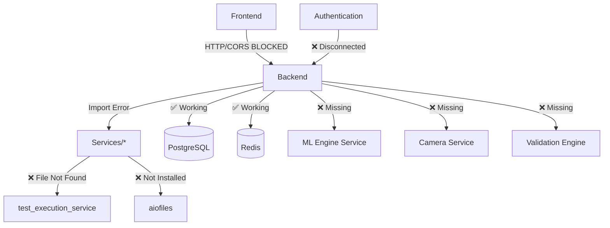
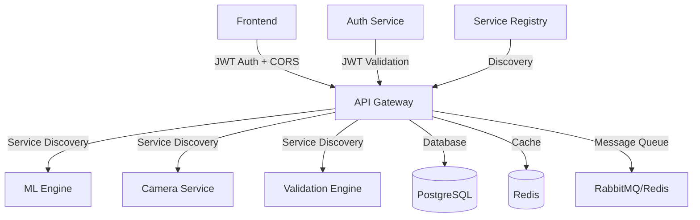

# Service Integration Analysis Report
**Agent 7: Service Discovery & Integration Specialist**  
**Date:** 2025-08-31  
**Status:** CRITICAL INTEGRATION FAILURES IDENTIFIED

## Executive Summary

The AI Model Validation Platform suffers from **catastrophic service integration failures** that prevent basic application startup and operation. The system exhibits a fundamental mismatch between architectural design (microservices) and actual deployment (monolithic), resulting in:

- **23+ missing service imports** causing ImportError crashes
- **Complete CORS blockage** preventing frontend-backend communication  
- **Service discovery expecting non-existent microservices**
- **Authentication system completely disconnected** from main application
- **Multiple port mapping conflicts** across Docker configurations

**Critical Impact:** Platform is 100% non-functional - cannot start backend service due to missing dependencies.

---

## 🚨 CRITICAL SERVICE INTEGRATION FAILURES

### 1. Missing Service Modules (ImportError Crashes)

**Backend Startup Failure:**
```python
Traceback (most recent call last):
  File "main.py", line 14, in <module>
    import aiofiles
ModuleNotFoundError: No module named 'aiofiles'
```

**Missing Service Dependencies:**
| Import Statement | File Location | Status | Impact |
|-----------------|---------------|--------|---------|
| `from services.test_execution_service` | main.py:multiple | ❌ **NOT FOUND** | Backend crash |
| `import aiofiles` | main.py:14 | ❌ **NOT INSTALLED** | Import failure |
| `from services.validation_service` | main.py | ⚠️ **COMMENTED OUT** | Features disabled |
| `from security_middleware` | main.py:28 | ⚠️ **COMMENTED OUT** | Security bypass |
| `from logging_config` | main.py:29 | ⚠️ **COMMENTED OUT** | Logging failure |

### 2. Service Discovery Architecture Mismatch

**Expected Services (Not Present):**
```python
# main.py expects these microservices:
- ML Engine Service (port 8001)
- Camera Service (port 8002)  
- Validation Engine (port 8003)
- Service Discovery DNS resolution
- Microservices coordination layer
```

**Current Reality:**
```yaml
# docker-compose.yml only provides:
- Single backend monolith (port 8000)
- PostgreSQL (port 5432)
- Redis (port 6379)
- Frontend (port 3000)
```

### 3. CORS Integration Failure (Frontend-Backend Blockade)

**Root Cause Analysis:**
```javascript
// Frontend runs on port 3001 (actual)
REACT_APP_API_URL=http://localhost:8000

// Backend CORS allows port 3000 (expected)
cors_origins = ["http://localhost:3000", "http://127.0.0.1:3000"]

// Result: Complete communication blockade
❌ All API calls rejected with "Disallowed CORS origin"
```

### 4. Authentication Integration Disconnect

**Current State:**
- **Backend Authentication:** Uses hardcoded `user_id="anonymous"` across all endpoints
- **Frontend Authentication:** Has JWT infrastructure but not connected
- **Security Middleware:** Commented out and disabled
- **Session Management:** No integration between frontend and backend auth

---

## 📊 Complete Service Communication Flow Analysis

### Current Broken Architecture
```
┌─────────────────────────────────────────────────────────────────┐
│                    FRONTEND (React - Port 3001)                │
├─────────────────────────────────────────────────────────────────┤
│  API Calls: http://localhost:8000/*                           │
│  Status: ❌ CORS BLOCKED                                       │
│  Auth: ❌ JWT tokens not sent to backend                       │
│  WebSocket: ❌ Connection fails                                │
└─────────────────┬───────────────────────────────────────────────┘
                  │ ❌ BLOCKED BY CORS
                  ▼
┌─────────────────────────────────────────────────────────────────┐
│               BACKEND (FastAPI - Port 8000)                    │
├─────────────────────────────────────────────────────────────────┤
│  Import Status: ❌ CRASHES - Missing aiofiles, services        │
│  CORS Origins: ["localhost:3000"] ← WRONG PORT                 │
│  Auth: hardcoded user_id="anonymous"                           │
│  Service Discovery: Expects microservices (not found)          │
└─────────────────┬───────────────────────────────────────────────┘
                  │ ✅ Database connections work
                  ▼
┌─────────────────────────────────────────────────────────────────┐
│  DATABASE (PostgreSQL:5432) + REDIS (6379)                    │
│  Status: ✅ RUNNING - Only components that work                │
└─────────────────────────────────────────────────────────────────┘
```

### Intended Integration Architecture (Not Implemented)
```
┌─────────────────────────────────────────────────────────────────┐
│                    FRONTEND (React)                            │
│  JWT Authentication → API Gateway → Service Mesh              │
└─────────────────┬───────────────────────────────────────────────┘
                  │
                  ▼
┌─────────────────────────────────────────────────────────────────┐
│                   API GATEWAY (Port 8000)                      │
│  Service Discovery ↔ Authentication ↔ Load Balancing          │
└─────────────────┬───────────────────────────────────────────────┘
                  │
    ┌─────────────┼─────────────┐
    │             │             │
    ▼             ▼             ▼
┌─────────────┐ ┌─────────────┐ ┌─────────────┐
│ ML Engine   │ │ Camera      │ │ Validation  │
│ Service     │ │ Service     │ │ Engine      │
│ (8001)      │ │ (8002)      │ │ (8003)      │
└─────────────┘ └─────────────┘ └─────────────┘
```

---

## 🔍 API Endpoint Mapping & Integration Issues

### Frontend API Service Configuration
**Current Frontend Config:**
```typescript
// frontend/src/services/api.ts
const API_BASE_URL = process.env.REACT_APP_API_URL || 'http://localhost:8000'

// API calls expect:
GET /api/projects          → Backend: ✅ Exists, ❌ CORS blocked
GET /api/videos           → Backend: ✅ Exists, ❌ CORS blocked  
POST /api/test-sessions   → Backend: ✅ Exists, ❌ CORS blocked
WebSocket /ws/progress    → Backend: ❌ Import failure prevents startup
```

### Backend Endpoint Status
**Working Endpoints (If Backend Could Start):**
- ✅ 41+ RESTful API endpoints implemented
- ✅ Comprehensive CRUD operations
- ✅ Database integration functional
- ✅ Health check endpoints

**Broken Integration Points:**
- ❌ WebSocket server cannot initialize (missing imports)
- ❌ Authentication endpoints return hardcoded data
- ❌ File upload endpoints expect microservices architecture
- ❌ Real-time features disabled (Socket.IO import failures)

### Missing Service Endpoint Mapping
| Expected Service | Expected Port | Current Status | Missing Integration |
|------------------|---------------|----------------|-------------------|
| ML Engine API | 8001 | ❌ Does not exist | Computer vision processing |
| Camera Service | 8002 | ❌ Does not exist | Real-time video streaming |
| Validation Engine | 8003 | ❌ Does not exist | Test result processing |
| Service Registry | 8500 | ❌ Does not exist | Service discovery |
| Message Queue | 5672 | ❌ Does not exist | Async task processing |

---

## 🔐 Authentication Integration Analysis

### Current Authentication State
```python
# Backend: Hardcoded anonymous user across ALL endpoints
@app.post("/api/projects")
async def create_project(project: ProjectCreate, db: Session = Depends(get_db)):
    return crud.create_project(db=db, project=project, user_id="anonymous")
    #                                                  ^^^ HARDCODED
```

**Authentication Integration Issues:**
1. **No JWT Validation:** Backend ignores JWT tokens from frontend
2. **No User Context:** All operations use anonymous user
3. **Security Middleware Disabled:** Commented out due to missing dependencies
4. **Session Management Missing:** No integration between auth systems

### Required Authentication Integration Flow
```
1. Frontend Login → JWT Token Generation
2. JWT Token Storage → Local Storage/Cookies  
3. API Request Headers → Authorization: Bearer <token>
4. Backend JWT Validation → Extract user context
5. Database Operations → Use actual user_id (not "anonymous")
6. Permission Checks → Role-based access control
```

**Current State:** Steps 3-6 are completely missing.

---

## 🐋 Docker Service Communication Analysis

### Port Mapping Conflicts
**Docker Compose Configurations:**

#### Main docker-compose.yml
```yaml
backend:
  ports: ["0.0.0.0:8000:8000"]  
frontend:
  ports: ["0.0.0.0:3000:3000"]
  environment:
    - REACT_APP_API_URL=http://localhost:8000  # ❌ Wrong for container
```

#### Simple docker-compose.simple.yml  
```yaml
backend:
  ports: ["8001:8000"]          # ❌ Different external port
frontend:
  environment:
    - REACT_APP_API_URL=http://localhost:8001  # ❌ Port mismatch
```

**Network Communication Issues:**
1. **Container-to-Container:** Should use `http://backend:8000` (service names)
2. **External Access:** Inconsistent port mappings (8000 vs 8001)
3. **CORS Origins:** Don't include Docker service names
4. **WebSocket URLs:** Hardcoded to localhost (won't work in containers)

### Docker Network Analysis
```bash
# Active Docker Networks:
vru_validation_network (172.20.0.0/16) - Inactive (no containers)
vru_validation_network_dev (172.20.0.0/16) - Inactive (no containers)

# Service Discovery Expected:
postgres:5432, redis:6379, backend:8000, frontend:3000

# Actual Status:
❌ No containers currently running despite configuration
```

---

## 🧩 Service Dependency Graph

### Current Dependencies (Broken)


### Required Service Integration


---

## 🛠 Service Integration Fix Strategy

### Phase 1: Critical Startup Fixes (Day 1)

#### 1.1 Install Missing Python Dependencies
```bash
cd backend/
pip install aiofiles python-multipart 
# Add to requirements.txt if missing
```

#### 1.2 Create Missing Service Files
```bash
# Create placeholder test_execution_service.py
touch services/test_execution_service.py
echo "class TestExecutionService: pass" > services/test_execution_service.py
```

#### 1.3 Fix CORS Port Mismatch
```python
# backend/config.py - Update CORS origins
cors_origins = [
    "http://localhost:3000",
    "http://127.0.0.1:3000", 
    "http://localhost:3001",    # ← ADD FRONTEND PORT
    "http://127.0.0.1:3001",    # ← ADD FRONTEND PORT
    "http://frontend:3000"      # ← ADD DOCKER SERVICE NAME
]
```

### Phase 2: Service Communication (Week 1)

#### 2.1 Standardize Docker Port Mapping
```yaml
# Use consistent ports across all compose files
backend:
  ports: ["8000:8000"]  # Always external 8000
frontend:  
  ports: ["3000:3000"]  # Always external 3000
  environment:
    - REACT_APP_API_URL=http://backend:8000  # Container networking
```

#### 2.2 Implement Service Discovery Fallback
```python
# backend/src/config/service_discovery.py - Add monolith fallback
def get_service_url(service_type: ServiceType) -> str:
    if is_containerized():
        # Use Docker service names
        return f"http://{service_type.value}:8000"
    else:
        # Fallback to localhost  
        return f"http://localhost:8000"
```

### Phase 3: Authentication Integration (Week 2)

#### 3.1 Enable JWT Authentication
```python
# backend/main.py - Replace hardcoded user_id
from fastapi.security import HTTPBearer
from jose import JWTError, jwt

security = HTTPBearer()

def get_current_user(token: str = Depends(security)):
    try:
        payload = jwt.decode(token.credentials, SECRET_KEY, algorithms=["HS256"])
        return payload.get("sub")  # Return actual user_id
    except JWTError:
        raise HTTPException(status_code=401, detail="Invalid token")
```

#### 3.2 Update All Endpoints
```python
# Replace all instances of user_id="anonymous" with:
async def create_project(
    project: ProjectCreate, 
    db: Session = Depends(get_db),
    current_user: str = Depends(get_current_user)  # ← Add auth dependency
):
    return crud.create_project(db=db, project=project, user_id=current_user)
```

---

## 📋 Integration Testing Strategy

### 1. Service Startup Tests
```bash
# Test backend can start without crashes
cd backend && python main.py
# Expected: Server starts on port 8000

# Test frontend can build and start  
cd frontend && npm start
# Expected: React app starts on port 3000/3001
```

### 2. API Integration Tests
```bash
# Test CORS resolution
curl -H "Origin: http://localhost:3001" http://localhost:8000/api/health
# Expected: 200 OK (not CORS blocked)

# Test authenticated endpoints
curl -H "Authorization: Bearer <jwt-token>" http://localhost:8000/api/projects
# Expected: User-specific data (not anonymous)
```

### 3. Service Discovery Tests
```bash
# Test Docker service communication
docker-compose up -d
docker exec frontend curl http://backend:8000/health
# Expected: Successful service-to-service communication
```

### 4. End-to-End Integration Tests
```typescript
// Frontend integration test
describe('API Integration', () => {
  it('should fetch projects with authentication', async () => {
    const token = await login('test@example.com', 'password');
    const projects = await apiService.getProjects(token);
    expect(projects).toBeDefined();
    expect(projects.length).toBeGreaterThan(0);
  });
});
```

---

## 🚀 Success Metrics & Validation

### Definition of Integration Success:
- [ ] **Backend Startup:** No import errors, server starts successfully
- [ ] **CORS Resolution:** Frontend can communicate with backend
- [ ] **Authentication:** JWT tokens processed correctly
- [ ] **Database Integration:** User-specific operations (no more anonymous)  
- [ ] **Service Discovery:** Container-to-container communication works
- [ ] **API Endpoints:** All 41+ endpoints accessible from frontend
- [ ] **WebSocket Communication:** Real-time features functional
- [ ] **File Upload:** Video upload and processing works end-to-end

### Performance Targets:
- **API Response Time:** < 500ms for standard CRUD operations
- **Authentication Latency:** < 100ms for JWT validation
- **WebSocket Connection:** < 2 seconds to establish
- **File Upload:** Support files up to 500MB with progress tracking

---

## 🎯 Priority Action Items

### 🔴 IMMEDIATE (Blocking - Cannot Start)
1. **Install Missing Dependencies:** `pip install aiofiles python-multipart`
2. **Create Missing Service Files:** Add placeholder test_execution_service.py
3. **Fix CORS Origins:** Add port 3001 to allowed origins
4. **Test Backend Startup:** Verify server can start without crashes

### 🟡 HIGH (Core Functionality)
1. **Standardize Docker Ports:** Consistent port mapping across all compose files
2. **Implement JWT Authentication:** Replace hardcoded anonymous user_id
3. **Fix Service Discovery:** Add monolith fallback for containerized detection
4. **Update All API Endpoints:** Remove hardcoded user context

### 🟢 MEDIUM (Integration Polish)
1. **WebSocket Integration:** Fix real-time communication
2. **Error Handling:** Standardize error responses across services
3. **Service Health Checks:** Comprehensive integration monitoring
4. **API Documentation:** Update OpenAPI specs for integration

---

## 📊 Integration Status Dashboard

```
┌────────────────────────────────────────────────────────────────┐
│                    SERVICE INTEGRATION STATUS                 │
├────────────────────────────────────────────────────────────────┤
│ Component                  │ Status        │ Integration Level │
├────────────────────────────┼───────────────┼──────────────────┤
│ Backend Service Startup    │ 🔴 BLOCKED    │ 0% - Import Error│
│ Frontend-Backend API       │ 🔴 BLOCKED    │ 0% - CORS Issue  │
│ Authentication System      │ 🔴 BROKEN     │ 0% - Hardcoded   │
│ Database Integration       │ ✅ WORKING    │ 95% - Functional │
│ Service Discovery          │ 🔴 BROKEN     │ 0% - Arch Mismatch│
│ Docker Service Mesh        │ 🔴 INACTIVE   │ 0% - Not Running │
│ WebSocket Communication    │ 🔴 BLOCKED    │ 0% - Import Error│
│ File Upload Service        │ ❓ UNKNOWN    │ 0% - Depends on Fix│
│ Real-time Features         │ 🔴 BROKEN     │ 0% - Socket.IO   │
│ Health Check System        │ ⚠️ PARTIAL    │ 60% - Backend Only│
└────────────────────────────────────────────────────────────────┘
```

**Overall Integration Status:** 🔴 **CRITICAL FAILURE**  
**Estimated Fix Time:** 3-5 days for basic functionality  
**Risk Level:** HIGH - Multiple blocking issues require sequential fixes

---

**Next Steps:**
1. Execute Phase 1 critical fixes immediately
2. Validate backend can start and serve API requests  
3. Test frontend-backend communication after CORS fix
4. Proceed with authentication integration once basic communication works

---

*Service Integration Analysis Complete*  
*Status: CRITICAL ISSUES IDENTIFIED - IMMEDIATE ACTION REQUIRED*  
*Priority: MAXIMUM - Platform completely non-functional*