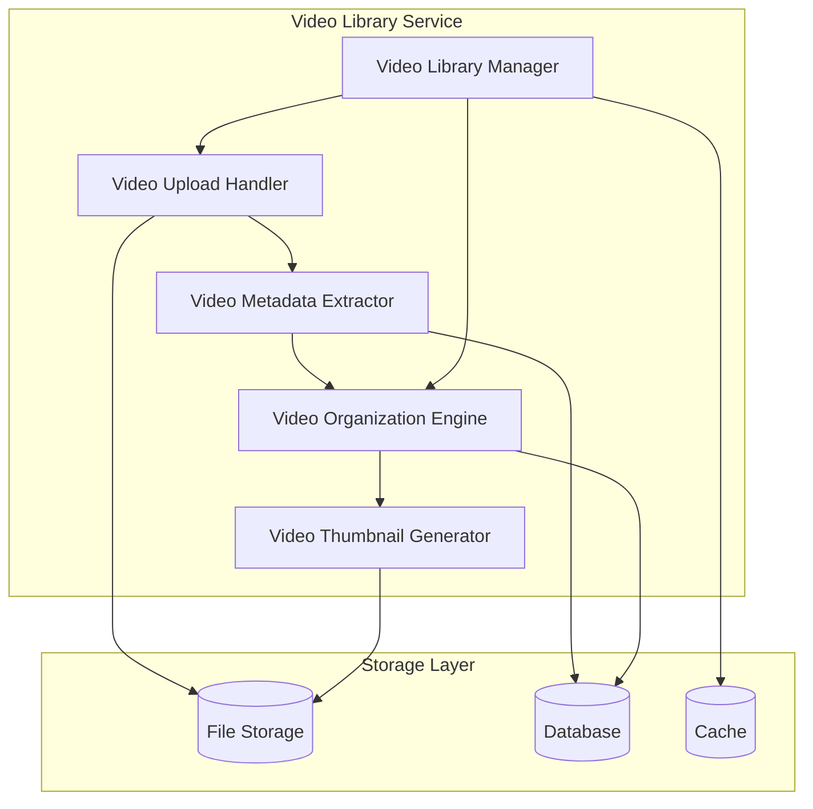
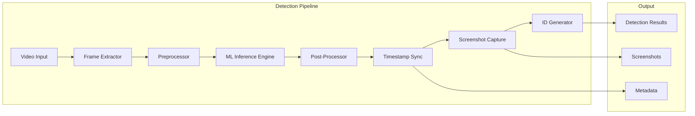
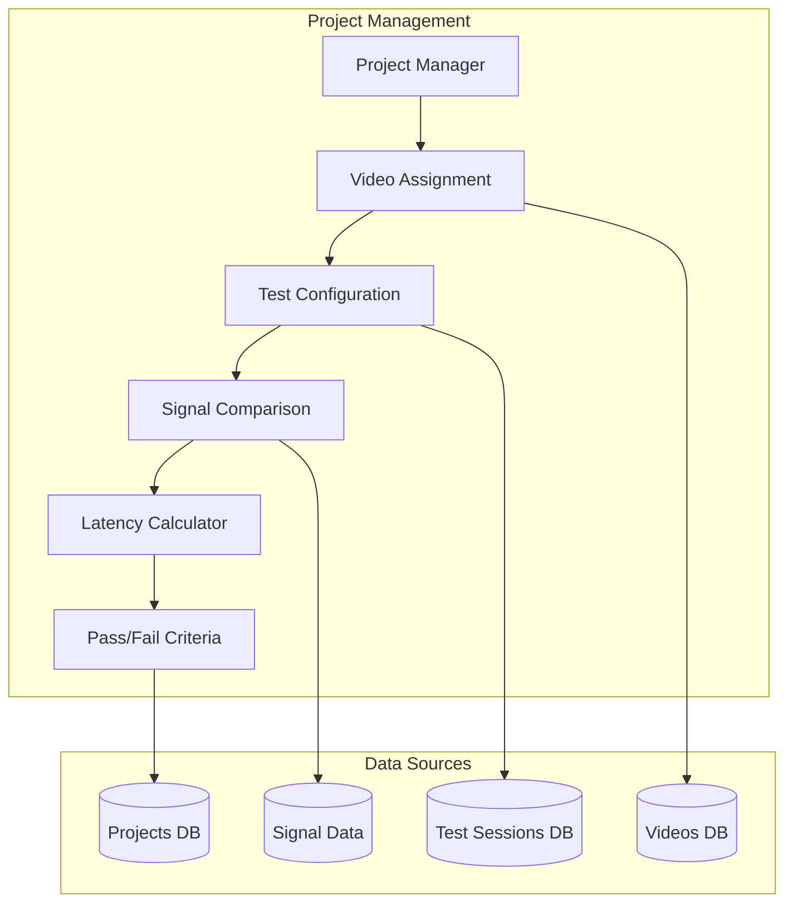
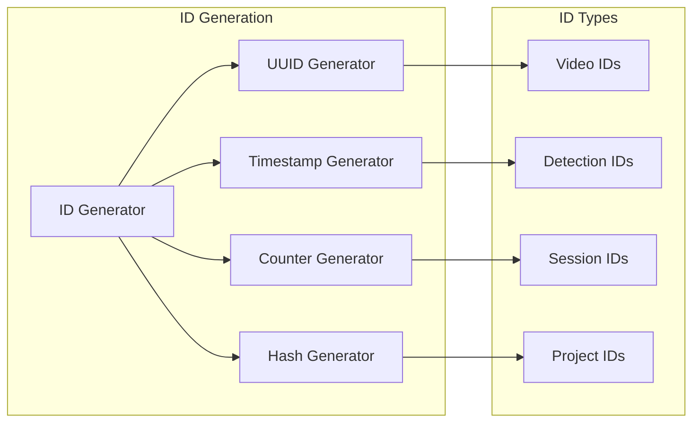

# VRU Detection System - Component Design (C4 Level 3)

## Video Library Management



### Video Library Manager
**Responsibilities:**
- Centralized video lifecycle management
- Folder organization by camera function
- Video assignment to projects
- Access control and permissions

**Key Methods:**
```python
class VideoLibraryManager:
    def upload_video(self, file: UploadFile, project_id: str, metadata: dict) -> Video
    def organize_by_camera_function(self, camera_type: CameraType) -> str
    def assign_to_project(self, video_id: str, project_id: str) -> bool
    def get_videos_by_criteria(self, filters: VideoFilters) -> List[Video]
    def delete_video(self, video_id: str, cascade: bool = False) -> bool
```

**Folder Organization Strategy:**
```
/video-library/
├── front-facing-vru/
│   ├── pedestrian-detection/
│   ├── cyclist-detection/
│   └── vehicle-detection/
├── rear-facing-vru/
│   ├── backup-scenarios/
│   └── parking-assistance/
├── in-cab-driver-behavior/
│   ├── distraction-detection/
│   └── drowsiness-monitoring/
└── multi-angle-scenarios/
    ├── intersection-analysis/
    └── complex-environments/
```

### Video Upload Handler
**Responsibilities:**
- Multi-format video ingestion
- Upload progress tracking
- File validation and security
- Duplicate detection

**Supported Formats:**
- MP4 (H.264/H.265)
- AVI (Motion JPEG)
- MOV (Apple ProRes)
- MKV (x264)

**Upload Workflow:**
```python
async def upload_workflow(file: UploadFile) -> VideoUploadResult:
    1. validate_file_format(file)
    2. scan_for_security_threats(file)
    3. extract_basic_metadata(file)
    4. generate_unique_id()
    5. stream_to_storage(file, video_id)
    6. queue_metadata_extraction(video_id)
    7. return upload_confirmation(video_id)
```

### Video Metadata Extractor
**Responsibilities:**
- Technical metadata extraction
- Frame analysis and indexing
- Timestamp synchronization
- Quality assessment

**Extracted Metadata:**
```python
@dataclass
class VideoMetadata:
    duration: float
    fps: float
    resolution: Tuple[int, int]
    codec: str
    bitrate: int
    frame_count: int
    file_size: int
    creation_time: datetime
    camera_parameters: CameraParams
    quality_metrics: QualityMetrics
```

## Detection Pipeline



### Real-time Inference Engine
**Responsibilities:**
- High-performance video processing
- Multi-model inference support
- GPU resource management
- Batch processing optimization

**Architecture:**
```python
class InferenceEngine:
    def __init__(self):
        self.model_registry = ModelRegistry()
        self.gpu_manager = GPUResourceManager()
        self.batch_processor = BatchProcessor()
    
    async def process_frame(self, frame: np.ndarray) -> List[Detection]:
        # Preprocessing
        preprocessed = self.preprocess_frame(frame)
        
        # Model inference
        raw_predictions = await self.model_registry.current_model.predict(preprocessed)
        
        # Post-processing
        detections = self.postprocess_predictions(raw_predictions)
        
        return detections
```

**Performance Optimizations:**
- **TensorRT Optimization**: Model compilation for NVIDIA GPUs
- **Batch Processing**: Multiple frames processed simultaneously
- **Memory Pooling**: Reuse GPU memory allocations
- **Pipeline Parallelism**: Overlapped inference and preprocessing

### VRU Detection Models
**Supported Model Types:**
- YOLOv8 (primary)
- YOLOv5 (legacy support)
- Custom CNN architectures
- Ensemble models

**Detection Classes:**
```python
class VRUClass(Enum):
    PEDESTRIAN = "pedestrian"
    CYCLIST = "cyclist"
    MOTORCYCLIST = "motorcyclist"
    WHEELCHAIR_USER = "wheelchair_user"
    SCOOTER_RIDER = "scooter_rider"
    CHILD_WITH_STROLLER = "child_with_stroller"
```

### Timestamp Synchronization
**Responsibilities:**
- Video timestamp extraction
- System clock synchronization
- Signal correlation
- Drift compensation

**Synchronization Strategy:**
```python
class TimestampSynchronizer:
    def __init__(self):
        self.reference_clock = SystemClock()
        self.video_timeline = VideoTimeline()
        self.signal_timeline = SignalTimeline()
    
    def sync_detection_timestamp(self, frame_number: int, system_time: float) -> float:
        video_timestamp = self.video_timeline.get_timestamp(frame_number)
        corrected_timestamp = self.apply_drift_correction(video_timestamp, system_time)
        return corrected_timestamp
```

### Screenshot Capture
**Responsibilities:**
- Detection moment capture
- Annotated image generation
- Thumbnail creation
- Quality optimization

**Capture Types:**
- **Raw Frame**: Original video frame
- **Annotated Frame**: With bounding boxes and labels
- **Zoomed Region**: Focused on detection area
- **Comparison View**: Before/after detection

## Project Management System



### Project Manager
**Responsibilities:**
- Project lifecycle management
- Resource allocation
- Test planning and execution
- Progress tracking

**Project States:**
```python
class ProjectStatus(Enum):
    DRAFT = "draft"
    ACTIVE = "active"
    TESTING = "testing"
    ANALYSIS = "analysis"
    COMPLETED = "completed"
    ARCHIVED = "archived"
```

### Video Assignment System
**Responsibilities:**
- Intelligent video-to-project mapping
- Compatibility validation
- Batch assignment operations
- Assignment history tracking

**Assignment Algorithm:**
```python
def smart_assign_videos(project: Project, available_videos: List[Video]) -> List[Assignment]:
    compatible_videos = []
    
    for video in available_videos:
        compatibility_score = calculate_compatibility(project, video)
        if compatibility_score > COMPATIBILITY_THRESHOLD:
            compatible_videos.append((video, compatibility_score))
    
    # Sort by compatibility and project requirements
    sorted_videos = sorted(compatible_videos, key=lambda x: x[1], reverse=True)
    
    return create_assignments(project, sorted_videos[:project.max_videos])
```

### Signal Timing Comparison Framework
**Responsibilities:**
- Multi-signal source support
- Temporal alignment
- Precision measurement
- Drift detection

**Supported Signal Types:**
```python
class SignalType(Enum):
    GPIO = "gpio"
    NETWORK_PACKET = "network_packet"
    SERIAL = "serial"
    CAN_BUS = "can_bus"
    ETHERNET = "ethernet"
```

**Timing Measurement:**
```python
class TimingMeasurement:
    def __init__(self):
        self.high_precision_timer = HighPrecisionTimer()
        self.signal_buffer = CircularBuffer(capacity=10000)
    
    def measure_latency(self, detection_time: float, signal_time: float) -> LatencyResult:
        latency_ms = abs(detection_time - signal_time) * 1000
        
        return LatencyResult(
            detection_timestamp=detection_time,
            signal_timestamp=signal_time,
            latency_ms=latency_ms,
            precision_us=self.calculate_precision(),
            is_within_tolerance=latency_ms <= self.tolerance_ms
        )
```

### Pass/Fail Criteria Implementation
**Responsibilities:**
- Configurable test criteria
- Multi-dimensional evaluation
- Threshold management
- Result classification

**Criteria Framework:**
```python
@dataclass
class PassFailCriteria:
    min_precision: float = 0.90
    min_recall: float = 0.85
    min_f1_score: float = 0.87
    max_latency_ms: float = 100.0
    max_false_positive_rate: float = 0.05
    min_detection_confidence: float = 0.70
    
    def evaluate(self, results: TestResults) -> TestVerdict:
        criteria_checks = [
            results.precision >= self.min_precision,
            results.recall >= self.min_recall,
            results.f1_score >= self.min_f1_score,
            results.average_latency_ms <= self.max_latency_ms,
            results.false_positive_rate <= self.max_false_positive_rate,
            results.average_confidence >= self.min_detection_confidence
        ]
        
        if all(criteria_checks):
            return TestVerdict.PASS
        elif sum(criteria_checks) >= len(criteria_checks) * 0.7:
            return TestVerdict.CONDITIONAL_PASS
        else:
            return TestVerdict.FAIL
```

## Unique ID Generation System



### ID Generation Strategy
**Requirements:**
- Globally unique identifiers
- Sortable by creation time
- Collision-resistant
- Performance optimized

**Implementation:**
```python
class IDGenerator:
    def __init__(self):
        self.node_id = self.get_node_identifier()
        self.sequence_counter = 0
        self.last_timestamp = 0
    
    def generate_detection_id(self) -> str:
        """Generate time-sortable detection ID"""
        timestamp_ms = int(time.time() * 1000)
        
        if timestamp_ms == self.last_timestamp:
            self.sequence_counter += 1
        else:
            self.sequence_counter = 0
            self.last_timestamp = timestamp_ms
        
        # Format: timestamp-node-sequence
        return f"{timestamp_ms:013x}-{self.node_id:04x}-{self.sequence_counter:06x}"
    
    def generate_video_id(self) -> str:
        """Generate UUID4 for videos"""
        return str(uuid.uuid4())
    
    def generate_session_id(self, project_id: str) -> str:
        """Generate session ID with project context"""
        timestamp = datetime.now().strftime("%Y%m%d_%H%M%S")
        project_short = project_id[:8]
        random_suffix = secrets.token_hex(4)
        return f"session_{project_short}_{timestamp}_{random_suffix}"
```

## Integration Patterns

### Event-Driven Architecture
**Event Types:**
- VideoUploaded
- DetectionCompleted
- ValidationFinished
- TestSessionStarted
- CriteriaEvaluated

**Event Handling:**
```python
class EventBus:
    def __init__(self):
        self.handlers = defaultdict(list)
        self.message_queue = MessageQueue()
    
    def subscribe(self, event_type: str, handler: Callable):
        self.handlers[event_type].append(handler)
    
    async def publish(self, event: Event):
        for handler in self.handlers[event.type]:
            await handler(event)
        
        # Also publish to message queue for async processing
        await self.message_queue.publish(event)
```

### Error Handling Strategy
**Error Categories:**
- **Transient Errors**: Network timeouts, temporary resource unavailability
- **Permanent Errors**: Invalid data, configuration errors
- **System Errors**: Hardware failures, service crashes

**Retry Mechanisms:**
```python
class RetryHandler:
    def __init__(self):
        self.max_retries = 3
        self.base_delay = 1.0
        self.backoff_multiplier = 2.0
    
    async def execute_with_retry(self, operation: Callable, *args, **kwargs):
        for attempt in range(self.max_retries + 1):
            try:
                return await operation(*args, **kwargs)
            except TransientError as e:
                if attempt < self.max_retries:
                    delay = self.base_delay * (self.backoff_multiplier ** attempt)
                    await asyncio.sleep(delay)
                    continue
                raise
            except PermanentError:
                raise  # Don't retry permanent errors
```

### Security Integration
**Authentication Flow:**
```python
class SecurityManager:
    def __init__(self):
        self.jwt_handler = JWTHandler()
        self.rbac_engine = RBACEngine()
        self.audit_logger = AuditLogger()
    
    async def authenticate_request(self, request: Request) -> User:
        token = self.extract_token(request)
        claims = self.jwt_handler.validate_token(token)
        user = await self.get_user(claims['sub'])
        
        await self.audit_logger.log_access(user, request)
        return user
    
    async def authorize_operation(self, user: User, operation: str, resource: str) -> bool:
        return await self.rbac_engine.check_permission(user, operation, resource)
```