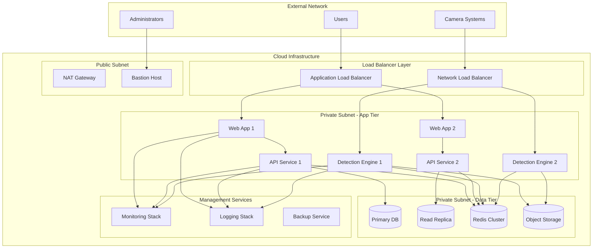

# VRU Detection System - Deployment Architecture

## Infrastructure Overview



## Container Orchestration

### Kubernetes Deployment Strategy

```yaml
# Namespace configuration
apiVersion: v1
kind: Namespace
metadata:
  name: vru-detection
  labels:
    name: vru-detection
    environment: production
---
# Frontend Deployment
apiVersion: apps/v1
kind: Deployment
metadata:
  name: web-app
  namespace: vru-detection
spec:
  replicas: 3
  selector:
    matchLabels:
      app: web-app
  template:
    metadata:
      labels:
        app: web-app
    spec:
      containers:
      - name: web-app
        image: vru-detection/web-app:v1.2.0
        ports:
        - containerPort: 3000
        env:
        - name: REACT_APP_API_URL
          value: "https://api.vru-detection.com"
        resources:
          requests:
            memory: "256Mi"
            cpu: "250m"
          limits:
            memory: "512Mi"
            cpu: "500m"
        livenessProbe:
          httpGet:
            path: /health
            port: 3000
          initialDelaySeconds: 30
          periodSeconds: 10
        readinessProbe:
          httpGet:
            path: /ready
            port: 3000
          initialDelaySeconds: 5
          periodSeconds: 5
---
# API Service Deployment
apiVersion: apps/v1
kind: Deployment
metadata:
  name: api-service
  namespace: vru-detection
spec:
  replicas: 4
  selector:
    matchLabels:
      app: api-service
  template:
    metadata:
      labels:
        app: api-service
    spec:
      containers:
      - name: api-service
        image: vru-detection/api-service:v1.2.0
        ports:
        - containerPort: 8000
        env:
        - name: DATABASE_URL
          valueFrom:
            secretKeyRef:
              name: database-secret
              key: url
        - name: REDIS_URL
          valueFrom:
            secretKeyRef:
              name: redis-secret
              key: url
        resources:
          requests:
            memory: "512Mi"
            cpu: "500m"
          limits:
            memory: "1Gi"
            cpu: "1000m"
        livenessProbe:
          httpGet:
            path: /health
            port: 8000
          initialDelaySeconds: 30
          periodSeconds: 10
        readinessProbe:
          httpGet:
            path: /ready
            port: 8000
          initialDelaySeconds: 5
          periodSeconds: 5
---
# Detection Engine Deployment (GPU-enabled)
apiVersion: apps/v1
kind: Deployment
metadata:
  name: detection-engine
  namespace: vru-detection
spec:
  replicas: 2
  selector:
    matchLabels:
      app: detection-engine
  template:
    metadata:
      labels:
        app: detection-engine
    spec:
      nodeSelector:
        accelerator: nvidia-tesla-v100
      containers:
      - name: detection-engine
        image: vru-detection/detection-engine:v1.2.0
        ports:
        - containerPort: 8001
        resources:
          requests:
            memory: "2Gi"
            cpu: "1000m"
            nvidia.com/gpu: 1
          limits:
            memory: "4Gi"
            cpu: "2000m"
            nvidia.com/gpu: 1
        env:
        - name: CUDA_VISIBLE_DEVICES
          value: "0"
        - name: MODEL_PATH
          value: "/models/yolov8n.pt"
        volumeMounts:
        - name: model-storage
          mountPath: /models
          readOnly: true
      volumes:
      - name: model-storage
        persistentVolumeClaim:
          claimName: model-storage-pvc
```

### Service Configuration

```yaml
# Frontend Service
apiVersion: v1
kind: Service
metadata:
  name: web-app-service
  namespace: vru-detection
spec:
  selector:
    app: web-app
  ports:
  - protocol: TCP
    port: 80
    targetPort: 3000
  type: ClusterIP
---
# API Service
apiVersion: v1
kind: Service
metadata:
  name: api-service
  namespace: vru-detection
spec:
  selector:
    app: api-service
  ports:
  - protocol: TCP
    port: 80
    targetPort: 8000
  type: ClusterIP
---
# Detection Engine Service
apiVersion: v1
kind: Service
metadata:
  name: detection-engine-service
  namespace: vru-detection
spec:
  selector:
    app: detection-engine
  ports:
  - protocol: TCP
    port: 80
    targetPort: 8001
  type: ClusterIP
```

### Ingress Configuration

```yaml
apiVersion: networking.k8s.io/v1
kind: Ingress
metadata:
  name: vru-detection-ingress
  namespace: vru-detection
  annotations:
    nginx.ingress.kubernetes.io/rewrite-target: /
    nginx.ingress.kubernetes.io/ssl-redirect: "true"
    nginx.ingress.kubernetes.io/proxy-body-size: "500m"  # For video uploads
    cert-manager.io/cluster-issuer: "letsencrypt-prod"
spec:
  tls:
  - hosts:
    - vru-detection.com
    - api.vru-detection.com
    secretName: vru-detection-tls
  rules:
  - host: vru-detection.com
    http:
      paths:
      - path: /
        pathType: Prefix
        backend:
          service:
            name: web-app-service
            port:
              number: 80
  - host: api.vru-detection.com
    http:
      paths:
      - path: /api
        pathType: Prefix
        backend:
          service:
            name: api-service
            port:
              number: 80
      - path: /detection
        pathType: Prefix
        backend:
          service:
            name: detection-engine-service
            port:
              number: 80
```

## Database Deployment

### PostgreSQL High Availability Setup

```yaml
# PostgreSQL Primary
apiVersion: apps/v1
kind: StatefulSet
metadata:
  name: postgresql-primary
  namespace: vru-detection
spec:
  serviceName: postgresql-primary-service
  replicas: 1
  selector:
    matchLabels:
      app: postgresql-primary
  template:
    metadata:
      labels:
        app: postgresql-primary
    spec:
      containers:
      - name: postgresql
        image: postgres:14
        env:
        - name: POSTGRES_DB
          value: vru_detection
        - name: POSTGRES_USER
          valueFrom:
            secretKeyRef:
              name: postgresql-secret
              key: username
        - name: POSTGRES_PASSWORD
          valueFrom:
            secretKeyRef:
              name: postgresql-secret
              key: password
        - name: POSTGRES_REPLICATION_USER
          value: replicator
        - name: POSTGRES_REPLICATION_PASSWORD
          valueFrom:
            secretKeyRef:
              name: postgresql-secret
              key: replication-password
        ports:
        - containerPort: 5432
        volumeMounts:
        - name: postgresql-storage
          mountPath: /var/lib/postgresql/data
        - name: postgresql-config
          mountPath: /etc/postgresql/postgresql.conf
          subPath: postgresql.conf
        resources:
          requests:
            memory: "2Gi"
            cpu: "1000m"
          limits:
            memory: "4Gi"
            cpu: "2000m"
      volumes:
      - name: postgresql-config
        configMap:
          name: postgresql-config
  volumeClaimTemplates:
  - metadata:
      name: postgresql-storage
    spec:
      accessModes: ["ReadWriteOnce"]
      resources:
        requests:
          storage: 500Gi
      storageClassName: fast-ssd
```

### Redis Cluster Configuration

```yaml
apiVersion: apps/v1
kind: StatefulSet
metadata:
  name: redis-cluster
  namespace: vru-detection
spec:
  serviceName: redis-cluster-service
  replicas: 6
  selector:
    matchLabels:
      app: redis-cluster
  template:
    metadata:
      labels:
        app: redis-cluster
    spec:
      containers:
      - name: redis
        image: redis:7-alpine
        command:
        - redis-server
        - /conf/redis.conf
        ports:
        - containerPort: 6379
        - containerPort: 16379
        volumeMounts:
        - name: redis-config
          mountPath: /conf
        - name: redis-data
          mountPath: /data
        resources:
          requests:
            memory: "1Gi"
            cpu: "500m"
          limits:
            memory: "2Gi"
            cpu: "1000m"
      volumes:
      - name: redis-config
        configMap:
          name: redis-config
  volumeClaimTemplates:
  - metadata:
      name: redis-data
    spec:
      accessModes: ["ReadWriteOnce"]
      resources:
        requests:
          storage: 50Gi
```

## Monitoring and Observability

### Prometheus Configuration

```yaml
apiVersion: apps/v1
kind: Deployment
metadata:
  name: prometheus
  namespace: monitoring
spec:
  replicas: 1
  selector:
    matchLabels:
      app: prometheus
  template:
    metadata:
      labels:
        app: prometheus
    spec:
      containers:
      - name: prometheus
        image: prom/prometheus:latest
        ports:
        - containerPort: 9090
        volumeMounts:
        - name: prometheus-config
          mountPath: /etc/prometheus
        - name: prometheus-storage
          mountPath: /prometheus
        command:
        - /bin/prometheus
        - --config.file=/etc/prometheus/prometheus.yml
        - --storage.tsdb.path=/prometheus
        - --web.console.libraries=/etc/prometheus/console_libraries
        - --web.console.templates=/etc/prometheus/consoles
        - --storage.tsdb.retention.time=30d
        - --web.enable-lifecycle
        resources:
          requests:
            memory: "2Gi"
            cpu: "1000m"
          limits:
            memory: "4Gi"
            cpu: "2000m"
      volumes:
      - name: prometheus-config
        configMap:
          name: prometheus-config
      - name: prometheus-storage
        persistentVolumeClaim:
          claimName: prometheus-storage-pvc
```

### Grafana Dashboard Configuration

```yaml
apiVersion: apps/v1
kind: Deployment
metadata:
  name: grafana
  namespace: monitoring
spec:
  replicas: 1
  selector:
    matchLabels:
      app: grafana
  template:
    metadata:
      labels:
        app: grafana
    spec:
      containers:
      - name: grafana
        image: grafana/grafana:latest
        ports:
        - containerPort: 3000
        env:
        - name: GF_SECURITY_ADMIN_PASSWORD
          valueFrom:
            secretKeyRef:
              name: grafana-secret
              key: admin-password
        volumeMounts:
        - name: grafana-storage
          mountPath: /var/lib/grafana
        - name: grafana-dashboards
          mountPath: /etc/grafana/provisioning/dashboards
        - name: grafana-datasources
          mountPath: /etc/grafana/provisioning/datasources
        resources:
          requests:
            memory: "512Mi"
            cpu: "250m"
          limits:
            memory: "1Gi"
            cpu: "500m"
      volumes:
      - name: grafana-storage
        persistentVolumeClaim:
          claimName: grafana-storage-pvc
      - name: grafana-dashboards
        configMap:
          name: grafana-dashboards
      - name: grafana-datasources
        configMap:
          name: grafana-datasources
```

## CI/CD Pipeline

### GitLab CI Configuration

```yaml
# .gitlab-ci.yml
stages:
  - test
  - build
  - security-scan
  - deploy-staging
  - integration-tests
  - deploy-production

variables:
  DOCKER_REGISTRY: registry.gitlab.com/vru-detection
  KUBE_NAMESPACE: vru-detection

# Test Stage
unit-tests:
  stage: test
  image: python:3.9
  script:
    - pip install -r requirements-test.txt
    - pytest tests/unit/ --cov=app --cov-report=xml
  artifacts:
    reports:
      coverage_report:
        coverage_format: cobertura
        path: coverage.xml

frontend-tests:
  stage: test
  image: node:18
  script:
    - cd frontend
    - npm ci
    - npm run test:coverage
  artifacts:
    reports:
      coverage_report:
        coverage_format: cobertura
        path: frontend/coverage/cobertura-coverage.xml

# Build Stage
build-api:
  stage: build
  image: docker:20.10.16
  services:
    - docker:20.10.16-dind
  script:
    - docker build -t $DOCKER_REGISTRY/api-service:$CI_COMMIT_SHA backend/
    - docker push $DOCKER_REGISTRY/api-service:$CI_COMMIT_SHA
  only:
    - main
    - develop

build-frontend:
  stage: build
  image: docker:20.10.16
  services:
    - docker:20.10.16-dind
  script:
    - docker build -t $DOCKER_REGISTRY/web-app:$CI_COMMIT_SHA frontend/
    - docker push $DOCKER_REGISTRY/web-app:$CI_COMMIT_SHA
  only:
    - main
    - develop

build-detection-engine:
  stage: build
  image: docker:20.10.16
  services:
    - docker:20.10.16-dind
  script:
    - docker build -t $DOCKER_REGISTRY/detection-engine:$CI_COMMIT_SHA detection/
    - docker push $DOCKER_REGISTRY/detection-engine:$CI_COMMIT_SHA
  only:
    - main
    - develop

# Security Scanning
security-scan:
  stage: security-scan
  image: owasp/zap2docker-stable
  script:
    - zap-baseline.py -t https://staging.vru-detection.com -r security-report.html
  artifacts:
    reports:
      dast: security-report.html
  only:
    - main

# Staging Deployment
deploy-staging:
  stage: deploy-staging
  image: bitnami/kubectl:latest
  script:
    - kubectl config use-context staging
    - kubectl set image deployment/api-service api-service=$DOCKER_REGISTRY/api-service:$CI_COMMIT_SHA -n $KUBE_NAMESPACE
    - kubectl set image deployment/web-app web-app=$DOCKER_REGISTRY/web-app:$CI_COMMIT_SHA -n $KUBE_NAMESPACE
    - kubectl set image deployment/detection-engine detection-engine=$DOCKER_REGISTRY/detection-engine:$CI_COMMIT_SHA -n $KUBE_NAMESPACE
    - kubectl rollout status deployment/api-service -n $KUBE_NAMESPACE
    - kubectl rollout status deployment/web-app -n $KUBE_NAMESPACE
    - kubectl rollout status deployment/detection-engine -n $KUBE_NAMESPACE
  environment:
    name: staging
    url: https://staging.vru-detection.com
  only:
    - develop

# Integration Tests
integration-tests:
  stage: integration-tests
  image: python:3.9
  script:
    - pip install -r requirements-test.txt
    - pytest tests/integration/ --base-url=https://staging.vru-detection.com
  only:
    - develop

# Production Deployment
deploy-production:
  stage: deploy-production
  image: bitnami/kubectl:latest
  script:
    - kubectl config use-context production
    - kubectl set image deployment/api-service api-service=$DOCKER_REGISTRY/api-service:$CI_COMMIT_SHA -n $KUBE_NAMESPACE
    - kubectl set image deployment/web-app web-app=$DOCKER_REGISTRY/web-app:$CI_COMMIT_SHA -n $KUBE_NAMESPACE
    - kubectl set image deployment/detection-engine detection-engine=$DOCKER_REGISTRY/detection-engine:$CI_COMMIT_SHA -n $KUBE_NAMESPACE
    - kubectl rollout status deployment/api-service -n $KUBE_NAMESPACE
    - kubectl rollout status deployment/web-app -n $KUBE_NAMESPACE
    - kubectl rollout status deployment/detection-engine -n $KUBE_NAMESPACE
  environment:
    name: production
    url: https://vru-detection.com
  when: manual
  only:
    - main
```

## Infrastructure as Code

### Terraform Configuration

```hcl
# main.tf
terraform {
  required_version = ">= 1.0"
  required_providers {
    aws = {
      source  = "hashicorp/aws"
      version = "~> 5.0"
    }
    kubernetes = {
      source  = "hashicorp/kubernetes"
      version = "~> 2.20"
    }
  }
}

provider "aws" {
  region = var.aws_region
}

# VPC Configuration
module "vpc" {
  source = "terraform-aws-modules/vpc/aws"
  
  name = "vru-detection-vpc"
  cidr = "10.0.0.0/16"
  
  azs             = ["${var.aws_region}a", "${var.aws_region}b", "${var.aws_region}c"]
  private_subnets = ["10.0.1.0/24", "10.0.2.0/24", "10.0.3.0/24"]
  public_subnets  = ["10.0.101.0/24", "10.0.102.0/24", "10.0.103.0/24"]
  
  enable_nat_gateway = true
  enable_vpn_gateway = true
  
  tags = {
    Environment = var.environment
    Project     = "vru-detection"
  }
}

# EKS Cluster
module "eks" {
  source = "terraform-aws-modules/eks/aws"
  
  cluster_name    = "vru-detection-cluster"
  cluster_version = "1.27"
  
  vpc_id     = module.vpc.vpc_id
  subnet_ids = module.vpc.private_subnets
  
  eks_managed_node_groups = {
    general = {
      desired_size = 3
      max_size     = 10
      min_size     = 3
      
      instance_types = ["t3.large"]
      capacity_type  = "ON_DEMAND"
    }
    
    gpu_nodes = {
      desired_size = 2
      max_size     = 5
      min_size     = 1
      
      instance_types = ["p3.2xlarge"]
      capacity_type  = "ON_DEMAND"
      
      taints = {
        dedicated = {
          key    = "nvidia.com/gpu"
          value  = "true"
          effect = "NO_SCHEDULE"
        }
      }
    }
  }
  
  tags = {
    Environment = var.environment
    Project     = "vru-detection"
  }
}

# RDS Instance
resource "aws_db_instance" "postgresql" {
  identifier = "vru-detection-db"
  
  engine         = "postgres"
  engine_version = "14.9"
  instance_class = "db.r6g.xlarge"
  
  allocated_storage     = 500
  max_allocated_storage = 1000
  storage_type          = "gp3"
  storage_encrypted     = true
  
  db_name  = "vru_detection"
  username = var.db_username
  password = var.db_password
  
  vpc_security_group_ids = [aws_security_group.rds.id]
  db_subnet_group_name   = aws_db_subnet_group.main.name
  
  backup_retention_period = 7
  backup_window          = "03:00-04:00"
  maintenance_window     = "sun:04:00-sun:05:00"
  
  skip_final_snapshot = false
  final_snapshot_identifier = "vru-detection-db-final-snapshot"
  
  tags = {
    Environment = var.environment
    Project     = "vru-detection"
  }
}

# ElastiCache Redis Cluster
resource "aws_elasticache_replication_group" "redis" {
  replication_group_id         = "vru-detection-redis"
  description                  = "Redis cluster for VRU Detection System"
  
  port               = 6379
  parameter_group_name = "default.redis7"
  
  num_cache_clusters = 3
  node_type          = "cache.r6g.large"
  
  subnet_group_name  = aws_elasticache_subnet_group.main.name
  security_group_ids = [aws_security_group.redis.id]
  
  at_rest_encryption_enabled = true
  transit_encryption_enabled = true
  
  tags = {
    Environment = var.environment
    Project     = "vru-detection"
  }
}

# S3 Bucket for Video Storage
resource "aws_s3_bucket" "video_storage" {
  bucket = "vru-detection-videos-${var.environment}"
  
  tags = {
    Environment = var.environment
    Project     = "vru-detection"
  }
}

resource "aws_s3_bucket_versioning" "video_storage" {
  bucket = aws_s3_bucket.video_storage.id
  versioning_configuration {
    status = "Enabled"
  }
}

resource "aws_s3_bucket_encryption" "video_storage" {
  bucket = aws_s3_bucket.video_storage.id
  
  server_side_encryption_configuration {
    rule {
      apply_server_side_encryption_by_default {
        sse_algorithm = "AES256"
      }
    }
  }
}
```

## Security Implementation

### Network Security Groups

```hcl
# Security Groups
resource "aws_security_group" "eks_cluster" {
  name_prefix = "vru-detection-eks-cluster"
  vpc_id      = module.vpc.vpc_id
  
  ingress {
    from_port = 443
    to_port   = 443
    protocol  = "tcp"
    cidr_blocks = ["0.0.0.0/0"]
  }
  
  egress {
    from_port   = 0
    to_port     = 0
    protocol    = "-1"
    cidr_blocks = ["0.0.0.0/0"]
  }
  
  tags = {
    Name = "vru-detection-eks-cluster-sg"
  }
}

resource "aws_security_group" "rds" {
  name_prefix = "vru-detection-rds"
  vpc_id      = module.vpc.vpc_id
  
  ingress {
    from_port       = 5432
    to_port         = 5432
    protocol        = "tcp"
    security_groups = [aws_security_group.eks_cluster.id]
  }
  
  tags = {
    Name = "vru-detection-rds-sg"
  }
}

resource "aws_security_group" "redis" {
  name_prefix = "vru-detection-redis"
  vpc_id      = module.vpc.vpc_id
  
  ingress {
    from_port       = 6379
    to_port         = 6379
    protocol        = "tcp"
    security_groups = [aws_security_group.eks_cluster.id]
  }
  
  tags = {
    Name = "vru-detection-redis-sg"
  }
}
```

### Secrets Management

```yaml
# Kubernetes Secrets
apiVersion: v1
kind: Secret
metadata:
  name: database-secret
  namespace: vru-detection
type: Opaque
data:
  url: <base64-encoded-database-url>
  username: <base64-encoded-username>
  password: <base64-encoded-password>
---
apiVersion: v1
kind: Secret
metadata:
  name: redis-secret
  namespace: vru-detection
type: Opaque
data:
  url: <base64-encoded-redis-url>
  password: <base64-encoded-password>
---
apiVersion: v1
kind: Secret
metadata:
  name: jwt-secret
  namespace: vru-detection
type: Opaque
data:
  secret-key: <base64-encoded-jwt-secret>
```

## Disaster Recovery

### Backup Strategy
```bash
#!/bin/bash
# backup-script.sh

# Database backup
kubectl exec -n vru-detection postgresql-primary-0 -- pg_dump -U postgres vru_detection | \
  gzip > /backups/db-backup-$(date +%Y%m%d-%H%M%S).sql.gz

# Redis backup
kubectl exec -n vru-detection redis-cluster-0 -- redis-cli BGSAVE
kubectl cp vru-detection/redis-cluster-0:/data/dump.rdb /backups/redis-backup-$(date +%Y%m%d-%H%M%S).rdb

# Upload to S3
aws s3 sync /backups/ s3://vru-detection-backups/$(date +%Y%m%d)/
```

### Recovery Procedures
```bash
#!/bin/bash
# restore-script.sh

# Restore database
gunzip -c /backups/db-backup-20240817-120000.sql.gz | \
kubectl exec -i -n vru-detection postgresql-primary-0 -- psql -U postgres vru_detection

# Restore Redis
kubectl cp /backups/redis-backup-20240817-120000.rdb vru-detection/redis-cluster-0:/data/dump.rdb
kubectl exec -n vru-detection redis-cluster-0 -- redis-cli DEBUG RESTART
```

## Performance Optimization

### Auto-scaling Configuration
```yaml
apiVersion: autoscaling/v2
kind: HorizontalPodAutoscaler
metadata:
  name: api-service-hpa
  namespace: vru-detection
spec:
  scaleTargetRef:
    apiVersion: apps/v1
    kind: Deployment
    name: api-service
  minReplicas: 2
  maxReplicas: 20
  metrics:
  - type: Resource
    resource:
      name: cpu
      target:
        type: Utilization
        averageUtilization: 70
  - type: Resource
    resource:
      name: memory
      target:
        type: Utilization
        averageUtilization: 80
  behavior:
    scaleUp:
      stabilizationWindowSeconds: 60
      policies:
      - type: Percent
        value: 100
        periodSeconds: 15
    scaleDown:
      stabilizationWindowSeconds: 300
      policies:
      - type: Percent
        value: 10
        periodSeconds: 60
```

This comprehensive deployment architecture provides a production-ready, scalable, and secure infrastructure for the VRU detection system with proper monitoring, backup, and disaster recovery capabilities.