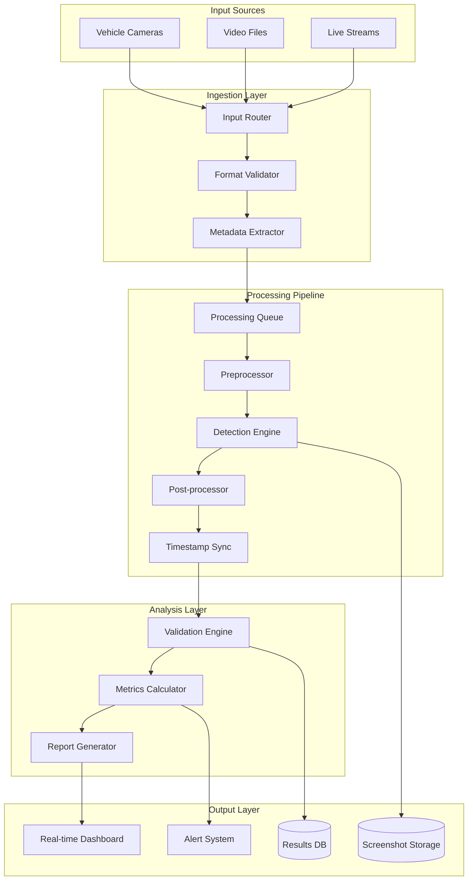

# VRU Detection System - Detection Workflow Architecture

## Overview

This document defines the end-to-end workflow for VRU (Vulnerable Road User) detection, from video ingestion through validation and reporting.

## Detection Pipeline Architecture



## Workflow Stages

### 1. Video Ingestion Workflow

```python
class VideoIngestionWorkflow:
    async def process_video_upload(self, video_file: UploadFile, project_id: str) -> VideoProcessingResult:
        """
        Complete video ingestion workflow
        """
        try:
            # Stage 1: Validation
            validation_result = await self.validate_video_file(video_file)
            if not validation_result.is_valid:
                raise ValidationError(validation_result.errors)
            
            # Stage 2: Storage
            storage_result = await self.store_video_file(video_file, project_id)
            
            # Stage 3: Metadata Extraction
            metadata = await self.extract_video_metadata(storage_result.file_path)
            
            # Stage 4: Database Registration
            video_record = await self.register_video_in_database(
                project_id=project_id,
                file_path=storage_result.file_path,
                metadata=metadata
            )
            
            # Stage 5: Queue for Processing
            await self.queue_video_for_processing(video_record.id)
            
            return VideoProcessingResult(
                video_id=video_record.id,
                status="queued_for_processing",
                estimated_completion=self.estimate_processing_time(metadata.duration)
            )
            
        except Exception as e:
            await self.handle_ingestion_error(video_file, e)
            raise
```

**Validation Criteria:**
- File format (MP4, AVI, MOV, MKV)
- Video codec (H.264, H.265, Motion JPEG)
- Resolution (minimum 640x480, maximum 4K)
- Duration (maximum 60 minutes)
- File size (maximum 10GB)
- Frame rate (5-120 FPS)

**Metadata Extraction:**
```python
@dataclass
class VideoMetadata:
    duration: float           # seconds
    frame_count: int         # total frames
    fps: float              # frames per second
    resolution: Tuple[int, int]  # (width, height)
    codec: str              # video codec
    bitrate: int            # bits per second
    file_size: int          # bytes
    creation_time: datetime # file creation timestamp
    camera_metadata: Optional[CameraMetadata]
    quality_assessment: QualityMetrics
```

### 2. Real-time Detection Workflow

```python
class DetectionWorkflow:
    def __init__(self):
        self.model_registry = ModelRegistry()
        self.frame_processor = FrameProcessor()
        self.timestamp_sync = TimestampSynchronizer()
        self.screenshot_capture = ScreenshotCapture()
        
    async def process_video_stream(self, video_id: str, test_session_id: str) -> AsyncGenerator[DetectionEvent, None]:
        """
        Real-time video processing workflow
        """
        video_stream = await self.get_video_stream(video_id)
        current_model = await self.model_registry.get_active_model()
        
        frame_number = 0
        async for frame in video_stream:
            frame_number += 1
            
            # Stage 1: Preprocessing
            processed_frame = await self.frame_processor.preprocess(frame)
            
            # Stage 2: ML Inference
            raw_detections = await current_model.predict(processed_frame)
            
            # Stage 3: Post-processing
            validated_detections = await self.validate_detections(raw_detections)
            
            # Stage 4: Timestamp Synchronization
            for detection in validated_detections:
                synchronized_timestamp = await self.timestamp_sync.sync_frame_timestamp(
                    frame_number, detection.timestamp
                )
                
                # Stage 5: Screenshot Capture
                if detection.confidence > SCREENSHOT_THRESHOLD:
                    screenshot_path = await self.screenshot_capture.capture_detection(
                        frame, detection.bounding_box, detection.id
                    )
                
                # Stage 6: Event Creation
                detection_event = DetectionEvent(
                    id=generate_detection_id(),
                    test_session_id=test_session_id,
                    timestamp=synchronized_timestamp,
                    confidence=detection.confidence,
                    class_label=detection.class_label,
                    bounding_box=detection.bounding_box,
                    screenshot_path=screenshot_path
                )
                
                # Stage 7: Real-time Validation
                validation_result = await self.validate_against_ground_truth(detection_event)
                detection_event.validation_result = validation_result
                
                yield detection_event
```

**Detection Classes and Confidence Thresholds:**
```python
VRU_DETECTION_CONFIG = {
    "pedestrian": {
        "min_confidence": 0.70,
        "nms_threshold": 0.45,
        "class_id": 0
    },
    "cyclist": {
        "min_confidence": 0.75,
        "nms_threshold": 0.40,
        "class_id": 1
    },
    "motorcyclist": {
        "min_confidence": 0.80,
        "nms_threshold": 0.35,
        "class_id": 2
    },
    "wheelchair_user": {
        "min_confidence": 0.65,
        "nms_threshold": 0.50,
        "class_id": 3
    },
    "scooter_rider": {
        "min_confidence": 0.70,
        "nms_threshold": 0.45,
        "class_id": 4
    }
}
```

### 3. Signal Processing Workflow

```python
class SignalProcessingWorkflow:
    def __init__(self):
        self.signal_handlers = {
            SignalType.GPIO: GPIOSignalHandler(),
            SignalType.NETWORK_PACKET: NetworkSignalHandler(),
            SignalType.SERIAL: SerialSignalHandler(),
            SignalType.CAN_BUS: CANBusSignalHandler()
        }
        
    async def process_signal_stream(self, test_session_id: str, signal_config: SignalConfig) -> AsyncGenerator[SignalEvent, None]:
        """
        Real-time signal processing workflow
        """
        handler = self.signal_handlers[signal_config.signal_type]
        
        async for raw_signal in handler.stream_signals(signal_config):
            # Stage 1: Signal Validation
            if not self.validate_signal_format(raw_signal, signal_config):
                continue
                
            # Stage 2: Timestamp Precision
            precise_timestamp = await self.get_high_precision_timestamp(raw_signal)
            
            # Stage 3: Signal Parsing
            parsed_data = await handler.parse_signal_data(raw_signal)
            
            # Stage 4: Event Creation
            signal_event = SignalEvent(
                id=generate_signal_id(),
                test_session_id=test_session_id,
                timestamp=precise_timestamp,
                signal_type=signal_config.signal_type,
                signal_data=parsed_data,
                source_identifier=signal_config.source_identifier
            )
            
            yield signal_event
```

**Signal Processing Configuration:**
```python
@dataclass
class SignalConfig:
    signal_type: SignalType
    source_identifier: str  # GPIO pin, IP:port, /dev/ttyUSB0, etc.
    sampling_rate: float    # Hz
    buffer_size: int       # samples
    precision_mode: bool   # high-precision timestamping
    filters: List[SignalFilter]
    
# GPIO Configuration Example
gpio_config = SignalConfig(
    signal_type=SignalType.GPIO,
    source_identifier="GPIO_21",
    sampling_rate=1000.0,  # 1kHz
    buffer_size=100,
    precision_mode=True,
    filters=[
        DebounceFilter(min_interval_ms=10),
        NoiseFilter(threshold=0.1)
    ]
)
```

### 4. Validation and Analysis Workflow

```python
class ValidationWorkflow:
    def __init__(self):
        self.tolerance_calculator = ToleranceCalculator()
        self.metrics_engine = MetricsEngine()
        self.statistical_analyzer = StatisticalAnalyzer()
        
    async def validate_test_session(self, test_session_id: str) -> ValidationResult:
        """
        Complete validation workflow for a test session
        """
        # Stage 1: Data Collection
        test_session = await self.get_test_session(test_session_id)
        detection_events = await self.get_detection_events(test_session_id)
        signal_events = await self.get_signal_events(test_session_id)
        ground_truth = await self.get_ground_truth(test_session.video_id)
        
        # Stage 2: Temporal Alignment
        aligned_events = await self.align_temporal_events(
            detection_events, signal_events, test_session.tolerance_ms
        )
        
        # Stage 3: Ground Truth Matching
        matched_detections = await self.match_ground_truth(
            detection_events, ground_truth, test_session.tolerance_ms
        )
        
        # Stage 4: Metrics Calculation
        performance_metrics = await self.metrics_engine.calculate_metrics(
            true_positives=matched_detections.true_positives,
            false_positives=matched_detections.false_positives,
            false_negatives=matched_detections.false_negatives,
            total_ground_truth=len(ground_truth)
        )
        
        # Stage 5: Latency Analysis
        latency_analysis = await self.analyze_detection_latency(
            aligned_events, test_session.tolerance_ms
        )
        
        # Stage 6: Statistical Analysis
        statistical_results = await self.statistical_analyzer.analyze(
            detection_events, performance_metrics
        )
        
        # Stage 7: Pass/Fail Determination
        test_verdict = await self.determine_test_verdict(
            performance_metrics, latency_analysis, test_session.pass_fail_criteria
        )
        
        return ValidationResult(
            test_session_id=test_session_id,
            performance_metrics=performance_metrics,
            latency_analysis=latency_analysis,
            statistical_results=statistical_results,
            test_verdict=test_verdict,
            detailed_analysis=self.generate_detailed_analysis(matched_detections)
        )
```

**Metrics Calculation Engine:**
```python
class MetricsEngine:
    def calculate_precision_recall_f1(self, tp: int, fp: int, fn: int) -> PerformanceMetrics:
        """Calculate standard ML performance metrics"""
        precision = tp / (tp + fp) if (tp + fp) > 0 else 0.0
        recall = tp / (tp + fn) if (tp + fn) > 0 else 0.0
        f1_score = 2 * (precision * recall) / (precision + recall) if (precision + recall) > 0 else 0.0
        
        return PerformanceMetrics(
            true_positives=tp,
            false_positives=fp,
            false_negatives=fn,
            precision=precision,
            recall=recall,
            f1_score=f1_score
        )
    
    def calculate_temporal_accuracy(self, detection_events: List[DetectionEvent], 
                                   ground_truth: List[GroundTruthObject],
                                   tolerance_ms: int) -> TemporalMetrics:
        """Calculate timing-specific metrics"""
        timing_errors = []
        within_tolerance = 0
        
        for detection in detection_events:
            closest_gt = self.find_closest_ground_truth(detection, ground_truth)
            if closest_gt:
                time_diff_ms = abs(detection.timestamp - closest_gt.timestamp) * 1000
                timing_errors.append(time_diff_ms)
                
                if time_diff_ms <= tolerance_ms:
                    within_tolerance += 1
        
        return TemporalMetrics(
            mean_timing_error_ms=np.mean(timing_errors) if timing_errors else 0,
            std_timing_error_ms=np.std(timing_errors) if timing_errors else 0,
            max_timing_error_ms=np.max(timing_errors) if timing_errors else 0,
            within_tolerance_percentage=within_tolerance / len(detection_events) * 100 if detection_events else 0
        )
```

## Performance Optimization Strategies

### 1. Pipeline Optimization

```python
class OptimizedDetectionPipeline:
    def __init__(self):
        self.frame_buffer = FrameBuffer(capacity=30)  # 1 second at 30fps
        self.batch_processor = BatchProcessor(batch_size=8)
        self.result_cache = LRUCache(maxsize=1000)
        
    async def process_frames_batch(self, frames: List[VideoFrame]) -> List[DetectionResult]:
        """Batch processing for improved throughput"""
        # Batch preprocessing
        preprocessed_batch = await self.batch_processor.preprocess_batch(frames)
        
        # Batch inference
        raw_predictions = await self.model.predict_batch(preprocessed_batch)
        
        # Parallel post-processing
        tasks = [
            self.postprocess_detection(pred, frame) 
            for pred, frame in zip(raw_predictions, frames)
        ]
        
        return await asyncio.gather(*tasks)
```

### 2. Memory Management

```python
class MemoryOptimizedProcessor:
    def __init__(self):
        self.memory_pool = MemoryPool(
            initial_size=1024 * 1024 * 100,  # 100MB
            max_size=1024 * 1024 * 500       # 500MB
        )
        
    async def process_with_memory_management(self, video_stream):
        """Process video with careful memory management"""
        async for frame_batch in self.get_frame_batches(video_stream):
            # Allocate from pool
            processing_buffer = self.memory_pool.allocate(frame_batch.size)
            
            try:
                # Process batch
                results = await self.process_batch(frame_batch, processing_buffer)
                yield results
            finally:
                # Return to pool
                self.memory_pool.deallocate(processing_buffer)
```

### 3. GPU Resource Management

```python
class GPUResourceManager:
    def __init__(self):
        self.gpu_semaphore = asyncio.Semaphore(2)  # Max 2 concurrent models
        self.model_cache = {}
        
    async def get_detection_model(self, model_id: str) -> DetectionModel:
        """Thread-safe model access with resource limits"""
        async with self.gpu_semaphore:
            if model_id not in self.model_cache:
                model = await self.load_model_to_gpu(model_id)
                self.model_cache[model_id] = model
            
            return self.model_cache[model_id]
    
    async def process_with_gpu_management(self, frames: List[VideoFrame]) -> List[DetectionResult]:
        """Process frames with GPU resource constraints"""
        model = await self.get_detection_model("yolov8n")
        
        # Use GPU memory efficiently
        with torch.cuda.amp.autocast():
            results = await model.predict_batch(frames)
        
        # Clear GPU cache periodically
        if self.should_clear_cache():
            torch.cuda.empty_cache()
        
        return results
```

## Error Handling and Recovery

### 1. Pipeline Error Recovery

```python
class ResilientDetectionPipeline:
    def __init__(self):
        self.retry_policy = RetryPolicy(
            max_retries=3,
            backoff_factor=2.0,
            retry_exceptions=[NetworkError, TemporaryResourceError]
        )
        
    async def process_with_error_recovery(self, video_stream):
        """Process video stream with comprehensive error handling"""
        checkpoint_manager = CheckpointManager()
        
        try:
            async for frame_batch in video_stream:
                # Create checkpoint
                checkpoint = checkpoint_manager.create_checkpoint(frame_batch.position)
                
                try:
                    results = await self.retry_policy.execute(
                        self.process_frame_batch, frame_batch
                    )
                    yield results
                    
                    # Mark checkpoint as successful
                    checkpoint_manager.mark_success(checkpoint)
                    
                except PermanentError as e:
                    # Log and skip problematic frames
                    logger.error(f"Permanent error processing frames: {e}")
                    checkpoint_manager.mark_failed(checkpoint, e)
                    continue
                    
                except Exception as e:
                    # Attempt recovery from checkpoint
                    logger.warning(f"Error processing frames, attempting recovery: {e}")
                    recovery_point = checkpoint_manager.get_last_successful_checkpoint()
                    video_stream.seek(recovery_point.position)
                    raise
                    
        except Exception as e:
            # Generate error report
            await self.generate_error_report(e, checkpoint_manager.get_history())
            raise
```

### 2. Data Consistency Guarantees

```python
class TransactionalWorkflow:
    def __init__(self):
        self.transaction_manager = TransactionManager()
        
    async def process_video_with_consistency(self, video_id: str, test_session_id: str):
        """Process video with ACID guarantees"""
        async with self.transaction_manager.begin_transaction() as tx:
            try:
                # Stage 1: Lock resources
                await tx.lock_video(video_id)
                await tx.lock_test_session(test_session_id)
                
                # Stage 2: Process video
                detection_events = []
                async for detection in self.process_video_stream(video_id):
                    detection_events.append(detection)
                    await tx.save_detection_event(detection)
                
                # Stage 3: Calculate metrics
                metrics = await self.calculate_session_metrics(detection_events)
                await tx.save_validation_results(test_session_id, metrics)
                
                # Stage 4: Update session status
                await tx.update_session_status(test_session_id, "completed")
                
                # Commit all changes atomically
                await tx.commit()
                
            except Exception as e:
                # Rollback on any error
                await tx.rollback()
                raise
```

## Monitoring and Observability

### 1. Performance Metrics

```python
class WorkflowMonitoring:
    def __init__(self):
        self.metrics_collector = MetricsCollector()
        self.performance_tracker = PerformanceTracker()
        
    async def monitor_detection_pipeline(self, workflow_instance):
        """Comprehensive pipeline monitoring"""
        with self.performance_tracker.track_workflow("detection_pipeline"):
            # Track frame processing rate
            self.metrics_collector.gauge("frames_per_second").set(
                workflow_instance.get_current_fps()
            )
            
            # Track GPU utilization
            self.metrics_collector.gauge("gpu_utilization").set(
                torch.cuda.utilization()
            )
            
            # Track memory usage
            self.metrics_collector.gauge("memory_usage_mb").set(
                psutil.Process().memory_info().rss / 1024 / 1024
            )
            
            # Track queue depths
            self.metrics_collector.gauge("processing_queue_depth").set(
                workflow_instance.queue.qsize()
            )
```

### 2. Real-time Alerting

```python
class AlertingSystem:
    def __init__(self):
        self.alert_rules = [
            LatencyAlert(threshold_ms=100, severity="critical"),
            AccuracyAlert(min_precision=0.90, severity="warning"),
            ResourceAlert(max_gpu_util=95, severity="warning")
        ]
        
    async def monitor_and_alert(self, metrics: WorkflowMetrics):
        """Real-time alerting based on workflow metrics"""
        for rule in self.alert_rules:
            if rule.should_trigger(metrics):
                alert = Alert(
                    rule_name=rule.name,
                    severity=rule.severity,
                    message=rule.format_message(metrics),
                    timestamp=datetime.utcnow(),
                    context={"workflow_id": metrics.workflow_id}
                )
                
                await self.send_alert(alert)
```

This comprehensive detection workflow architecture ensures reliable, scalable, and high-performance VRU detection with proper error handling, monitoring, and consistency guarantees.