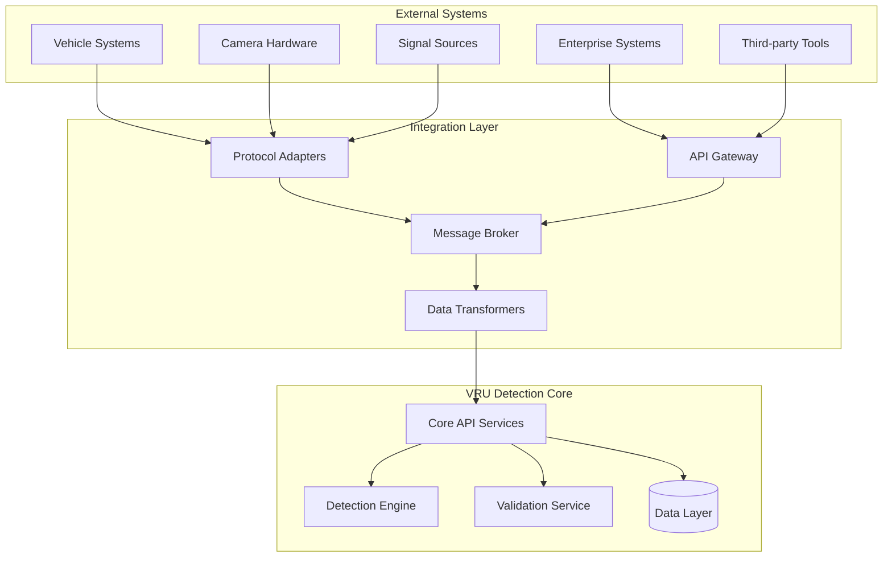

# VRU Detection System - Integration Patterns

## Overview

This document defines the integration patterns and protocols for connecting the VRU detection system with external systems, including vehicle cameras, signal sources, enterprise systems, and third-party tools.

## Integration Architecture



## Vehicle Integration Patterns

### 1. Camera Integration Protocol

```python
class CameraIntegrationAdapter:
    """Universal camera integration adapter"""
    
    def __init__(self):
        self.camera_drivers = {
            "rtsp": RTSPCameraDriver(),
            "usb": USBCameraDriver(),
            "ethernet": EthernetCameraDriver(),
            "can": CANCameraDriver()
        }
        
    async def connect_camera(self, camera_config: CameraConfig) -> CameraStream:
        """Establish connection to camera with auto-discovery"""
        driver = self.camera_drivers[camera_config.protocol]
        
        # Attempt connection with retry logic
        connection = await self.retry_connection(
            driver.connect, camera_config, max_retries=3
        )
        
        # Validate camera capabilities
        capabilities = await driver.get_capabilities(connection)
        self.validate_capabilities(capabilities, camera_config.requirements)
        
        # Configure camera settings
        await driver.configure_camera(connection, camera_config.settings)
        
        # Create stream wrapper
        return CameraStream(connection, driver, camera_config)

@dataclass
class CameraConfig:
    camera_id: str
    protocol: str  # rtsp, usb, ethernet, can
    connection_string: str
    resolution: Tuple[int, int]
    fps: int
    format: str  # h264, mjpeg, raw
    authentication: Optional[CameraAuth]
    requirements: CameraRequirements
    settings: CameraSettings
```

**RTSP Camera Integration:**
```python
class RTSPCameraDriver:
    """RTSP protocol camera driver"""
    
    async def connect(self, config: CameraConfig) -> RTSPConnection:
        """Connect to RTSP camera stream"""
        # Parse RTSP URL: rtsp://username:password@ip:port/stream
        rtsp_url = self.build_rtsp_url(config)
        
        # Configure GStreamer pipeline
        pipeline = f"""
        rtspsrc location={rtsp_url} latency=0 drop-on-latency=true !
        rtph264depay ! h264parse ! avdec_h264 !
        videoconvert ! video/x-raw,format=RGB !
        appsink name=sink sync=false drop=true max-buffers=1
        """
        
        # Create connection with timeout
        connection = await asyncio.wait_for(
            self.create_gstreamer_connection(pipeline),
            timeout=30.0
        )
        
        return RTSPConnection(connection, config)
    
    async def get_capabilities(self, connection: RTSPConnection) -> CameraCapabilities:
        """Query camera capabilities via RTSP DESCRIBE"""
        describe_response = await connection.send_rtsp_describe()
        sdp = self.parse_sdp(describe_response)
        
        return CameraCapabilities(
            supported_resolutions=self.extract_resolutions(sdp),
            supported_formats=self.extract_formats(sdp),
            max_fps=self.extract_max_fps(sdp),
            audio_support=self.has_audio_track(sdp)
        )
```

**USB Camera Integration:**
```python
class USBCameraDriver:
    """USB camera driver using V4L2"""
    
    async def connect(self, config: CameraConfig) -> USBConnection:
        """Connect to USB camera"""
        # Enumerate USB video devices
        devices = self.enumerate_v4l2_devices()
        
        # Find matching device
        device_path = self.find_device_by_id(devices, config.camera_id)
        
        # Open V4L2 device
        cap = cv2.VideoCapture(device_path, cv2.CAP_V4L2)
        
        if not cap.isOpened():
            raise CameraConnectionError(f"Failed to open camera: {device_path}")
        
        return USBConnection(cap, config)
    
    def enumerate_v4l2_devices(self) -> List[V4L2Device]:
        """Enumerate available V4L2 video devices"""
        devices = []
        
        for device_path in glob.glob("/dev/video*"):
            try:
                with open(device_path, 'rb') as f:
                    # Query device capabilities
                    caps = fcntl.ioctl(f.fileno(), V4L2_VIDIOC_QUERYCAP, 
                                     struct.pack('64s64s32sI', b'', b'', b'', 0))
                    
                    driver, card, bus_info, version = struct.unpack('64s64s32sI', caps)
                    
                    devices.append(V4L2Device(
                        path=device_path,
                        driver=driver.decode().strip('\x00'),
                        card=card.decode().strip('\x00'),
                        bus_info=bus_info.decode().strip('\x00')
                    ))
            except OSError:
                continue
        
        return devices
```

### 2. Signal Source Integration

```python
class SignalSourceAdapter:
    """Multi-protocol signal source adapter"""
    
    def __init__(self):
        self.signal_handlers = {
            SignalType.GPIO: GPIOSignalHandler(),
            SignalType.NETWORK: NetworkSignalHandler(),
            SignalType.SERIAL: SerialSignalHandler(),
            SignalType.CAN_BUS: CANBusSignalHandler(),
            SignalType.MODBUS: ModbusSignalHandler()
        }
    
    async def create_signal_stream(self, signal_config: SignalConfig) -> SignalStream:
        """Create signal stream with appropriate handler"""
        handler = self.signal_handlers[signal_config.signal_type]
        
        # Initialize signal source
        source = await handler.initialize_source(signal_config)
        
        # Start signal streaming
        stream = await handler.create_stream(source, signal_config)
        
        # Add signal processing pipeline
        processed_stream = self.add_signal_processing(stream, signal_config.filters)
        
        return SignalStream(processed_stream, handler, signal_config)

class GPIOSignalHandler:
    """Raspberry Pi GPIO signal handler"""
    
    def __init__(self):
        try:
            import RPi.GPIO as GPIO
            self.GPIO = GPIO
            self.GPIO.setmode(GPIO.BCM)
        except ImportError:
            raise RuntimeError("RPi.GPIO not available - not running on Raspberry Pi")
    
    async def initialize_source(self, config: SignalConfig) -> GPIOSource:
        """Initialize GPIO pin for signal capture"""
        pin_number = int(config.source_identifier.replace("GPIO_", ""))
        
        # Configure pin as input with pull-up/down
        self.GPIO.setup(pin_number, self.GPIO.IN, 
                       pull_up_down=config.get_pull_mode())
        
        # Setup interrupt detection
        if config.edge_detection:
            self.GPIO.add_event_detect(
                pin_number, 
                config.edge_type,
                callback=self.gpio_callback,
                bouncetime=config.debounce_time_ms
            )
        
        return GPIOSource(pin_number, config)
    
    async def create_stream(self, source: GPIOSource, config: SignalConfig) -> AsyncGenerator[SignalEvent, None]:
        """Create real-time GPIO signal stream"""
        signal_queue = asyncio.Queue()
        
        def gpio_callback(channel):
            timestamp = time.time_ns() / 1e9  # High precision timestamp
            value = self.GPIO.input(channel)
            
            signal_event = SignalEvent(
                timestamp=timestamp,
                source_id=f"GPIO_{channel}",
                value=value,
                signal_type=SignalType.GPIO
            )
            
            # Non-blocking queue put
            try:
                signal_queue.put_nowait(signal_event)
            except asyncio.QueueFull:
                # Drop oldest signal if queue is full
                try:
                    signal_queue.get_nowait()
                    signal_queue.put_nowait(signal_event)
                except asyncio.QueueEmpty:
                    pass
        
        # Set callback for this source
        source.set_callback(gpio_callback)
        
        # Yield signals from queue
        while True:
            signal = await signal_queue.get()
            yield signal

class NetworkSignalHandler:
    """Network packet signal handler"""
    
    async def initialize_source(self, config: SignalConfig) -> NetworkSource:
        """Initialize network socket for signal capture"""
        protocol, address, port = self.parse_network_config(config.source_identifier)
        
        if protocol == "udp":
            # Create UDP socket
            sock = socket.socket(socket.AF_INET, socket.SOCK_DGRAM)
            sock.bind((address, port))
            sock.setblocking(False)
        elif protocol == "tcp":
            # Create TCP server socket
            sock = socket.socket(socket.AF_INET, socket.SOCK_STREAM)
            sock.setsockopt(socket.SOL_SOCKET, socket.SO_REUSEADDR, 1)
            sock.bind((address, port))
            sock.listen(5)
            sock.setblocking(False)
        else:
            raise ValueError(f"Unsupported network protocol: {protocol}")
        
        return NetworkSource(sock, protocol, config)
    
    async def create_stream(self, source: NetworkSource, config: SignalConfig) -> AsyncGenerator[SignalEvent, None]:
        """Create network signal stream"""
        loop = asyncio.get_event_loop()
        
        if source.protocol == "udp":
            while True:
                try:
                    data, addr = await loop.sock_recvfrom(source.socket, 1024)
                    timestamp = time.time_ns() / 1e9
                    
                    signal_event = SignalEvent(
                        timestamp=timestamp,
                        source_id=f"UDP_{addr[0]}:{addr[1]}",
                        data=data,
                        signal_type=SignalType.NETWORK
                    )
                    
                    yield signal_event
                    
                except Exception as e:
                    logger.error(f"Network signal error: {e}")
                    await asyncio.sleep(0.001)  # Brief pause on error
        
        elif source.protocol == "tcp":
            while True:
                try:
                    client_sock, addr = await loop.sock_accept(source.socket)
                    
                    # Handle TCP client in separate task
                    asyncio.create_task(
                        self.handle_tcp_client(client_sock, addr, config)
                    )
                    
                except Exception as e:
                    logger.error(f"TCP accept error: {e}")
                    await asyncio.sleep(0.001)
```

### 3. CAN Bus Integration

```python
class CANBusSignalHandler:
    """CAN bus signal handler using python-can"""
    
    def __init__(self):
        try:
            import can
            self.can = can
        except ImportError:
            raise RuntimeError("python-can not available")
    
    async def initialize_source(self, config: SignalConfig) -> CANSource:
        """Initialize CAN bus interface"""
        # Parse CAN config: can0, can1, etc.
        interface = config.source_identifier
        
        # Create CAN bus instance
        bus = self.can.interface.Bus(
            channel=interface,
            bustype='socketcan',
            bitrate=config.get_bitrate(default=500000)
        )
        
        return CANSource(bus, interface, config)
    
    async def create_stream(self, source: CANSource, config: SignalConfig) -> AsyncGenerator[SignalEvent, None]:
        """Create CAN message stream"""
        loop = asyncio.get_event_loop()
        
        while True:
            try:
                # Receive CAN message with timeout
                message = await loop.run_in_executor(
                    None, source.bus.recv, 0.1
                )
                
                if message:
                    timestamp = message.timestamp
                    
                    signal_event = SignalEvent(
                        timestamp=timestamp,
                        source_id=f"CAN_{hex(message.arbitration_id)}",
                        data=message.data,
                        signal_type=SignalType.CAN_BUS,
                        metadata={
                            "arbitration_id": message.arbitration_id,
                            "is_extended_id": message.is_extended_id,
                            "is_remote_frame": message.is_remote_frame,
                            "dlc": message.dlc
                        }
                    )
                    
                    yield signal_event
                    
            except Exception as e:
                logger.error(f"CAN bus error: {e}")
                await asyncio.sleep(0.001)
```

## Enterprise System Integration

### 1. LDAP/Active Directory Integration

```python
class LDAPAuthenticationProvider:
    """LDAP/AD authentication provider"""
    
    def __init__(self, ldap_config: LDAPConfig):
        self.config = ldap_config
        self.connection_pool = ldap3.ConnectionPool(
            ldap_config.servers,
            size_init=5,
            size_max=20
        )
    
    async def authenticate_user(self, username: str, password: str) -> Optional[User]:
        """Authenticate user against LDAP/AD"""
        try:
            # Create connection from pool
            with ldap3.Connection(self.connection_pool) as conn:
                # Bind with user credentials
                user_dn = self.build_user_dn(username)
                
                if not conn.bind(user=user_dn, password=password):
                    return None
                
                # Search for user attributes
                conn.search(
                    search_base=self.config.user_base_dn,
                    search_filter=f"({self.config.username_attribute}={username})",
                    attributes=['cn', 'mail', 'memberOf', 'department']
                )
                
                if not conn.entries:
                    return None
                
                entry = conn.entries[0]
                
                # Map LDAP groups to system roles
                user_groups = [str(group) for group in entry.memberOf]
                system_role = self.map_ldap_groups_to_role(user_groups)
                
                return User(
                    id=str(uuid.uuid4()),
                    username=username,
                    email=str(entry.mail),
                    full_name=str(entry.cn),
                    role=system_role,
                    ldap_dn=user_dn,
                    department=str(entry.department) if entry.department else None
                )
                
        except Exception as e:
            logger.error(f"LDAP authentication error: {e}")
            return None
    
    def map_ldap_groups_to_role(self, ldap_groups: List[str]) -> UserRole:
        """Map LDAP group memberships to system roles"""
        group_role_mapping = {
            "CN=VRU_Admins,OU=Groups,DC=company,DC=com": UserRole.ADMIN,
            "CN=VRU_Engineers,OU=Groups,DC=company,DC=com": UserRole.ENGINEER,
            "CN=VRU_Analysts,OU=Groups,DC=company,DC=com": UserRole.ANALYST,
            "CN=VRU_Users,OU=Groups,DC=company,DC=com": UserRole.USER
        }
        
        # Return highest privilege role found
        for group in ldap_groups:
            if group in group_role_mapping:
                return group_role_mapping[group]
        
        return UserRole.USER  # Default role
```

### 2. SAML SSO Integration

```python
class SAMLAuthenticationProvider:
    """SAML 2.0 SSO authentication provider"""
    
    def __init__(self, saml_config: SAMLConfig):
        self.config = saml_config
        self.saml_settings = self.build_saml_settings()
    
    async def initiate_sso(self, request: Request) -> RedirectResponse:
        """Initiate SAML SSO authentication"""
        auth = OneLogin_Saml2_Auth(
            self.build_onelogin_request(request),
            self.saml_settings
        )
        
        # Generate SAML authentication request
        sso_url = auth.login(return_to=request.url_for("saml_acs"))
        
        return RedirectResponse(url=sso_url)
    
    async def handle_saml_response(self, request: Request) -> Optional[User]:
        """Handle SAML response from IdP"""
        auth = OneLogin_Saml2_Auth(
            self.build_onelogin_request(request),
            self.saml_settings
        )
        
        # Process SAML response
        auth.process_response()
        
        if not auth.is_authenticated():
            errors = auth.get_errors()
            logger.error(f"SAML authentication failed: {errors}")
            return None
        
        # Extract user attributes
        attributes = auth.get_attributes()
        user_id = auth.get_nameid()
        
        return User(
            id=str(uuid.uuid4()),
            username=user_id,
            email=attributes.get('email', [''])[0],
            full_name=attributes.get('displayName', [''])[0],
            role=self.map_saml_role(attributes.get('role', [])),
            saml_session=auth.get_session_index()
        )
```

### 3. Webhook Integration

```python
class WebhookManager:
    """Manage outbound webhooks for system events"""
    
    def __init__(self):
        self.webhook_registry = WebhookRegistry()
        self.delivery_queue = asyncio.Queue()
        self.retry_handler = WebhookRetryHandler()
        
    async def register_webhook(self, webhook_config: WebhookConfig) -> str:
        """Register a new webhook endpoint"""
        webhook_id = str(uuid.uuid4())
        
        # Validate webhook URL
        await self.validate_webhook_endpoint(webhook_config.url)
        
        # Store webhook configuration
        await self.webhook_registry.store(webhook_id, webhook_config)
        
        return webhook_id
    
    async def send_webhook(self, event_type: str, payload: dict):
        """Send webhook for system event"""
        # Get registered webhooks for event type
        webhooks = await self.webhook_registry.get_by_event_type(event_type)
        
        for webhook in webhooks:
            webhook_delivery = WebhookDelivery(
                webhook_id=webhook.id,
                event_type=event_type,
                payload=payload,
                url=webhook.url,
                headers=webhook.headers,
                timestamp=datetime.utcnow()
            )
            
            await self.delivery_queue.put(webhook_delivery)
    
    async def webhook_delivery_worker(self):
        """Background worker for webhook delivery"""
        while True:
            try:
                delivery = await self.delivery_queue.get()
                
                success = await self.deliver_webhook(delivery)
                
                if not success:
                    # Schedule retry
                    await self.retry_handler.schedule_retry(delivery)
                
                self.delivery_queue.task_done()
                
            except Exception as e:
                logger.error(f"Webhook delivery error: {e}")
    
    async def deliver_webhook(self, delivery: WebhookDelivery) -> bool:
        """Deliver individual webhook with timeout and validation"""
        try:
            # Prepare webhook payload
            webhook_payload = {
                "event_type": delivery.event_type,
                "timestamp": delivery.timestamp.isoformat(),
                "data": delivery.payload
            }
            
            # Add webhook signature
            signature = self.generate_webhook_signature(
                webhook_payload, delivery.webhook_secret
            )
            
            headers = {
                "Content-Type": "application/json",
                "X-Webhook-Signature": signature,
                "X-Webhook-Event": delivery.event_type,
                **delivery.headers
            }
            
            # Send webhook with timeout
            async with aiohttp.ClientSession(timeout=aiohttp.ClientTimeout(30)) as session:
                async with session.post(
                    delivery.url,
                    json=webhook_payload,
                    headers=headers
                ) as response:
                    
                    if response.status >= 200 and response.status < 300:
                        logger.info(f"Webhook delivered successfully: {delivery.webhook_id}")
                        return True
                    else:
                        logger.warning(f"Webhook delivery failed with status {response.status}")
                        return False
                        
        except Exception as e:
            logger.error(f"Webhook delivery exception: {e}")
            return False
```

## Third-party Tool Integration

### 1. Grafana Dashboard Integration

```python
class GrafanaDashboardProvider:
    """Provide metrics to Grafana via Prometheus"""
    
    def __init__(self):
        self.registry = CollectorRegistry()
        self.metrics = {
            'detection_accuracy': Gauge(
                'vru_detection_accuracy',
                'VRU detection accuracy percentage',
                ['project_id', 'camera_type'],
                registry=self.registry
            ),
            'processing_latency': Histogram(
                'vru_processing_latency_seconds',
                'VRU processing latency in seconds',
                ['stage'],
                registry=self.registry
            ),
            'active_sessions': Gauge(
                'vru_active_test_sessions',
                'Number of active test sessions',
                registry=self.registry
            )
        }
    
    async def update_metrics(self, test_session_results: List[TestSessionResult]):
        """Update Prometheus metrics from test results"""
        for result in test_session_results:
            # Update accuracy metric
            self.metrics['detection_accuracy'].labels(
                project_id=result.project_id,
                camera_type=result.camera_type
            ).set(result.accuracy * 100)
            
            # Update latency metrics
            self.metrics['processing_latency'].labels(
                stage='detection'
            ).observe(result.avg_detection_latency)
            
            self.metrics['processing_latency'].labels(
                stage='validation'
            ).observe(result.avg_validation_latency)
    
    def get_metrics_endpoint(self) -> str:
        """Return Prometheus metrics endpoint"""
        return generate_latest(self.registry).decode('utf-8')
```

### 2. Slack/Teams Notification Integration

```python
class NotificationManager:
    """Multi-channel notification manager"""
    
    def __init__(self):
        self.channels = {
            'slack': SlackNotificationChannel(),
            'teams': TeamsNotificationChannel(),
            'email': EmailNotificationChannel(),
            'webhook': WebhookNotificationChannel()
        }
    
    async def send_alert(self, alert: Alert, channels: List[str]):
        """Send alert to multiple notification channels"""
        tasks = []
        
        for channel_name in channels:
            if channel_name in self.channels:
                channel = self.channels[channel_name]
                task = asyncio.create_task(
                    channel.send_notification(alert)
                )
                tasks.append(task)
        
        # Send to all channels concurrently
        results = await asyncio.gather(*tasks, return_exceptions=True)
        
        # Log delivery status
        for channel_name, result in zip(channels, results):
            if isinstance(result, Exception):
                logger.error(f"Failed to send alert to {channel_name}: {result}")
            else:
                logger.info(f"Alert sent successfully to {channel_name}")

class SlackNotificationChannel:
    """Slack notification channel"""
    
    def __init__(self, webhook_url: str):
        self.webhook_url = webhook_url
    
    async def send_notification(self, alert: Alert):
        """Send alert to Slack channel"""
        slack_payload = {
            "text": f"VRU Detection Alert: {alert.title}",
            "attachments": [
                {
                    "color": self.get_color_for_severity(alert.severity),
                    "fields": [
                        {
                            "title": "Severity",
                            "value": alert.severity.upper(),
                            "short": True
                        },
                        {
                            "title": "Project",
                            "value": alert.context.get("project_name", "Unknown"),
                            "short": True
                        },
                        {
                            "title": "Description",
                            "value": alert.description,
                            "short": False
                        },
                        {
                            "title": "Timestamp",
                            "value": alert.timestamp.strftime("%Y-%m-%d %H:%M:%S UTC"),
                            "short": True
                        }
                    ]
                }
            ]
        }
        
        async with aiohttp.ClientSession() as session:
            async with session.post(self.webhook_url, json=slack_payload) as response:
                if response.status != 200:
                    raise Exception(f"Slack API error: {response.status}")
```

### 3. Jupyter Notebook Integration

```python
class JupyterNotebookGenerator:
    """Generate Jupyter notebooks for analysis"""
    
    def __init__(self):
        self.template_loader = jinja2.FileSystemLoader('templates/notebooks')
        self.template_env = jinja2.Environment(loader=self.template_loader)
    
    async def generate_analysis_notebook(self, test_session_id: str) -> str:
        """Generate analysis notebook for test session"""
        # Get test session data
        session_data = await self.get_session_analysis_data(test_session_id)
        
        # Load notebook template
        template = self.template_env.get_template('test_analysis.ipynb.j2')
        
        # Render notebook with data
        notebook_content = template.render(
            session_id=test_session_id,
            session_data=session_data,
            timestamp=datetime.utcnow().isoformat()
        )
        
        # Save notebook file
        notebook_path = f"/notebooks/analysis_{test_session_id}.ipynb"
        
        with open(notebook_path, 'w') as f:
            f.write(notebook_content)
        
        return notebook_path
    
    async def execute_notebook(self, notebook_path: str) -> NotebookExecutionResult:
        """Execute Jupyter notebook and return results"""
        import nbformat
        from nbconvert.preprocessors import ExecutePreprocessor
        
        # Load notebook
        with open(notebook_path) as f:
            nb = nbformat.read(f, as_version=4)
        
        # Execute notebook
        ep = ExecutePreprocessor(timeout=600, kernel_name='python3')
        
        try:
            ep.preprocess(nb, {'metadata': {'path': '/notebooks/'}})
            
            # Save executed notebook
            executed_path = notebook_path.replace('.ipynb', '_executed.ipynb')
            with open(executed_path, 'w') as f:
                nbformat.write(nb, f)
            
            return NotebookExecutionResult(
                success=True,
                executed_notebook_path=executed_path,
                outputs=self.extract_outputs(nb)
            )
            
        except Exception as e:
            return NotebookExecutionResult(
                success=False,
                error=str(e)
            )
```

## Integration Security

### 1. API Security Patterns

```python
class IntegrationSecurityManager:
    """Security manager for external integrations"""
    
    def __init__(self):
        self.api_key_validator = APIKeyValidator()
        self.rate_limiter = RateLimiter()
        self.audit_logger = IntegrationAuditLogger()
    
    async def validate_integration_request(self, request: Request, integration_type: str) -> bool:
        """Validate incoming integration request"""
        # Check API key
        api_key = request.headers.get("X-API-Key")
        if not api_key:
            raise HTTPException(401, "API key required")
        
        # Validate API key
        integration_config = await self.api_key_validator.validate(api_key, integration_type)
        if not integration_config:
            await self.audit_logger.log_unauthorized_access(request, api_key)
            raise HTTPException(401, "Invalid API key")
        
        # Check rate limits
        client_id = integration_config.client_id
        if not await self.rate_limiter.check_rate_limit(client_id, integration_type):
            await self.audit_logger.log_rate_limit_exceeded(request, client_id)
            raise HTTPException(429, "Rate limit exceeded")
        
        # Log successful access
        await self.audit_logger.log_integration_access(request, integration_config)
        
        return True
    
    def generate_api_key(self, integration_config: IntegrationConfig) -> str:
        """Generate secure API key for integration"""
        # Create JWT token with integration claims
        payload = {
            "client_id": integration_config.client_id,
            "integration_type": integration_config.integration_type,
            "permissions": integration_config.permissions,
            "iat": datetime.utcnow(),
            "exp": datetime.utcnow() + timedelta(days=365)
        }
        
        return jwt.encode(payload, self.get_signing_key(), algorithm="HS256")
```

### 2. Data Encryption for Integration

```python
class IntegrationDataEncryption:
    """Handle encryption for sensitive integration data"""
    
    def __init__(self):
        self.encryption_key = self.load_encryption_key()
        self.cipher_suite = Fernet(self.encryption_key)
    
    def encrypt_sensitive_data(self, data: dict) -> str:
        """Encrypt sensitive data for external transmission"""
        # Serialize data
        json_data = json.dumps(data, separators=(',', ':')).encode('utf-8')
        
        # Encrypt data
        encrypted_data = self.cipher_suite.encrypt(json_data)
        
        # Base64 encode for transmission
        return base64.b64encode(encrypted_data).decode('utf-8')
    
    def decrypt_received_data(self, encrypted_data: str) -> dict:
        """Decrypt data received from external systems"""
        try:
            # Base64 decode
            encrypted_bytes = base64.b64decode(encrypted_data.encode('utf-8'))
            
            # Decrypt data
            decrypted_bytes = self.cipher_suite.decrypt(encrypted_bytes)
            
            # Deserialize JSON
            return json.loads(decrypted_bytes.decode('utf-8'))
            
        except Exception as e:
            raise DecryptionError(f"Failed to decrypt integration data: {e}")
```

This comprehensive integration pattern documentation provides secure, scalable, and maintainable approaches for connecting the VRU detection system with various external systems and tools.