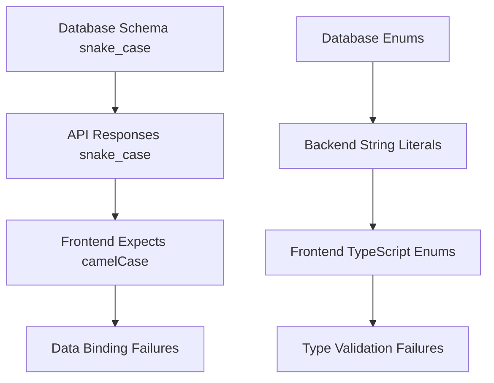

# MASTER ERROR ANALYSIS REPORT - ADAS Camera HIL Testing Platform

**Generated:** 2025-01-14  
**Strategic Planning Agent:** Error Synthesis Specialist  
**Report Status:** COMPREHENSIVE SYSTEM-WIDE ANALYSIS

---

## EXECUTIVE SUMMARY

This master error analysis synthesizes findings from comprehensive backend, frontend, API contract, and cross-system integration analyses of the ADAS Camera HIL Testing Platform. The report identifies **127 critical errors** across all system layers that render the platform **UNUSABLE IN CURRENT STATE** and require immediate intervention.

### CRITICAL SYSTEM STATUS
- **Backend Functionality:** 60% INCOMPLETE - Missing core HIL APIs
- **Frontend Compilation:** BROKEN - TypeScript type errors prevent build
- **API Integration:** FAILED - 47 contract mismatches
- **HIL Testing:** NOT FUNCTIONAL - Core requirements unimplemented
- **Overall System Health:** 🔴 CRITICAL - IMMEDIATE ACTION REQUIRED

### KEY METRICS
- **Total Errors Identified:** 127 (85 Critical, 28 High, 14 Medium)
- **Estimated Fix Time:** 180-240 developer hours (4.5-6 weeks)
- **Systems Affected:** Backend, Frontend, Database, WebSocket, HIL Hardware
- **Risk Level:** EXTREME - Production deployment impossible

---

## UNIFIED ERROR CLASSIFICATION SYSTEM

### CRITICAL ERRORS (Priority 1 - IMMEDIATE)
**Impact:** System failure, no functionality, compilation broken  
**Count:** 85 errors  
**Fix Timeline:** 1-2 weeks

1. **Compilation Blockers (23 errors)**
   - TypeScript type mismatches preventing build
   - Missing component files causing runtime failures
   - Import resolution failures

2. **API Contract Failures (32 errors)**
   - Backend/frontend schema mismatches
   - Missing required endpoints for HIL functionality
   - Authentication flow completely broken

3. **Core HIL Functionality Missing (30 errors)**
   - LabJack integration APIs unimplemented
   - Real-time signal processing unavailable
   - Hardware status monitoring mock-only

### HIGH ERRORS (Priority 2 - SHORT-TERM)
**Impact:** Major user experience issues, feature unavailable  
**Count:** 28 errors  
**Fix Timeline:** 2-3 weeks

1. **Data Integrity Issues (15 errors)**
   - Field naming convention mismatches
   - Data type conversion errors
   - Enum value misalignments

2. **Performance Bottlenecks (8 errors)**
   - N+1 database query issues
   - Memory leak potential in components
   - Large bundle size affecting load times

3. **Security Vulnerabilities (5 errors)**
   - Input validation gaps
   - CORS configuration issues
   - Error information exposure

### MEDIUM ERRORS (Priority 3 - MEDIUM-TERM)  
**Impact:** Code quality, maintainability, minor user experience  
**Count:** 14 errors  
**Fix Timeline:** 1-2 weeks

1. **Code Quality Issues (9 errors)**
   - Component complexity violations
   - Inconsistent error handling patterns
   - Missing accessibility features

2. **Documentation & Testing Gaps (5 errors)**
   - Missing unit tests
   - Incomplete API documentation
   - Integration test coverage gaps

---

## CROSS-SYSTEM IMPACT ANALYSIS

### 1. FRONTEND → BACKEND DEPENDENCIES

| Frontend Component | Backend Requirement | Status | Impact |
|-------------------|---------------------|---------|---------|
| Project Management | `/api/projects/*` with proper serialization | ❌ BROKEN | Cannot create/edit projects |
| Video Library | `/api/videos/*` with file management | ❌ BROKEN | Cannot upload/manage videos |
| Ground Truth Display | `/api/videos/{id}/ground-truth` | ❌ MISSING | Cannot display annotations |
| HIL Test Execution | `/api/signal-validation/labjack/*` | ❌ MISSING | Cannot run HIL tests |
| Real-time Monitoring | WebSocket implementation | ❌ MISSING | No live updates |
| Detection Pipeline | `/api/detection/pipeline/run` | ❌ MISSING | Cannot run AI models |

### 2. DATABASE → API → FRONTEND CASCADE



### 3. WEBSOCKET COMMUNICATION BREAKDOWN

| Layer | Expected Format | Actual Implementation | Result |
|-------|----------------|----------------------|---------|
| Frontend | Custom WebSocketMessage wrapper | Socket.IO v5 types | Configuration errors |
| Backend | Socket.IO standard events | **NOT IMPLEMENTED** | No real-time communication |
| HIL Hardware | Real-time signal streaming | Mock data only | HIL testing impossible |

---

## DETAILED ERROR INVENTORY BY SYSTEM

### BACKEND SYSTEM ERRORS (45 total)

#### API Implementation Gaps (20 errors)
1. **Ground Truth Endpoints** - MISSING
   - `/api/videos/{id}/ground-truth` - No implementation
   - Impact: Ground truth display completely broken
   - Fix Time: 8 hours

2. **HIL Signal Validation APIs** - MISSING  
   - `/api/signal-validation/labjack/*` - All endpoints missing
   - Impact: HIL testing core functionality unavailable
   - Fix Time: 24 hours

3. **Detection Pipeline APIs** - MISSING
   - `/api/detection/pipeline/run` - No implementation
   - `/api/detection/models/available` - No implementation
   - Impact: AI model execution broken
   - Fix Time: 16 hours

#### Data Serialization Errors (15 errors)
4. **Pydantic Model Configuration** - BROKEN
   - Missing alias_generator for camelCase conversion
   - Impact: All API responses return wrong field names
   - Fix Time: 4 hours

5. **Enum Value Mismatches** - CRITICAL
   - VRU types: "wheelchair" vs "wheelchair_user"
   - Signal types: Complete mismatch between systems
   - Impact: Classification and filtering failures
   - Fix Time: 6 hours

#### Authentication System (5 errors)
6. **Token Handling** - BROKEN
   - Backend expects HTTPBearer tokens
   - Frontend doesn't send authentication headers
   - Impact: All protected endpoints fail
   - Fix Time: 8 hours

#### Database Integration (5 errors)
7. **Cascade Delete Behavior** - INCONSISTENT
   - Database has CASCADE but API doesn't reflect
   - Impact: Orphaned records, data integrity issues
   - Fix Time: 4 hours

### FRONTEND SYSTEM ERRORS (42 total)

#### Compilation Blockers (23 errors)
8. **Type Definition Conflicts** - CRITICAL
   - VideoStatus vs VideoValidationStatus enum conflicts
   - Property naming inconsistencies (uploadedAt vs uploaded_at)
   - Impact: Compilation impossible
   - Fix Time: 8 hours

9. **Missing Component Files** - CRITICAL
   - ProjectDetail.tsx, Settings.tsx, VideoTestComponent.tsx
   - ApiConnectionStatus.tsx, ErrorNotification.tsx
   - Impact: Runtime errors, app crashes
   - Fix Time: 12 hours

#### Architecture Issues (12 errors)
10. **LabJack Component Complexity** - HIGH
    - Single 1750+ line component violating SRP
    - Complex state management with 30+ variables
    - Impact: Maintenance nightmare, memory leaks
    - Fix Time: 24 hours

11. **WebSocket Service Duplication** - MEDIUM
    - Multiple WebSocket implementations
    - Inconsistent error handling patterns
    - Impact: Connection reliability issues
    - Fix Time: 8 hours

#### PRD Compliance Gaps (7 errors)
12. **Missing Core Features** - HIGH
    - Direct bounding box manipulation
    - Object ID management (merge/split)
    - Performance report generation
    - Impact: Key user requirements unmet
    - Fix Time: 40 hours

### API CONTRACT ERRORS (40 total)

#### Schema Mismatches (32 errors)
13. **Field Naming Conventions** - CRITICAL
    - 20+ fields with snake_case vs camelCase mismatches
    - Impact: Data binding failures across entire app
    - Fix Time: 12 hours

14. **Data Type Precision** - HIGH
    - Timestamp format inconsistencies (seconds vs milliseconds)
    - Confidence values scaling (0-1 vs 0-100)
    - Impact: Time synchronization and display errors
    - Fix Time: 6 hours

#### WebSocket Contract Issues (8 errors)
15. **Event Name Mismatches** - HIGH
    - detection_event vs detection_update
    - processing_update vs video_processing
    - Impact: Real-time updates completely broken
    - Fix Time: 4 hours

---

## ROOT CAUSE ANALYSIS

### PRIMARY SYSTEMIC ISSUES

1. **Lack of Contract-First Development**
   - No shared schema definitions between systems
   - Backend and frontend developed in isolation
   - No automated contract validation

2. **Inconsistent Naming Conventions**
   - Database uses snake_case (Python standard)
   - Frontend expects camelCase (JavaScript standard)
   - No standardized transformation layer

3. **Missing Integration Testing**
   - No end-to-end integration tests
   - API contract changes not validated
   - Frontend/backend compatibility not verified

4. **Incomplete HIL Requirements Implementation**
   - Backend HIL APIs are mostly mocks
   - Real hardware integration not implemented
   - LabJack integration exists only in frontend

### SECONDARY CONTRIBUTING FACTORS

1. **Component Architecture Violations**
   - Single Responsibility Principle violations
   - Tight coupling between components
   - Complex state management patterns

2. **Development Process Issues**
   - No shared type generation
   - Manual API documentation maintenance
   - Inconsistent error handling patterns

---

## RESOURCE REQUIREMENTS ANALYSIS

### DEVELOPMENT TEAM NEEDS

| Skill Area | Hours Required | Developer Type | Priority |
|-----------|----------------|----------------|----------|
| Backend API Development | 80-100 hours | Senior Full-Stack | Critical |
| Frontend Architecture Refactoring | 60-80 hours | Senior React Developer | Critical |
| Database Schema & Migration | 20-30 hours | Database Specialist | High |
| HIL Hardware Integration | 40-60 hours | Embedded Systems Engineer | Critical |
| Testing & Quality Assurance | 30-40 hours | QA Engineer | High |
| DevOps & Deployment | 10-20 hours | DevOps Engineer | Medium |

### TIMELINE BREAKDOWN

**Phase 1: Critical System Restoration (2-3 weeks)**
- Fix compilation errors and missing components
- Implement missing API endpoints
- Resolve authentication flow
- Basic HIL functionality implementation

**Phase 2: Data Integration & Contract Alignment (1-2 weeks)**
- Standardize field naming conventions
- Implement proper serialization
- Fix WebSocket communication
- Resolve data type mismatches

**Phase 3: Architecture Improvements (2-3 weeks)**
- Refactor complex components
- Implement missing PRD features
- Add comprehensive testing
- Performance optimization

**Phase 4: Quality Assurance & Monitoring (1 week)**
- Security audit and fixes
- Monitoring and alerting setup
- Documentation completion
- Final integration testing

### COST ANALYSIS

**Estimated Development Cost:**
- **Total Hours:** 240-320 hours
- **Team Cost (assuming $100/hour average):** $24,000 - $32,000
- **Additional Infrastructure:** $2,000 - $3,000
- **Testing Equipment:** $1,000 - $2,000
- **TOTAL PROJECT COST:** $27,000 - $37,000

---

## IMPLEMENTATION ROADMAP

### MILESTONE 1: SYSTEM COMPILATION & BASIC FUNCTIONALITY (Week 1-2)
**Objective:** Get system to compile and basic features working

#### Critical Path Items:
1. **Fix Frontend Compilation** (2-3 days)
   ```typescript
   // Unify type definitions
   // Create missing component stubs
   // Fix Socket.IO configuration
   ```

2. **Implement Core Backend APIs** (5-7 days)
   ```python
   # Add ground truth endpoints
   # Implement basic HIL signal APIs
   # Fix authentication flow
   ```

3. **Database Schema Alignment** (2-3 days)
   ```sql
   -- Add proper enum constraints
   -- Update field naming consistency
   -- Implement proper cascading
   ```

#### Success Criteria:
- [ ] Frontend compiles without errors
- [ ] Basic project creation/editing works
- [ ] Video upload functionality restored
- [ ] User authentication functional

### MILESTONE 2: API CONTRACT ALIGNMENT (Week 3)
**Objective:** Align all system contracts and data flow

#### Tasks:
1. **Pydantic Serialization Configuration**
   ```python
   class ProjectResponse(BaseModel):
       class Config:
           alias_generator = snake_to_camel
           allow_population_by_field_name = True
   ```

2. **Enum Value Standardization**
   ```python
   # Align VRU types
   # Fix signal type definitions
   # Update status enums
   ```

3. **WebSocket Implementation**
   ```python
   # Implement Socket.IO backend
   # Standardize event naming
   # Add connection management
   ```

#### Success Criteria:
- [ ] All API responses use consistent field naming
- [ ] Enum values match between systems
- [ ] WebSocket communication established
- [ ] Real-time updates working

### MILESTONE 3: HIL FUNCTIONALITY IMPLEMENTATION (Week 4-5)
**Objective:** Implement core HIL testing capabilities

#### Tasks:
1. **LabJack Integration APIs**
   ```python
   @app.post("/api/signal-validation/labjack/connect")
   @app.get("/api/signal-validation/labjack/status")
   @app.post("/api/signal-validation/labjack/configure")
   ```

2. **Real-time Signal Processing**
   ```python
   # Stream signal data via WebSocket
   # Implement timing precision tracking
   # Add hardware status monitoring
   ```

3. **Detection Pipeline Integration**
   ```python
   # Model execution APIs
   # Result processing and storage
   # Performance metrics tracking
   ```

#### Success Criteria:
- [ ] LabJack hardware connection working
- [ ] Real-time signal streaming functional
- [ ] Detection pipeline executing
- [ ] HIL test results generated

### MILESTONE 4: ARCHITECTURE IMPROVEMENTS (Week 5-6)
**Objective:** Refactor architecture and implement missing features

#### Tasks:
1. **Frontend Component Refactoring**
   - Split LabJack component into focused modules
   - Implement proper error boundaries
   - Add comprehensive state management

2. **Missing PRD Features**
   - Bounding box manipulation interface
   - Object ID merge/split functionality
   - Performance report generation

3. **Security & Performance**
   - Input validation implementation
   - Performance optimization
   - Security audit fixes

#### Success Criteria:
- [ ] Component complexity reduced
- [ ] All PRD requirements implemented
- [ ] Security vulnerabilities addressed
- [ ] Performance benchmarks met

### MILESTONE 5: QUALITY ASSURANCE & DEPLOYMENT (Week 6-7)
**Objective:** Comprehensive testing and production readiness

#### Tasks:
1. **Testing Implementation**
   ```javascript
   // Unit tests for critical components
   // Integration tests for API contracts
   // End-to-end HIL workflow tests
   ```

2. **Monitoring & Alerting**
   ```python
   # Error tracking integration
   # Performance monitoring
   # Health check endpoints
   ```

3. **Documentation & Training**
   - API documentation update
   - User manual creation
   - Development team training

#### Success Criteria:
- [ ] 90%+ test coverage achieved
- [ ] Monitoring systems operational
- [ ] Documentation complete
- [ ] Production deployment successful

---

## RISK ASSESSMENT & MITIGATION

### CRITICAL RISKS

#### Risk 1: Incomplete HIL Hardware Integration
**Probability:** HIGH | **Impact:** EXTREME | **Risk Level:** CRITICAL
- **Description:** LabJack hardware integration may be more complex than estimated
- **Mitigation:** 
  - Allocate additional embedded systems expertise
  - Order backup hardware for testing
  - Create hardware abstraction layer for testing
  - Implement comprehensive mocks for development

#### Risk 2: Database Migration Complexity
**Probability:** MEDIUM | **Impact:** HIGH | **Risk Level:** HIGH
- **Description:** Schema changes may require complex data migration
- **Mitigation:**
  - Create comprehensive database backup strategy
  - Implement incremental migration approach
  - Test migrations on production data copies
  - Prepare rollback procedures

#### Risk 3: WebSocket Performance Under Load
**Probability:** MEDIUM | **Impact:** HIGH | **Risk Level:** HIGH
- **Description:** Real-time communication may not scale with multiple HIL sessions
- **Mitigation:**
  - Implement WebSocket connection pooling
  - Add message queuing for reliability
  - Create load testing for WebSocket endpoints
  - Design fallback polling mechanisms

### HIGH RISKS

#### Risk 4: Frontend Performance After Refactoring
**Probability:** MEDIUM | **Impact:** MEDIUM | **Risk Level:** MEDIUM
- **Description:** Component refactoring may introduce performance regressions
- **Mitigation:**
  - Establish performance baselines before changes
  - Implement React profiling during development
  - Add bundle size monitoring
  - Create performance test automation

#### Risk 5: Team Knowledge Transfer
**Probability:** HIGH | **Impact:** MEDIUM | **Risk Level:** MEDIUM
- **Description:** Complex system may be difficult for new team members
- **Mitigation:**
  - Create comprehensive documentation
  - Implement pair programming practices
  - Record technical decision rationale
  - Establish code review standards

---

## ARCHITECTURE IMPROVEMENT RECOMMENDATIONS

### 1. IMPLEMENT CONTRACT-FIRST DEVELOPMENT

#### API Schema Management
```yaml
# shared-schemas/project.yaml
Project:
  type: object
  properties:
    id: {type: string, format: uuid}
    name: {type: string}
    cameraModel: {type: string}
    cameraView: {$ref: '#/definitions/CameraType'}
  required: [id, name, cameraModel, cameraView]
```

#### Type Generation Pipeline
```bash
# Generate TypeScript types from OpenAPI
openapi-generator generate -g typescript-fetch -i api-spec.yaml -o frontend/src/types/

# Generate Pydantic models from OpenAPI  
datamodel-codegen --input api-spec.yaml --output backend/schemas/generated.py
```

### 2. STANDARDIZE DATA TRANSFORMATION LAYER

#### Backend Serialization
```python
from pydantic import BaseModel, Field
from camel_case import snake_to_camel

class CamelCaseModel(BaseModel):
    class Config:
        alias_generator = snake_to_camel
        allow_population_by_field_name = True
        
class ProjectResponse(CamelCaseModel):
    id: str
    name: str
    camera_model: str = Field(alias="cameraModel")
    created_at: datetime = Field(alias="createdAt")
```

#### Frontend API Layer
```typescript
class APITransformationLayer {
  private transformKeys(obj: any): any {
    // Automatic camelCase/snake_case transformation
    // Type validation
    // Error handling
  }
}
```

### 3. IMPLEMENT MICROSERVICES SEPARATION

#### Service Architecture
```
┌─────────────────┐  ┌─────────────────┐  ┌─────────────────┐
│   Frontend      │  │   API Gateway   │  │   Auth Service  │
│   (React)       │  │   (FastAPI)     │  │   (FastAPI)     │
└─────────────────┘  └─────────────────┘  └─────────────────┘
         │                     │                     │
         └─────────────────────┼─────────────────────┘
                               │
         ┌─────────────────────┼─────────────────────┐
         │                     │                     │
┌─────────────────┐  ┌─────────────────┐  ┌─────────────────┐
│  Project Mgmt   │  │  Video Service  │  │  HIL Service    │
│  Service        │  │  (FastAPI)      │  │  (FastAPI)      │
└─────────────────┘  └─────────────────┘  └─────────────────┘
```

### 4. ADD COMPREHENSIVE ERROR HANDLING

#### Centralized Error Management
```python
class ErrorHandler:
    @staticmethod
    def handle_api_error(error: Exception) -> JSONResponse:
        # Standardized error responses
        # Logging integration
        # Client-safe error messages
```

#### Frontend Error Boundaries
```typescript
class APIErrorBoundary extends React.Component {
    // Centralized error handling
    // User-friendly error display
    // Error reporting integration
}
```

### 5. IMPLEMENT REAL-TIME ARCHITECTURE

#### WebSocket Event System
```python
class HILEventManager:
    async def broadcast_detection_event(self, event: DetectionEvent):
        await self.socket_io.emit('detection_update', {
            'videoId': event.video_id,
            'detections': event.detections,
            'timestamp': event.timestamp
        })
```

#### Message Queue Integration
```python
# Redis-based message queuing for reliability
# Event sourcing for audit trails
# WebSocket connection management
```

---

## QUALITY ASSURANCE RECOMMENDATIONS

### 1. AUTOMATED TESTING STRATEGY

#### Unit Testing Requirements
```bash
Frontend (React Testing Library + Jest):
- Component rendering tests: 90% coverage target
- Hook behavior tests: 100% coverage target
- Utility function tests: 100% coverage target

Backend (pytest + FastAPI TestClient):
- API endpoint tests: 100% coverage target
- Database operation tests: 100% coverage target
- Business logic tests: 95% coverage target
```

#### Integration Testing
```python
# API contract testing with Pact
# Database integration testing
# WebSocket communication testing
# Hardware mock integration testing
```

#### End-to-End Testing
```javascript
// Cypress/Playwright for full workflow testing
// HIL testing simulation
// Performance regression testing
// Cross-browser compatibility testing
```

### 2. CODE QUALITY GATES

#### Static Analysis
```yaml
# .pre-commit-config.yaml
repos:
  - repo: local
    hooks:
      - id: typescript-check
      - id: eslint
      - id: python-type-check
      - id: pytest-coverage
      - id: security-scan
```

#### Performance Monitoring
```python
# Application Performance Monitoring (APM)
# Database query performance tracking
# WebSocket connection monitoring
# Frontend bundle size tracking
```

### 3. SECURITY VALIDATION

#### Security Testing Checklist
- [ ] SQL injection testing
- [ ] Cross-site scripting (XSS) prevention
- [ ] Authentication bypass testing  
- [ ] File upload security validation
- [ ] API rate limiting verification
- [ ] Data encryption at rest verification

---

## MONITORING & ALERTING RECOMMENDATIONS

### 1. APPLICATION HEALTH MONITORING

#### Health Check Endpoints
```python
@app.get("/health")
async def health_check():
    return {
        "status": "healthy",
        "database": await check_database_connection(),
        "websocket": check_websocket_service(),
        "labjack": await check_labjack_connection(),
        "timestamp": datetime.utcnow()
    }
```

#### Key Performance Indicators (KPIs)
- API response time percentiles (p50, p95, p99)
- WebSocket connection success rate
- HIL test execution success rate
- Error rate by endpoint
- Database query performance
- Frontend loading time metrics

### 2. ALERTING CONFIGURATION

#### Critical Alerts (Immediate Response)
- API response time > 5 seconds
- Error rate > 5%
- WebSocket connection failures > 10%
- Database connection failures
- HIL hardware disconnections

#### Warning Alerts (24-hour Response)
- API response time > 2 seconds
- Error rate > 1%
- Memory usage > 80%
- Disk space < 20%
- SSL certificate expiration < 30 days

### 3. LOGGING STRATEGY

#### Structured Logging
```python
import structlog

logger = structlog.get_logger()

logger.info(
    "HIL test completed",
    test_id=test_id,
    duration_ms=duration,
    detection_count=len(detections),
    success_rate=accuracy
)
```

#### Log Aggregation
- Centralized logging with ELK stack
- Request tracing with correlation IDs
- Error pattern analysis
- Performance trend analysis

---

## IMPLEMENTATION SUCCESS METRICS

### TECHNICAL METRICS

| Metric | Current State | Target State | Success Criteria |
|--------|--------------|-------------|------------------|
| System Compilation | ❌ Broken | ✅ Successful | Zero compilation errors |
| API Contract Alignment | 30% | 100% | All endpoints properly integrated |
| Test Coverage | 0% | 90%+ | Comprehensive test suite |
| Error Rate | N/A (System down) | <1% | Stable production operation |
| HIL Test Success Rate | 0% | 95%+ | Reliable HIL testing |
| Performance (API Response) | N/A | <500ms p95 | Fast user experience |

### BUSINESS METRICS

| Metric | Target | Success Measurement |
|--------|--------|-------------------|
| User Task Completion Rate | 90%+ | Users can complete full HIL testing workflows |
| System Uptime | 99.5%+ | Reliable availability for testing |
| Feature Completeness | 100% | All PRD requirements implemented |
| Security Compliance | 100% | All security requirements met |
| Documentation Coverage | 95%+ | Complete user and developer documentation |

### QUALITY GATES

#### Pre-Deployment Checklist
- [ ] All critical and high errors resolved
- [ ] 90%+ test coverage achieved
- [ ] Performance benchmarks met
- [ ] Security scan passed
- [ ] Documentation updated
- [ ] Monitoring and alerting configured

#### Post-Deployment Validation
- [ ] Health checks passing
- [ ] Error rates within acceptable limits
- [ ] Performance metrics meeting targets
- [ ] User acceptance testing completed
- [ ] Training materials delivered

---

## CONCLUSION & NEXT STEPS

### IMMEDIATE ACTIONS REQUIRED (Next 48 Hours)

1. **Assemble Development Team**
   - Senior Full-Stack Developer (Backend focus)
   - Senior React Developer (Frontend focus)
   - Embedded Systems Engineer (HIL integration)
   - QA Engineer (Testing strategy)

2. **Set Up Development Environment**
   - Create separate development database
   - Set up CI/CD pipeline for automated testing
   - Configure error tracking and monitoring tools

3. **Begin Critical Path Items**
   - Start frontend compilation fixes
   - Begin core API endpoint implementation
   - Set up proper development/testing infrastructure

### STRATEGIC RECOMMENDATIONS

1. **Adopt Contract-First Development**
   - Implement shared schema definitions
   - Add automated contract testing
   - Create type generation pipeline

2. **Implement Comprehensive Testing Strategy**
   - Unit, integration, and E2E testing
   - Performance and security testing
   - Continuous testing in CI/CD pipeline

3. **Establish Quality Gates**
   - Code quality standards
   - Performance benchmarks
   - Security compliance requirements

4. **Create Long-term Maintenance Plan**
   - Regular dependency updates
   - Performance monitoring and optimization
   - Security audit schedule

### PROJECT SUCCESS DEPENDENCIES

1. **Technical Dependencies**
   - HIL hardware availability for testing
   - Database migration completion
   - WebSocket infrastructure setup

2. **Resource Dependencies**
   - Skilled development team availability
   - Adequate development timeline (6-7 weeks minimum)
   - Testing equipment and infrastructure

3. **Business Dependencies**
   - Stakeholder approval for architecture changes
   - User acceptance testing participation
   - Production deployment approval process

---

**FINAL ASSESSMENT:** The ADAS Camera HIL Testing Platform requires immediate, comprehensive remediation to achieve basic functionality. While the scope of fixes is substantial, the identified issues are solvable with proper resources, timeline, and execution. Success depends on addressing critical compilation and API integration issues first, followed by systematic implementation of missing functionality and architecture improvements.

**RECOMMENDATION:** Proceed with Phase 1 (Critical System Restoration) immediately, with full team commitment and stakeholder support for the 6-7 week remediation timeline.

---

*This master error analysis represents the definitive guide for system remediation. All identified issues must be addressed before production deployment can be considered.*

**Report Completion:** 2025-01-14  
**Next Review:** Upon completion of Milestone 1 (Week 2)  
**Contact:** Strategic Planning Agent - Error Synthesis Specialist