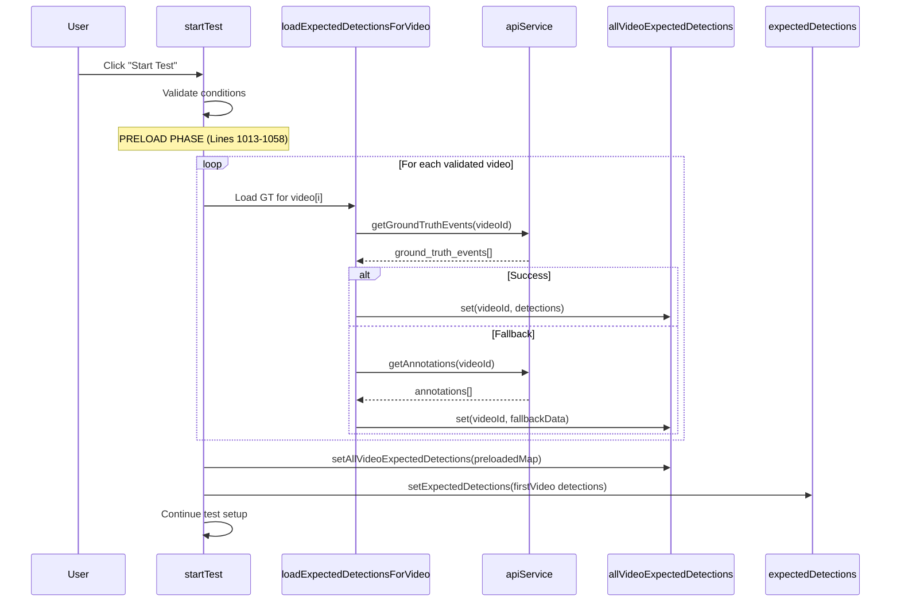
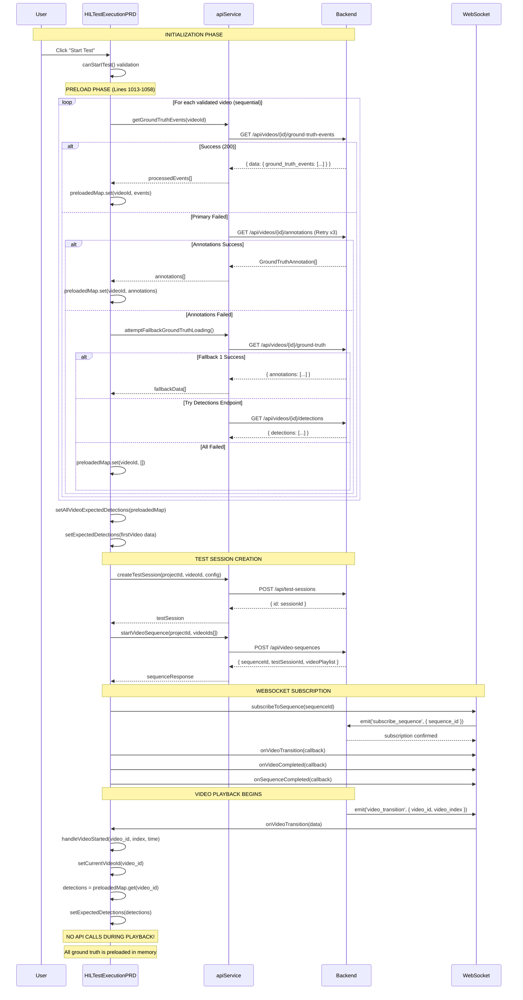

# Frontend Ground-Truth Data Fetching & State Management Analysis

**Research Date:** 2025-10-31
**Component:** HILTestExecutionPRD.tsx
**Focus:** Ground-truth data loading, state management, and video transition handling

---

## Executive Summary

The frontend HIL test execution page implements a **preload-first architecture** where ground-truth data for ALL videos in a sequence is loaded **BEFORE** test execution begins. This prevents race conditions during video transitions. The system uses multiple fallback mechanisms and has comprehensive error handling, but there are potential state synchronization issues between WebSocket events and React state updates.

---

## 1. API Integration Architecture

### 1.1 Primary Endpoints Used

```typescript
// Ground Truth Events (Primary/Canonical)
GET /api/videos/{videoId}/ground-truth-events
Response: {
  success: true,
  data: {
    ground_truth_events: Array<{
      id: string,
      timestamp: number,           // Video time in seconds
      video_frame: number,
      video_time_seconds?: number,
      videoTimeSeconds?: number,
      class_label: string,
      confidence: number,
      x, y, width, height: number
    }>
  }
}

// Annotations (Fallback #1)
GET /api/videos/{videoId}/annotations
Response: Array<GroundTruthAnnotation>

// Ground Truth Endpoint (Fallback #2)
GET /api/videos/{videoId}/ground-truth
Response: { annotations: [], detections: [], data: [] }

// Detections Endpoint (Fallback #3)
GET /api/videos/{videoId}/detections
Response: { detections: [] }
```

### 1.2 API Service Methods

**File:** `/home/rigade/Testing/ai-model-validation-platform/frontend/src/services/api.ts`

```typescript
// Lines 1099-1146: Primary ground truth events method
async getGroundTruthEvents(videoId: string): Promise<any> {
  const response = await this.api.get(`/api/videos/${videoId}/ground-truth-events`);
  // Normalizes field names (timestamp, video_frame, class_label)
  // Returns { success: true, data: { ground_truth_events: [...] } }
}

// Lines 1473-1475: Annotation fetching with caching
async getAnnotations(videoId: string): Promise<GroundTruthAnnotation[]> {
  return this.cachedRequest<GroundTruthAnnotation[]>(
    'GET',
    `/api/videos/${videoId}/annotations`
  );
}
```

---

## 2. State Management Flow

### 2.1 State Variables

**File:** `HILTestExecutionPRD.tsx` (Lines 150-156)

```typescript
// Current active detection list (for UI display)
const [expectedDetections, setExpectedDetections] =
  useState<{timestamp: number, id: string}[]>([]);

// Complete preloaded map for ALL videos in sequence
const [allVideoExpectedDetections, setAllVideoExpectedDetections] =
  useState<Map<string, {timestamp: number, id: string}[]>>(new Map());

// Current video tracking
const [currentVideoId, setCurrentVideoId] = useState<string | null>(null);
const [currentVideoIdx, setCurrentVideoIdx] = useState<number>(0);
const [videoStartTimes, setVideoStartTimes] = useState<Map<string, number>>(new Map());
```

### 2.2 State Initialization Sequence



---

## 3. Ground Truth Loading Implementation

### 3.1 Preload Strategy (Lines 1013-1058)

```typescript
const startTest = async () => {
  // ... validation ...

  // =====================================================
  // CRITICAL: PRELOAD ALL GROUND TRUTH BEFORE TEST START
  // =====================================================
  console.log(`🔄 [HIL] Preloading ground truth for ${validatedVideos.length} videos...`);

  let totalDetections = 0;
  const preloadedMap = new Map<string, {timestamp: number, id: string}[]>();

  // SEQUENTIAL LOADING (Not parallel - ensures order and error handling)
  for (let i = 0; i < validatedVideos.length; i++) {
    const video = validatedVideos[i];

    try {
      const detections = await loadExpectedDetectionsForVideo(video);
      preloadedMap.set(video.id, detections);
      totalDetections += detections.length;
      console.log(`✅ [HIL] Preloaded ${detections.length} detections for video ${i + 1}`);
    } catch (err) {
      console.error(`❌ [HIL] Failed to preload ground truth for video ${i + 1}:`, err);
      preloadedMap.set(video.id, []); // Empty array prevents undefined
    }
  }

  // ATOMIC STATE UPDATE
  setAllVideoExpectedDetections(preloadedMap);

  // Initialize first video's detections
  const firstVideoId = validatedVideos[0]?.id;
  if (firstVideoId) {
    setExpectedDetections(preloadedMap.get(firstVideoId) ?? []);
  }

  console.log(`✅ [HIL] Preloaded ${totalDetections} total detections`);

  // ZERO DETECTIONS WARNING (Lines 1047-1054)
  if (totalDetections === 0) {
    console.warn('⚠️ [HIL] No ground truth detections preloaded');
    showSnackbar('No ground truth data found. Test will proceed in debugging mode.', 'warning');

    // Trigger automatic diagnostic (after 1 second delay)
    setTimeout(async () => {
      await debugGroundTruthIssues();
    }, 1000);
  }

  // Continue with test setup...
}
```

### 3.2 Per-Video Loading Logic (Lines 622-835)

```typescript
const loadExpectedDetectionsForVideo = useCallback(
  async (video: VideoFile): Promise<{timestamp: number, id: string}[]> => {

    console.log('🚀 [HIL GROUND TRUTH] Loading annotations for:', {
      id: video.id,
      filename: video.filename,
      status: video.status
    });

    try {
      // ============================================
      // PRIMARY PATH: Ground Truth Events Endpoint
      // ============================================
      const gtEventsResponse = await apiService.getGroundTruthEvents(video.id);
      const groundTruthEvents: any[] = gtEventsResponse?.data?.ground_truth_events ?? [];

      if (Array.isArray(groundTruthEvents) && groundTruthEvents.length > 0) {
        console.log(`✅ Received ${groundTruthEvents.length} ground truth events`);

        // NORMALIZATION: Handle multiple timestamp field names
        const processedEvents = groundTruthEvents.map((event, index) => {
          const rawTimestamp =
            typeof event.timestamp === 'number' ? event.timestamp :
            event.video_time_seconds ?? event.videoTimeSeconds ?? null;

          const timestampSeconds = rawTimestamp !== null ? rawTimestamp :
            (typeof event.video_frame === 'number'
              ? event.video_frame / ((video as any).fps || 24)
              : index * 2); // Default 2-second intervals

          const frameNumber = event.video_frame ?? event.frame_number ??
            Math.round(timestampSeconds * ((video as any).fps || 24));

          return {
            timestamp: timestampSeconds,
            id: event.id || event.event_id || `gt_event_${index}`,
            frameNumber,
            videoId: video.id,
            confidence: event.confidence ?? event.confidence_score ?? 1.0,
            label: event.class_label ?? event.label ?? 'pedestrian'
          };
        }).sort((a, b) => a.timestamp - b.timestamp);

        return processedEvents;
      }

      // ============================================
      // FALLBACK PATH 1: Annotations Endpoint
      // ============================================
      console.warn('⚠️ No ground truth events; trying annotations...');

      let annotations = [];
      let attempts = 0;
      const maxAttempts = 3;
      const retryDelay = 1000;

      // RETRY LOGIC for annotations
      while (attempts < maxAttempts) {
        try {
          attempts++;
          annotations = await apiService.getAnnotations(video.id);
          console.log(`📊 Raw annotations (attempt ${attempts}):`, annotations);
          break;
        } catch (retryError: any) {
          if (attempts < maxAttempts) {
            await new Promise(resolve => setTimeout(resolve, retryDelay));
          }
        }
      }

      // Process annotations if available
      if (Array.isArray(annotations) && annotations.length > 0) {
        const expectedTimes = annotations.map((ann, idx) => ({
          timestamp: ann.timestamp ?? (idx * 3),
          id: ann.id || `ann_${idx}`,
          frameNumber: ann.frameNumber ?? 0,
          confidence: 0.9
        })).sort((a, b) => a.timestamp - b.timestamp);

        return expectedTimes;
      }

      // ============================================
      // FALLBACK PATH 2: attemptFallbackGroundTruthLoading
      // ============================================
      console.log('🔄 Attempting fallback methods...');
      const fallbackResult = await attemptFallbackGroundTruthLoading(video);

      if (fallbackResult.length > 0) {
        showSnackbar(`Loaded ${fallbackResult.length} via fallback`, 'success');
        return fallbackResult;
      } else {
        showSnackbar(`Failed to load ground truth for ${video.filename}`, 'error');
        return [];
      }

    } catch (error: any) {
      console.error('❌ Failed to load annotations:', error);
      return [];
    }
  },
  [showSnackbar, attemptFallbackGroundTruthLoading]
);
```

### 3.3 Fallback Chain (Lines 562-620)

```typescript
const attemptFallbackGroundTruthLoading = async (video: any): Promise<any[]> => {
  try {
    // Method 1: /api/videos/{id}/ground-truth
    try {
      const gtResponse = await apiService.get(`/api/videos/${video.id}/ground-truth`);
      const gtData = gtResponse.annotations || gtResponse.detections || gtResponse.data;
      if (Array.isArray(gtData) && gtData.length > 0) {
        return gtData.map((item, index) => ({
          timestamp: (item.timestamp || (index * 5)) / 1000,
          id: item.id || `fallback_${index}`,
          frameNumber: item.frame_number || index * 150,
          confidence: item.confidence || 0.8
        }));
      }
    } catch (gtError) {
      console.warn('⚠️ Ground truth endpoint failed:', gtError);
    }

    // Method 2: /api/videos/{id}/detections
    try {
      const detectionsResponse = await apiService.get(`/api/videos/${video.id}/detections`);
      const detections = detectionsResponse.detections || detectionsResponse.data;
      if (Array.isArray(detections) && detections.length > 0) {
        return detections.map((item, index) => ({
          timestamp: (item.timestamp || item.time || (index * 3)) / 1000,
          id: item.id || `detection_${index}`,
          frameNumber: item.frame || index * 90,
          confidence: item.confidence || 0.7
        }));
      }
    } catch (detError) {
      console.warn('⚠️ Detections endpoint failed:', detError);
    }

    // Method 3: Check video.metadata.annotations
    if (video.metadata && video.metadata.annotations) {
      return video.metadata.annotations.map((ann: any, index: number) => ({
        timestamp: (ann.timestamp || (index * 4)) / 1000,
        id: ann.id || `meta_${index}`,
        frameNumber: ann.frame || index * 120,
        confidence: 0.6
      }));
    }

    return [];
  } catch (error: any) {
    console.error('❌ Fallback loading failed:', error);
    return [];
  }
};
```

---

## 4. Video Transition Handling

### 4.1 Video Started Handler (Lines 199-214)

```typescript
const handleVideoStarted = useCallback(
  (videoId: string, videoIndex: number, startTime: number) => {
    console.log('🎬 [HIL] Video started:', { videoId, videoIndex, startTime });

    // Update current video tracking
    setCurrentVideoId(videoId);
    setCurrentVideoIdx(videoIndex);
    setVideoStartTimes(prev => new Map(prev).set(videoId, startTime));

    // RETRIEVE PRELOADED DETECTIONS (No API call here!)
    const preloadedDetections = allVideoExpectedDetections.get(videoId);
    if (preloadedDetections) {
      console.log(`✅ Using preloaded ${preloadedDetections.length} detections`);
      setExpectedDetections(preloadedDetections);
    } else {
      console.warn(`⚠️ No preloaded ground truth for video ${videoIndex + 1}`);
      setExpectedDetections([]);
    }
  },
  [allVideoExpectedDetections] // Dependency on preloaded map
);
```

### 4.2 React Effect Synchronization (Lines 225-235)

```typescript
// SAFETY NET: Sync expectedDetections when currentVideoId changes
useEffect(() => {
  if (!currentVideoId) return;

  const detections = allVideoExpectedDetections.get(currentVideoId);
  if (detections) {
    setExpectedDetections(detections);
  } else {
    setExpectedDetections([]);
  }
}, [currentVideoId, allVideoExpectedDetections]);
```

### 4.3 WebSocket Video Transition Events (Lines 1138-1166)

```typescript
// Subscribe to video sequence events via WebSocket
console.log('🔌 [HIL] Subscribing to video sequence events...');
try {
  const sequenceSubscription = websocketService.subscribeToSequence(backendSequenceId);

  if (sequenceSubscription) {
    // Handle video_started events from backend
    sequenceSubscription.onVideoTransition((data: any) => {
      console.log('🎬 [HIL WebSocket] video_started event received:', data);
      if (data.video_id && data.video_index !== undefined) {
        handleVideoStarted(data.video_id, data.video_index, data.started_at || Date.now());
      }
    });

    // Handle video_ended events
    sequenceSubscription.onVideoCompleted((data: any) => {
      console.log('🏁 [HIL WebSocket] video_ended event received:', data);
    });

    // Handle sequence completion
    sequenceSubscription.onSequenceCompleted((data: any) => {
      console.log('✅ [HIL WebSocket] sequence_completed event received:', data);
      handleSequenceComplete();
    });

    console.log('✅ [HIL] WebSocket sequence subscriptions established');
  }
} catch (wsSubErr) {
  console.warn('⚠️ [HIL] WebSocket sequence subscription failed:', wsSubErr);
}
```

**WebSocket Service Implementation** (`websocketService.ts`, Lines 547-577):

```typescript
subscribeToSequence(sequenceId: string) {
  if (!sequenceId) {
    console.error('❌ Cannot subscribe: sequenceId required');
    return null;
  }

  console.log(`🎬 Subscribing to sequence: ${sequenceId}`);

  // Emit subscription request to backend
  this.emit('subscribe_sequence', { sequence_id: sequenceId });

  // Return subscription handlers
  return {
    onVideoTransition: (callback: (data: unknown) => void) => {
      return this.subscribe('video_transition', callback);
    },
    onVideoCompleted: (callback: (data: unknown) => void) => {
      return this.subscribe('video_completed', callback);
    },
    onSequenceCompleted: (callback: (data: unknown) => void) => {
      return this.subscribe('sequence_completed', callback);
    },
    unsubscribe: () => {
      this.emit('unsubscribe_sequence', { sequence_id: sequenceId });
    }
  };
}
```

---

## 5. Key Questions Answered

### 5.1 When is ground-truth data loaded?

**Answer:** **At test startup, BEFORE video playback begins**

- **Location:** `startTest()` function, lines 1013-1058
- **Timing:** Sequential preload loop executed after user clicks "Start Test" but before:
  - Creating test session
  - Initializing video sequence
  - Starting LabJack monitoring
  - Beginning video playback

**Sequence:**
1. User clicks "Start Test"
2. Validate conditions (project, videos, LabJack)
3. **PRELOAD** ground truth for ALL videos (sequential loop)
4. Store in `allVideoExpectedDetections` Map
5. Initialize `expectedDetections` with first video's data
6. Create backend test session
7. Subscribe to WebSocket events
8. Start video playback

### 5.2 How is expectedDetections map populated and updated?

**Initialization (Startup):**
```typescript
// Line 1019: Create empty map
const preloadedMap = new Map<string, {timestamp: number, id: string}[]>();

// Lines 1021-1035: Sequential population
for (let i = 0; i < validatedVideos.length; i++) {
  const video = validatedVideos[i];
  const detections = await loadExpectedDetectionsForVideo(video);
  preloadedMap.set(video.id, detections); // Add to map
}

// Line 1038: Atomic state update
setAllVideoExpectedDetections(preloadedMap);

// Lines 1039-1044: Initialize active detections
const firstVideoId = validatedVideos[0]?.id;
setExpectedDetections(preloadedMap.get(firstVideoId) ?? []);
```

**Updates (Video Transitions):**
```typescript
// Method 1: handleVideoStarted callback (Lines 199-214)
const preloadedDetections = allVideoExpectedDetections.get(videoId);
setExpectedDetections(preloadedDetections);

// Method 2: React useEffect (Lines 225-235)
useEffect(() => {
  const detections = allVideoExpectedDetections.get(currentVideoId);
  setExpectedDetections(detections);
}, [currentVideoId, allVideoExpectedDetections]);
```

**No per-video API calls during playback** - all data is preloaded!

### 5.3 What's the fallback chain if API returns empty?

**4-Level Fallback Hierarchy:**

```
Level 1 (PRIMARY):
  GET /api/videos/{id}/ground-truth-events
  └─> Returns: { data: { ground_truth_events: [...] } }
  └─> Fields: timestamp, video_frame, class_label, confidence

Level 2 (FALLBACK #1):
  GET /api/videos/{id}/annotations (with 3 retries)
  └─> Returns: GroundTruthAnnotation[]
  └─> Fields: timestamp, frameNumber, id

Level 3 (FALLBACK #2):
  attemptFallbackGroundTruthLoading():
    a) GET /api/videos/{id}/ground-truth
       └─> Returns: { annotations: [], detections: [], data: [] }

    b) GET /api/videos/{id}/detections
       └─> Returns: { detections: [] }

    c) video.metadata.annotations
       └─> Check embedded metadata

Level 4 (FINAL):
  Return [] (empty array)
  └─> Store empty array in preloadedMap
  └─> Trigger debugGroundTruthIssues() diagnostic
  └─> Show warning snackbar
  └─> Continue test in "debugging mode"
```

**Code References:**
- Level 1: Lines 634-675 (`loadExpectedDetectionsForVideo`)
- Level 2: Lines 679-756 (annotations with retry)
- Level 3: Lines 562-620 (`attemptFallbackGroundTruthLoading`)
- Level 4: Lines 1047-1054 (zero detection handler)

### 5.4 Is there still mock/legacy fallback code?

**YES - Multiple legacy patterns found:**

1. **Mock Timestamp Generation (Lines 574, 592, 606):**
```typescript
// Default to 5-second intervals if no timestamp
timestamp: (item.timestamp || (index * 5)) / 1000

// Default to 3-second intervals for detections
timestamp: (item.timestamp || item.time || (index * 3)) / 1000

// Default to 4-second intervals for metadata
timestamp: (ann.timestamp || (index * 4)) / 1000
```

2. **Default FPS Assumption (Lines 653, 659):**
```typescript
// Assume 24 FPS if not provided
const timestampSeconds = event.video_frame / ((video as any).fps || 24);
const frameNumber = Math.round(timestampSeconds * ((video as any).fps || 24));
```

3. **Index-Based Fallbacks (Lines 654, 659):**
```typescript
// Generate timestamp from index if all else fails
const timestampSeconds = index * 2; // 2-second intervals
const frameNumber = index * 150; // Assume 150 frames per detection
```

4. **Default Confidence Scores:**
```typescript
confidence: event.confidence ?? event.confidence_score ?? 1.0  // Line 666
confidence: item.confidence || 0.8  // Line 577
confidence: item.confidence || 0.7  // Line 595
confidence: 0.6  // Line 609 (metadata fallback)
confidence: 0.9  // Line 782 (annotations)
```

**These are NOT true mocks** but rather **defensive programming** to handle incomplete API responses. They ensure the system doesn't crash with null/undefined values.

### 5.5 How are video transitions handled?

**Two-Phase Mechanism:**

**Phase 1: WebSocket Event Listener (Lines 1144-1149)**
```typescript
// Backend emits video_transition event when video changes
sequenceSubscription.onVideoTransition((data: any) => {
  console.log('🎬 [HIL WebSocket] video_started event:', data);
  if (data.video_id && data.video_index !== undefined) {
    handleVideoStarted(data.video_id, data.video_index, data.started_at);
  }
});
```

**Phase 2: State Update Handler (Lines 199-214)**
```typescript
const handleVideoStarted = useCallback((videoId, videoIndex, startTime) => {
  setCurrentVideoId(videoId);           // Trigger React effect
  setCurrentVideoIdx(videoIndex);       // Update UI index
  setVideoStartTimes(...);              // Track timing

  // CRITICAL: Lookup preloaded data (no API call!)
  const preloadedDetections = allVideoExpectedDetections.get(videoId);
  setExpectedDetections(preloadedDetections);
}, [allVideoExpectedDetections]);
```

**Phase 3: React Effect Safety Net (Lines 225-235)**
```typescript
// Ensures UI stays synchronized even if WebSocket event is missed
useEffect(() => {
  const detections = allVideoExpectedDetections.get(currentVideoId);
  setExpectedDetections(detections);
}, [currentVideoId, allVideoExpectedDetections]);
```

**SequentialVideoPlayer Component:**
- Manages actual video playback and transitions
- Emits events that trigger WebSocket notifications
- Located at: `frontend/src/components/SequentialVideoPlayer.tsx`
- Receives `sequenceId` prop that's set in `startTest()` (line 1134)

---

## 6. Potential Issues & Race Conditions

### 6.1 WebSocket-State Synchronization Gap

**Issue:** WebSocket event handler has stale closure over `allVideoExpectedDetections`

**Location:** Lines 1144-1149

**Problem:**
```typescript
// Line 1141: Subscribe AFTER preload completes
const sequenceSubscription = websocketService.subscribeToSequence(backendSequenceId);

// Line 1144: Callback has closure over allVideoExpectedDetections
sequenceSubscription.onVideoTransition((data: any) => {
  // This callback references allVideoExpectedDetections from lines 199-214
  // But handleVideoStarted was defined BEFORE preload (line 199)
  handleVideoStarted(data.video_id, data.video_index, data.started_at);
});
```

**Root Cause:**
- `handleVideoStarted` is defined early (line 199) with `useCallback([allVideoExpectedDetections])`
- At that point, `allVideoExpectedDetections` is empty Map
- `startTest()` populates the Map later (line 1038)
- React should recreate the callback, BUT WebSocket subscription may hold stale reference

**Mitigation:** Lines 225-235 React effect acts as safety net by responding to `currentVideoId` changes

**Risk Level:** MEDIUM - The React effect provides backup, but timing-sensitive transitions could miss data

### 6.2 Sequential Preload Blocking

**Issue:** Ground truth loading is sequential, blocking test start

**Location:** Lines 1021-1035

**Problem:**
```typescript
// BLOCKING LOOP - Not parallelized
for (let i = 0; i < validatedVideos.length; i++) {
  const detections = await loadExpectedDetectionsForVideo(video); // Waits for each
  preloadedMap.set(video.id, detections);
}
```

**Impact:**
- For 5 videos with 1-second API latency each = 5+ seconds startup delay
- User waits after clicking "Start Test"
- No progress indicator for individual video loads

**Potential Improvement:** Parallel loading with `Promise.all()`
```typescript
const loadPromises = validatedVideos.map(video =>
  loadExpectedDetectionsForVideo(video)
    .then(detections => ({ videoId: video.id, detections }))
    .catch(err => ({ videoId: video.id, detections: [], error: err }))
);

const results = await Promise.all(loadPromises);
results.forEach(({ videoId, detections }) => {
  preloadedMap.set(videoId, detections);
});
```

**Risk Level:** LOW - Current approach is safer but slower

### 6.3 Zero Detections Silent Failure

**Issue:** Test continues even with no ground truth data

**Location:** Lines 1047-1054

**Behavior:**
```typescript
if (totalDetections === 0) {
  console.warn('⚠️ No ground truth detections preloaded');
  showSnackbar('No ground truth data found. Test will proceed in debugging mode.', 'warning');

  setTimeout(async () => {
    await debugGroundTruthIssues(); // Runs 1 second later, AFTER test starts
  }, 1000);

  // ⚠️ CONTINUES TO VIDEO PLAYBACK WITHOUT BLOCKING!
}
```

**Impact:**
- Test runs with no expected detections
- User may not realize test is invalid
- Results page shows 0% pass rate or "N/A"
- Debug diagnostic runs AFTER video starts (too late)

**Risk Level:** MEDIUM - Could lead to invalid test results being recorded

### 6.4 Multiple State Update Sources

**Issue:** `expectedDetections` can be updated from 3 different sources

**Sources:**
1. **Preload Initialization** (Line 1041): `setExpectedDetections(preloadedMap.get(firstVideoId))`
2. **WebSocket Handler** (Line 209): `setExpectedDetections(preloadedDetections)`
3. **React Effect** (Line 231): `setExpectedDetections(detections)`

**Race Condition Scenario:**
```
Time 0ms:   WebSocket event arrives → handleVideoStarted called
Time 5ms:   handleVideoStarted sets expectedDetections = video2Data
Time 10ms:  React effect fires (currentVideoId changed) → sets expectedDetections = video2Data again
Time 15ms:  Another WebSocket event (late arrival) → sets expectedDetections = video1Data (WRONG!)
```

**Mitigation:** The React effect uses `[currentVideoId, allVideoExpectedDetections]` deps, so it should stabilize
**Risk Level:** LOW-MEDIUM - Unlikely but possible with slow WebSocket

### 6.5 API Error Handling Inconsistency

**Issue:** Different error handling strategies across fallback levels

**Pattern 1 - Silent Continue (Line 631-633):**
```typescript
try {
  const detections = await loadExpectedDetectionsForVideo(video);
} catch (err) {
  console.error(`❌ Failed to preload ground truth for video ${i + 1}:`, err);
  preloadedMap.set(video.id, []); // Store empty, no throw
}
```

**Pattern 2 - Retry with Delay (Lines 685-698):**
```typescript
let attempts = 0;
const maxAttempts = 3;
while (attempts < maxAttempts) {
  try {
    annotations = await apiService.getAnnotations(video.id);
    break;
  } catch (retryError: any) {
    if (attempts < maxAttempts) {
      await new Promise(resolve => setTimeout(resolve, 1000));
    }
  }
}
```

**Pattern 3 - Fallback Chain (Lines 565-613):**
```typescript
try {
  const gtResponse = await apiService.get(`/api/videos/${video.id}/ground-truth`);
} catch (gtError) {
  // Try next method
  try {
    const detectionsResponse = await apiService.get(`/api/videos/${video.id}/detections`);
  } catch (detError) {
    // Try next method
  }
}
```

**Impact:** Inconsistent behavior makes debugging harder

**Risk Level:** LOW - Mostly cosmetic, but could confuse developers

---

## 7. Code Snippets for Critical Paths

### 7.1 Complete State Initialization Flow

```typescript
// ============================================
// STARTUP: User clicks "Start Test"
// ============================================
const startTest = async () => {
  // Step 1: Validate conditions (Lines 982-986)
  const validation = canStartTest();
  if (!validation.canStart) {
    setError(validation.reasons.join('. '));
    return;
  }

  // Step 2: Mark user interaction for autoplay (Line 992)
  markUserInteraction();

  // Step 3: Synchronous UI state update (Lines 997-1001)
  flushSync(() => {
    setTestRunning(true);
    setStartTestDialog(false);
    setDetectionEvents([]);
  });

  // Step 4: Attempt fullscreen (Lines 1005-1011)
  try {
    if (!document.fullscreenElement) {
      await enterFullScreen();
    }
  } catch (fsErr) {
    console.warn('⚠️ Fullscreen failed:', fsErr);
  }

  // ============================================
  // Step 5: PRELOAD GROUND TRUTH (Lines 1013-1058)
  // ============================================
  console.log(`🔄 [HIL] Preloading ground truth for ${validatedVideos.length} videos...`);
  setCurrentVideoIdx(0);

  let totalDetections = 0;
  const preloadedMap = new Map<string, {timestamp: number, id: string}[]>();

  // Sequential loading loop
  for (let i = 0; i < validatedVideos.length; i++) {
    const video = validatedVideos[i];
    console.log(`🔄 [HIL] Preloading ${i + 1}/${validatedVideos.length}: ${video.filename}`);

    try {
      // Primary API call: /api/videos/{id}/ground-truth-events
      const detections = await loadExpectedDetectionsForVideo(video);
      preloadedMap.set(video.id, detections);
      totalDetections += detections.length;
      console.log(`✅ [HIL] Preloaded ${detections.length} detections for video ${i + 1}`);
    } catch (err) {
      console.error(`❌ [HIL] Failed to preload for video ${i + 1}:`, err);
      showSnackbar(`Warning: Failed to load ground truth for ${video.filename}`, 'warning');
      preloadedMap.set(video.id, []); // Prevent undefined
    }
  }

  // Atomic state update with complete preloaded map
  setAllVideoExpectedDetections(preloadedMap);

  // Initialize expectedDetections with first video's data
  const firstVideoId = validatedVideos[0]?.id;
  if (firstVideoId) {
    setExpectedDetections(preloadedMap.get(firstVideoId) ?? []);
  } else {
    setExpectedDetections([]);
  }

  console.log(`✅ [HIL] Preloaded ${totalDetections} total detections across ${validatedVideos.length} videos`);

  // Handle zero detections case
  if (totalDetections === 0) {
    console.warn('⚠️ [HIL] No ground truth detections preloaded');
    showSnackbar('No ground truth data found. Test will proceed in debugging mode.', 'warning');

    // Trigger diagnostic after 1 second
    setTimeout(async () => {
      await debugGroundTruthIssues();
    }, 1000);
  } else {
    showSnackbar(`Ground truth loaded: ${totalDetections} expected detections from ${validatedVideos.length} videos`, 'success');
  }

  // Step 6: Create backend test session (Lines 1061-1080)
  let createdSessionId = `session_${Date.now()}`;
  try {
    const created = await apiService.createTestSession({
      name: `HIL Test ${new Date().toLocaleString()}`,
      projectId: selectedProject!.id,
      videoId: validatedVideos[0]?.id,
      config: { maxLatencyMs }
    });
    createdSessionId = created.id;
  } catch (createErr: any) {
    console.warn('⚠️ Failed to create backend session:', createErr);
  }

  // Step 7: Initialize video sequence with backend (Lines 1082-1116)
  let backendSequenceId = `sequence_${createdSessionId}`;
  try {
    const sequenceResponse = await apiService.startVideoSequence(
      selectedProject!.id,
      validatedVideos.map(v => v.id)
    );
    backendSequenceId = sequenceResponse.sequenceId;
    createdSessionId = sequenceResponse.testSessionId;
  } catch (sequenceErr: any) {
    console.warn('⚠️ Backend sequence init failed:', sequenceErr);
  }

  // Step 8: Create session object (Lines 1118-1130)
  const session: HILTestSession = {
    id: createdSessionId,
    projectId: selectedProject!.id,
    testStartTime: new Date(),
    maxLatencyMs,
    labjackConnected: labjackStatus.connected,
    status: 'running',
    videoPlaylist: enrichedVideoPlaylist,
    vruTracks: [],
    vruTrackingEnabled
  };
  setCurrentSession(session);

  // Step 9: Set sequence ID synchronously (Lines 1133-1136)
  flushSync(() => {
    setSequenceId(backendSequenceId);
  });

  // ============================================
  // Step 10: Subscribe to WebSocket Events (Lines 1138-1166)
  // ============================================
  console.log('🔌 [HIL] Subscribing to video sequence events...');
  try {
    const sequenceSubscription = websocketService.subscribeToSequence(backendSequenceId);

    if (sequenceSubscription) {
      // Video transition events
      sequenceSubscription.onVideoTransition((data: any) => {
        console.log('🎬 [HIL WebSocket] video_started event:', data);
        if (data.video_id && data.video_index !== undefined) {
          handleVideoStarted(data.video_id, data.video_index, data.started_at || Date.now());
        }
      });

      // Video completed events
      sequenceSubscription.onVideoCompleted((data: any) => {
        console.log('🏁 [HIL WebSocket] video_ended event:', data);
      });

      // Sequence completion
      sequenceSubscription.onSequenceCompleted((data: any) => {
        console.log('✅ [HIL WebSocket] sequence_completed event:', data);
        handleSequenceComplete();
      });
    }
  } catch (wsSubErr) {
    console.warn('⚠️ WebSocket subscription failed:', wsSubErr);
  }

  // Step 11: Start LabJack monitoring and WebSocket detections (Lines 1171-1243)
  // Step 12: SequentialVideoPlayer begins playback automatically
};
```

### 7.2 Video Transition State Update

```typescript
// ============================================
// VIDEO TRANSITION: Backend emits video_started event
// ============================================

// WebSocket Handler (Lines 1144-1149)
sequenceSubscription.onVideoTransition((data: any) => {
  console.log('🎬 [HIL WebSocket] video_started event received:', data);
  // data = { video_id: "uuid", video_index: 1, started_at: timestamp }

  if (data.video_id && data.video_index !== undefined) {
    handleVideoStarted(data.video_id, data.video_index, data.started_at || Date.now());
  }
});

// State Update Handler (Lines 199-214)
const handleVideoStarted = useCallback(
  (videoId: string, videoIndex: number, startTime: number) => {
    console.log('🎬 [HIL] Video started in sequence:', { videoId, videoIndex, startTime });

    // Update current video tracking
    setCurrentVideoId(videoId);  // ← Triggers React effect (lines 225-235)
    setCurrentVideoIdx(videoIndex);
    setVideoStartTimes(prev => new Map(prev).set(videoId, startTime));

    // RETRIEVE PRELOADED DETECTIONS (No API call!)
    const preloadedDetections = allVideoExpectedDetections.get(videoId);
    if (preloadedDetections) {
      console.log(`✅ [HIL] Using preloaded ${preloadedDetections.length} detections for video ${videoIndex + 1}`);
      setExpectedDetections(preloadedDetections);
    } else {
      console.warn(`⚠️ [HIL] No preloaded ground truth for video ${videoIndex + 1}`);
      setExpectedDetections([]);
    }
  },
  [allVideoExpectedDetections] // Dependency ensures callback updates when map changes
);

// React Effect Safety Net (Lines 225-235)
useEffect(() => {
  if (!currentVideoId) return;

  // Lookup current video's detections from preloaded map
  const detections = allVideoExpectedDetections.get(currentVideoId);
  if (detections) {
    setExpectedDetections(detections);
  } else {
    setExpectedDetections([]);
  }
}, [currentVideoId, allVideoExpectedDetections]); // Runs when either dependency changes
```

---

## 8. Diagnostics & Debug Features

### 8.1 Automatic Debug Trigger

**Location:** Lines 1047-1054

```typescript
if (totalDetections === 0) {
  console.warn('⚠️ [HIL] No ground truth detections preloaded - proceeding in enhanced debugging mode');
  showSnackbar('No ground truth data found. Test will proceed in debugging mode with video playback enabled.', 'warning');

  console.log('⚠️ [HIL] Triggering automatic debug investigation for missing ground truth');
  setTimeout(async () => {
    await debugGroundTruthIssues();
  }, 1000);

  // Continue execution to allow video loading and debugging features
}
```

### 8.2 Debug Investigation Function

**Location:** Lines 349-380

```typescript
const debugGroundTruthIssues = useCallback(async () => {
  try {
    console.log('🔍 [HIL DEBUG] Starting comprehensive ground truth investigation...');
    showSnackbar('Starting ground truth investigation...', 'info');

    // Create HIL debugger instance
    const hilDebugger = createHILDebugger();

    // Run comprehensive investigation
    const report = await hilDebugger.investigateGroundTruthLoading(
      videoPlaylist,
      validatedVideos
    );

    console.log('📊 [HIL DEBUG] Investigation complete. Full report:', report);

    // Show summary to user
    const criticalIssues = report.criticalIssues.length;
    const warnings = report.warningCount;
    const successes = report.successCount;

    if (criticalIssues > 0) {
      showSnackbar(`Investigation found ${criticalIssues} critical issues. Check console for details.`, 'error');
    } else if (warnings > 0) {
      showSnackbar(`Investigation found ${warnings} warnings but no critical errors. Check console.`, 'warning');
    } else {
      showSnackbar(`Investigation complete: ${successes} successful operations found.`, 'success');
    }

    // Store the report for later analysis
    (window as any).hilDebugReport = report;
    console.log('💾 [HIL DEBUG] Report saved to window.hilDebugReport for analysis');

  } catch (error) {
    console.error('❌ [HIL DEBUG] Investigation failed:', error);
    showSnackbar('Debug investigation failed. Check console for details.', 'error');
  }
}, [videoPlaylist, validatedVideos, showSnackbar]);
```

**Debugger Service:** `/home/rigade/Testing/ai-model-validation-platform/frontend/src/utils/hilTestDebugging.ts`

### 8.3 Manual Debug Button

**Location:** Lines 1963-1972

```tsx
<Button
  size="small"
  onClick={debugGroundTruthIssues}
  variant="outlined"
  color="info"
  sx={{ mt: 1 }}
>
  🔍 Debug Ground Truth Loading
</Button>
```

---

## 9. API Call Sequence Diagram



---

## 10. Recommendations

### 10.1 Critical Fixes

1. **Fix WebSocket Callback Closure Issue**
   - **Problem:** `handleVideoStarted` may have stale closure over `allVideoExpectedDetections`
   - **Solution:** Move WebSocket subscription AFTER preload, OR use useRef for latest map
   ```typescript
   const allVideoExpectedDetectionsRef = useRef(allVideoExpectedDetections);
   useEffect(() => {
     allVideoExpectedDetectionsRef.current = allVideoExpectedDetections;
   }, [allVideoExpectedDetections]);

   // In handleVideoStarted:
   const preloadedDetections = allVideoExpectedDetectionsRef.current.get(videoId);
   ```

2. **Add User Confirmation for Zero Detections**
   - **Problem:** Test continues silently with no ground truth
   - **Solution:** Show blocking dialog requiring user acknowledgment
   ```typescript
   if (totalDetections === 0) {
     const userConfirmed = await showConfirmDialog(
       'No Ground Truth Data',
       'No expected detections were loaded. Continue with test anyway?',
       { severity: 'warning' }
     );
     if (!userConfirmed) {
       throw new Error('Test cancelled: No ground truth data');
     }
   }
   ```

3. **Implement Progress Indicator for Preload**
   - **Problem:** User waits with no feedback during preload
   - **Solution:** Show progress dialog with per-video status
   ```typescript
   setLoadingProgress({ current: i + 1, total: validatedVideos.length, video: video.filename });
   ```

### 10.2 Performance Optimizations

1. **Parallelize Ground Truth Loading**
   ```typescript
   const loadPromises = validatedVideos.map(video =>
     loadExpectedDetectionsForVideo(video)
       .then(detections => ({ videoId: video.id, detections }))
       .catch(err => ({ videoId: video.id, detections: [], error: err }))
   );
   const results = await Promise.all(loadPromises);
   ```

2. **Implement Ground Truth Caching**
   - Cache successful loads in sessionStorage/localStorage
   - Check cache before making API calls
   - Invalidate on video re-validation

### 10.3 Code Quality Improvements

1. **Remove Mock/Legacy Fallbacks**
   - Replace index-based timestamp generation with null checks
   - Fail explicitly rather than generating fake data
   - Add API contract validation

2. **Standardize Error Handling**
   - Use consistent retry strategy across all API calls
   - Define error severity levels (fatal vs recoverable)
   - Create centralized error handler

3. **Add Type Safety**
   ```typescript
   interface PreloadedGroundTruth {
     timestamp: number;
     id: string;
     frameNumber: number;
     confidence: number;
     label: string;
     source: 'ground_truth_events' | 'annotations' | 'fallback';
   }
   ```

---

## 11. Summary

### Architecture Strengths
✅ Preload-first design prevents race conditions
✅ Comprehensive fallback chain ensures resilience
✅ React effect provides state synchronization safety net
✅ Automatic diagnostic for debugging zero-detection cases
✅ No per-video API calls during playback (fast transitions)

### Potential Weaknesses
⚠️ Sequential preload blocks test startup
⚠️ WebSocket callback may have stale closure
⚠️ Zero detections allow test to continue
⚠️ Multiple state update sources could cause race conditions
⚠️ Mock/legacy fallbacks mask API issues

### Critical Data Flow
```
Startup → Sequential Preload → Store in Map → Subscribe WebSocket → Start Playback
                                      ↓
                            allVideoExpectedDetections
                                      ↓
Video Transition → WebSocket Event → handleVideoStarted → Map.get() → setExpectedDetections
                                                              ↓
                                                    React Effect (Safety Net)
```

**No API calls occur during video transitions - all data is preloaded at test startup.**

---

**End of Report**
